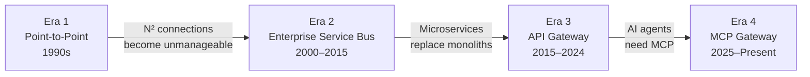
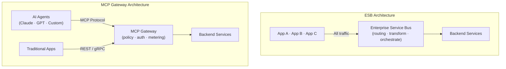

<!-- last verified: 2026-02 -->

# The ESB is Dead, Long Live MCP: From Integration Buses to AI Gateways

Let us say what many enterprise architects are thinking but few vendors will admit: **the ESB is dead**. The enterprise service bus — that monolithic integration middleware that defined the SOA era — has been in decline for a decade. What killed it was not a single technology but a series of architectural shifts: microservices, API gateways, event-driven architectures, and now the Model Context Protocol (MCP). Each shift made the ESB less relevant. MCP may be the final blow.

<!-- truncate -->

## A Brief History of Enterprise Integration

To understand where we are going, we need to understand where we have been. Enterprise integration has gone through four distinct eras:



### Era 1: Point-to-Point (1990s)

The first integration pattern was the simplest: direct connections between systems. Application A calls Application B via a proprietary protocol (CORBA, RMI, DCOM). It works for five systems. It becomes unmanageable at fifty. The number of connections grows quadratically — N systems produce N(N-1)/2 connections.

### Era 2: The Enterprise Service Bus (2000-2015)

The ESB solved point-to-point chaos by introducing a centralized message broker. All systems connect to the bus, not to each other. The bus handles routing, transformation, protocol mediation, and orchestration. Major products — IBM WebSphere, TIBCO, Software AG webMethods, Oracle Service Bus, MuleSoft — became the backbone of enterprise integration.

The ESB worked. For a while. But it introduced its own problems:

- **Central bottleneck.** Everything routes through the bus. If the bus is slow, everything is slow.
- **Vendor lock-in.** Proprietary message formats, transformation languages, and deployment models.
- **Monolithic governance.** Change management for ESB configurations is slow and risky.
- **Cost.** License fees for enterprise ESBs run into millions per year.

### Era 3: API Gateways and Microservices (2015-2024)

The microservices revolution killed the ESB's central premise. Instead of routing everything through a bus, services communicate directly via lightweight HTTP APIs. The API gateway replaced the ESB as the traffic management layer — but with a key difference: it routes, it does not transform. Business logic lives in the services, not in the middleware.

Kong, Envoy, Traefik, and AWS API Gateway became the new infrastructure. REST replaced SOAP. JSON replaced XML. OpenAPI replaced WSDL. The ESB vendors scrambled to rebrand as "integration platforms" and "iPaaS" providers.

### Era 4: MCP Gateways and AI Agents (2025-Present)

Now a new consumer has entered the picture: the AI agent. LLMs like Claude and GPT do not call REST APIs the way a web application does. They use the [Model Context Protocol (MCP)](/docs/concepts/mcp-gateway) to discover tools, invoke functions, and read resources dynamically.

This is not just a protocol change. It is a fundamental shift in how integration happens:

| Aspect | ESB Era | API Gateway Era | MCP Gateway Era |
|---|---|---|---|
| **Consumer** | Applications (Java, .NET) | Web/mobile developers | AI agents (LLMs) |
| **Discovery** | UDDI registry (static) | OpenAPI/Swagger docs | Dynamic tool enumeration |
| **Protocol** | SOAP/XML over JMS/MQ | REST/GraphQL over HTTP | MCP over JSON-RPC/SSE |
| **Transformation** | In the middleware (XSLT, DataMapper) | In the service (code) | In the agent (LLM reasoning) |
| **Governance** | ESB admin console | API portal + gateway policies | Policy engine (OPA) + tenant isolation |
| **Invocation pattern** | Orchestrated workflows | Request/response | Context-aware tool invocation |



## Why the ESB Cannot Adapt

Some vendors will argue that their ESB can handle MCP traffic. After all, it is just another protocol, right?

Wrong. The ESB's architecture is fundamentally incompatible with the AI agent paradigm for three reasons:

### 1. Static Routing vs. Dynamic Discovery

ESBs route messages based on pre-configured rules: if message type X arrives, route to service Y via transformation Z. Every route must be defined in advance by an integration developer.

AI agents discover tools dynamically at runtime. An agent might list available tools, select the appropriate one based on its current context, and invoke it — all within a single conversation turn. The ESB has no concept of this interaction pattern.

### 2. Centralized Transformation vs. Agent Reasoning

The ESB's core value proposition is message transformation: converting between formats, enriching payloads, mapping schemas. This logic lives in the bus itself, maintained by specialized integration developers.

With MCP, the AI agent handles data interpretation and transformation through its own reasoning. The gateway's job is to route, secure, and observe — not to transform. An ESB that insists on mediating every payload is adding latency and complexity for no value.

### 3. Monolithic Governance vs. Multi-Tenant Policies

ESB governance is typically all-or-nothing: a central team controls the bus configuration. Adding a new route or transformation requires a change request, testing in a staging environment, and a deployment window.

MCP gateways need [multi-tenant, self-service governance](/docs/concepts/architecture). Each team manages their own tools and policies. The platform enforces isolation. This is the model that API gateways introduced and that MCP gateways extend to AI agent traffic.

## The Migration Path: ESB to MCP Gateway

If your organization is still running an ESB — and many are, especially in financial services, insurance, healthcare, and government — the path forward is not a big-bang migration. It is a gradual, non-disruptive transition.

### Phase 1: Sidecar Deployment

Deploy an MCP gateway alongside your existing ESB. AI agent traffic routes through the MCP gateway. Traditional integration traffic continues through the ESB. No disruption to existing workflows.

```
Traditional Apps ──→ ESB ──→ Backend Services
AI Agents ──→ MCP Gateway ──→ Same Backend Services
```

### Phase 2: API Facade

Wrap ESB-exposed services with lightweight REST APIs. These APIs become tools that the MCP gateway can expose to AI agents. The ESB still runs behind the scenes, but its surface area shrinks.

### Phase 3: Service Extraction

Gradually extract services from the ESB into standalone microservices or serverless functions. Each extracted service becomes a native MCP tool. The ESB handles fewer and fewer integrations.

### Phase 4: Decommission

When the ESB handles no critical traffic, decommission it. The MCP gateway and standard API gateway handle all integration — AI and traditional.

This phased approach is exactly how STOA is designed to operate. Our [migration guides](/docs/guides/migration/) cover specific ESB products, including [webMethods](/docs/guides/migration/ibm-webmethods), with detailed step-by-step instructions.

## What Replaces the ESB's Valuable Features?

The ESB did provide real value. Here is where those capabilities live in the modern stack:

| ESB Capability | Modern Equivalent |
|---|---|
| Message routing | API gateway / MCP gateway routing rules |
| Message transformation | Service-level code (or agent reasoning for AI) |
| Protocol mediation | API gateway protocol support (REST, gRPC, MCP) |
| Orchestration | Workflow engines (Temporal, Step Functions) or agent chains |
| Service registry | Kubernetes service discovery + MCP tool catalogs |
| Monitoring | Prometheus/Grafana + distributed tracing (Jaeger, Tempo) |
| Security | OPA policies + OAuth2/JWT + mTLS |
| Guaranteed delivery | Event streaming (Kafka, NATS) |

Nothing is lost. The capabilities are disaggregated into purpose-built components, each of which can be scaled, upgraded, and replaced independently.

## The Enterprises Still on ESBs

If you are reading this and thinking "we still have an ESB in production," you are not alone. A 2025 Gartner survey found that 43% of large enterprises still run at least one ESB in production, with an average remaining lifespan of 3-5 years.

The most common reasons for keeping an ESB running:

1. **Legacy integrations** with mainframe or ERP systems that only speak SOAP/JMS.
2. **Regulatory requirements** that mandate specific audit trails tied to the ESB.
3. **Organizational inertia** — the integration team knows the ESB, and retraining is expensive.
4. **No clear migration path** — until now.

STOA addresses all four of these. The sidecar deployment mode handles coexistence with existing platforms. OPA policies provide structured audit trails. The admin console and developer portal reduce the learning curve. And the phased migration path eliminates the need for a risky big-bang cutover.

## The Future: Unified API and AI Gateway

The endgame is not replacing the ESB with another monolithic middleware. It is a unified gateway layer that handles all traffic — REST, GraphQL, gRPC, MCP — with consistent security, observability, and governance.

This is what STOA is building: a platform where traditional API consumers and AI agents share the same infrastructure, the same policies, and the same developer experience. The ESB centralized everything into one bus. The MCP gateway unifies everything through one standard.

The ESB is dead. Long live MCP.

## Get Started

- **[Architecture Overview](/docs/concepts/architecture)** — How STOA's control plane and data plane work together.
- **[Migration Guides](/docs/guides/migration/)** — Step-by-step paths from webMethods, Kong, Apigee, and more.
- **[Quickstart](/docs/guides/quickstart)** — Running instance in 15 minutes with Docker Compose.

---

## Further Reading

- [Complete API Gateway Migration Guide 2026](/blog/api-gateway-migration-guide-2026) — Decision framework for legacy gateway modernization
- [webMethods Migration Guide](/blog/webmethods-migration-guide) — ESB-to-gateway migration with sidecar approach
- [MCP Gateway Concepts](/docs/concepts/mcp-gateway) — How MCP replaces ESB integration patterns

---

*Still running an ESB? [Explore the migration guides](/docs/guides/migration/) to plan your path to a modern API and AI gateway — without disrupting production.*

> **Disclaimer:** Product names mentioned are trademarks of their respective owners. Feature comparisons are based on publicly available documentation as of February 2026. This article describes general industry trends and does not imply any deficiency in specific products.
