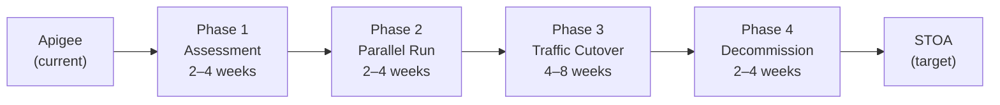

If you are evaluating an **Apigee alternative**, you are not alone. Since Google absorbed Apigee into its cloud platform, a growing number of organizations have found themselves facing rising costs, deepening vendor lock-in, and an increasingly opaque product roadmap. The good news: open-source API gateways have matured to the point where migration is not just feasible — it is often a strategic improvement.

<!-- truncate -->

:::info Part of the API Gateway Migration Series
This article is part of our [complete API gateway migration guide](/blog/api-gateway-migration-guide-2026). Whether you're coming from webMethods, MuleSoft, Apigee, or DataPower, the core migration principles are the same.
:::

This article examines why teams are leaving Apigee, what the open-source alternatives look like in 2026, and how to plan a successful migration without disrupting your API consumers.

## Why Teams Are Leaving Apigee

Apigee was a pioneer in API management. Acquired by Google in 2016, it brought enterprise-grade features like a developer portal, analytics, and monetization to a cloud-hosted platform. But the landscape has changed, and several pain points have become hard to ignore.

### Cost Escalation

Apigee's pricing model scales with API call volume. Organizations running many APIs across multiple environments may find that total cost of ownership becomes a significant budget line item — especially when evaluating open-source alternatives that offer comparable features without platform license fees. Contact Google Cloud directly for current Apigee pricing details.

### Vendor Lock-In

Apigee's policy model uses proprietary XML-based configurations ("proxy bundles") that do not translate to any other platform. Years of investment in Apigee-specific policies, shared flows, and JavaScript callouts create a migration barrier that grows over time.

Key lock-in vectors include:

- **Proprietary policy language** — Apigee policies (AssignMessage, RaiseFault, ServiceCallout) have no equivalent in standard formats.
- **Google Cloud dependency** — Apigee X is tightly integrated with GCP networking, IAM, and monitoring.
- **Custom JavaScript/Java callouts** — Business logic embedded in Apigee's runtime is not portable.
- **Analytics data** — Historical API analytics are trapped in the Apigee platform.

### Product Direction Uncertainty

Since the transition from Apigee Edge to Apigee X (and later Apigee hybrid), the product has gone through multiple architectural changes. Each transition required migration effort from customers. Teams are understandably wary of investing further in a platform whose direction is driven by Google Cloud's broader strategy rather than API management specifically.

### Missing AI-Native Capabilities

Apigee was built for the REST API era. As organizations adopt AI agents and the Model Context Protocol (MCP), they need gateways that understand AI-specific patterns: tool discovery, streaming responses, session management, and token optimization. Apigee's architecture does not natively support these patterns.

## The Open Source Alternative Landscape

The open-source API management ecosystem has matured dramatically. Here is how the leading alternatives compare to Apigee:

| Capability | Apigee | Kong OSS | Tyk OSS | STOA |
|---|:---:|:---:|:---:|:---:|
| API Gateway | Yes | Yes | Yes | Yes |
| Developer Portal | Yes | Enterprise only | Yes | Yes |
| Analytics Dashboard | Yes | Enterprise only | Yes | Yes |
| Multi-Tenancy | Yes | Enterprise only | Yes | Yes |
| MCP / AI Agent Support | No | Plugin (since 3.12) | No | Native (core) |
| Policy Engine | Proprietary XML | Lua plugins | Go middleware | OPA (standard) |
| Hybrid Deployment | Apigee hybrid | Kong Hybrid (Enterprise) | Tyk Hybrid | Native (OSS) |
| Data Sovereignty | GCP regions | Self-hosted | Self-hosted | Self-hosted + hybrid |
| License | Proprietary | Apache 2.0 | MPL 2.0 | Apache 2.0 |
| Lock-In Risk | High | Low | Low | Low |

<!-- last verified: 2026-02 -->

The critical difference: features that Apigee includes in its proprietary offering — developer portal, analytics, multi-tenancy — are available in the open-source editions of Tyk and STOA.

## Total Cost of Ownership Considerations

A fair comparison must account for all costs, not just licensing. The main cost categories to evaluate include:

### Proprietary API Gateway Costs

Proprietary API gateways typically include several cost components:

- **Platform license fee** — Often the largest component, scaling with usage or environment count.
- **Cloud infrastructure** — Required compute, networking, and storage (may be tied to a specific cloud provider).
- **Professional services and training** — Onboarding, migration assistance, and ongoing enablement.
- **Migration costs** — When the vendor mandates architectural changes between versions.

Contact vendors directly for current pricing, as models vary significantly and change over time.

### Open Source Alternative Costs

Open-source gateways eliminate the platform license fee but introduce other cost considerations:

- **Infrastructure** — Kubernetes cluster or equivalent compute (this cost exists regardless of gateway choice).
- **Engineering time** — Setup, configuration, and ongoing operations.
- **Optional commercial support** — Available from most open-source vendors for production deployments.

The key difference is eliminating vendor lock-in on the platform license and gaining the flexibility to run on any cloud provider or on-premise infrastructure.

<!-- last verified: 2026-02 -->

## Migration Path: Apigee to STOA

Migration from a proprietary platform to open source is a project that requires planning. Here is a proven approach. For detailed step-by-step instructions, see the [Apigee Migration Guide](https://docs.gostoa.dev/docs/guides/migration/apigee).

### Phase 1: Inventory and Assessment (2-4 weeks)

Before touching any configuration:

1. **Catalog all API proxies** — List every proxy, its traffic volume, and its consumers.
2. **Identify policy patterns** — Map Apigee policies to STOA equivalents (most have direct mappings).
3. **Document custom code** — JavaScript callouts, Java callouts, and shared flows need individual assessment.
4. **Export analytics baseline** — Capture current traffic patterns, error rates, and latency for comparison.

### Phase 2: Parallel Deployment (2-4 weeks)

Deploy STOA alongside Apigee without migrating any traffic:

1. **Set up STOA** on your Kubernetes cluster using the Helm chart.
2. **Configure the same APIs** in STOA using Universal API Contracts (UAC).
3. **Replicate security policies** using OPA (replacing Apigee's proprietary policy XML).
4. **Set up the developer portal** and register existing consumers.

### Phase 3: Traffic Migration (4-8 weeks)

Migrate traffic gradually using a canary approach:

1. **Start with internal, low-risk APIs** — Move internal APIs first to build confidence.
2. **Use DNS-based routing** — Point API subdomains to STOA while keeping Apigee as fallback.
3. **Monitor closely** — Compare latency, error rates, and throughput between the two platforms.
4. **Migrate consumers** — Issue new API keys through STOA's portal and sunset Apigee keys.

### Phase 4: Decommission (2-4 weeks)

Once all traffic is on STOA:

1. **Verify zero traffic** on Apigee for at least 2 weeks.
2. **Export remaining analytics data** for compliance retention.
3. **Cancel Apigee subscription**.
4. **Document lessons learned** for future reference.

## What You Gain Beyond Cost Savings

Migrating from Apigee to an open-source gateway is not just about saving money. You also gain:

### Data Sovereignty

With Apigee, your API traffic and analytics flow through Google's infrastructure. With STOA's [hybrid deployment model](https://docs.gostoa.dev/docs/deployment/hybrid), your data plane runs on your own infrastructure, and sensitive traffic never leaves your network.

### AI-Native Capabilities

STOA's native MCP support means you can expose your existing APIs to AI agents without building custom integration layers. Your Apigee APIs become MCP-accessible tools that Claude, GPT, and other AI agents can discover and invoke securely.

### Future Flexibility

Open source eliminates lock-in by design. If STOA does not evolve in the direction you need, you can fork it, extend it, or migrate to another open-source gateway without losing your investment. Your configurations are in standard formats (OPA policies, Kubernetes CRDs, OpenAPI specs), not proprietary XML.

### Community-Driven Innovation

Proprietary roadmaps serve the vendor's business strategy. Open-source roadmaps are shaped by the community of users who actually operate the software. Feature requests, bug fixes, and improvements come from practitioners, not product managers optimizing for upsell.

## Common Concerns (and Honest Answers)

**"We'll lose enterprise support."**
STOA offers commercial support options. More importantly, open-source communities often provide faster response times for critical issues than enterprise support tickets.

**"Our team doesn't have Kubernetes expertise."**
STOA's Quickstart provides a Docker Compose deployment for teams not yet on Kubernetes. The full Kubernetes deployment uses standard Helm charts and follows well-documented patterns.

**"Migration will disrupt our API consumers."**
A properly executed canary migration is transparent to consumers. DNS-based cutover means no client-side changes are needed. API keys can be migrated or reissued without downtime.

**"Apigee has features STOA doesn't."**
This may be true for specific features like monetization or GraphQL federation. Evaluate your actual feature usage — most organizations use less than 30% of Apigee's capabilities.

## Ready to Evaluate?

If Apigee's cost, lock-in, or lack of AI-native features is driving you to explore alternatives, STOA is designed to make migration straightforward.

- Read the [Apigee Migration Guide](https://docs.gostoa.dev/docs/guides/migration/apigee)
- Explore [Enterprise Use Cases](https://docs.gostoa.dev/docs/enterprise/use-cases)
- Try STOA with the [Quickstart Guide](https://docs.gostoa.dev/docs/guides/quickstart)
- Talk to us on [Discord](https://discord.gostoa.dev) about your migration scenario

---

### Related Reading

- **[API Gateway Migration Guide 2026](/blog/api-gateway-migration-guide-2026)** — Complete migration framework for all legacy platforms.
- **[Apigee Migration Guide](/docs/guides/migration/apigee)** — Step-by-step proxy export, policy translation, and traffic migration.
- **[API Gateway Patterns — STOA vs Kong vs Apigee](/docs/guides/fiches/api-gateway-patterns)** — Architectural comparison and decision framework.

---

## Related Migration Guides

This article is part of our API gateway migration series. Explore guides for other platforms:

- **[Complete API Gateway Migration Guide 2026](/blog/api-gateway-migration-guide-2026)** — Vendor-neutral decision framework and phased migration strategy
- **[webMethods Migration Guide](/blog/webmethods-migration-guide)** — Sidecar approach for Software AG platforms
- **[MuleSoft Migration Guide](/blog/mulesoft-migration-open-source-gateway)** — Decouple gateway from iPaaS, migrate to open source
- **[DataPower & TIBCO Migration Guide](/blog/datapower-tibco-migration-guide)** — Protocol translation and identity migration

For detailed technical walkthroughs, see our [migration documentation](https://docs.gostoa.dev/docs/guides/migration/).

## Frequently Asked Questions

### What are the actual cost differences between Apigee and open source?

Apigee pricing varies significantly based on API call volume, number of environments, and contract terms. Contact Google Cloud directly for current pricing. Open-source alternatives like STOA eliminate platform license fees but require infrastructure costs (Kubernetes cluster) and engineering time for setup and operations. For organizations with existing Kubernetes expertise, the total cost of ownership can be 60-80% lower than Apigee over three years. See the [complete migration guide](/blog/api-gateway-migration-guide-2026) for TCO comparison frameworks.

### How complex is migrating from Apigee to an open-source gateway?

Complexity depends on how deeply you've invested in Apigee-specific features. Simple proxy-and-route APIs migrate easily (weeks). Custom JavaScript callouts, shared flows, and monetization logic require reimplementation (months). The migration path in this guide uses a parallel deployment approach: run STOA alongside Apigee, migrate traffic gradually, and keep Apigee as fallback until confidence is high. Most teams complete migration in 4-6 months. See the [Apigee migration guide](https://docs.gostoa.dev/docs/guides/migration/) for detailed technical steps.

### Will I lose features by moving to an open-source gateway?

Not necessarily. Features that Apigee includes (developer portal, analytics, multi-tenancy) are available in open-source platforms like STOA and Tyk. However, if you rely on Apigee-specific capabilities like monetization, GraphQL federation, or deep Google Cloud integrations, you'll need equivalent solutions. Evaluate your actual feature usage — most organizations use less than 30% of Apigee's capabilities. The [Kong vs STOA comparison](/blog/stoa-vs-kong) provides feature-by-feature analysis.

---

*Christophe Aboulicam is the Founder & CTO at HLFH. Before building STOA, he spent over a decade implementing and operating enterprise API management platforms including webMethods, Kong, and Apigee.*

> **Disclaimer:** Feature comparisons are based on publicly available documentation as of February 2026. Product capabilities change frequently. We encourage readers to verify current features directly with each vendor. All trademarks belong to their respective owners.

---

## Ready to bridge your legacy APIs to AI agents?

STOA is open-source (Apache 2.0) and free to try.

- **[Quick Start Guide →](/docs/guides/quickstart)** — Get STOA running locally in 5 minutes
- **[GitHub →](https://github.com/stoa-platform/stoa)** — Star us, fork us, contribute
- **[Discord →](https://discord.gostoa.dev)** — Join the community
