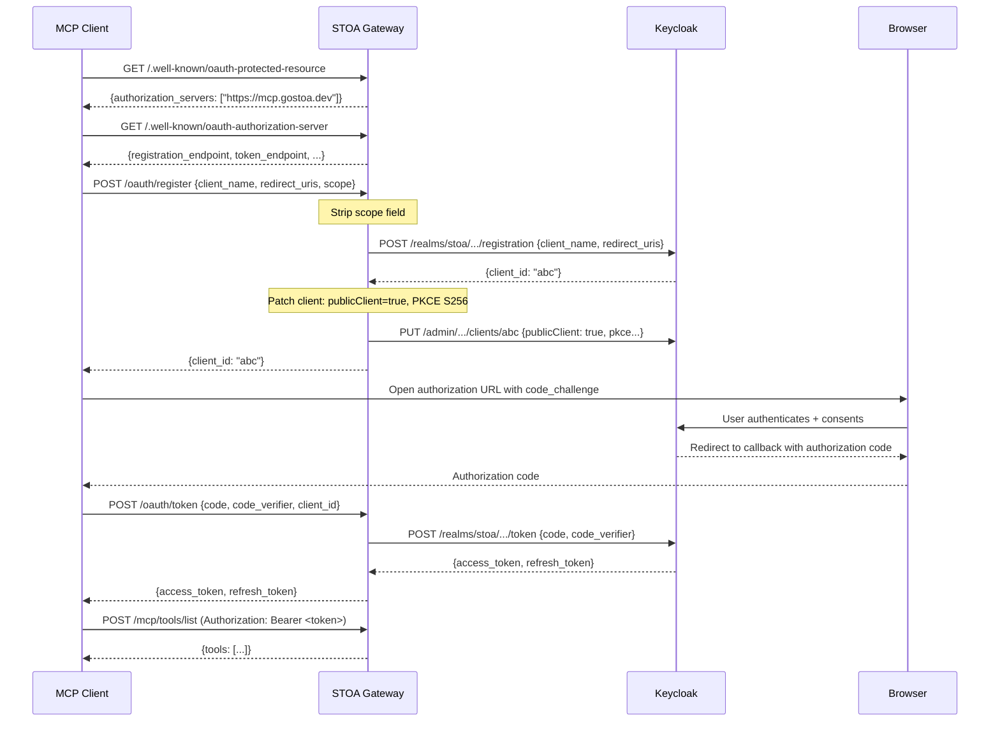

<!-- last verified: 2026-02 -->

# OAuth 2.1 + PKCE for MCP Gateways: The Complete Flow

MCP clients like Claude Desktop and GPT are public clients. They cannot store client secrets. OAuth 2.1 with PKCE (Proof Key for Code Exchange) solves this by replacing the client secret with a cryptographic proof that only the original requester could produce. This article walks through the complete OAuth flow for MCP gateways, including the discovery chain, dynamic client registration, and the production pitfalls we encountered and solved.

<!-- truncate -->

:::info Part of the Security Deep-Dive Series
This article covers the OAuth authentication flow for MCP gateways. For a protocol-level deep dive, see [MCP Protocol Architecture Deep Dive](/blog/mcp-protocol-architecture-deep-dive). For broader authentication patterns, see [AI Agent Security: 5 Authentication Patterns](/blog/ai-agent-security-authentication-patterns). For the full security architecture, see [STOA Security Architecture: Defense-in-Depth](/blog/stoa-api-security-architecture).
:::

## Why Public Clients Need PKCE

Traditional OAuth 2.0 authorization code flow relies on a client secret shared between the client application and the authorization server. This works for server-side applications where the secret can be stored securely. It does not work for:

- **AI agents** (Claude Desktop, GPT) that run on user machines
- **Mobile applications** without secure server-side storage
- **CLI tools** that cannot protect embedded secrets
- **Browser-based MCP clients** where source code is inspectable

These are all **public clients** in OAuth terminology: they cannot maintain the confidentiality of a client secret.

Without PKCE, an attacker who intercepts the authorization code (via a compromised redirect URI, a malicious browser extension, or a man-in-the-middle on localhost) can exchange it for tokens. PKCE prevents this by requiring a cryptographic proof that only the original client could produce.

### How PKCE Works

The PKCE flow adds two parameters to the authorization code exchange:

1. **code_verifier**: a random string (43-128 characters) generated by the client
2. **code_challenge**: a SHA-256 hash of the code_verifier, sent during the authorization request

```
Client                        Authorization Server
  │                                    │
  │── Authorization Request ──────────→│
  │   code_challenge = SHA256(verifier)│
  │   code_challenge_method = S256     │
  │                                    │
  │←── Authorization Code ────────────│
  │                                    │
  │── Token Request ──────────────────→│
  │   code = <auth_code>               │
  │   code_verifier = <original>       │
  │                                    │
  │   Server checks:                   │
  │   SHA256(code_verifier) ==         │
  │     stored code_challenge?         │
  │                                    │
  │←── Access Token ──────────────────│
  │                                    │
```

An attacker who intercepts the authorization code does not have the code_verifier (it was never transmitted during the authorization request). Without the verifier, the token request fails.

OAuth 2.1 (draft) mandates PKCE for all authorization code flows, not just public clients. This eliminates the class of authorization code interception attacks entirely.

## The MCP OAuth Discovery Chain

MCP uses a standards-based discovery chain to find the OAuth configuration. This is not custom to STOA -- it follows RFC 9728 and RFC 8414.

### Step 1: Protected Resource Metadata (RFC 9728)

The MCP client first discovers that the resource requires OAuth by fetching the protected resource metadata:

```
GET /.well-known/oauth-protected-resource HTTP/1.1
Host: mcp.gostoa.dev
```

Response:

```json
{
  "resource": "https://mcp.gostoa.dev",
  "authorization_servers": ["https://mcp.gostoa.dev"],
  "scopes_supported": ["openid", "stoa:read", "stoa:write", "stoa:admin"],
  "bearer_methods_supported": ["header"]
}
```

**Critical detail**: `authorization_servers` points to the **gateway**, not directly to Keycloak. This is intentional. The gateway serves curated OAuth metadata that differs from what Keycloak would return natively. Specifically, the gateway advertises `token_endpoint_auth_methods_supported: ["none"]`, which is required for public clients. Keycloak's native metadata does not advertise the `none` auth method, even when public clients are enabled.

### Step 2: Authorization Server Metadata (RFC 8414)

The client follows `authorization_servers[0]` to fetch the full OAuth metadata:

```
GET /.well-known/oauth-authorization-server HTTP/1.1
Host: mcp.gostoa.dev
```

Response:

```json
{
  "issuer": "https://auth.gostoa.dev/realms/stoa",
  "authorization_endpoint": "https://auth.gostoa.dev/realms/stoa/protocol/openid-connect/auth",
  "token_endpoint": "https://mcp.gostoa.dev/oauth/token",
  "registration_endpoint": "https://mcp.gostoa.dev/oauth/register",
  "scopes_supported": ["openid", "profile", "email", "stoa:read", "stoa:write", "stoa:admin"],
  "response_types_supported": ["code"],
  "grant_types_supported": ["authorization_code", "refresh_token"],
  "token_endpoint_auth_methods_supported": ["none"],
  "code_challenge_methods_supported": ["S256"]
}
```

Notice that `token_endpoint` and `registration_endpoint` point to the gateway (`mcp.gostoa.dev/oauth/*`), not directly to Keycloak. The gateway proxies these requests, applying transformations that make the flow work for public MCP clients.

### Step 3: Dynamic Client Registration (DCR)

The MCP client registers itself dynamically:

```
POST /oauth/register HTTP/1.1
Host: mcp.gostoa.dev
Content-Type: application/json

{
  "client_name": "Claude Desktop",
  "redirect_uris": ["http://127.0.0.1:54321/callback"],
  "grant_types": ["authorization_code", "refresh_token"],
  "response_types": ["code"],
  "token_endpoint_auth_method": "none",
  "scope": "openid profile email stoa:read stoa:write"
}
```

The gateway proxies this to Keycloak's DCR endpoint, but with a critical modification: **it strips the `scope` field from the payload before forwarding**.

### Step 4: Token Exchange

After the user authorizes in their browser, the MCP client exchanges the authorization code:

```
POST /oauth/token HTTP/1.1
Host: mcp.gostoa.dev
Content-Type: application/x-www-form-urlencoded

grant_type=authorization_code
&code=abc123
&redirect_uri=http://127.0.0.1:54321/callback
&client_id=claude-desktop-xyz
&code_verifier=dBjftJeZ4CVP-mB92K27uhbUJU1p1r_wW1gFWFOEjXk
```

The gateway proxies to Keycloak's token endpoint. Keycloak validates the code_verifier against the stored code_challenge, issues an access token (JWT) and refresh token.

### Complete Flow Diagram



## Production Pitfalls (Battle-Tested)

These are not theoretical concerns. Each of these broke the OAuth flow in production and required specific fixes.

### Pitfall 1: DCR Scope Stripping

**Problem**: When Claude Desktop sends `scope: "openid profile email stoa:read stoa:write"` in the DCR registration payload, Keycloak **replaces** all realm default scopes with only the requested ones. The registered client loses access to scopes like `roles`, `web-origins`, and any custom mappers attached to default scopes. The next token request fails with `invalid_scope`.

**Root cause**: Keycloak interprets the `scope` field in DCR literally -- it sets the client's optional scopes to exactly what was requested, removing all defaults.

**Fix**: The gateway strips the `scope` field from the DCR payload before forwarding to Keycloak. Without an explicit scope, Keycloak assigns all realm default scopes plus all optional scopes to the new client. The client can then request any scope during the authorization flow.

**Verification**: Register a client with scope included vs. without. Compare the client's assigned scopes in Keycloak admin console.

### Pitfall 2: mTLS Bypass for OAuth Endpoints

**Problem**: STOA's mTLS middleware (Layer 1 security) enforces mutual TLS on all endpoints. But OAuth discovery and registration endpoints must be accessible *before* the client has authenticated. If mTLS enforcement blocks the `/.well-known/*` and `/oauth/*` paths, the client never reaches the OAuth challenge and the flow fails silently.

**Root cause**: The mTLS middleware returns `401 MTLS_CERT_REQUIRED` before the OAuth layer can return `401` with `WWW-Authenticate: Bearer` headers. The client never sees the OAuth challenge.

**Fix**: Hardcoded bypass list in the mTLS middleware. These paths skip certificate verification:

- `/.well-known/*` (discovery)
- `/oauth/*` (token, register)
- `/mcp/sse`, `/mcp/tools/*`, `/mcp/v1/*` (MCP transport)
- `/health`, `/ready`, `/metrics` (infrastructure)

The bypass list is intentionally hardcoded (not configurable) because a configuration mistake must not break the OAuth flow.

**Verification**: Connect to the gateway without a client certificate. The `/.well-known/oauth-protected-resource` endpoint should return 200, not 401.

### Pitfall 3: Public Client PKCE Patch

**Problem**: Keycloak creates DCR clients as confidential clients by default. A confidential client requires a `client_secret` in the token request. MCP public clients (Claude, GPT) do not have a client secret.

**Root cause**: The OAuth 2.1 DCR specification does not mandate that `token_endpoint_auth_method: "none"` automatically creates a public client. Keycloak ignores this field during DCR.

**Fix**: After successful DCR registration, the gateway patches the Keycloak client via the admin API:

1. Set `publicClient: true` (removes client_secret requirement)
2. Set `pkce.code.challenge.method: S256` (enables PKCE)

This requires `KEYCLOAK_ADMIN_PASSWORD` as an environment variable. Without it, the patch step is skipped and clients will require a client_secret (breaking public client flows).

**Verification**: After DCR registration, check the client in Keycloak admin. `Client authentication` should be OFF. `PKCE Code Challenge Method` should be S256.

### Pitfall 4: Authorization Servers Must Point to Gateway

**Problem**: If `authorization_servers` in the protected resource metadata points directly to Keycloak (`auth.gostoa.dev`), the client fetches Keycloak's native OAuth metadata. Keycloak's metadata does not advertise `token_endpoint_auth_methods_supported: ["none"]`, causing public client registration to fail.

**Root cause**: Keycloak's OAuth metadata reflects its default configuration. Even when public clients are enabled at the client level, the server-level metadata does not change.

**Fix**: `authorization_servers` always points to the gateway. The gateway serves curated metadata that includes `"none"` as a supported auth method. Registration and token endpoints are proxied through the gateway, which applies the necessary transformations.

**Verification**: Compare `GET https://auth.gostoa.dev/realms/stoa/.well-known/openid-configuration` with `GET https://mcp.gostoa.dev/.well-known/oauth-authorization-server`. The gateway metadata should include `"none"` in `token_endpoint_auth_methods_supported`.

### Pitfall 5: Keycloak DCR Scope Policy

**Problem**: Custom scopes like `stoa:read`, `stoa:write`, `stoa:admin` are rejected by Keycloak during DCR if the "Allowed Client Scopes" DCR policy does not include them.

**Root cause**: Keycloak has a built-in DCR policy that restricts which scopes can be requested during client registration. By default, only OpenID Connect standard scopes are allowed.

**Fix**: In Keycloak admin: Realm Settings > Client Policies > find the DCR policy > add `stoa:read`, `stoa:write`, `stoa:admin` to the allowed scopes list. Alternatively, since the gateway strips the scope field (Pitfall 1), this only matters if the client explicitly requests custom scopes during token exchange.

## Security Properties of the Flow

The complete OAuth 2.1 + PKCE flow for MCP provides:

| Property | Mechanism | Threat Addressed |
|----------|-----------|-----------------|
| **No client secrets** | PKCE (code_verifier/code_challenge) | Public client authentication |
| **Code interception resistance** | S256 challenge prevents code reuse | Authorization code theft |
| **Short-lived tokens** | 15-minute access token TTL | Stolen token window |
| **Token refresh** | Refresh token with rotation | Session continuity without re-auth |
| **Scope enforcement** | Per-token scopes validated per request | Excessive privilege |
| **Certificate binding** | RFC 8705 (optional, adds mTLS) | Token replay from different client |
| **Discovery-based** | RFC 9728 + RFC 8414 | No hardcoded endpoints |

When combined with mTLS certificate binding (RFC 8705), a stolen access token is useless without the corresponding client certificate private key. This combination -- PKCE for initial authentication, mTLS for ongoing binding -- represents the strongest authentication pattern for AI agent API access.

## Implementation Reference

### Gateway Configuration

The OAuth proxy in STOA Gateway is configured via environment variables:

```bash
# Keycloak connection
KEYCLOAK_BASE_URL=https://auth.gostoa.dev
KEYCLOAK_REALM=stoa
KEYCLOAK_ADMIN_PASSWORD=<required for PKCE patch>

# OAuth metadata
OAUTH_ISSUER=https://auth.gostoa.dev/realms/stoa
GATEWAY_EXTERNAL_URL=https://mcp.gostoa.dev
```

### Testing the Flow Manually

Verify each step of the discovery chain:

```bash
# Step 1: Protected resource metadata
curl -s https://mcp.gostoa.dev/.well-known/oauth-protected-resource | jq .

# Step 2: Authorization server metadata
curl -s https://mcp.gostoa.dev/.well-known/oauth-authorization-server | jq .

# Step 3: Dynamic client registration
curl -s -X POST https://mcp.gostoa.dev/oauth/register \
  -H "Content-Type: application/json" \
  -d '{
    "client_name": "test-client",
    "redirect_uris": ["http://127.0.0.1:9999/callback"],
    "grant_types": ["authorization_code"],
    "response_types": ["code"],
    "token_endpoint_auth_method": "none"
  }' | jq .

# Step 4: Generate PKCE values
CODE_VERIFIER=$(openssl rand -base64 32 | tr -d '=/+' | head -c 43)
CODE_CHALLENGE=$(echo -n "$CODE_VERIFIER" | openssl dgst -sha256 -binary | base64 | tr -d '=' | tr '+/' '-_')

echo "Verifier: $CODE_VERIFIER"
echo "Challenge: $CODE_CHALLENGE"

# Step 5: Open authorization URL (browser)
echo "https://auth.gostoa.dev/realms/stoa/protocol/openid-connect/auth?\
client_id=<client_id>&\
response_type=code&\
redirect_uri=http://127.0.0.1:9999/callback&\
scope=openid+stoa:read&\
code_challenge=$CODE_CHALLENGE&\
code_challenge_method=S256"
```

### Test Coverage

The OAuth flow is covered at multiple test layers:

| Layer | Tests | What's Covered |
|-------|-------|---------------|
| Unit (`src/oauth/proxy.rs`) | 15 | Token proxy, DCR proxy, scope stripping, error paths |
| Unit (`src/auth/mtls.rs`) | 4 | mTLS bypass path matching |
| Unit (`src/oauth/discovery.rs`) | 7 | Discovery metadata fields, URL construction |
| Contract (`tests/contract/oauth.rs`) | 3 | Snapshot: authorization_servers, metadata shape |
| Integration (`tests/integration/mcp.rs`) | 12 | OAuth discovery endpoints, metadata validation |
| E2E bash (`tests/e2e/test-mcp-oauth-flow.sh`) | 9 steps | Full flow: discovery, DCR, token (manual, requires live Keycloak) |

## Frequently Asked Questions

### Why not use client credentials flow instead of PKCE?

Client credentials flow requires a client secret, which AI agents running on user machines cannot store securely. The secret would be embedded in the application binary, extractable by any user with file system access. PKCE eliminates the need for a persistent secret.

### Can I use this flow with a non-Keycloak identity provider?

The flow follows standard RFCs (9728, 8414, OAuth 2.1). Any identity provider that supports Dynamic Client Registration and PKCE should work. The gateway's scope stripping and public client patching are Keycloak-specific workarounds. Other providers may not need them (or may need different workarounds).

### What happens if the PKCE patch fails?

If `KEYCLOAK_ADMIN_PASSWORD` is not set or the admin API is unreachable, the DCR registration succeeds but the client is created as confidential. The MCP client's subsequent token request fails because it cannot provide a client secret. The gateway logs a warning: `PKCE patch failed: admin API unavailable`. This is a hard failure for public clients.

### How do I rotate or revoke a dynamically registered client?

Keycloak stores DCR clients like any other client. Revoke via the Keycloak admin console (Clients > find by client_id > disable or delete) or via the admin API. STOA does not currently support DCR client management (RFC 7592) through the gateway proxy.

### Is the OAuth flow compatible with MCP Streamable HTTP transport?

Yes. The OAuth flow is transport-independent. The access token obtained via PKCE is included as a Bearer token in the HTTP headers, regardless of whether the MCP transport is SSE, Streamable HTTP, or WebSocket.

## Further Reading

- [MCP Protocol Architecture Deep Dive](/blog/mcp-protocol-architecture-deep-dive) -- Protocol layers and transport options
- [AI Agent Security: 5 Authentication Patterns](/blog/ai-agent-security-authentication-patterns) -- Broader authentication strategies
- [STOA Security Architecture: Defense-in-Depth](/blog/stoa-api-security-architecture) -- Full five-layer security model
- [Zero Trust for API Gateways (Part 1)](/blog/zero-trust-api-gateways-part-1) -- Why verify-every-request matters
- [OWASP API Security Top 10 & STOA](/blog/owasp-api-security-top-10-stoa) -- OWASP API2 (Broken Authentication) coverage
- [MCP OAuth specification](https://modelcontextprotocol.io/specification/2025-03-26/basic/authorization) -- Official MCP authorization spec

---

> This guide describes STOA's production OAuth implementation. It does not constitute a security audit. Organizations should validate OAuth configurations against their specific security requirements and engage qualified security assessors for compliance evaluations.

*STOA Platform is open-source (Apache 2.0). [Deploy the gateway](https://docs.gostoa.dev/docs/guides/quickstart) or explore the [security documentation](https://docs.gostoa.dev/docs/reference/security-configuration).*
