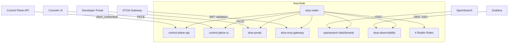

import EnvSetup from '@site/docs/_partials/_env-setup.mdx';

# Keycloak Administration

STOA uses Keycloak as its identity provider. This guide covers realm configuration, OIDC client setup, RBAC role mapping, and production hardening.

## Architecture Overview



## Realm Configuration

### Create the Realm

1. Log in to Keycloak Admin Console (`https://auth.<YOUR_DOMAIN>/admin`)
2. Click **Create Realm**
3. Set realm name: `stoa`

### Realm Settings

| Setting | Value | Purpose |
|---------|-------|---------|
| Display name | `STOA Identity` | Shown on login page |
| SSL required | `external` (prod) / `none` (dev) | TLS enforcement |
| Registration allowed | `false` | Invite-only access |
| Login with email | `true` | Email as username |
| Brute force protection | `true` | Security hardening |
| Reset password | `true` | Self-service recovery |

### Token Lifespans

| Setting | Dev | Production | Purpose |
|---------|-----|------------|---------|
| Access token lifespan | 3600s (1h) | 300s (5min) | Short-lived for security |
| SSO session idle | 1800s (30min) | 900s (15min) | Idle timeout |
| SSO session max | 36000s (10h) | 28800s (8h) | Maximum session |

## RBAC Roles

Create these 4 realm roles in **Realm Settings > Roles**:

| Role | Description | Scope |
|------|-------------|-------|
| `cpi-admin` | Full platform administrator, can manage all tenants and system settings | Platform-wide |
| `tenant-admin` | Tenant administrator, can manage their own tenant's APIs and users | Tenant-scoped |
| `devops` | DevOps engineer, can deploy and promote APIs | Tenant-scoped |
| `viewer` | Read-only access to tenant resources | Tenant-scoped |

### Role Hierarchy

```
cpi-admin (platform-wide)
  └── tenant-admin (tenant-scoped)
       └── devops (deploy-scoped)
            └── viewer (read-only)
```

Higher roles inherit all permissions of lower roles. See [RBAC Permissions](/docs/reference/rbac-permissions) for the full permission matrix.

### User-Tenant Mapping

Each user needs a `tenant` attribute to scope their access:

1. Go to **Users** > select user > **Attributes**
2. Add attribute: `tenant` = `acme` (the tenant slug)

The `tenant` claim is included in tokens via a protocol mapper (configured per client).

## OIDC Clients

### 1. Control Plane API (Backend)

**Purpose**: Backend service-to-service authentication.

| Setting | Value |
|---------|-------|
| Client ID | `control-plane-api` |
| Client type | Confidential |
| Standard flow | Enabled |
| Direct access grants | Enabled |
| Service accounts | Enabled |
| Client authentication | On (client secret) |

**Redirect URIs**:
- Dev: `http://localhost:8000/*`
- Prod: `https://api.<YOUR_DOMAIN>/*`

### 2. Console UI (Admin Console)

**Purpose**: Admin console for API providers. Public client using PKCE.

| Setting | Value |
|---------|-------|
| Client ID | `control-plane-ui` |
| Client type | Public |
| Standard flow | Enabled |
| Direct access grants | Enabled |

**Redirect URIs**:
- Dev: `http://localhost:3000/*`, `http://localhost:5173/*`
- Prod: `https://console.<YOUR_DOMAIN>/*`

**Protocol mapper** (required): Add an **Audience** mapper:
- Name: `control-plane-api-audience`
- Mapper type: Audience
- Included Client Audience: `control-plane-api`
- Add to ID token: Yes
- Add to access token: Yes

This ensures the `aud` claim includes `control-plane-api`, allowing the backend to validate tokens.

### 3. Developer Portal

**Purpose**: Public-facing developer portal for API consumers.

| Setting | Value |
|---------|-------|
| Client ID | `stoa-portal` |
| Client type | Public |
| Standard flow | Enabled |
| Direct access grants | Enabled |

**Redirect URIs**:
- Dev: `http://localhost:3001/*`
- Prod: `https://portal.<YOUR_DOMAIN>/*`

**Protocol mapper**: Same audience mapper as Console (`control-plane-api-audience`).

### 4. MCP Gateway

**Purpose**: Gateway JWT validation and service account for tool discovery.

| Setting | Value |
|---------|-------|
| Client ID | `stoa-mcp-gateway` |
| Client type | Confidential |
| Standard flow | Enabled |
| Direct access grants | Enabled |
| Service accounts | Enabled |

**Redirect URIs**:
- Dev: `http://localhost:8081/*`
- Prod: `https://mcp.<YOUR_DOMAIN>/*`

### 5. OpenSearch Dashboards (Optional)

**Purpose**: OIDC SSO for the logs/search UI.

| Setting | Value |
|---------|-------|
| Client ID | `opensearch-dashboards` |
| Client type | Confidential |
| Standard flow | Enabled |

**Protocol mappers**:
- `tenant-mapper`: User Attribute mapper, claims `tenant_id` from user attribute `tenant`
- `realm-roles-mapper`: Realm Role mapper, claims `roles` with user's realm roles

**Redirect URIs**:
- Prod: `https://opensearch.<YOUR_DOMAIN>/*`

### 6. Observability (Optional)

**Purpose**: Grafana SSO and Prometheus OAuth2 proxy.

| Setting | Value |
|---------|-------|
| Client ID | `stoa-observability` |
| Client type | Confidential |
| Standard flow | Enabled |

**Protocol mapper**: `realm-roles` mapper adding `roles` claim.

**Redirect URIs**:
- Grafana: `https://grafana.<YOUR_DOMAIN>/login/generic_oauth`
- Prometheus: `https://prometheus.<YOUR_DOMAIN>/oauth2/callback`

## Client Summary

| Client ID | Type | Service Account | Audience Mapper | Users |
|-----------|------|-----------------|-----------------|-------|
| `control-plane-api` | Confidential | Yes | -- | Backend services |
| `control-plane-ui` | Public | No | `control-plane-api` | Admins (Console) |
| `stoa-portal` | Public | No | `control-plane-api` | Developers (Portal) |
| `stoa-mcp-gateway` | Confidential | Yes | -- | Gateway service |
| `opensearch-dashboards` | Confidential | No | -- | Observability users |
| `stoa-observability` | Confidential | No | -- | Grafana/Prometheus |

## Security Hardening (Production)

### Browser Security Headers

Configure in **Realm Settings > Security Defenses > Headers**:

| Header | Value |
|--------|-------|
| Content-Security-Policy | `frame-src 'self'; frame-ancestors 'self' https://console.<YOUR_DOMAIN>; object-src 'none';` |
| X-Content-Type-Options | `nosniff` |
| X-XSS-Protection | `1; mode=block` |
| Strict-Transport-Security | `max-age=31536000; includeSubDomains` |
| Referrer-Policy | `no-referrer` |

### Brute Force Protection

Enable in **Realm Settings > Security Defenses > Brute Force Detection**:

| Setting | Recommended Value |
|---------|-------------------|
| Enabled | Yes |
| Max login failures | 5 |
| Wait increment (seconds) | 60 |
| Max wait (seconds) | 900 |
| Failure reset time (seconds) | 43200 (12h) |

### TOTP/2FA (Optional)

STOA supports step-up authentication with TOTP for sensitive operations:

| Setting | Value |
|---------|-------|
| OTP policy type | TOTP |
| Algorithm | HmacSHA256 |
| Digits | 6 |
| Period | 30 seconds |
| Supported apps | Google Authenticator, Microsoft Authenticator, Authy, 1Password, FreeOTP |

Enable via a custom authentication flow (`step-up-totp`) that requires OTP for admin operations.

## Realm Export/Import

### Export (Backup)

<EnvSetup />

```bash
# Export realm configuration (no secrets)
curl -s "${STOA_AUTH_URL}/admin/realms/stoa" \
  -H "Authorization: Bearer ${ADMIN_TOKEN}" | jq > stoa-realm-backup.json
```

### Import (Bootstrap)

For initial deployment, import the reference realm:

```bash
# Using Keycloak CLI
/opt/keycloak/bin/kcadm.sh config credentials \
  --server "${STOA_AUTH_URL}" \
  --realm master \
  --user admin \
  --password "${KEYCLOAK_ADMIN_PASSWORD}"

/opt/keycloak/bin/kcadm.sh create realms \
  -f stoa-realm.json
```

Or via Docker Compose with volume mount:

```yaml
keycloak:
  image: quay.io/keycloak/keycloak:24.0
  command: start-dev --import-realm
  volumes:
    - ./init/keycloak-realm.json:/opt/keycloak/data/import/stoa-realm.json
```

## Grafana OIDC Integration

Configure Grafana to use Keycloak SSO:

```yaml
# Helm values (kube-prometheus-stack)
grafana:
  grafana.ini:
    auth.generic_oauth:
      enabled: true
      name: Keycloak
      client_id: stoa-observability
      client_secret: ${GF_AUTH_GENERIC_OAUTH_CLIENT_SECRET}
      auth_url: https://auth.<YOUR_DOMAIN>/realms/stoa/protocol/openid-connect/auth
      token_url: https://auth.<YOUR_DOMAIN>/realms/stoa/protocol/openid-connect/token
      api_url: https://auth.<YOUR_DOMAIN>/realms/stoa/protocol/openid-connect/userinfo
      scopes: openid profile email roles
      role_attribute_path: "contains(roles[*], 'stoa:admin') && 'Admin' || 'Viewer'"
```

This maps Keycloak roles to Grafana roles:
- Users with `stoa:admin` scope get Grafana **Admin** role
- All others get Grafana **Viewer** role

## Troubleshooting

| Problem | Cause | Fix |
|---------|-------|-----|
| `invalid_grant` error | Token expired or wrong client secret | Regenerate client secret in Keycloak |
| `audience_mismatch` | Missing audience mapper on client | Add `control-plane-api-audience` protocol mapper |
| `unauthorized_client` | Wrong grant type enabled | Enable Standard Flow and/or Direct Access Grants |
| Login page shows `stoa` realm | Correct behavior | Users authenticate against the `stoa` realm |
| CORS errors from Console | Wrong Web Origins | Add Console URL to client's Web Origins |
| Token missing `tenant` claim | User has no `tenant` attribute | Add `tenant` user attribute in Keycloak |
| Grafana SSO shows 403 | Missing `roles` claim | Add `realm-roles` protocol mapper to `stoa-observability` client |

## Related

- [Authentication Guide](/docs/guides/authentication) -- OIDC flow and token handling
- [RBAC Permissions](/docs/reference/rbac-permissions) -- Full permission matrix
- [OAuth Discovery](/docs/reference/oauth-discovery) -- OAuth 2.1 endpoints
- [Installation Guide](/docs/admin/installation) -- Helm chart deployment
- [Multi-Tenant Isolation](/docs/concepts/multi-tenant) -- Tenant architecture
