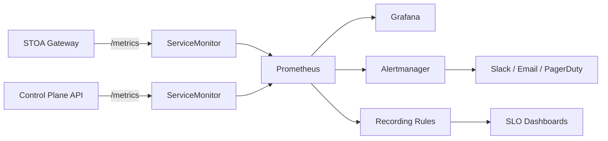

import EnvSetup from '@site/docs/_partials/_env-setup.mdx';

# Monitoring & Alerting

STOA integrates with Prometheus and Grafana for metrics collection, dashboards, and alerting. This guide covers setup, custom metrics, SLO rules, and alert configuration.

## Architecture



## Prerequisites

Install the kube-prometheus-stack Helm chart (includes Prometheus, Grafana, and Alertmanager):

```bash
helm repo add prometheus-community https://prometheus-community.github.io/helm-charts
helm repo update

helm install kube-prometheus-stack prometheus-community/kube-prometheus-stack \
  -n monitoring --create-namespace \
  -f prometheus-values.yaml
```

## ServiceMonitors

STOA ships ServiceMonitor CRDs in the Helm chart. Enable them in `values.yaml`:

```yaml
stoaGateway:
  serviceMonitor:
    enabled: true
    interval: 15s
    scrapeTimeout: 10s
```

### Deployed ServiceMonitors

| Target | Port | Path | Interval | Labels |
|--------|------|------|----------|--------|
| STOA Gateway | `http` | `/metrics` | 15s | `app.kubernetes.io/name: stoa-gateway` |
| MCP Gateway | `http` | `/metrics` | 15s | `app.kubernetes.io/name: mcp-gateway` |
| Pushgateway | `http` | `/metrics` | 30s | `app: pushgateway` |

All ServiceMonitors use the label `prometheus: kube-prometheus-stack` to match the Prometheus operator's selector.

### Verify Scrape Targets

Check that Prometheus discovers STOA targets:

```bash
# Port-forward to Prometheus
kubectl port-forward -n monitoring svc/kube-prometheus-stack-prometheus 9090:9090

# Open http://localhost:9090/targets and look for stoa-gateway target
```

## Custom Metrics

### STOA Gateway (Rust)

The gateway exposes 12 custom metric families at `/metrics`:

#### HTTP Metrics

| Metric | Type | Labels | Description |
|--------|------|--------|-------------|
| `stoa_http_requests_total` | Counter | `method`, `path`, `status` | Total HTTP requests |
| `stoa_http_request_duration_seconds` | Histogram | `method`, `path` | Request latency |

#### MCP Tool Metrics

| Metric | Type | Labels | Description |
|--------|------|--------|-------------|
| `stoa_mcp_tools_calls_total` | Counter | `tool`, `tenant`, `status` | Tool invocations |
| `stoa_mcp_tool_duration_seconds` | Histogram | `tool`, `tenant`, `status` | Tool execution latency |

#### SSE Connection Metrics

| Metric | Type | Labels | Description |
|--------|------|--------|-------------|
| `stoa_mcp_sse_connections_active` | Gauge | -- | Active SSE connections |
| `stoa_mcp_sse_connection_duration_seconds` | Histogram | `tenant` | SSE session duration |
| `stoa_mcp_sessions_active` | Gauge | -- | Active MCP sessions |

#### Rate Limiting Metrics

| Metric | Type | Labels | Description |
|--------|------|--------|-------------|
| `stoa_rate_limit_hits_total` | Counter | `tenant` | Rate limit rejections |
| `stoa_rate_limit_buckets` | Gauge | -- | Active rate limit buckets |

#### Circuit Breaker Metrics

| Metric | Type | Labels | Description |
|--------|------|--------|-------------|
| `stoa_circuit_breaker_state` | Gauge | `upstream` | CB state: 0=closed, 1=open, 2=half-open |

#### Quota & Upstream Metrics

| Metric | Type | Labels | Description |
|--------|------|--------|-------------|
| `stoa_quota_remaining` | Gauge | `consumer`, `period` | Remaining quota |
| `stoa_upstream_latency_seconds` | Histogram | `upstream`, `status` | Backend latency |

### Histogram Buckets

All latency histograms use the same bucket boundaries:

```
[0.001, 0.005, 0.01, 0.025, 0.05, 0.1, 0.25, 0.5, 1.0, 2.5, 5.0, 10.0] seconds
```

SSE connection duration uses wider buckets:

```
[1.0, 5.0, 10.0, 30.0, 60.0, 120.0, 300.0, 600.0, 1800.0] seconds
```

## SLO Recording Rules

STOA ships recording rules for SLO tracking. Apply them as a PrometheusRule:

```bash
kubectl apply -f deploy/prometheus/stoa-slo-rules.yaml -n monitoring
```

### Availability SLO

**Target**: 99.9% (0.1% error budget)

```promql
# Recording rule: slo:api_availability:ratio
sum(rate(stoa_http_requests_total{status!~"5.."}[5m]))
/
sum(rate(stoa_http_requests_total[5m]))
```

### Latency SLO

**Target**: P95 < 500ms

```promql
# Recording rule: slo:api_latency_p95:seconds
histogram_quantile(0.95,
  sum(rate(stoa_http_request_duration_seconds_bucket[5m])) by (le)
)
```

### APDEX Score

**Target**: >= 0.85 (satisfied < 250ms, tolerating < 1s)

```promql
# Recording rule: slo:apdex:score
(
  sum(rate(stoa_http_request_duration_seconds_bucket{le="0.25"}[5m]))
  + sum(rate(stoa_http_request_duration_seconds_bucket{le="1.0"}[5m]))
)
/ (2 * sum(rate(stoa_http_request_duration_seconds_count[5m])))
```

### Error Budget

```promql
# Recording rule: slo:error_budget:remaining_ratio
1 - (
  sum(increase(stoa_http_requests_total{status=~"5.."}[30d]))
  / (sum(increase(stoa_http_requests_total[30d])) * 0.001)
)
```

### Business Metrics

| Rule | Interval | Description |
|------|----------|-------------|
| `business:active_tenants:count` | 5m | Count of distinct active tenants |
| `business:api_calls:hourly_rate` | 5m | Hourly API call rate |
| `business:tool_usage:1h_rate` | 5m | Hourly tool invocation rate |
| `business:billable_requests_by_tenant:daily` | 5m | Daily billable requests per tenant |

## Alerting Rules

### Gateway Alerts

```yaml
groups:
  - name: stoa.stoa-gateway.rules
    rules:
      - alert: StoaGatewayHighErrorRate
        expr: |
          sum(rate(stoa_http_requests_total{status=~"5.."}[5m]))
          / sum(rate(stoa_http_requests_total[5m])) > 0.05
        for: 5m
        labels:
          severity: critical
        annotations:
          summary: "STOA Gateway error rate above 5%"

      - alert: StoaGatewayHighLatency
        expr: |
          histogram_quantile(0.99,
            sum(rate(stoa_http_request_duration_seconds_bucket[5m])) by (le)
          ) > 2
        for: 5m
        labels:
          severity: warning
        annotations:
          summary: "STOA Gateway P99 latency above 2s"

      - alert: StoaGatewayDown
        expr: up{job=~".*stoa-gateway.*"} == 0
        for: 1m
        labels:
          severity: critical
        annotations:
          summary: "STOA Gateway is down"
```

### SLO Alerts

```yaml
      - alert: ErrorBudgetLow
        expr: slo:error_budget:remaining_ratio < 0.2
        for: 5m
        labels:
          severity: warning
        annotations:
          summary: "Error budget below 20% — slow down deploys"

      - alert: ErrorBudgetExhausted
        expr: slo:error_budget:remaining_ratio < 0.05
        for: 5m
        labels:
          severity: critical
        annotations:
          summary: "Error budget exhausted — freeze changes"

      - alert: SLOAvailabilityBreach
        expr: slo:api_availability_30d:ratio < 0.999
        for: 10m
        labels:
          severity: critical
        annotations:
          summary: "30-day availability below 99.9% SLO"
```

### Kubernetes Alerts

```yaml
      - alert: PodCrashLooping
        expr: |
          increase(kube_pod_container_status_restarts_total{
            namespace="stoa-system"
          }[15m]) > 3
        labels:
          severity: critical

      - alert: PodHighMemory
        expr: |
          container_memory_usage_bytes{namespace="stoa-system"}
          / container_spec_memory_limit_bytes > 0.9
        for: 5m
        labels:
          severity: warning
```

### Full Alert Inventory

| Group | Alerts | Severities |
|-------|--------|------------|
| STOA Gateway | Error rate, latency, down, OIDC failure | critical, warning |
| Control Plane API | Error rate, latency, down | critical, warning |
| Database | Down, high connections, slow queries | critical, warning |
| Kubernetes | Pod not ready, crash loops, high memory/CPU | critical, warning |
| Disk | Space high (under 20%), space critical (under 10%), PVC | warning, critical |
| Keycloak | Down, high login failures | critical, warning |
| Redpanda | Down, consumer lag >10k | critical, warning |
| SLO | Error budget low/exhausted, availability breach | warning, critical |

## Grafana Dashboards

STOA provides 12 pre-built dashboards. Import them from `docker/observability/grafana/dashboards/`:

| Dashboard | Purpose | Key Panels |
|-----------|---------|------------|
| **Platform Overview** | High-level health | Requests/sec, error rate, P95 latency, service status |
| **Control Plane API** | Backend performance | Endpoint latency, errors, throughput |
| **MCP Gateway** | Gateway metrics | Tool invocations, token consumption, SSE connections |
| **SLO Dashboard** | SLO compliance | APDEX score, error budget, availability over time |
| **Gateway RED Method** | Rate/Errors/Duration | RED method visualization per endpoint |
| **Gateway Arena** | Benchmark leaderboard | STOA vs Kong vs Gravitee scores |
| **Service Health** | Pod health | Restarts, readiness, resource usage |
| **Infrastructure** | Node resources | CPU, memory, network, disk per node |
| **Error Tracking** | Error analysis | Error categories, stack traces, trends |
| **Logs Explorer** | Log search | Loki-based log queries with filters |
| **Token Optimization** | Token usage | Consumption rate by tenant, cost projection |
| **MCP Migration** | Python to Rust | Shadow mode comparison, canary metrics |

### Import Dashboards

```bash
# Via Grafana API
for f in docker/observability/grafana/dashboards/*.json; do
  curl -X POST "${GRAFANA_URL}/api/dashboards/db" \
    -H "Authorization: Bearer ${GRAFANA_TOKEN}" \
    -H "Content-Type: application/json" \
    -d "{\"dashboard\": $(cat "$f"), \"overwrite\": true, \"folderId\": 0}"
done
```

Or use Grafana provisioning (recommended for GitOps):

```yaml
# grafana-values.yaml
grafana:
  dashboardProviders:
    dashboardproviders.yaml:
      apiVersion: 1
      providers:
        - name: STOA
          folder: STOA
          type: file
          options:
            path: /var/lib/grafana/dashboards
  dashboardsConfigMaps:
    stoa: stoa-grafana-dashboards
```

## Useful PromQL Queries

### Request Rate by Status

```promql
sum by (status) (rate(stoa_http_requests_total[5m]))
```

### P95 Latency by Endpoint

```promql
histogram_quantile(0.95,
  sum by (path, le) (rate(stoa_http_request_duration_seconds_bucket[5m]))
)
```

### Active SSE Connections Over Time

```promql
stoa_mcp_sse_connections_active
```

### Top 10 Tools by Invocation Rate

```promql
topk(10, sum by (tool) (rate(stoa_mcp_tools_calls_total[1h])))
```

### Circuit Breaker Status

```promql
stoa_circuit_breaker_state
# 0 = closed (healthy), 1 = open (tripped), 2 = half-open (testing)
```

### Error Budget Burn Rate

```promql
slo:error_budget:burn_rate_1h
# Values > 1.0 mean burning faster than sustainable
```

## Troubleshooting

| Problem | Cause | Fix |
|---------|-------|-----|
| No metrics from gateway | ServiceMonitor not matched | Verify `prometheus: kube-prometheus-stack` label |
| Stale metrics | Pod restarted, counters reset | Expected behavior; rate() handles resets |
| Dashboard shows "No data" | Wrong datasource or namespace | Check Grafana datasource points to correct Prometheus |
| Alerts not firing | PrometheusRule not applied | `kubectl get prometheusrule -n monitoring` |
| High cardinality warning | Too many unique label values | Reduce `path` label cardinality with route grouping |
| Grafana SSO not working | Missing Keycloak client | Create `stoa-observability` client (see [Keycloak Admin](/docs/admin/keycloak)) |

## Related

- [Installation Guide](/docs/admin/installation) -- ServiceMonitor Helm values
- [Keycloak Administration](/docs/admin/keycloak) -- Grafana OIDC setup
- [Performance Benchmarks](/docs/reference/performance-benchmarks) -- Baseline metrics
- [Observability Guide](/docs/guides/observability) -- User-facing observability features
- [Quota Enforcement](/docs/reference/quotas) -- Quota metrics and alerts
