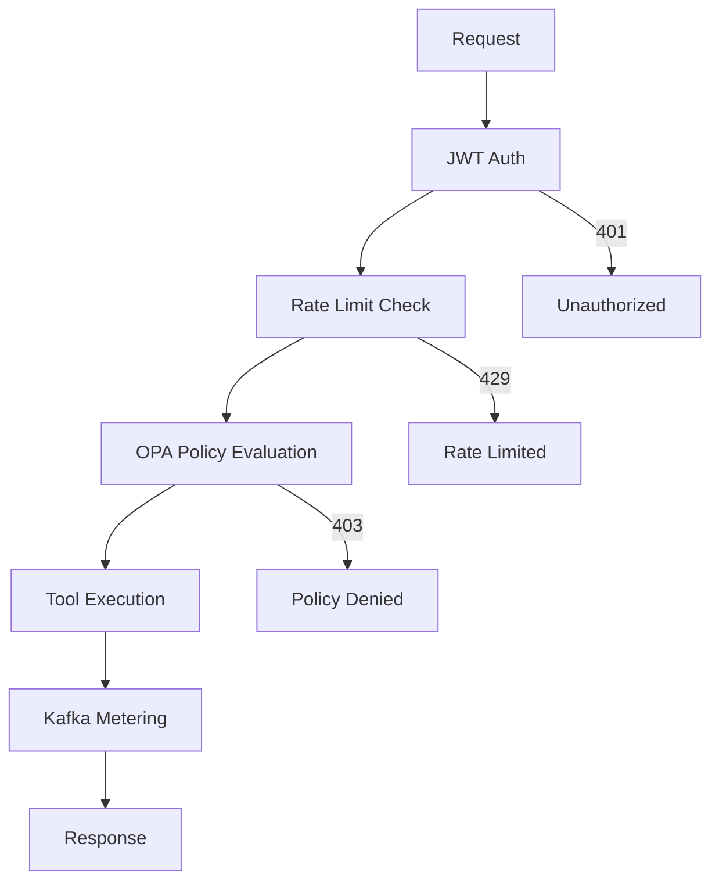

import EnvSetup from '@site/docs/_partials/_env-setup.mdx';

# MCP Gateway API

Complete API reference for the STOA Gateway MCP endpoints.

<EnvSetup />

## Overview

The STOA Gateway implements the [Model Context Protocol](https://modelcontextprotocol.io) (MCP) specification version `2025-03-26`, with backward compatibility for `2024-11-05`.

Two access patterns:

| Pattern | Transport | Use Case |
|---------|-----------|----------|
| **REST** | HTTP POST | Scripts, simple integrations, one-shot calls |
| **MCP Protocol** | SSE (JSON-RPC) | AI agents, streaming, session-based |

## Authentication

All endpoints (except discovery) require a JWT Bearer token from Keycloak:

```bash
# Get token
TOKEN=$(curl -s -X POST "${STOA_AUTH_URL}/realms/stoa/protocol/openid-connect/token" \
  -d "client_id=my-app" \
  -d "client_secret=${CLIENT_SECRET}" \
  -d "grant_type=client_credentials" | jq -r '.access_token')

# Use token
curl -H "Authorization: Bearer ${TOKEN}" "${STOA_GATEWAY_URL}/mcp/v1/tools"
```

Public endpoints (no auth required): `initialize`, `ping`, and OAuth discovery.

---

## REST Endpoints

Simple HTTP endpoints for tool operations.

### List Tools

```http
POST /mcp/v1/tools
Authorization: Bearer <token>
Content-Type: application/json
```

**Response:**

```json
{
  "tools": [
    {
      "name": "get-weather",
      "description": "Returns current weather for a given city",
      "inputSchema": {
        "type": "object",
        "properties": {
          "q": { "type": "string", "description": "City name" }
        },
        "required": ["q"]
      },
      "annotations": {
        "readOnlyHint": true,
        "destructiveHint": false,
        "idempotentHint": true,
        "openWorldHint": true
      }
    }
  ]
}
```

### Invoke Tool

```http
POST /mcp/v1/tools/invoke
Authorization: Bearer <token>
Content-Type: application/json

{
  "name": "get-weather",
  "arguments": { "q": "Paris" }
}
```

**Response:**

```json
{
  "content": [
    {
      "type": "text",
      "text": "{\"location\":{\"name\":\"Paris\"},\"current\":{\"temp_c\":12.0}}"
    }
  ],
  "isError": false
}
```

---

## MCP Protocol Endpoints (JSON-RPC over SSE)

Full MCP specification compliance via Server-Sent Events transport.

### Initialize Session

Handshake with protocol version negotiation:

```http
POST /mcp/sse
Authorization: Bearer <token>
Content-Type: application/json

{
  "jsonrpc": "2.0",
  "method": "initialize",
  "params": {
    "protocolVersion": "2025-03-26",
    "capabilities": {
      "tools": {}
    },
    "clientInfo": {
      "name": "my-agent",
      "version": "1.0.0"
    }
  },
  "id": 1
}
```

**Response:**

```json
{
  "jsonrpc": "2.0",
  "result": {
    "protocolVersion": "2025-03-26",
    "capabilities": {
      "tools": { "listChanged": true },
      "tokenOptimization": {
        "supported": true,
        "levels": ["none", "moderate", "aggressive"]
      },
      "elicitation": {}
    },
    "serverInfo": {
      "name": "stoa-gateway",
      "version": "0.1.0"
    }
  },
  "id": 1
}
```

### List Tools (JSON-RPC)

```http
POST /mcp/sse
Content-Type: application/json

{
  "jsonrpc": "2.0",
  "method": "tools/list",
  "id": 2
}
```

### Call Tool (JSON-RPC)

```http
POST /mcp/sse
Content-Type: application/json

{
  "jsonrpc": "2.0",
  "method": "tools/call",
  "params": {
    "name": "get-weather",
    "arguments": { "q": "London" }
  },
  "id": 3
}
```

### Batch Requests (MCP 2025-03-26)

Send multiple JSON-RPC requests in a single call:

```http
POST /mcp/sse
Content-Type: application/json

[
  {
    "jsonrpc": "2.0",
    "method": "tools/call",
    "params": { "name": "get-weather", "arguments": { "q": "Paris" } },
    "id": 1
  },
  {
    "jsonrpc": "2.0",
    "method": "tools/call",
    "params": { "name": "get-weather", "arguments": { "q": "London" } },
    "id": 2
  }
]
```

All requests are processed concurrently. Response is an array of JSON-RPC results.

### Ping

```http
POST /mcp/sse
Content-Type: application/json

{ "jsonrpc": "2.0", "method": "ping", "id": 99 }
```

### Close Session

```http
DELETE /mcp/sse?sessionId=<session-id>
```

### SSE Stream (Legacy)

```http
GET /mcp/sse?sessionId=<session-id>
```

Opens a persistent SSE connection for streaming responses.

### Supported JSON-RPC Methods

| Method | Auth Required | Description |
|--------|--------------|-------------|
| `initialize` | No | Handshake + version negotiation |
| `ping` | No | Keepalive |
| `notifications/initialized` | No | Client acknowledgment (no response) |
| `tools/list` | Yes | List available tools |
| `tools/call` | Yes | Execute a tool |
| `resources/list` | Yes | List resources (returns `[]`) |

---

## Discovery Endpoints

### MCP Server Discovery

```http
GET /mcp
```

Returns server metadata: name, version, protocol version, available endpoints.

### MCP Capabilities

```http
GET /mcp/capabilities
```

Returns detailed capability information including supported features.

### MCP Health

```http
GET /mcp/health
```

Returns MCP-specific health: tool count, active sessions, status.

---

## OAuth 2.1 Discovery

STOA implements OAuth 2.1 discovery per RFC 9728, enabling AI agents to authenticate automatically.

### Protected Resource Metadata (RFC 9728)

```http
GET /.well-known/oauth-protected-resource
```

```json
{
  "resource": "https://mcp.<YOUR_DOMAIN>",
  "authorization_servers": ["https://auth.<YOUR_DOMAIN>/realms/stoa"],
  "scopes_supported": ["stoa:read", "stoa:write", "stoa:execute"]
}
```

### Authorization Server Metadata (RFC 8414)

```http
GET /.well-known/oauth-authorization-server
```

### OpenID Connect Discovery

```http
GET /.well-known/openid-configuration
```

### Token Proxy

```http
POST /oauth/token
```

Transparent proxy to Keycloak token endpoint. Allows AI agents to obtain tokens without knowing the Keycloak URL.

### Dynamic Client Registration

```http
POST /oauth/register
```

Proxy to Keycloak DCR endpoint for automated client registration.

---

## Execution Pipeline

Every tool invocation goes through this pipeline:



1. **JWT Auth** — Bearer token validated against Keycloak JWKS
2. **Rate Limit** — Per-consumer quota check (if configured)
3. **OPA Policy** — Role-based access control with scopes
4. **Tool Execution** — HTTP call to backend endpoint
5. **Kafka Metering** — Event emitted for analytics (optional, feature-gated)

### RBAC Scope Mapping

| Role | Scopes |
|------|--------|
| `cpi-admin` | `admin`, `read`, `write`, `execute`, `deploy`, `audit` |
| `tenant-admin` | `read`, `write`, `execute` |
| `devops` | `read`, `write`, `deploy` |
| `viewer` | `read` |

---

## Token Optimization

Reduce LLM token usage with the `X-Token-Optimization` header:

```bash
curl -X POST "${STOA_GATEWAY_URL}/mcp/tools/call" \
  -H "Authorization: Bearer ${TOKEN}" \
  -H "X-Token-Optimization: aggressive" \
  -H "Content-Type: application/json" \
  -d '{"name": "get-weather", "arguments": {"q": "Paris"}}'
```

| Level | Effect |
|-------|--------|
| `none` | Full response (default) |
| `moderate` | Remove redundant fields |
| `aggressive` | Minimal response, optimized for LLM context |

---

## Session Management

SSE sessions have a configurable TTL (default: 30 minutes). Sessions are automatically cleaned up by a background task.

### Session Stats (Admin)

```http
GET /admin/sessions/stats
Authorization: Bearer <admin-token>
```

```json
{
  "active_sessions": 12,
  "zombie_sessions": 0,
  "total_created": 1543
}
```

---

## Error Responses

| Status | Error | Cause |
|--------|-------|-------|
| `401` | `Unauthorized` | Missing/expired JWT token |
| `403` | `Forbidden` | OPA policy denied the action |
| `404` | `Tool not found` | Tool name doesn't exist in registry |
| `429` | `Rate limited` | Consumer quota exceeded |
| `500` | `Tool execution failed` | Backend endpoint returned error |
| `502` | `Backend unreachable` | Backend endpoint is down |

JSON-RPC errors follow the MCP specification:

```json
{
  "jsonrpc": "2.0",
  "error": {
    "code": -32602,
    "message": "Tool not found: unknown-tool"
  },
  "id": 3
}
```

---

## Examples

### Python Client

```python
import os
import requests

STOA_AUTH_URL = os.environ['STOA_AUTH_URL']
STOA_GATEWAY_URL = os.environ['STOA_GATEWAY_URL']

# Authenticate
auth = requests.post(
    f'{STOA_AUTH_URL}/realms/stoa/protocol/openid-connect/token',
    data={
        'client_id': 'my-app',
        'client_secret': os.environ['STOA_CLIENT_SECRET'],
        'grant_type': 'client_credentials'
    }
)
token = auth.json()['access_token']

# Invoke tool
response = requests.post(
    f'{STOA_GATEWAY_URL}/mcp/tools/call',
    headers={'Authorization': f'Bearer {token}'},
    json={'name': 'get-weather', 'arguments': {'q': 'Paris'}}
)

result = response.json()
print(result['content'][0]['text'])
```

### JavaScript Client

```javascript
const STOA_GATEWAY_URL = process.env.STOA_GATEWAY_URL;

const response = await fetch(`${STOA_GATEWAY_URL}/mcp/tools/call`, {
  method: 'POST',
  headers: {
    'Authorization': `Bearer ${token}`,
    'Content-Type': 'application/json'
  },
  body: JSON.stringify({
    name: 'get-weather',
    arguments: { q: 'Paris' }
  })
});

const result = await response.json();
console.log(result.content[0].text);
```

---

## Related

- [MCP Getting Started](/docs/guides/mcp-getting-started) — Hands-on tutorial
- [MCP Tools Development](/docs/guides/mcp-tools-development) — Build custom tools
- [MCP Protocol Fiche](/docs/guides/fiches/mcp-protocol) — Protocol deep-dive
- [CRD Reference](/docs/reference/crds/) — Tool and ToolSet specs
