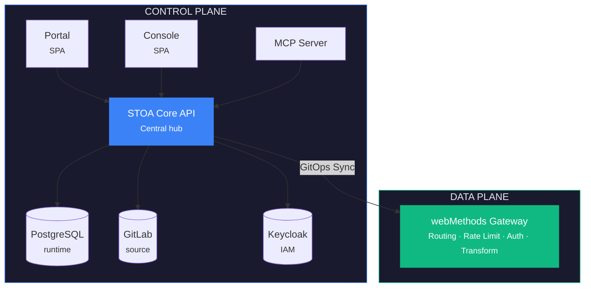
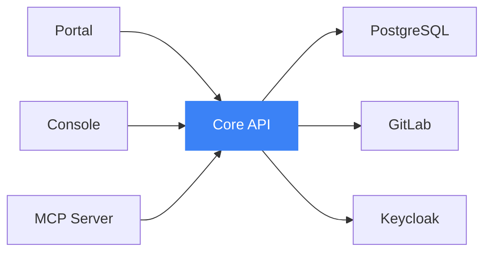
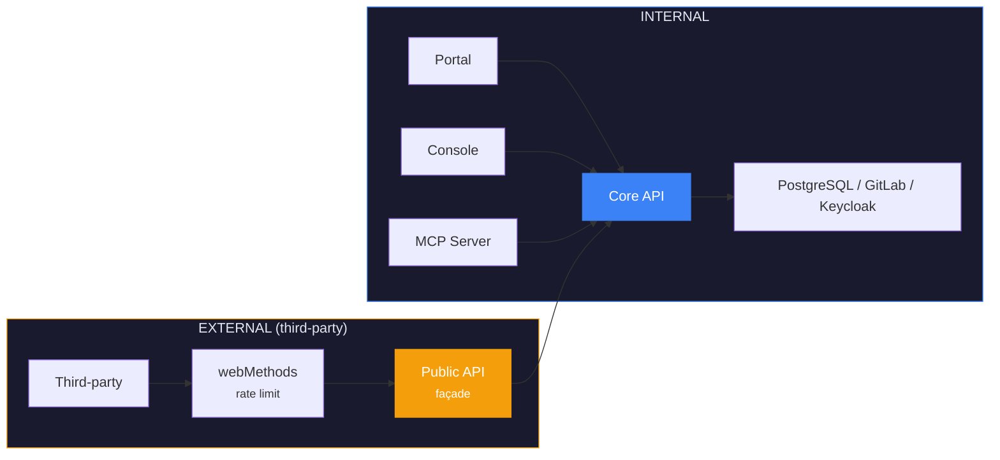

# ADR-001: Third-Party API Exposure Strategy — Public API Façade

## Metadata

| Field | Value |
|-------|-------|
| **Status** | ✅ Accepted |
| **Date** | 18 January 2026 |
| **Linear** | [CAB-669](https://linear.app/hlfh-workspace/issue/CAB-669) (Epic) |

## Context

STOA Platform evolves with several components in parallel: Control-Plane API (FastAPI), MCP Gateway, Developer Portal (React), Console (React), and webMethods Gateway.

### Identified Problems

| Problem | Impact | Severity |
|---------|--------|----------|
| **Cross dependencies** | Each component directly accesses PostgreSQL, GitLab, Keycloak | 🔴 High |
| **Unclear webMethods role** | Used for admin AND runtime, difficult to scale | 🔴 High |
| **Logic duplication** | Validation, auth, tenant isolation repeated everywhere | 🟡 Medium |
| **Coupled deployment** | Impossible to deploy Portal without MCP Gateway | 🟡 Medium |

### Architectural Question

> **How to structure STOA components so they are independently deployable, while maintaining GitLab as source of truth and clarifying each element's role?**

## Decision

Adopt a **Control Plane / Data Plane** architecture with Core API as central hub.

### Options Considered

| Option | Description | Verdict |
|--------|-------------|---------|
| **A. Modular monolith** | Everything in one artifact | ❌ Against open-core, all-or-nothing scaling |
| **B. Pure microservices** | One service per domain | ❌ Overkill for team size |
| **C. Control Plane / Data Plane** | Clear separation of responsibilities | ✅ **Selected** |

### Architecture



### Components

| Component | Type | Role | Dependencies |
|-----------|------|------|--------------|
| **STOA Core API** | Backend (FastAPI) | Central hub, all business logic | PostgreSQL, GitLab, Keycloak |
| **STOA Portal** | Frontend (React) | Developer self-service | Core API only |
| **STOA Console** | Frontend (React) | Platform administration | Core API only |
| **STOA MCP Server** | Backend (Python) | AI/LLM interface | Core API only |
| **webMethods Gateway** | Data Plane | API runtime traffic execution | Config sync from Core API |

### Architecture Rules

#### Rule 1: Unidirectional Dependencies



**Forbidden:** Portal → PostgreSQL (direct), MCP Server → GitLab (direct)

#### Rule 2: GitLab = Source of Truth for Definitions

```yaml
# What lives in GitLab (stoa-catalog)
stoa-catalog/
  tenants/{tenant}/
    apis/{api}/
      api.yaml       # API definition
      openapi.yaml   # OpenAPI spec

# What lives in PostgreSQL
- subscriptions, api_keys, audit_logs, rate_limit_usage, mcp_sessions
```

#### Rule 3: webMethods = Data Plane Only

✅ **DO:** Routing, Rate limiting, JWT validation, Transformation, Caching
❌ **DON'T:** Serve UIs, Manage subscriptions, Store data

## Public API Façade

### Architecture



### Endpoints Exposed to Third Parties

```yaml
/v1/portal/:
  catalog:           # Public or API key
    GET /apis, GET /apis/{id}, GET /apis/{id}/spec
  subscriptions:     # OAuth2 required
    GET/POST/DELETE /subscriptions
  me:                # OAuth2 required
    GET /me, GET /me/usage
```

**NEVER exposed:** `/v1/admin/*`, `/v1/tenants/*/members`, `/v1/gateway/*`

## Consequences

### Positive

- ✅ Independent component deployment
- ✅ GitLab remains source of truth
- ✅ Clear Control Plane / Data Plane separation
- ✅ Secure third-party exposure

### Negative

- ⚠️ Additional latency (MCP → Core API vs direct DB)
- ⚠️ Migration effort

## References

- Kubernetes Control Plane / Data Plane separation
- Istio Pilot (control) vs Envoy (data)
- Kong Konnect architecture
- [ADR-012: MCP Tools Architecture](./adr-012-mcp-rbac-architecture.md)
