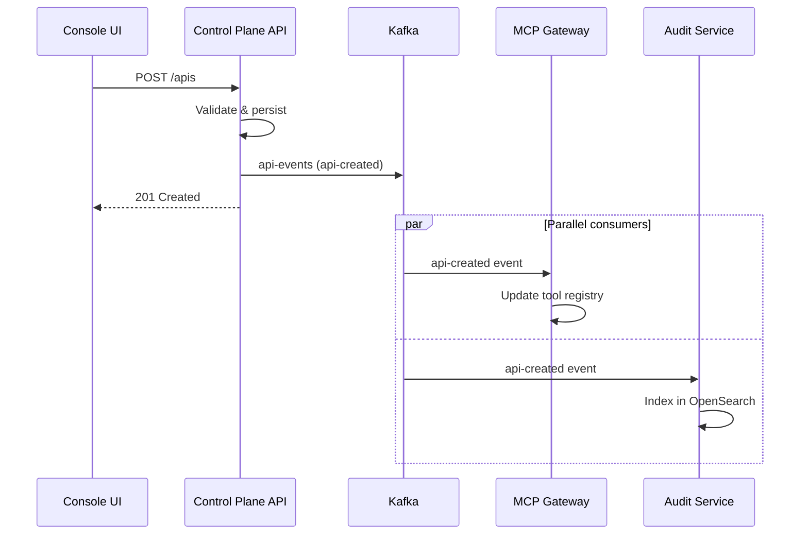
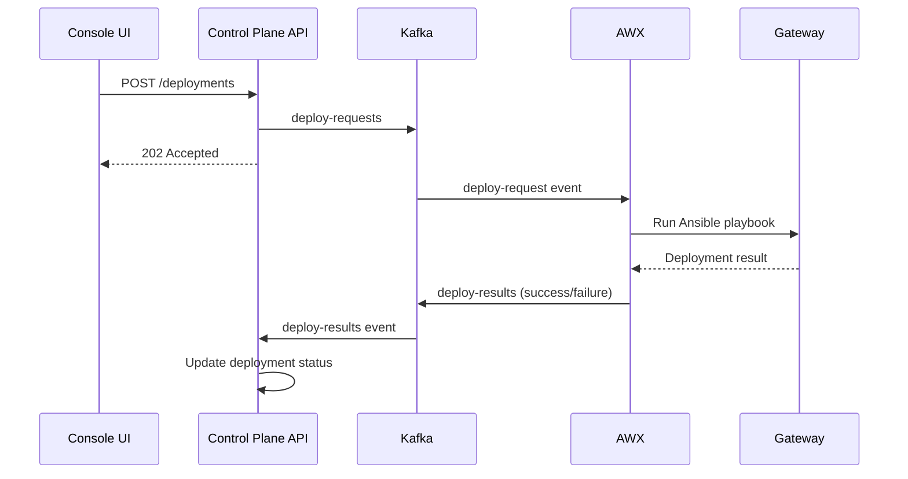

# ADR-005: Event-Driven Architecture — Kafka Topics Design

## Metadata

| Field | Value |
|-------|-------|
| **Status** | Accepted |
| **Date** | 2026-02-06 |
| **Linear** | N/A (Foundational) |

## Context

STOA Platform requires asynchronous communication between components:

- **Control Plane API** publishes events when resources change
- **AWX/Ansible** consumes deployment requests and reports results
- **MCP Gateway** synchronizes tool catalogs based on GitOps events
- **Audit Service** ingests all actions for compliance
- **Observability** tracks gateway health and drift

### The Problem

> "How do we enable loose coupling between services while maintaining consistency and auditability?"

Traditional synchronous REST calls create tight coupling and cascading failures. STOA needs an event-driven architecture that:

- Decouples producers from consumers
- Enables replay and recovery
- Supports multi-tenant isolation
- Provides audit trail

## Decision

Adopt **Apache Kafka** (Redpanda-compatible) as the event backbone with a standardized topic structure and event envelope format.

### Event Envelope Schema

All events follow a consistent envelope:

```json
{
  "id": "uuid-v4",
  "type": "event-type-name",
  "tenant_id": "tenant-identifier",
  "timestamp": "2026-02-06T10:30:00.000Z",
  "user_id": "user-who-triggered",
  "payload": {
    // Event-specific data
  }
}
```

### Topic Inventory

| Topic | Event Types | Producer | Consumer |
|-------|-------------|----------|----------|
| `api-events` | api-created, api-updated, api-deleted | Control Plane API | MCP Gateway, Audit |
| `deploy-requests` | deploy-request | Control Plane API | AWX |
| `deploy-results` | deploy-success, deploy-failure | AWX | Control Plane API |
| `app-events` | app-created, app-updated, app-deleted | Control Plane API | Gateway, Audit |
| `tenant-events` | tenant-created, tenant-updated, tenant-deleted | Control Plane API | Keycloak, Audit |
| `audit-log` | audit | All services | Audit Service, OpenSearch |
| `mcp-server-events` | mcp-server-registered, mcp-server-updated | Control Plane API | MCP Gateway |
| `mcp-sync-requests` | sync-request | Console UI | MCP Gateway |
| `mcp-sync-results` | sync-success, sync-failure | MCP Gateway | Control Plane API |
| `gateway-sync-requests` | sync-request | Control Plane API | Gateway Adapter |
| `gateway-sync-results` | sync-success, sync-failure | Gateway Adapter | Control Plane API |
| `gateway-events` | health-changed, drift-detected, reconciled | Gateway Adapter | Observability |

## Architecture

```
┌──────────────────────────────────────────────────────────────────────┐
│                         PRODUCERS                                      │
│  ┌──────────────┐  ┌──────────────┐  ┌──────────────┐               │
│  │Control Plane │  │   Console    │  │    AWX       │               │
│  │     API      │  │     UI       │  │  (Ansible)   │               │
│  └──────┬───────┘  └──────┬───────┘  └──────┬───────┘               │
└─────────┼─────────────────┼─────────────────┼───────────────────────┘
          │                 │                 │
          ▼                 ▼                 ▼
┌─────────────────────────────────────────────────────────────────────┐
│                    KAFKA / REDPANDA CLUSTER                          │
│  ┌─────────────┐ ┌─────────────┐ ┌─────────────┐ ┌─────────────┐   │
│  │ api-events  │ │deploy-req.  │ │ audit-log   │ │gateway-sync │   │
│  │ (3 partns)  │ │ (3 partns)  │ │ (6 partns)  │ │ (3 partns)  │   │
│  └─────────────┘ └─────────────┘ └─────────────┘ └─────────────┘   │
│  ┌─────────────┐ ┌─────────────┐ ┌─────────────┐ ┌─────────────┐   │
│  │ app-events  │ │tenant-event │ │mcp-server   │ │mcp-sync-*   │   │
│  │ (3 partns)  │ │ (3 partns)  │ │  events     │ │ req/results │   │
│  └─────────────┘ └─────────────┘ └─────────────┘ └─────────────┘   │
└─────────────────────────────────────────────────────────────────────┘
          │                 │                 │
          ▼                 ▼                 ▼
┌─────────────────────────────────────────────────────────────────────┐
│                         CONSUMERS                                     │
│  ┌──────────────┐  ┌──────────────┐  ┌──────────────┐               │
│  │  MCP Gateway │  │ Audit Service│  │ Observability│               │
│  │   (tool      │  │ (OpenSearch) │  │   (Grafana)  │               │
│  │   registry)  │  │              │  │              │               │
│  └──────────────┘  └──────────────┘  └──────────────┘               │
└─────────────────────────────────────────────────────────────────────┘
```

## Partitioning Strategy

Events are partitioned by `tenant_id` to ensure:

1. **Ordering** — Events for the same tenant arrive in order
2. **Parallelism** — Different tenants processed in parallel
3. **Isolation** — Consumer groups can filter by tenant

```python
async def publish(self, topic: str, event_type: str, tenant_id: str, payload: dict):
    event = self._create_event(event_type, tenant_id, payload)
    partition_key = tenant_id  # Partition by tenant

    future = self._producer.send(topic, value=event, key=partition_key)
    future.get(timeout=10)  # Wait for ack
```

## Consumer Groups

| Consumer Group | Topics | Purpose |
|----------------|--------|---------|
| `mcp-gateway-sync` | api-events, mcp-server-events | Tool registry updates |
| `awx-worker` | deploy-requests | Process deployment jobs |
| `audit-ingester` | audit-log, api-events, app-events | OpenSearch indexing |
| `gateway-orchestrator` | gateway-sync-requests | Gateway reconciliation |
| `observability-collector` | gateway-events | Metrics/alerts |

## Event Flow Examples

### API Creation Flow



### Deployment Flow



## Connection Resilience

Kafka connections include retry logic:

```python
async def connect(self):
    max_retries = 5
    retry_delay = 2

    for attempt in range(max_retries):
        try:
            self._producer = KafkaProducer(
                bootstrap_servers=settings.KAFKA_BOOTSTRAP_SERVERS.split(","),
                acks="all",  # Wait for all replicas
                retries=3,
                request_timeout_ms=10000,
            )
            return
        except Exception as e:
            if attempt < max_retries - 1:
                logger.warning(f"Attempt {attempt + 1} failed, retrying...")
                time.sleep(retry_delay)
            else:
                raise
```

## Redpanda Compatibility

STOA uses Redpanda as a Kafka-compatible alternative:

| Feature | Kafka | Redpanda |
|---------|-------|----------|
| Protocol | Kafka 2.x | Compatible |
| JVM | Required | None (C++) |
| ZooKeeper | Required (< 3.x) | None |
| Single-node | Complex | Simple |
| Performance | Good | Better latency |

Configuration:

```yaml
# docker-compose.yml
services:
  redpanda:
    image: redpandadata/redpanda:latest
    command:
      - redpanda start
      - --kafka-addr 0.0.0.0:9092
      - --advertise-kafka-addr redpanda:9092
```

## Topic Configuration

Recommended settings per topic category:

| Category | Partitions | Retention | Replication |
|----------|------------|-----------|-------------|
| Events (api, app, tenant) | 3 | 7 days | 3 |
| Requests (deploy, sync) | 3 | 1 day | 3 |
| Results | 3 | 1 day | 3 |
| Audit | 6 | 90 days | 3 |
| Gateway health | 3 | 1 day | 3 |

## Consequences

### Positive

- **Loose Coupling** — Services communicate via events, not direct calls
- **Reliability** — Kafka persists events; consumers can replay
- **Scalability** — Partitions enable parallel processing
- **Auditability** — All events are recorded for compliance
- **Observability** — Event streams feed monitoring dashboards

### Negative

- **Eventual Consistency** — UI may show stale data briefly
- **Operational Overhead** — Kafka cluster requires management
- **Message Ordering** — Only guaranteed within a partition
- **Debugging Complexity** — Distributed traces needed

### Mitigations

| Challenge | Mitigation |
|-----------|------------|
| Eventual consistency | Optimistic UI updates + polling |
| Operations | Managed Redpanda or Confluent Cloud |
| Ordering | Partition by tenant_id |
| Debugging | OpenTelemetry trace propagation |

## References

- [control-plane-api/src/services/kafka_service.py](https://github.com/stoa-platform/stoa/blob/main/control-plane-api/src/services/kafka_service.py)
- [ADR-007 — GitOps with ArgoCD](./adr-007-gitops-argocd.md)
- [Apache Kafka Documentation](https://kafka.apache.org/documentation/)
- [Redpanda Documentation](https://docs.redpanda.com/)

---

*Standard Marchemalo: A 40-year veteran architect understands in 30 seconds*
