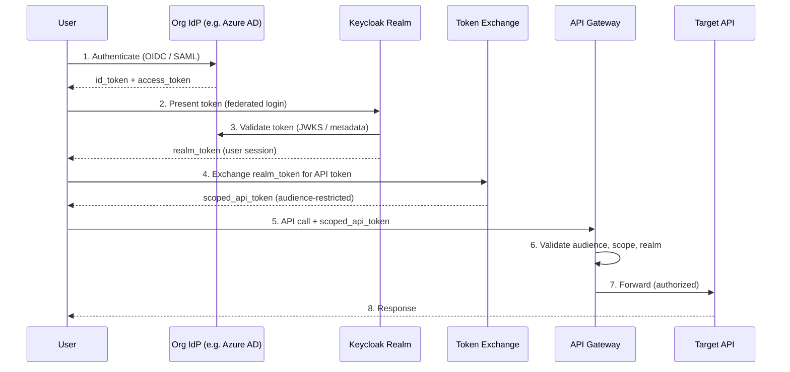
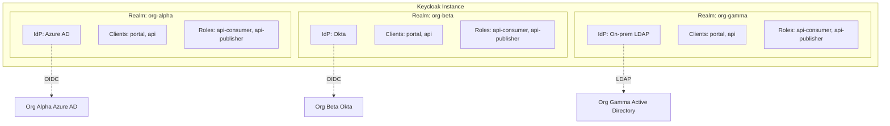

# ADR-026: Multi-IAM Federation Pattern — Zero User Storage Architecture

## Status

Accepted

## Date

2026-01-28

## Context

Enterprise ecosystems frequently involve multiple independent organizations that need to share APIs through a common platform while each retaining full control over their identity infrastructure. Examples include:

- **Banking consortiums** — Regional institutions sharing payment or compliance APIs, each running their own Active Directory or OIDC provider.
- **Insurance groups** — Subsidiaries with independent IT departments and separate identity stores, needing unified claims-processing APIs.
- **Retail franchises** — Stores operating their own identity systems, consuming shared inventory or loyalty APIs.
- **Healthcare networks** — Regional hospitals federating around shared patient-referral or lab-result APIs.
- **Logistics partnerships** — Carriers federating to expose track-and-trace capabilities across organizational boundaries.

The central problem: **N organizations, N different IAMs, one API platform — without forcing a central user directory.**

Traditional approaches copy or synchronize user data into a central store. This creates GDPR liability, synchronization drift, and reduces organizational control over their own identities. STOA needs a pattern that enables unified API access while storing **zero user data** centrally.

## Decision Drivers

- **Data sovereignty** — Each organization must remain the sole controller of its user data.
- **GDPR simplification** — Eliminating centrally stored PII removes an entire category of compliance obligations.
- **Protocol diversity** — Organizations use OIDC, SAML 2.0, or LDAP; the platform must accommodate all.
- **Operational independence** — One organization's IAM outage must not cascade to others.
- **Horizontal scalability** — Adding a new organization should not require re-architecting the platform.
- **API-native integration** — The federation pattern must compose naturally with API gateway policies, rate limiting, and metering.

## Considered Options

### 1. Federation Hub (Zero User Storage)

Each organization connects its IAM as an Identity Provider to a dedicated Keycloak realm. STOA stores no user records — authentication is delegated entirely to the upstream IdP. A Token Exchange step (RFC 8693) converts the user's identity token into a scoped API token that the gateway layer can enforce.

### 2. User Synchronization (Directory Sync)

A central directory receives periodic or real-time copies of user records from each organization via SCIM or LDAP sync. Authentication happens against the central copy.

### 3. Meta-Directory (Virtual Directory)

A virtual directory layer queries each organization's directory at authentication time, presenting a unified view without copying data. User records are never stored but are fetched on demand.

## Decision Outcome

**Chosen option: Federation Hub (Zero User Storage).**

This option is the only one that achieves true zero-PII central storage while preserving full organizational sovereignty. It aligns with STOA's position as an API management platform — not an identity provider — and composes cleanly with the existing multi-tenant architecture (one Keycloak realm per tenant).

| Criteria | Federation Hub | User Sync | Meta-Directory |
|---|---|---|---|
| User Storage | None (zero) | Full copy | Virtual |
| Auth Latency | Auth-time only | Near-zero | Query-time |
| GDPR Compliance | Excellent | Complex | Good |
| Org Sovereignty | Full | Compromised | Partial |
| Implementation Complexity | Medium | High | Very High |
| Vendor Lock-in | Low | High | Medium |
| Sync Conflicts | None | Frequent | None |
| Failure Isolation | Per-realm | Global | Per-query |

## Architecture

```
┌─────────────────────────────────────────────────────────────┐
│                      STOA Platform                          │
│                                                             │
│  ┌──────────┐  ┌──────────┐  ┌──────────┐                  │
│  │ Realm A  │  │ Realm B  │  │ Realm C  │   Keycloak       │
│  │ (OIDC)   │  │ (SAML)   │  │ (LDAP)   │   Multi-Realm    │
│  └────┬─────┘  └────┬─────┘  └────┬─────┘                  │
│       │              │              │                       │
│       ▼              ▼              ▼                       │
│  ┌─────────────────────────────────────────┐                │
│  │       Token Exchange (RFC 8693)          │                │
│  │    User Token  →  Scoped API Token       │                │
│  └─────────────────────────────────────────┘                │
│                       │                                     │
│                       ▼                                     │
│  ┌─────────────────────────────────────────┐                │
│  │          API Gateway Layer               │                │
│  │   (Audience validation per realm)        │                │
│  └─────────────────────────────────────────┘                │
└─────────────────────────────────────────────────────────────┘
          │              │              │
          ▼              ▼              ▼
     ┌────────┐    ┌────────┐    ┌────────┐
     │ Org A  │    │ Org B  │    │ Org C  │
     │  IAM   │    │  IAM   │    │  IAM   │
     └────────┘    └────────┘    └────────┘
```

### Token Exchange Flow



### Realm Isolation



## Implementation Notes

### Keycloak Configuration (Per Realm)

Each organization gets a dedicated realm with its IdP configured as an Identity Provider:

```json
{
  "realm": "org-alpha",
  "enabled": true,
  "identityProviders": [
    {
      "alias": "org-alpha-idp",
      "providerId": "oidc",
      "enabled": true,
      "trustEmail": true,
      "firstBrokerLoginFlowAlias": "first broker login",
      "config": {
        "authorizationUrl": "https://login.org-alpha.example/.well-known/openid-configuration",
        "tokenUrl": "https://login.org-alpha.example/oauth2/token",
        "clientId": "stoa-federation",
        "clientSecret": "${vault:org-alpha-client-secret}",
        "defaultScope": "openid profile email",
        "syncMode": "FORCE",
        "validateSignature": "true",
        "useJwksUrl": "true"
      }
    }
  ],
  "users": []
}
```

Note: `"users": []` — the realm stores **no user records**. User data exists only as transient session attributes during active authentication.

### Token Exchange Configuration (RFC 8693)

Enable token exchange on the realm:

```json
{
  "clientId": "token-exchange-service",
  "enabled": true,
  "protocol": "openid-connect",
  "attributes": {
    "oidc.token.exchange.enabled": "true"
  },
  "protocolMappers": [
    {
      "name": "audience-mapper",
      "protocol": "openid-connect",
      "protocolMapper": "oidc-audience-mapper",
      "config": {
        "included.custom.audience": "stoa-api-gateway",
        "access.token.claim": "true"
      }
    },
    {
      "name": "realm-mapper",
      "protocol": "openid-connect",
      "protocolMapper": "oidc-hardcoded-claim-mapper",
      "config": {
        "claim.name": "stoa_realm",
        "claim.value": "org-alpha",
        "access.token.claim": "true"
      }
    }
  ]
}
```

### Gateway Policy (OPA)

The API Gateway validates that each token is scoped to the correct realm and audience:

```rego
package stoa.gateway.authz

default allow = false

allow {
    input.token.aud == "stoa-api-gateway"
    input.token.stoa_realm == input.request.tenant
    token_not_expired
    realm_has_api_access(input.token.stoa_realm, input.request.api_id)
}

token_not_expired {
    now := time.now_ns() / 1000000000
    now < input.token.exp
}

realm_has_api_access(realm, api_id) {
    subscription := data.subscriptions[realm]
    subscription.apis[_] == api_id
    subscription.status == "active"
}
```

### Key Rotation Strategy

Each realm manages its own JWKS independently. The gateway caches JWKS per realm with a configurable TTL:

```yaml
# Gateway JWKS configuration
jwks:
  cache_ttl: 300          # 5 minutes
  refresh_interval: 60    # Background refresh every 60s
  max_retries: 3
  timeout: 5s
  endpoints:
    org-alpha: https://auth.gostoa.dev/realms/org-alpha/protocol/openid-connect/certs
    org-beta: https://auth.gostoa.dev/realms/org-beta/protocol/openid-connect/certs
```

Key rotation at any organization propagates automatically: the org rotates keys in their IdP, Keycloak picks up the new JWKS on next validation, and the gateway refreshes its cache within the TTL window.

### Clock Synchronization

Federation is sensitive to clock drift. All components must run NTP with a maximum tolerable skew:

- **Token `exp` / `iat` / `nbf` validation**: 30-second skew tolerance configured in Keycloak and gateway.
- **Infrastructure requirement**: All nodes (Keycloak, gateway, API backends) must sync to the same NTP pool with drift < 5 seconds.
- **Monitoring**: Alert when clock offset exceeds 10 seconds on any node.

### Audit Trail

Cross-organization access is logged with full traceability:

```json
{
  "event": "cross_org_api_access",
  "timestamp": "2026-01-28T14:32:00Z",
  "source_realm": "org-alpha",
  "target_api": "payments-v2",
  "user_sub": "hashed:sha256:a1b2c3...",
  "token_jti": "uuid-of-scoped-token",
  "client_ip": "redacted-to-subnet",
  "decision": "allow",
  "policy_version": "v1.3.0"
}
```

User identifiers are hashed in audit logs — the platform never stores plaintext PII, even in logs.

### Disaster Recovery: IdP Unavailability

When an organization's IdP goes down:

1. **Existing sessions continue** — Keycloak realm sessions remain valid until their TTL expires.
2. **New logins for that org fail** — Users see a clear error identifying their organization's IdP as unreachable.
3. **Other orgs are unaffected** — Realm isolation ensures no cross-contamination.
4. **Circuit breaker** — The gateway marks the realm as degraded after 3 consecutive IdP failures and stops attempting federation until a health check succeeds.

### Token Revocation Across Realms

Token revocation operates at two levels:

1. **Realm-level**: Keycloak's built-in session revocation invalidates all tokens for a realm. Used for emergency lockout.
2. **Token-level**: The gateway checks a revocation list (backed by Redis) on each request. When a token is revoked, its `jti` is added to the list with a TTL matching the token's remaining lifetime.

Revocation propagation latency: < 1 second (Redis pub/sub across gateway instances).

## Consequences

### Positive

- **Zero PII stored centrally** — GDPR data-controller obligations are significantly reduced for user identity data. The platform acts as a processor of transient authentication events only.
- **Full organizational sovereignty** — Each organization retains complete control over user lifecycle, password policies, MFA requirements, and session management.
- **No synchronization conflicts** — There is no directory to drift out of sync. The IdP remains the source of truth for user data.
- **Horizontal scaling per realm** — Realms are independent. Adding the 50th organization is the same operation as adding the 2nd.
- **Protocol flexibility** — Organizations connect via whatever protocol their IAM supports (OIDC, SAML 2.0, LDAP). No migration required.
- **Clean failure isolation** — One organization's IdP outage does not affect any other organization's users.

### Negative

- **Auth-time latency** — Federation adds a round-trip to the upstream IdP during initial authentication (typically 200-500ms). Mitigated by session caching.
- **Token Exchange complexity** — RFC 8693 is not universally well-understood. Operational teams need training on the exchange flow and its failure modes.
- **Requires mature IAM at each org** — Organizations must operate a standards-compliant IdP (OIDC/SAML). Organizations with only basic LDAP need a lightweight bridge (Keycloak can federate LDAP directly).
- **No cross-org user search** — The platform cannot list "all users across all organizations." This is by design but can surprise administrators expecting a global directory.

### Risks

| Risk | Impact | Likelihood | Mitigation |
|---|---|---|---|
| IdP unavailability blocks org users | High | Medium | Circuit breaker, session TTL grace period, health monitoring |
| Token size exceeds limits with many claims | Medium | Low | Claim filtering in protocol mappers, use reference tokens for large payloads |
| Clock skew causes token rejection | High | Low | NTP enforcement, 30s skew tolerance, monitoring alerts |
| Realm escape (cross-tenant token reuse) | Critical | Very Low | Audience validation, realm claim enforcement, OPA policy, penetration testing |
| JWKS cache poisoning | Critical | Very Low | Pin JWKS URLs to Keycloak internal endpoints, mTLS between gateway and Keycloak |
| Audit log correlation across orgs | Medium | Medium | Hashed user identifiers with per-realm salt, correlation via `token_jti` |

## Security Considerations

### Realm Isolation Design

- Each realm runs with its own signing keys, client registrations, and session store.
- The gateway enforces `stoa_realm` claim matching against the request's tenant context. A token issued for `org-alpha` cannot access `org-beta` APIs even if scopes match.
- Network policies restrict inter-realm communication at the Kubernetes level.

### JWT Algorithm Enforcement

```yaml
# Keycloak realm configuration
tokenSettings:
  defaultSignatureAlgorithm: RS256
  allowedSignatureAlgorithms:
    - RS256
    - ES256
  # "none" algorithm is rejected at framework level
```

The gateway rejects any token with `alg: none` or symmetric algorithms (HS256) for realm tokens. Only asymmetric algorithms with keys from trusted JWKS endpoints are accepted.

### Secrets Management

- IdP client secrets are stored in HashiCorp Vault, injected via Kubernetes secrets.
- No secrets in environment variables, ConfigMaps, or source control.
- Client secrets are rotated on a 90-day cycle with zero-downtime rotation (dual-secret window).

### mTLS Between Components

All internal communication (Keycloak ↔ Gateway, Gateway ↔ API backends) uses mTLS with certificates issued by a private CA. External IdP connections use standard TLS with certificate pinning where supported.

## GDPR Considerations

- **Article 28 (Processor)**: STOA acts as a data processor for transient authentication metadata only. Data processing agreements cover federation metadata (issuer URLs, client IDs) but not user PII.
- **Right to Erasure (Article 17)**: When a user is deleted at their organization's IdP, their Keycloak session (if any) expires naturally. Audit logs contain only hashed identifiers — no plaintext PII to erase.
- **Cross-border transfers**: If organizations span EU and non-EU jurisdictions, the federation metadata (not user data) traverses borders. Standard Contractual Clauses apply to the platform operator, not to user identity data (which never leaves the org's IdP).

## STOA Value Proposition

This pattern is not raw Keycloak federation — it is federation **composed with API management**:

1. **Realm-per-tenant integrated with API subscriptions** — The gateway enforces that Org A's token can only access APIs that Org A has subscribed to. This is API-lifecycle-aware federation, not generic SSO.
2. **Metering per realm** — Usage tracking, rate limiting, and billing are scoped per organization automatically through realm isolation.
3. **Self-service onboarding** — New organizations are provisioned through the STOA control plane (realm creation + IdP configuration + API subscription), not through manual Keycloak administration.
4. **MCP-native federation** — AI agents authenticating via MCP tools inherit the same federation model. An agent acting on behalf of Org A's user gets a scoped token that restricts tool access to Org A's subscribed APIs.
5. **GitOps-driven realm configuration** — Realm definitions are stored as code, reviewed via merge requests, and applied through CI/CD. No manual Keycloak console changes in production.

## References

- [RFC 8693 — OAuth 2.0 Token Exchange](https://datatracker.ietf.org/doc/html/rfc8693)
- [Keycloak Identity Brokering](https://www.keycloak.org/docs/latest/server_admin/#_identity_broker)
- [GDPR Article 28 — Processor](https://gdpr-info.eu/art-28-gdpr/)
- [GDPR Article 17 — Right to Erasure](https://gdpr-info.eu/art-17-gdpr/)
- [ADR-024 — Gateway Unified Modes](https://docs.gostoa.dev/architecture/adr/adr-024-gateway-unified-modes)
