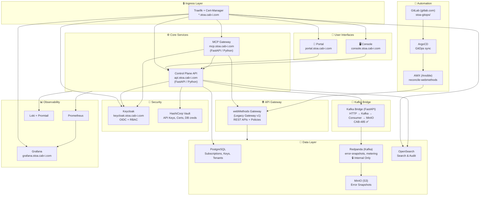
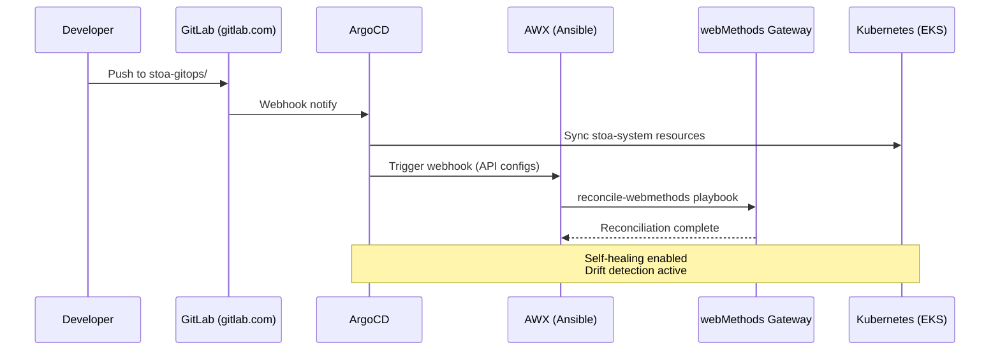
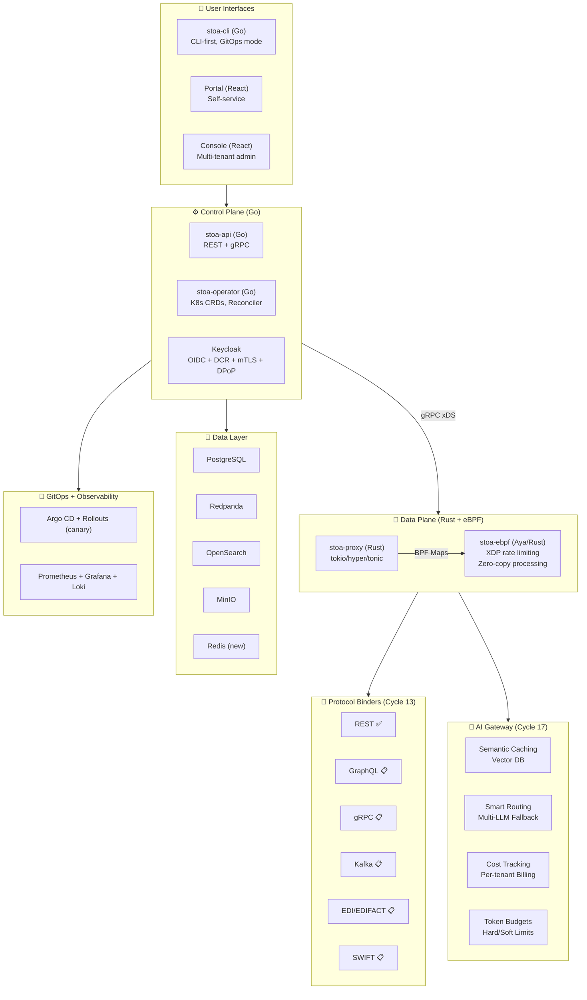
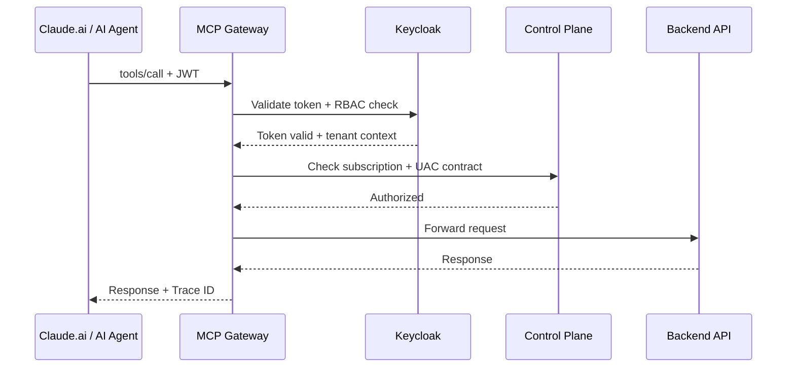

# Architecture Overview

> **"Two architectures, one vision"** — Current implementation + Target state for v1.0

STOA Platform is designed as a cloud-native, multi-tenant gateway platform built for both traditional APIs and AI agents. This document maintains two distinct views:

1. **Live** — What is actually deployed and running in production
2. **Target** — The architecture we are converging toward (v1.0 Q3 2026)

*Last updated: February 2, 2026 — Post Cycle 5 (CAB-668)*

---

## Live Architecture (February 2026)

*What runs in production on `*.stoa.cab-i.com`*



### Live Services — Status 02/02/2026

| Service | URL | Status | Stack |
|---------|-----|--------|-------|
| Portal | `portal.stoa.cab-i.com` | ✅ Live | React |
| Control Plane API | `api.stoa.cab-i.com` | ✅ Live | FastAPI (Python) |
| Console | `console.stoa.cab-i.com` | ✅ Live | React |
| MCP Gateway | `mcp.stoa.cab-i.com` | ✅ Live | FastAPI (Python) |
| Keycloak | `keycloak.stoa.cab-i.com` | ✅ Live | Keycloak (OIDC) |
| Grafana | `grafana.stoa.cab-i.com` | ✅ Live | Grafana + Loki |
| OpenSearch | `opensearch.stoa.cab-i.com` | ✅ Live | OpenSearch |
| Docs | `docs.gostoa.dev` | ✅ Live | Docusaurus (Vercel) |
| Kafka Bridge | Internal only | ✅ Live | FastAPI (CAB-485) |
| Error Snapshot Consumer | Internal only | ✅ Live | Python (CAB-485) |

### Live Features — Implemented (Post Cycle 5)

- ✅ **Auth**: Keycloak OIDC + TOTP 2FA + RBAC multi-tenant
- ✅ **Subscriptions**: Tool → User → Tenant with API Keys (Vault-backed)
- ✅ **MCP Gateway**: `list_tools`, `call_tool`, `list_resources` — Claude.ai integration fixed (JSON-RPC bugs resolved)
- ✅ **Multi-Tenant Tool Discovery**: Tenant-scoped tools with JWT context injection
- ✅ **GitOps webMethods**: YAML → AWX → Gateway reconciliation
- ✅ **ArgoCD Foundation**: GitOps continuous deployment for `stoa-system`
- ✅ **Error Snapshots**: Capture → Kafka → MinIO → API retrieve (CAB-397 + CAB-485)
- ✅ **Observability**: Prometheus + Grafana + Loki centralized
- ✅ **Search**: OpenSearch catalog + audit trail
- ✅ **Webhooks**: `subscription.created/renewed/revoked` notifications
- ✅ **Security**: Vault secrets management, Keycloak RBAC, mTLS groundwork

### Git Repositories

| Repository | Host | Purpose |
|------------|------|---------|
| `stoa-platform/stoa` | GitHub (public) | Core platform code (Apache 2.0) |
| `stoa-platform/stoa-docs` | GitHub (public) | Documentation site |
| `stoa-platform/stoa-web` | GitHub (public) | Landing page (gostoa.dev) |
| `stoa-platform/stoa-helm` | GitHub (public) | Helm charts |
| `PotoMitan/stoa-gitops` | GitLab (private) | ArgoCD apps, Ansible playbooks, infra |
| `PotoMitan/stoa-catalog` | GitLab (private) | Tenant API definitions, webMethods configs |
| `PotoMitan/stoa-ops` | GitLab (private) | Terraform, operational scripts |

### Deployment Flow (Live)



:::caution Important
The deployment flow is **NOT** Kafka-driven. The actual pipeline is:
`GitLab → ArgoCD → AWX webhook → webMethods`

Kafka is used exclusively for internal event streaming (error snapshots, metering), never for deployment orchestration. See ADR-017: Kafka Internal-Only.
:::

### Kubernetes Namespace

All components run in the `stoa-system` namespace on EKS:

```bash
kubectl get pods -n stoa-system
```

---

## Target Architecture (v1.0 — Q3 2026)

*Vision: eBPF-native, CLI-first, AI-ready*



### Live → Target Differences

| Component | Live (Feb 2026) | Target (Q3 2026) | Cycle |
|-----------|-----------------|-------------------|-------|
| **Gateway** | webMethods (Java) | stoa-proxy (Rust) | Cycle 15 |
| **Rate Limiting** | User-space (slowapi) | XDP/eBPF (kernel) | Cycle 15 |
| **Control Plane** | FastAPI (Python) | stoa-api (Go) | Cycle 15 |
| **CLI** | — | stoa-cli (Go) | Cycle 15 |
| **Operator** | — | stoa-operator (Go) | Cycle 15 |
| **GitOps** | AWX + GitLab CI | Argo CD + Rollouts | CAB-483 |
| **Cache** | In-memory | Redis distributed | CAB-306 |
| **B2B Protocols** | REST only | EDI/SWIFT/Euro Num. | Cycle 13 |
| **AI Gateway** | Basic MCP | Semantic cache + routing | Cycle 17 |

### CRDs — Roadmap v1.0

:::info Not Yet Deployed
The following Custom Resource Definitions are **planned for v1.0** and are not currently deployed. They will be managed by the `stoa-operator`:
:::

```yaml
# ROADMAP - Not deployed yet
apiVersion: stoa.io/v1alpha1
kind: Tool
metadata:
  name: billing-api
  namespace: tenant-acme
spec:
  protocol: rest
  upstream: https://api.acme.com/billing
  auth:
    type: oauth2
    issuer: https://keycloak.stoa.cab-i.com/realms/acme
---
apiVersion: stoa.io/v1alpha1
kind: ToolSet
metadata:
  name: acme-tools
  namespace: tenant-acme
spec:
  tools:
    - billing-api
    - inventory-api
  policies:
    rateLimit: 1000/min
    auth: required
```

---

## Migration Roadmap

```
Jan 2026       Feb 2026       Mar 2026       Q2 2026        Q3 2026
    │              │              │              │              │
    ▼              ▼              ▼              ▼              ▼
┌───────┐     ┌───────┐     ┌───────┐     ┌───────┐     ┌───────┐
│v0.1.0 │     │v0.2.0 │     │v0.3.0 │     │v0.5.0 │     │v1.0.0 │
│MVP    │────►│Demo   │────►│Proxy  │────►│eBPF   │────►│GA     │
│       │     │       │     │       │     │       │     │       │
│Live   │     │+Claude│     │+Rust  │     │+eBPF  │     │Full   │
│Arch   │     │ .ai   │     │Proxy  │     │       │     │Target │
└───────┘     └───────┘     └───────┘     └───────┘     └───────┘
    │                                                        │
    └──────────── Hybrid Period ─────────────────────────────┘
        (webMethods + stoa-proxy coexist with traffic shifting)
```

---

## Technology Stack

| Layer | Live (Feb 2026) | Target (v1.0) |
|-------|-----------------|---------------|
| Gateway | webMethods (Java) | Rust, Tokio, Hyper |
| MCP Gateway | Python, FastAPI | Rust (integrated in stoa-proxy) |
| Control Plane API | Python, FastAPI | Go |
| Frontend | React, TypeScript, Tailwind | React, TypeScript, Tailwind |
| Database | PostgreSQL | PostgreSQL |
| Event Streaming | Redpanda (Kafka API) | Redpanda (Kafka API) |
| Search | OpenSearch | OpenSearch |
| Object Storage | MinIO | MinIO / S3 |
| Cache | In-memory | Redis |
| Auth | Keycloak | Keycloak |
| Secrets | HashiCorp Vault | HashiCorp Vault |
| Observability | Prometheus, Grafana, Loki | Prometheus, Grafana, Loki |
| GitOps | ArgoCD + AWX | ArgoCD + Argo Rollouts |
| Infrastructure | Kubernetes (EKS), Helm | Kubernetes, Helm, Terraform |

---

## Security Zones

| Zone | Trust Level | Components |
|------|-------------|------------|
| **External** | Untrusted | API Clients, Claude.ai, Web Console |
| **DMZ** | Semi-trusted | Traefik Ingress, API Gateway, MCP Gateway |
| **Internal** | Trusted | Control Plane, Keycloak, Data Layer |

Key security principles:
- Kafka/Redpanda: **zero external exposure** (ADR-017)
- Multi-tenant isolation via JWT context (ADR-016)
- GitOps with Argo CD for declarative config ([ADR-015](/docs/architecture/adr/adr-015-token-optimization-architecture))
- All secrets managed through HashiCorp Vault

---

## MCP Gateway Flow



### Multi-Tenant Tool Isolation

Each tenant only sees their own tools:

| Tenant | Platform Tools | Tenant Tools |
|--------|---------------|--------------|
| **Parzival (IOI)** | `stoa_*` | `ioi:billing:*`, `ioi:inventory:*` |
| **Sorrento (Gregarious)** | `stoa_*` | `greg:oasis:*`, `greg:sixers:*` |
| **Halliday (Admin)** | Full cross-tenant visibility | All tools |

---

## Related Documents

- [Gateway Overview](/docs/concepts/gateway) — Gateway concepts
- [Technology Choices (ADRs)](/docs/architecture/adr) — Architecture decisions
- [GitOps with ArgoCD](/docs/concepts/gitops) — Deployment strategy

---

## Changelog

| Date | Version | Changes |
|------|---------|---------|
| 2026-02-02 | 2.1 | Alignment CAB-668: Phase→Cycle terminology, Feb 2026 refresh, post-Cycle 5 features |
| 2026-01-18 | 2.0 | Live vs Target separation, URL corrections |
| 2026-01-15 | 1.9 | Added CAB-485 (Error Snapshots) |
| 2026-01-11 | 1.8 | MCP Gateway OPA integration |

---

*Reference: [CAB-668](https://linear.app/hlfh-workspace/issue/CAB-668) — STOA Platform*
