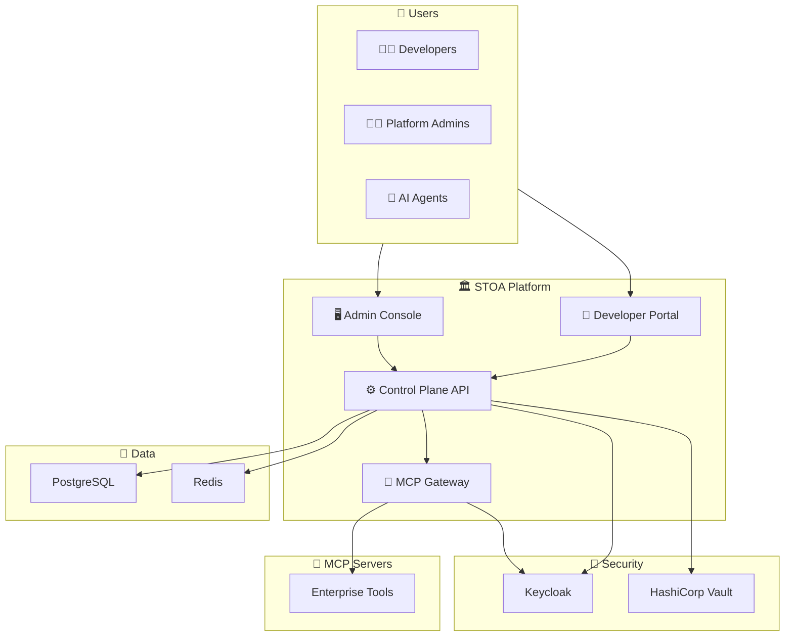
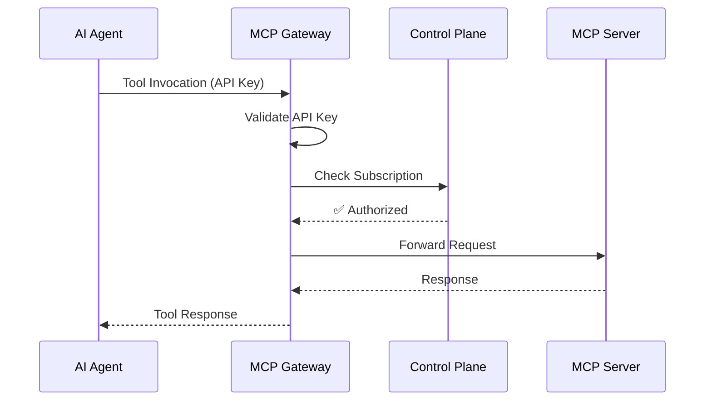

# STOA Platform Architecture

This document provides an overview of the STOA Platform architecture.

## High-Level Architecture



## Components

### Core Services

| Component | Technology | Purpose |
|-----------|------------|---------|
| **Control Plane API** | Python, FastAPI | Central management API for subscriptions, tools, tenants |
| **MCP Gateway** | Rust, Tokio, Hyper | High-performance proxy for MCP tool invocations |
| **Portal UI** | React, TypeScript | Developer self-service portal |
| **Console UI** | React, TypeScript | Admin management console |

### Security Layer

| Component | Technology | Purpose |
|-----------|------------|---------|
| **Keycloak** | Java | OIDC/OAuth2 identity provider, RBAC |
| **HashiCorp Vault** | Go | Secrets management, API key storage |

### Data Layer

| Component | Technology | Purpose |
|-----------|------------|---------|
| **PostgreSQL** | SQL | Primary database for subscriptions, tenants |
| **Redis** | In-memory | Caching, sessions, rate limiting |

### Observability

| Component | Technology | Purpose |
|-----------|------------|---------|
| **Prometheus** | Go | Metrics collection |
| **Grafana** | Go | Dashboards and visualization |
| **Loki** | Go | Log aggregation |
| **Alertmanager** | Go | Alert routing and notifications |

## Request Flow



## Deployment

STOA Platform is designed to run on Kubernetes. See the [Helm chart documentation](https://github.com/stoa-platform/stoa-helm) for deployment instructions.

### Kubernetes Namespace

All components run in the `stoa-system` namespace:

```bash
kubectl get pods -n stoa-system
```

### Ingress

| Service | URL | Purpose |
|---------|-----|---------|
| Portal | `portal.stoa.example.com` | Developer portal |
| Console | `console.stoa.example.com` | Admin console |
| API | `api.stoa.example.com` | Control Plane API |
| Gateway | `gateway.stoa.example.com` | MCP Gateway |
| Auth | `auth.stoa.example.com` | Keycloak |
| Grafana | `grafana.stoa.example.com` | Dashboards |

## Diagrams

Architecture diagrams are available in multiple formats:

- **Mermaid**: `architecture-high-level.mermaid` - For embedding in Markdown
- **SVG**: `architecture-diagram.svg` - For web and presentations
- **Kubernetes**: `architecture-kubernetes.mermaid` - Deployment view

## Related Documentation

- [Getting Started](/getting-started)
- [Deployment Guide](/deployment/helm)
- [API Reference](/api)
