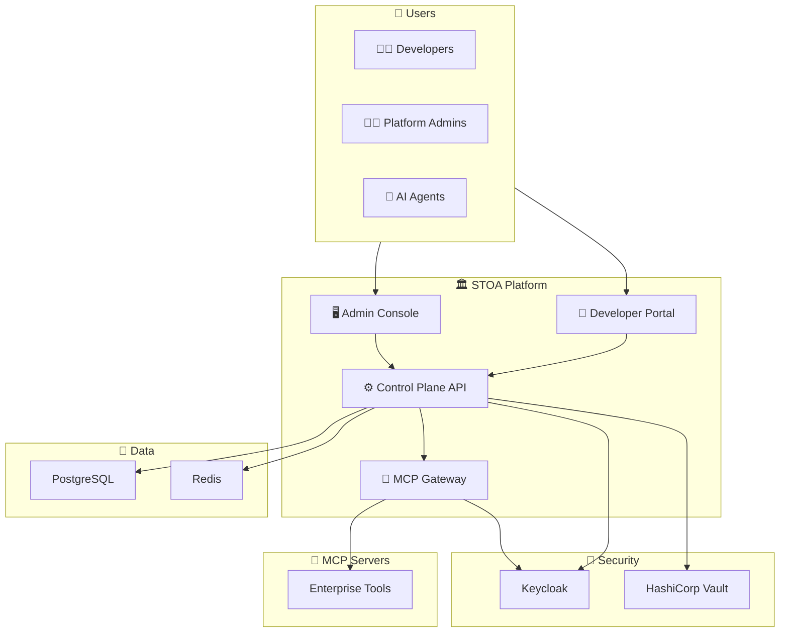
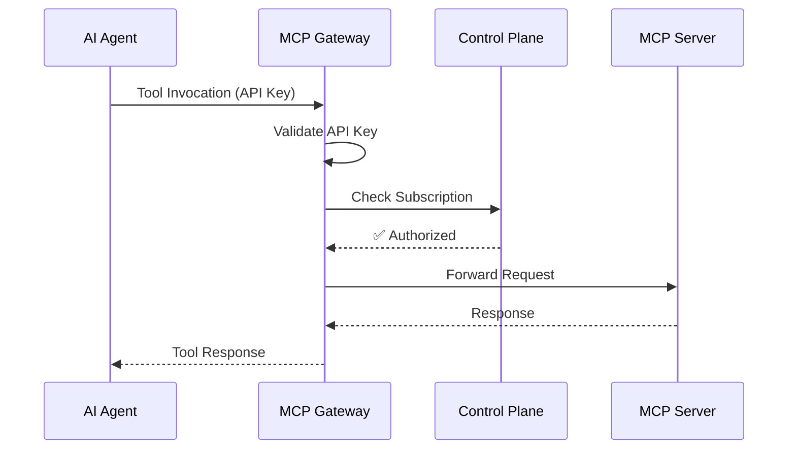

# Architecture Overview

STOA Platform is designed as a cloud-native, multi-tenant gateway platform built for both traditional APIs and AI agents.

## High-Level Architecture



## Core Components

### Control Plane API

The central management API built with **Python** and **FastAPI**.

| Aspect | Details |
|--------|---------|
| Language | Python 3.12+ |
| Framework | FastAPI (async) |
| Database | PostgreSQL + SQLAlchemy |
| Cache | Redis |
| Auth | Keycloak (OIDC) |

**Responsibilities:**
- Subscription management
- Tenant provisioning
- Tool catalog
- Usage tracking
- Policy enforcement

### MCP Gateway

High-performance proxy for MCP tool invocations built with **Rust**.

| Aspect | Details |
|--------|---------|
| Language | Rust |
| Runtime | Tokio (async) |
| HTTP | Hyper |
| Protocol | MCP (Model Context Protocol) |

**Responsibilities:**
- Request routing
- Authentication validation
- Rate limiting
- Metrics collection
- MCP protocol handling

### Portal UI

Self-service developer portal built with **React** and **TypeScript**.

**Features:**
- API/Tool catalog browsing
- Subscription management
- API key generation
- Usage dashboards
- Documentation access

### Console UI

Admin management console built with **React** and **TypeScript**.

**Features:**
- Tenant management
- User administration
- Policy configuration
- System monitoring
- Audit logs

## Security Layer

### Keycloak

Identity and access management providing:
- OIDC/OAuth2 authentication
- SSO (Single Sign-On)
- RBAC (Role-Based Access Control)
- Multi-factor authentication
- User federation

### HashiCorp Vault

Secrets management for:
- API key encryption
- Database credentials
- TLS certificates
- Service tokens

## Data Layer

### PostgreSQL

Primary database storing:
- Subscriptions
- Tenants
- Users
- Tool definitions
- Audit logs

### Redis

In-memory data store for:
- Session management
- Rate limiting counters
- Response caching
- Real-time metrics

## Observability Stack

| Component | Purpose |
|-----------|---------|
| **Prometheus** | Metrics collection |
| **Grafana** | Dashboards & visualization |
| **Loki** | Log aggregation |
| **Alertmanager** | Alert routing |

## Request Flow



1. **AI Agent** sends a tool invocation request with an API key
2. **MCP Gateway** validates the API key against Keycloak
3. **Gateway** checks subscription status with Control Plane API
4. **Control Plane** verifies the subscription is active
5. **Gateway** forwards the request to the appropriate MCP Server
6. **MCP Server** executes the tool and returns the response
7. **Gateway** returns the response to the AI Agent

## Deployment

STOA Platform runs on **Kubernetes** and can be deployed using:

- **Helm Charts**: [stoa-platform/stoa-helm](https://github.com/stoa-platform/stoa-helm)
- **GitOps**: ArgoCD compatible
- **IaC**: Terraform modules available

### Kubernetes Namespace

All components run in the `stoa-system` namespace:

```bash
kubectl get pods -n stoa-system
```

### Ingress Endpoints

| Service | URL Pattern |
|---------|-------------|
| Portal | `portal.<domain>` |
| Console | `console.<domain>` |
| API | `api.<domain>` |
| Gateway | `gateway.<domain>` |
| Auth | `auth.<domain>` |

## Technology Stack Summary

| Layer | Technology |
|-------|------------|
| Gateway | Rust, Tokio, Hyper |
| API | Python, FastAPI |
| Frontend | React, TypeScript, Tailwind |
| Database | PostgreSQL |
| Cache | Redis |
| Auth | Keycloak |
| Secrets | HashiCorp Vault |
| Observability | Prometheus, Grafana, Loki |
| Infrastructure | Kubernetes, Helm, Terraform |

## Next Steps

- [Quick Start Guide](/docs/guides/quick-start) - Get STOA running locally
- [API Reference](/docs/api/control-plane) - Explore the Control Plane API
