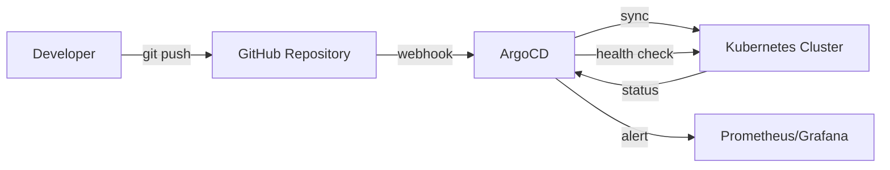
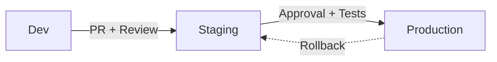
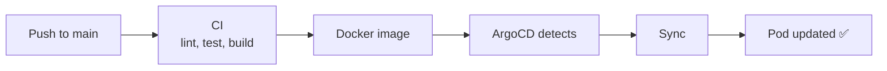

# GitOps with ArgoCD

How STOA leverages GitOps for declarative, auditable configuration management across multiple environments.

## GitOps Philosophy

STOA embraces GitOps principles where Git is the single source of truth for all platform configuration:

- **Declarative Configuration** — Desired state defined in YAML, not imperative scripts
- **Git as Source of Truth** — All configuration stored, versioned, and auditable in Git
- **Automated Sync** — ArgoCD continuously reconciles actual vs desired cluster state
- **Self-Healing** — Drift detected automatically, cluster state restored to match Git
- **Audit Trail** — Every change has a Git commit with author, timestamp, and rationale

## Architecture



STOA uses ArgoCD for Kubernetes resource management. Each managed component is an ArgoCD `Application`:

| Component | ArgoCD App | Sync Policy |
|-----------|-----------|-------------|
| STOA Gateway | `stoa-gateway` | Auto-sync + self-heal |
| Control Plane API | `control-plane-api` | Auto-sync + self-heal |
| Console UI | `control-plane-ui` | Auto-sync + self-heal |
| Developer Portal | `stoa-portal` | Auto-sync + self-heal |

## Multi-Environment Promotion (ADR-040)

STOA implements a "Born GitOps" model where environments are first-class citizens, not an afterthought.

### Three Environments

| Environment | Mode | Color | Purpose |
|-------------|------|-------|---------|
| **Development** | `full` | Green | Unrestricted — create, modify, delete |
| **Staging** | `full` | Amber | Pre-production validation |
| **Production** | `read-only` | Red | Locked — changes via promotion only |

### Promotion Flow



1. **Develop** in `dev` — full CRUD access, rapid iteration
2. **Promote** to `staging` — automated tests, integration validation
3. **Approve** for `prod` — manual gate, read-only enforcement prevents direct edits

### Environment-Scoped Operations

The Console UI reflects the current environment with visual indicators:

- **Green dot** — Development (all actions available)
- **Amber dot** — Staging (all actions available)
- **Red dot + lock icon** — Production (read-only, no create/edit/delete)

API queries are environment-scoped: `GET /v1/apis?environment=staging` returns only staging APIs.

## ArgoCD Application Example

```yaml
apiVersion: argoproj.io/v1alpha1
kind: Application
metadata:
  name: stoa-gateway
  namespace: argocd
spec:
  project: default
  source:
    repoURL: https://github.com/stoa-platform/stoa
    targetRevision: main
    path: stoa-gateway/k8s
  destination:
    server: https://kubernetes.default.svc
    namespace: stoa-system
  syncPolicy:
    automated:
      prune: true        # Delete resources removed from Git
      selfHeal: true     # Revert manual cluster changes
    syncOptions:
      - CreateNamespace=true
```

### Sync Policies

| Policy | Effect |
|--------|--------|
| `automated.prune: true` | Resources deleted from Git are removed from cluster |
| `automated.selfHeal: true` | Manual kubectl changes are reverted to match Git |
| `syncOptions: CreateNamespace` | Namespace auto-created if missing |

## CI/CD Integration

ArgoCD integrates with STOA's CI pipeline:



| Step | Tool | Trigger |
|------|------|---------|
| Code push | GitHub | Developer merge |
| CI pipeline | GitHub Actions | Push to main |
| Docker build | GitHub Actions | CI success |
| ArgoCD sync | ArgoCD | Image change detected |
| Health check | ArgoCD | Post-sync probe |
| Alerting | Prometheus | Health degraded |

### Image Update Strategy

STOA uses `imagePullPolicy: Always` with `kubectl rollout restart` to deploy new images. ArgoCD monitors the deployment and reports sync status.

## Drift Detection

ArgoCD continuously compares the live cluster state with the Git-defined state:

| Status | Meaning | Action |
|--------|---------|--------|
| **Synced + Healthy** | Cluster matches Git, pods running | None |
| **OutOfSync** | Git changed, cluster not yet updated | Auto-sync applies changes |
| **Degraded** | Pods failing health checks | Investigate, potential rollback |
| **Unknown** | ArgoCD can't reach the app | Check repo access |

When self-heal is enabled, STOA automatically reverts any manual changes made via `kubectl` — ensuring Git remains the single source of truth.

## Configuration Repository Structure

```
stoa/
├── stoa-gateway/
│   └── k8s/
│       └── deployment.yaml     # Gateway K8s manifest
├── control-plane-ui/
│   └── k8s/
│       └── deployment.yaml     # Console UI manifest
├── portal/
│   └── k8s/
│       └── deployment.yaml     # Portal manifest
└── charts/
    └── stoa-platform/
        ├── crds/               # CRD definitions (Tool, ToolSet)
        ├── templates/          # Helm templates
        └── values.yaml         # Default values
```

## Best Practices

- **Never manually edit cluster resources** — All changes through Git PRs
- **Use PRs for all changes** — Code review + CI validation before merge
- **Environment separation** — Dev for experimentation, staging for validation, prod via promotion
- **Secrets via Infisical** — Never store secrets in Git; use external secret management
- **Monitor ArgoCD sync status** — Grafana dashboard with sync/health alerts
- **Rollback via Git** — `git revert` the problematic commit, ArgoCD auto-syncs

## Related

- [Quick Start](/docs/guides/quickstart) — Get started with STOA
- [Architecture Overview](/docs/concepts/architecture) — System architecture
- [ADR-007: GitOps with ArgoCD](/docs/architecture/adr/adr-007-gitops-argocd) — Architecture decision
- [ADR-040: Born GitOps](/docs/architecture/adr/adr-040-born-gitops-multi-environment) — Multi-environment architecture
- [Deployment Guide](/docs/deployment/hybrid) — Hybrid deployment options
