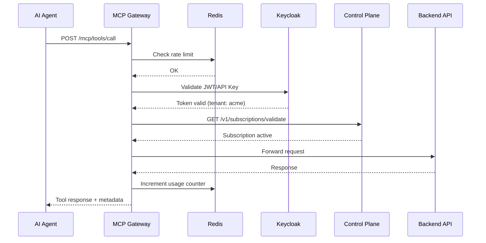

# MCP Gateway

STOA's MCP Gateway is the **first MCP-native API Gateway**, enabling AI agents like Claude, GPT, and custom LLM applications to securely consume enterprise APIs through the Model Context Protocol.

## Overview

The MCP Gateway acts as the bridge between AI agents and your API ecosystem. It handles authentication, rate limiting, subscription validation, and multi-tenant isolation—all while speaking the native MCP protocol.

```
┌─────────────┐      MCP Protocol       ┌──────────────┐      REST/gRPC      ┌─────────────┐
│  AI Agent   │ ◄─────────────────────► │ MCP Gateway  │ ◄─────────────────► │  Your APIs  │
│  (Claude)   │    tools/call, etc.     │    (Rust)    │                     │             │
└─────────────┘                         └──────────────┘                     └─────────────┘
                                               │
                                               ▼
                                        ┌──────────────┐
                                        │ Control Plane│
                                        │  (FastAPI)   │
                                        └──────────────┘
```

## Key Features

### 🔐 Enterprise Security
- **Keycloak OIDC integration** with multi-realm per tenant
- JWT token validation with audience mapping
- API key management with automatic rotation

### 🏢 Multi-Tenant Isolation
- Kubernetes namespace per tenant (`tenant-{name}`)
- Network policies preventing cross-tenant communication
- Per-tenant rate limiting and quotas

### 📊 Full Observability
- Prometheus metrics on port 9090
- Request tracing with correlation IDs
- Usage analytics per subscription

### ⚡ High Performance
- Written in **Rust + Tokio** for maximum throughput
- Redis-based rate limiting with sub-millisecond latency
- Connection pooling and request batching

## MCP Protocol Support

STOA implements the full [MCP specification](https://modelcontextprotocol.io/) (version `2024-11-05`) with enterprise extensions.

### Supported Transports

| Transport | Endpoint | Use Case |
|-----------|----------|----------|
| HTTP | `POST /mcp/*` | Stateless tool invocations |
| WebSocket | `GET /ws` | Bidirectional, long-running sessions |

### Core Methods

#### Tools

```bash
# List available tools for your subscription
POST /mcp/tools/list
Content-Type: application/json

{
  "cursor": null
}
```

```bash
# Invoke a tool
POST /mcp/tools/call
Content-Type: application/json

{
  "name": "stoa_catalog",
  "arguments": {
    "action": "list",
    "status": "active"
  }
}
```

#### Resources

```bash
# List available resources
POST /mcp/resources/list

# Read a specific resource
POST /mcp/resources/read
{
  "uri": "stoa://apis/billing-api/openapi.json"
}

# Subscribe to changes (WebSocket only)
POST /mcp/resources/subscribe
{
  "uri": "stoa://metrics/billing-api"
}
```

#### Prompts

```bash
# List available prompts
POST /mcp/prompts/list

# Get a prompt with arguments
POST /mcp/prompts/get
{
  "name": "api-integration-guide",
  "arguments": {
    "api_id": "billing-api",
    "language": "python"
  }
}
```

## STOA Extensions

Beyond the standard MCP protocol, STOA provides enterprise-grade extensions.

### Batch Operations

Execute multiple tool calls in a single request to reduce latency:

```bash
POST /mcp/tools/batch
Content-Type: application/json

{
  "calls": [
    {"name": "stoa_catalog", "arguments": {"action": "get", "api_id": "billing-api"}},
    {"name": "stoa_metrics", "arguments": {"action": "usage", "api_id": "billing-api"}},
    {"name": "stoa_subscription", "arguments": {"action": "credentials", "subscription_id": "sub-123"}}
  ]
}
```

### Response Caching

Use the `X-MCP-Cache` header to enable response caching:

```bash
POST /mcp/tools/call
X-MCP-Cache: max-age=300

{
  "name": "stoa_catalog",
  "arguments": {"action": "list"}
}
```

### LLM Sampling Proxy

Route LLM completion requests through STOA for cost tracking and audit:

```bash
POST /mcp/sampling/createMessage

{
  "messages": [
    {"role": "user", "content": "Summarize the billing API documentation"}
  ],
  "maxTokens": 1000,
  "systemPrompt": "You are a helpful API documentation assistant."
}
```

## Request Flow

Understanding how requests flow through the gateway:



## Authentication

### JWT Tokens (Recommended)

Obtain a token from your tenant's Keycloak realm:

```bash
# Get token
TOKEN=$(curl -X POST "https://auth.gostoa.dev/realms/{tenant}/protocol/openid-connect/token" \
  -d "client_id=mcp-client" \
  -d "client_secret=${CLIENT_SECRET}" \
  -d "grant_type=client_credentials" | jq -r .access_token)

# Use with MCP Gateway
curl -X POST "https://mcp.gostoa.dev/v1/{tenant}/tools/list" \
  -H "Authorization: Bearer ${TOKEN}" \
  -H "Content-Type: application/json"
```

### API Keys

For simpler integrations, use API keys:

```bash
curl -X POST "https://mcp.gostoa.dev/v1/{tenant}/tools/call" \
  -H "X-API-Key: stoa_key_xxxxx" \
  -H "Content-Type: application/json" \
  -d '{"name": "stoa_catalog", "arguments": {"action": "list"}}'
```

## Connecting Claude.ai

To connect Claude.ai to your STOA instance:

1. **Get your MCP endpoint URL:**
   ```
   https://mcp.gostoa.dev/v1/{your-tenant}/sse
   ```

2. **Configure in Claude.ai Settings:**
   - Go to Settings → Integrations → MCP Servers
   - Add new server with your endpoint URL
   - Enter your API key or OAuth credentials

3. **Verify connection:**
   Ask Claude: *"What STOA tools are available?"*

## Health Endpoints

| Endpoint | Port | Purpose |
|----------|------|---------|
| `/health` | 8080 | Liveness probe |
| `/ready` | 8080 | Readiness probe |
| `/metrics` | 9090 | Prometheus metrics |

## Configuration

The MCP Gateway is configured via Helm values:

```yaml
# values.yaml
mcpGateway:
  replicas: 3
  image: ghcr.io/stoa-platform/mcp-gateway:latest

  config:
    logLevel: info
    mcpProtocolVersion: "2024-11-05"

  rateLimiting:
    requestsPerSecond: 100
    requestsPerMinute: 1000

  resources:
    requests:
      memory: "256Mi"
      cpu: "250m"
    limits:
      memory: "512Mi"
      cpu: "500m"
```

## Next Steps

- [Quick Start Guide](/docs/guides/quick-start) — Get up and running in 5 minutes
- [MCP Tools Reference](/docs/reference/mcp-tools) — Complete tool documentation
- [Multi-Tenancy Guide](/docs/concepts/multi-tenant) — Configure tenant isolation
- [Authentication Setup](/docs/guides/authentication) — Secure your deployment
