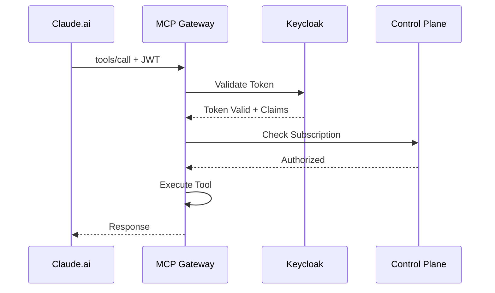

# MCP Gateway

STOA's MCP Gateway is the **first MCP-native API Gateway**, enabling AI agents like Claude, GPT, and custom LLM applications to securely consume enterprise APIs through the Model Context Protocol.

## Overview

The MCP Gateway acts as the bridge between AI agents and your API ecosystem. It handles authentication, rate limiting, subscription validation, and multi-tenant isolation—all while speaking the native MCP protocol.

```
┌─────────────┐      MCP Protocol       ┌──────────────┐      REST/gRPC      ┌─────────────┐
│  AI Agent   │ ◄─────────────────────► │ MCP Gateway  │ ◄─────────────────► │  Your APIs  │
│  (Claude)   │    tools/call, etc.     │  (FastAPI)   │                     │             │
└─────────────┘                         └──────────────┘                     └─────────────┘
                                               │
                                               ▼
                                        ┌──────────────┐
                                        │ Control Plane│
                                        │  (FastAPI)   │
                                        └──────────────┘
```

## Current Implementation

The MCP Gateway is built with **Python** and **FastAPI** for rapid development and flexibility.

| Aspect | Details |
|--------|---------|
| Language | Python 3.12+ |
| Framework | FastAPI (async) |
| Policy Engine | OPA (Open Policy Agent) |
| Protocol | MCP 2024-11-05 |

:::info Future Roadmap
A high-performance **Rust + Tokio + Hyper** implementation is planned for **Q4 2026**, bringing:
- Kernel-level eBPF acceleration
- Sub-millisecond latency overhead
- Significantly reduced memory footprint

See our [Roadmap](/docs/roadmap) for details.
:::

## Key Features

### 🔐 Enterprise Security
- **Keycloak OIDC integration** with multi-realm per tenant
- JWT token validation with audience mapping
- API key management with automatic rotation

### 🏢 Multi-Tenant Isolation
- Kubernetes namespace per tenant (`tenant-{name}`)
- Network policies preventing cross-tenant communication
- Per-tenant rate limiting and quotas

### 📊 Full Observability
- Prometheus metrics on port 9090
- Request tracing with correlation IDs
- Usage analytics per subscription

### ⚡ Production Ready
- Async request handling with FastAPI
- Kafka/Redpanda-based metering pipeline
- Connection pooling and request batching
- OPA-based policy enforcement

## MCP Protocol Support

STOA implements the full [MCP specification](https://modelcontextprotocol.io/) (version `2024-11-05`) with enterprise extensions.

### Supported Methods

| Method | Description |
|--------|-------------|
| `tools/list` | Discover available tools |
| `tools/call` | Invoke a tool |
| `resources/list` | List available resources |
| `resources/read` | Read resource content |
| `prompts/list` | List available prompts |
| `prompts/get` | Get prompt template |

### Transport Options

- **HTTP/SSE**: Server-Sent Events for streaming responses
- **WebSocket**: Bidirectional communication (planned)

## Authentication Flow



## Multi-Tenant Tool Visibility

Each tenant only sees tools they're authorized to access:

| Tenant | Visible Tools |
|--------|---------------|
| **Parzival** (High Five) | `stoa_*`, `highfive:*` |
| **Sorrento** (IOI) | `stoa_*`, `ioi:*` |
| **Halliday** (Admin) | All tools (cross-tenant) |

## Configuration

### Environment Variables

```bash
# Server
MCP_GATEWAY_HOST=0.0.0.0
MCP_GATEWAY_PORT=3001

# Control Plane
CONTROL_PLANE_URL=http://control-plane:8080

# Keycloak
KEYCLOAK_URL=https://auth.gostoa.dev
KEYCLOAK_REALM=stoa

# OPA (for policies)
OPA_URL=http://opa:8181
```

### Kubernetes Deployment

```yaml
apiVersion: apps/v1
kind: Deployment
metadata:
  name: mcp-gateway
  namespace: stoa-system
spec:
  replicas: 3
  template:
    spec:
      containers:
        - name: mcp-gateway
          image: stoaplatform/mcp-gateway:latest
          ports:
            - containerPort: 3001
          resources:
            requests:
              cpu: 500m
              memory: 512Mi
            limits:
              cpu: 2000m
              memory: 2Gi
```

## Integration with Claude.ai

STOA MCP Gateway integrates directly with Claude.ai through the MCP connector:

1. **Configure MCP Server** in Claude.ai settings
2. **Authenticate** with your STOA API key
3. **Discover tools** automatically via `tools/list`
4. **Invoke tools** through natural conversation

### Example Tool Invocation

```json
{
  "method": "tools/call",
  "params": {
    "name": "stoa_catalog",
    "arguments": {
      "action": "list",
      "status": "active"
    }
  }
}
```

## Metrics & Monitoring

### Prometheus Metrics

| Metric | Type | Description |
|--------|------|-------------|
| `mcp_requests_total` | Counter | Total MCP requests |
| `mcp_request_duration_seconds` | Histogram | Request latency |
| `mcp_tool_invocations_total` | Counter | Tool invocations by name |
| `mcp_errors_total` | Counter | Errors by type |

### Grafana Dashboard

Pre-built dashboards available for:
- Request throughput and latency
- Tool invocation patterns
- Error rates by tenant
- Rate limiting events

## Next Steps

- [Quick Start Guide](/docs/guides/quickstart) - Get started with STOA
- [API Reference](/docs/api/mcp-gateway) - MCP Gateway endpoints
- [Authentication Guide](/docs/guides/authentication) - Configure auth
