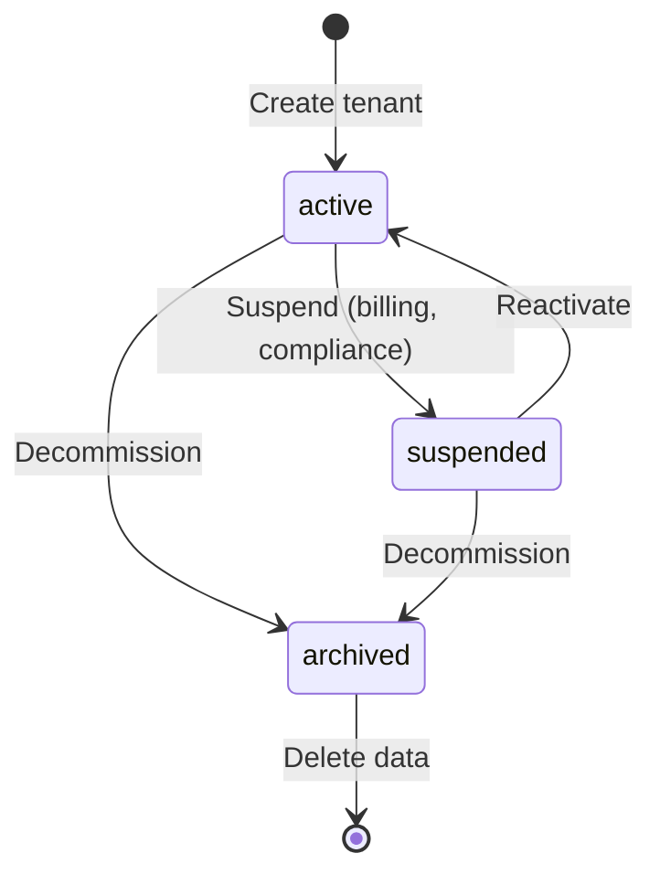

# Multi-Tenant Isolation

STOA implements a **hard multi-tenancy** model where each tenant is fully isolated across infrastructure, identity, data, and networking layers. This enables a single STOA deployment to serve multiple organizations without cross-tenant data leakage.

## Tenant Data Model

Each tenant in STOA has the following properties:

| Field | Type | Description |
|-------|------|-------------|
| `id` | string | Slug identifier (e.g., `oasis`, `acme-corp`) — immutable |
| `name` | string | Display name (e.g., "OASIS Gunters") |
| `description` | string | Optional description |
| `status` | enum | `active`, `suspended`, `archived` |
| `settings` | JSON | Quotas, feature flags, custom config |
| `created_at` | timestamp | Creation date |

### Tenant Status Lifecycle



- **Active** — Full access to all platform features
- **Suspended** — Read-only access, no API calls, no deployments. Used for billing issues or compliance holds.
- **Archived** — Data retained for audit, no access. Pending deletion per retention policy.

## Five Isolation Layers

### 1. Kubernetes Namespace Isolation

Each tenant operates in a dedicated namespace with labels for policy enforcement:

```yaml
apiVersion: v1
kind: Namespace
metadata:
  name: tenant-acme
  labels:
    stoa.io/tenant-id: acme
    stoa.io/tier: enterprise
    pod-security.kubernetes.io/enforce: restricted
```

Resource quotas prevent a single tenant from consuming cluster resources:

```yaml
apiVersion: v1
kind: ResourceQuota
metadata:
  name: tenant-quota
  namespace: tenant-acme
spec:
  hard:
    requests.cpu: "10"
    requests.memory: 20Gi
    persistentvolumeclaims: "5"
    services.loadbalancers: "2"
```

### 2. Network Isolation

Network policies prevent cross-tenant communication at the CNI level:

```yaml
apiVersion: networking.k8s.io/v1
kind: NetworkPolicy
metadata:
  name: tenant-isolation
  namespace: tenant-acme
spec:
  podSelector: {}
  policyTypes: [Ingress, Egress]
  ingress:
    - from:
      - namespaceSelector:
          matchLabels:
            stoa.io/tenant-id: acme
  egress:
    - to:
      - namespaceSelector:
          matchLabels:
            stoa.io/tenant-id: acme
    - to:
      - namespaceSelector:
          matchLabels:
            kubernetes.io/metadata.name: stoa-system
```

Tenants can communicate with their own namespace and the shared `stoa-system` namespace (for the Control Plane API and Gateway), but never with other tenants.

### 3. Gateway Isolation

The STOA Gateway enforces tenant boundaries at the API layer:

- **Tenant-scoped routing** — Each API is scoped to a tenant ID
- **Separate rate limits** — Per-tenant quota enforcement
- **Independent policies** — OPA policies evaluate tenant context
- **Tenant-specific certificates** — mTLS certificates scoped per tenant

In multi-gateway deployments, each gateway adapter (Kong, Gravitee, webMethods, STOA) maintains tenant isolation through its native mechanisms.

### 4. Authentication Isolation

Keycloak multi-realm architecture provides identity isolation:

- **One realm per tenant** — Isolated user stores, separate credentials
- **Isolated client configurations** — Each tenant has its own OIDC clients
- **Independent token validation** — Tokens from one realm are invalid in another
- **Tenant-scoped roles** — `tenant-admin` can only manage their own tenant

### 5. Data Isolation

- **Schema-per-tenant** — Database schemas isolated per tenant
- **Encrypted at rest** — All tenant data encrypted (AES-256)
- **Separate backup policies** — Per-tenant backup schedules
- **Audit logging** — Every data access logged with tenant context

## RBAC and Tenant Scoping

STOA's RBAC model combines platform-wide and tenant-scoped roles:

| Role | Scope | Permissions |
|------|-------|-------------|
| `cpi-admin` | **Platform** | Full access to all tenants, all operations |
| `tenant-admin` | **Tenant** | Full access to own tenant only |
| `devops` | **Tenant** | Deploy and promote within own tenant |
| `viewer` | **Tenant** | Read-only access to own tenant |

Key behaviors:
- A `tenant-admin` for tenant `acme` **cannot** see tenant `globex` resources
- A `viewer` can browse APIs and tools but cannot invoke, create, or modify
- A `cpi-admin` sees all tenants and can perform cross-tenant operations
- Environment mode (dev/staging/prod) further restricts operations — production is read-only by default

## Tenant Settings

The `settings` JSON field on each tenant allows per-tenant configuration:

```json
{
  "quotas": {
    "max_apis": 50,
    "max_subscriptions": 200,
    "max_rate_limit": 10000
  },
  "features": {
    "mcp_enabled": true,
    "shadow_mode": false,
    "advanced_analytics": true
  },
  "notifications": {
    "webhook_url": "https://hooks.acme.com/stoa",
    "email_alerts": true
  }
}
```

## Tenant Tiers

| Tier | Resources | Features | SLA |
|------|-----------|----------|-----|
| **Community** | Limited | Core APIs, basic MCP | Best effort |
| **Starter** | Moderate | APIs + MCP tools, portal | 99% |
| **Business** | High | Full platform, multi-gateway | Per agreement |
| **Enterprise** | Custom | White-label, dedicated support | Custom SLA |

## Per-Tenant Observability

Every metric in STOA is labeled with the tenant ID, enabling per-tenant dashboards:

- **API request rates** — `stoa_api_requests_total{tenant="acme"}`
- **Error rates** — `stoa_api_errors_total{tenant="acme"}`
- **Latency percentiles** — `stoa_api_duration_seconds{tenant="acme"}`
- **Resource utilization** — CPU, memory, storage per namespace
- **Cost attribution** — Per-tenant resource consumption for billing

Grafana dashboards can be filtered by tenant for tenant-admins, or viewed across all tenants for platform admins.

## Related

- [Architecture Overview](/docs/concepts/architecture) — System architecture
- [MCP Gateway](/docs/concepts/mcp-gateway) — Gateway concepts
- [Subscriptions Guide](/docs/guides/subscriptions) — API subscription management
- [ADR-022: UAC Tenant Architecture](/docs/architecture/adr/adr-022-uac-tenant-architecture) — Architecture decision
