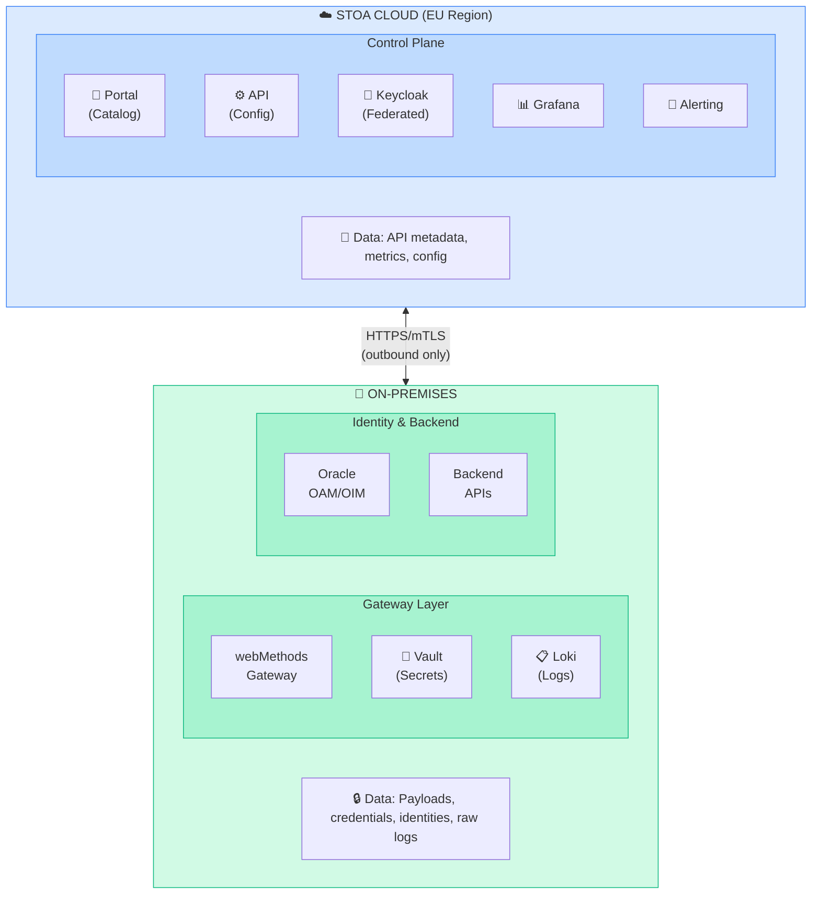
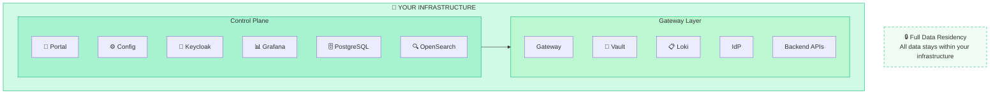
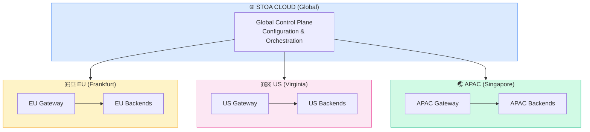
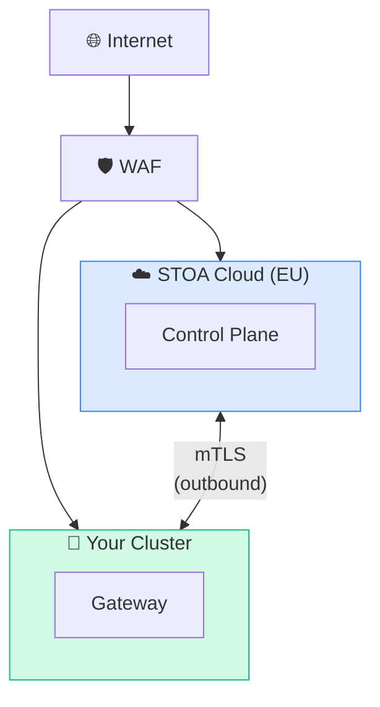

# Hybrid Deployment

STOA Platform supports multiple deployment models to match your security, sovereignty, and operational requirements.

## Deployment Models

| Model | Control Plane | Gateway | Data Residency | Best For |
|-------|---------------|---------|----------------|----------|
| **Hybrid** | STOA Cloud (EU) | On-Premises | Business data on-prem | Most enterprises |
| **Full On-Premises** | Your infrastructure | Your infrastructure | Full on-prem | Max sovereignty |
| **Multi-Cloud** | STOA Cloud | Multiple regions | Distributed | Global organizations |

---

## Model 1: Hybrid (Recommended)

**Control Plane Cloud + Gateway On-Premises**

The default deployment model balances ease of management with data sovereignty.



### What Stays On-Premises

| Data Type | Description | Encryption |
|-----------|-------------|------------|
| **API Payloads** | Request/response bodies | TLS in transit |
| **Credentials** | API keys, tokens, certificates | AES-256 at rest (Vault) |
| **User Identities** | Oracle OAM/OIM directory | Existing controls |
| **Raw Logs** | Full transaction details | Customer-controlled |
| **Secrets** | HashiCorp Vault data | AES-256-GCM |

### What Goes to Cloud

| Data Type | Description | Sensitivity |
|-----------|-------------|-------------|
| **API Metadata** | Names, descriptions, OpenAPI specs | Low |
| **Aggregated Metrics** | Request counts, latencies, errors | Low |
| **Configuration** | Routing rules, policies | Low |
| **Federated Tokens** | Short-lived, no credentials | Low |

### Network Requirements

| Direction | Protocol | Ports | Purpose |
|-----------|----------|-------|---------|
| **On-prem → Cloud** | HTTPS | 443 | Config sync, metrics push |
| **Cloud → On-prem** | None | — | No inbound required |

**Key security benefit:** No inbound connections required. All communication is initiated from your infrastructure.

### Prerequisites

- Kubernetes 1.28+ cluster on-premises
- Outbound HTTPS to STOA Cloud endpoints
- DNS resolution for STOA services
- Existing identity provider (OAM, Okta, Azure AD)

---

## Model 2: Full On-Premises

**Maximum Sovereignty**

For organizations requiring complete control over all components.



### When to Choose Full On-Premises

- Regulatory requirement for 100% data residency
- Air-gapped environments
- Government or defense sector
- Extreme compliance requirements (banking regulators)

### Additional Requirements

| Component | On-Premises Requirement |
|-----------|------------------------|
| **Kubernetes** | Production cluster (3+ nodes) |
| **PostgreSQL** | HA setup (primary + replica) |
| **OpenSearch** | Cluster for logs and search |
| **Object Storage** | S3-compatible (MinIO) |
| **TLS Certificates** | PKI or Let's Encrypt |

### Trade-offs

| Aspect | Hybrid | Full On-Prem |
|--------|--------|--------------|
| Operational complexity | Lower | Higher |
| Updates | Automatic | Manual |
| Support | Full | Limited self-service |
| Data residency | Metadata in cloud | 100% on-prem |
| Initial setup | 1-2 days | 1-2 weeks |

---

## Model 3: Multi-Cloud (Future)

**Global Distribution**

For organizations requiring presence in multiple regions or clouds.



### Planned Capabilities

- Geographic load balancing
- Data residency per region
- Cross-region failover
- Unified global dashboard

**Status:** Roadmap Q4 2026

---

## Data Flow Summary

### Hybrid Model Data Matrix

| Data | Direction | Encryption | Frequency |
|------|-----------|------------|-----------|
| Config | Cloud → On-prem | mTLS | On change |
| Metrics (aggregated) | On-prem → Cloud | TLS | Every 15s |
| Alerts | Cloud → Ops team | TLS | On trigger |
| Tokens (federated) | Cloud ↔ On-prem | TLS | Per request |
| Payloads | Designed to remain on-prem | N/A | N/A |
| Credentials | Designed to remain on-prem | N/A | N/A |

### Network Diagram



---

## Getting Started

### Hybrid Deployment Quick Start

:::info Private Beta
Repository access is granted to beta participants. [Request access](mailto:christophe@hlfh.io) to get the Helm chart and deployment instructions.
:::

```bash
# 1. Create namespace
kubectl create namespace stoa-system

# 2. Add the STOA Helm repository (provided with beta access)
helm repo add stoa https://charts.gostoa.dev
helm repo update

# 3. Install with hybrid configuration
helm install stoa stoa/stoa-platform \
  --namespace stoa-system \
  --set mode=hybrid \
  --set controlPlane.endpoint=https://api.<YOUR_DOMAIN> \
  --set controlPlane.tenantId=YOUR_TENANT_ID

# 4. Verify installation
kubectl get pods -n stoa-system
```

### Full On-Premises Quick Start

```bash
# 1. Install prerequisites
helm install postgresql bitnami/postgresql -n stoa-system
helm install opensearch opensearch/opensearch -n stoa-system
helm install vault hashicorp/vault -n stoa-system

# 2. Install STOA full stack
helm install stoa stoa/stoa-full \
  --namespace stoa-system \
  --set mode=on-premises \
  --values your-values.yaml
```

---

## Next Steps

- [Security & Compliance](/docs/enterprise/security-compliance) — Data residency details
- [Migration Guides](/docs/guides/migration) — Move from legacy platforms
- [Architecture Overview](/docs/concepts/architecture) — Component deep dive

---

*Need help choosing the right deployment model? [Contact us](mailto:contact@gostoa.dev) for an architecture consultation.*
