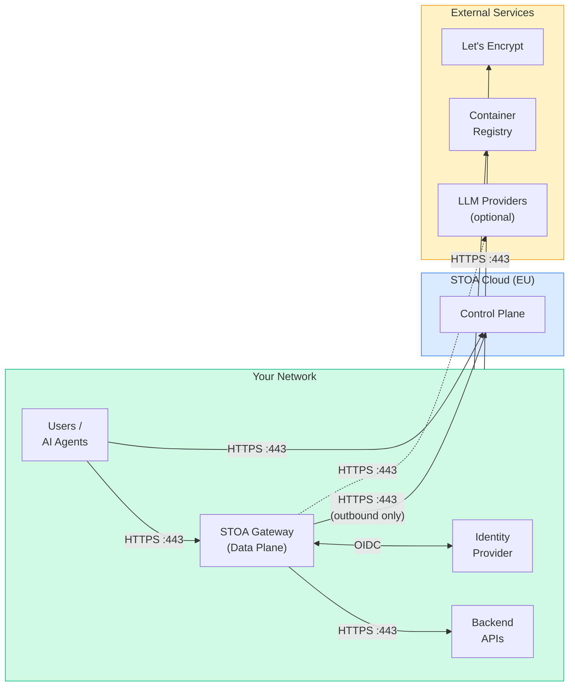

# Deployment Prerequisites

This document provides the complete list of infrastructure, network, and authentication requirements for deploying STOA Platform. **Share this with your IT, network, and security teams** before deployment.

:::tip Which deployment model?
See [Hybrid Deployment](/docs/deployment/hybrid) to choose between Hybrid, Full On-Premises, or Multi-Cloud models. This page covers the technical prerequisites for all models.
:::

---

## 1. Infrastructure Requirements

### Kubernetes Cluster

| Requirement | Minimum | Recommended |
|-------------|---------|-------------|
| **Kubernetes version** | 1.28+ | 1.30+ |
| **Worker nodes** | 2 | 3+ |
| **CPU per node** | 4 vCPU | 8 vCPU |
| **RAM per node** | 8 GB | 16 GB |
| **Disk per node** | 40 GB SSD | 100 GB NVMe |
| **Container runtime** | containerd 1.7+ | containerd 1.7+ |
| **Ingress controller** | Any (nginx, Traefik, Envoy) | nginx-ingress |
| **cert-manager** | v1.12+ | v1.14+ |
| **Helm** | v3.12+ | v3.14+ |

**Supported distributions:** EKS, GKE, AKS, OVH MKS, K3s, RKE2, OpenShift 4.12+.

### Resource Budget per Component

| Component | Replicas | CPU Request | CPU Limit | RAM Request | RAM Limit | Disk |
|-----------|----------|-------------|-----------|-------------|-----------|------|
| **Control Plane API** | 2 | 250m | 1000m | 256Mi | 1Gi | — |
| **Console UI** | 1 | 100m | 500m | 128Mi | 256Mi | — |
| **Developer Portal** | 1 | 100m | 500m | 128Mi | 256Mi | — |
| **Stoa Gateway** | 2 | 250m | 1000m | 128Mi | 512Mi | — |
| **Keycloak** | 1 | 500m | 2000m | 512Mi | 2Gi | — |
| **PostgreSQL** | 1 (HA: 2) | 250m | 1000m | 512Mi | 2Gi | 20Gi PVC |
| **Total (minimum)** | **8 pods** | **1.8 CPU** | **7 CPU** | **2 Gi** | **6.5 Gi** | **20 Gi** |

### External Dependencies (Full On-Premises only)

These are only required for the Full On-Premises model. In Hybrid mode, STOA Cloud provides them.

| Component | Version | Purpose | Alternative |
|-----------|---------|---------|-------------|
| **PostgreSQL** | 16+ | Control Plane database | Any managed PG (RDS, Cloud SQL, Azure DB) |
| **Redis** | 7+ | Gateway caching (optional) | — |
| **OpenSearch** | 2.11+ | Logs and search (optional) | Elasticsearch 8.x |

---

## 2. Network Flow Matrix

### Overview



### Detailed Port Matrix

#### Inbound Flows (into your cluster)

| Source | Destination | Port | Protocol | Purpose | Required? |
|--------|-------------|------|----------|---------|-----------|
| Users / Browsers | Ingress Controller | **443** | HTTPS/TLS | Console, Portal, API access | Yes |
| Users / Browsers | Ingress Controller | **80** | HTTP | Redirect to HTTPS | Recommended |
| AI Agents (Claude, GPT, etc.) | Ingress Controller | **443** | HTTPS/TLS | MCP Gateway (tool discovery + calls) | Yes |
| AI Agents | Ingress Controller | **443** | HTTPS/TLS | OAuth 2.1 discovery + token exchange | Yes |
| Monitoring (Uptime Kuma, etc.) | Ingress Controller | **443** | HTTPS/TLS | Health check endpoints | Recommended |

#### Outbound Flows (from your cluster)

| Source | Destination | Port | Protocol | Purpose | Required? |
|--------|-------------|------|----------|---------|-----------|
| Gateway pods | Backend APIs | **varies** | HTTP/HTTPS | API traffic routing | Yes |
| Gateway pods | Identity Provider | **443** | HTTPS | OIDC token validation (JWKS) | Yes |
| Gateway pods | STOA Cloud API | **443** | HTTPS | Config sync, metrics push (Hybrid only) | Hybrid only |
| Control Plane API | Identity Provider | **443** | HTTPS | User federation, token introspection | Yes |
| Control Plane API | PostgreSQL | **5432** | TCP/TLS | Database queries | Yes |
| K8s nodes | Container Registry | **443** | HTTPS | Pull container images (GHCR) | Yes |
| cert-manager | Let's Encrypt | **443** | HTTPS | TLS certificate issuance (ACME) | If using LE |
| Gateway pods | LLM Provider APIs | **443** | HTTPS | AI routing (if LLM features enabled) | Optional |

#### Internal Flows (within your cluster)

| Source | Destination | Port | Protocol | Purpose |
|--------|-------------|------|----------|---------|
| Ingress Controller | Console UI pods | **8080** | HTTP | Frontend serving |
| Ingress Controller | Portal pods | **8080** | HTTP | Portal serving |
| Ingress Controller | Control Plane API pods | **8000** | HTTP | REST API |
| Ingress Controller | Gateway pods | **8080** | HTTP | MCP + proxy traffic |
| Ingress Controller | Keycloak pods | **8080** | HTTP | Auth UI + OIDC endpoints |
| Control Plane API | Keycloak | **8080** | HTTP | Token validation, user sync |
| Control Plane API | PostgreSQL | **5432** | TCP | Database |
| Gateway | Control Plane API | **8000** | HTTP | Config loading, tool registry |
| Gateway | Keycloak | **8080** | HTTP | JWKS endpoint, token introspection |
| Keycloak | PostgreSQL | **5432** | TCP | Auth database |

### Firewall Rules Summary

Provide this to your network team:

```
# INBOUND (into K8s cluster)
ALLOW  TCP/443   FROM 0.0.0.0/0     TO <INGRESS_LB_IP>    # HTTPS traffic
ALLOW  TCP/80    FROM 0.0.0.0/0     TO <INGRESS_LB_IP>    # HTTP→HTTPS redirect

# OUTBOUND (from K8s cluster)
ALLOW  TCP/443   TO ghcr.io                                # Container images
ALLOW  TCP/443   TO acme-v02.api.letsencrypt.org           # TLS certs (if using LE)
ALLOW  TCP/443   TO <YOUR_IDP_DOMAIN>                      # OIDC (Keycloak, Okta, Azure AD)
ALLOW  TCP/5432  TO <YOUR_PG_HOST>                         # PostgreSQL (if external)
ALLOW  TCP/443   TO api.gostoa.dev                         # STOA Cloud (Hybrid only)

# OPTIONAL OUTBOUND
ALLOW  TCP/443   TO api.anthropic.com                      # LLM routing (if enabled)
ALLOW  TCP/443   TO api.openai.com                         # LLM routing (if enabled)
```

---

## 3. DNS Requirements

### Subdomains

STOA requires **5 subdomains** pointing to your ingress controller's external IP or load balancer.

| Subdomain | Service | Purpose |
|-----------|---------|---------|
| `console.<YOUR_DOMAIN>` | Console UI | Admin dashboard |
| `portal.<YOUR_DOMAIN>` | Developer Portal | API catalog, subscriptions |
| `api.<YOUR_DOMAIN>` | Control Plane API | REST API + admin operations |
| `mcp.<YOUR_DOMAIN>` | Stoa Gateway | MCP protocol, AI agent access, API proxy |
| `auth.<YOUR_DOMAIN>` | Keycloak | SSO, OIDC provider |

**Optional subdomains:**

| Subdomain | Service | When needed |
|-----------|---------|-------------|
| `grafana.<YOUR_DOMAIN>` | Grafana | If deploying observability stack |
| `vault.<YOUR_DOMAIN>` | Vault/Infisical | If deploying secrets manager |

### DNS Configuration

```
# All subdomains point to the same ingress LB IP
console.<YOUR_DOMAIN>    A    <INGRESS_LB_IP>
portal.<YOUR_DOMAIN>     A    <INGRESS_LB_IP>
api.<YOUR_DOMAIN>        A    <INGRESS_LB_IP>
mcp.<YOUR_DOMAIN>        A    <INGRESS_LB_IP>
auth.<YOUR_DOMAIN>       A    <INGRESS_LB_IP>
```

**TLS certificates** are managed by cert-manager (ClusterIssuer with Let's Encrypt or your internal CA). No manual certificate management required.

---

## 4. Authentication Requirements

### Identity Provider (IdP)

STOA uses **Keycloak** as its identity broker. Keycloak can federate with your existing IdP.

| IdP Type | Integration | Protocol | What you provide |
|----------|-------------|----------|-----------------|
| **Keycloak (bundled)** | Included in Helm chart | OIDC | Nothing — ready out of the box |
| **Azure AD / Entra ID** | Keycloak identity broker | OIDC/SAML | Tenant ID, Client ID, Client Secret |
| **Okta** | Keycloak identity broker | OIDC | Issuer URL, Client ID, Client Secret |
| **Oracle OAM** | Keycloak identity broker | SAML 2.0 | Metadata XML, Entity ID |
| **LDAP/Active Directory** | Keycloak user federation | LDAP | Connection URL, Bind DN, Search Base |
| **Any OIDC provider** | Keycloak identity broker | OIDC | Issuer, Client ID, Secret |

### RBAC Roles

STOA ships with 4 predefined roles. Map them to your IdP groups:

| STOA Role | Permissions | Typical Mapping |
|-----------|-------------|-----------------|
| `cpi-admin` | Full platform administration | IT Admin group |
| `tenant-admin` | Manage own tenant (APIs, apps, users) | API Team Lead |
| `devops` | Deploy and promote APIs | DevOps / SRE team |
| `viewer` | Read-only access | Auditors, stakeholders |

### MCP OAuth 2.1 (AI Agent Access)

AI agents (Claude, GPT, custom) authenticate via **OAuth 2.1 with PKCE**:

| Requirement | Detail |
|-------------|--------|
| **Protocol** | OAuth 2.1 (RFC 9728 discovery + RFC 8414 metadata) |
| **Grant type** | Authorization Code with PKCE (S256) |
| **Client type** | Public (no client_secret) |
| **Registration** | Dynamic Client Registration (DCR) — automatic |
| **Scopes** | `stoa:read`, `stoa:write`, `stoa:admin` |

No manual configuration needed for AI agents — the Gateway handles OAuth discovery, DCR, and PKCE automatically.

---

## 5. Container Images

All STOA images are published to GitHub Container Registry (GHCR).

| Image | Tag Policy | Size |
|-------|-----------|------|
| `ghcr.io/stoa-platform/control-plane-api` | `latest`, semver | ~250 MB |
| `ghcr.io/stoa-platform/control-plane-ui` | `latest`, semver | ~50 MB |
| `ghcr.io/stoa-platform/portal` | `latest`, semver | ~50 MB |
| `ghcr.io/stoa-platform/stoa-gateway` | `latest`, semver | ~30 MB |
| `ghcr.io/stoa-platform/keycloak` | `latest` | ~500 MB |

### Air-Gapped / Private Registry

For environments without internet access:

```bash
# Pull and re-tag for your private registry
for img in control-plane-api control-plane-ui portal stoa-gateway keycloak; do
  docker pull ghcr.io/stoa-platform/$img:latest
  docker tag ghcr.io/stoa-platform/$img:latest your-registry.internal/$img:latest
  docker push your-registry.internal/$img:latest
done
```

Then override in Helm values:

```yaml
global:
  imageRegistry: your-registry.internal
  imagePullSecrets:
    - name: your-registry-secret
```

---

## 6. Deployment Topology Comparison

### Hybrid (Recommended)

```
Your Responsibility                    STOA Cloud (EU)
┌─────────────────────────┐            ┌────────────────────┐
│ K8s Cluster             │            │ Control Plane      │
│  ├── Stoa Gateway (2)   │───HTTPS───▶│  ├── Console UI    │
│  ├── Your Backend APIs  │  outbound  │  ├── Portal        │
│  └── Identity Provider  │   only     │  ├── API           │
│                         │            │  ├── Keycloak      │
│ Firewall: TCP/443 OUT   │            │  └── PostgreSQL    │
└─────────────────────────┘            └────────────────────┘
```

**You manage:** K8s cluster, gateway pods, backend APIs, IdP federation.
**STOA manages:** Control Plane, database, updates, monitoring.
**Network:** Outbound HTTPS only (no inbound from STOA Cloud).

### Full On-Premises

```
Your Responsibility (everything)
┌──────────────────────────────────────┐
│ K8s Cluster                          │
│  ├── Control Plane API (2)           │
│  ├── Console UI (1)                  │
│  ├── Portal (1)                      │
│  ├── Stoa Gateway (2)               │
│  ├── Keycloak (1)                    │
│  ├── PostgreSQL (1-2)                │
│  └── [Optional] Grafana, OpenSearch  │
│                                      │
│ Firewall: TCP/443 IN (users/agents)  │
│           TCP/443 OUT (GHCR, LE)     │
└──────────────────────────────────────┘
```

**You manage:** Everything.
**STOA provides:** Helm chart, container images, documentation, support.
**Network:** Inbound HTTPS for users + outbound for image pulls and TLS certs.

---

## 7. Pre-Deployment Checklist

Hand this to your IT team. All items must be confirmed before deployment day.

### Infrastructure

- [ ] Kubernetes cluster provisioned (version 1.28+)
- [ ] Minimum 2 worker nodes (4 vCPU, 8 GB each)
- [ ] Ingress controller installed (nginx-ingress, Traefik, or equivalent)
- [ ] cert-manager installed (v1.12+)
- [ ] Helm v3.12+ available
- [ ] `kubectl` access confirmed from deployment machine
- [ ] Storage class available for PVCs (20 Gi minimum)

### Network

- [ ] Ingress load balancer IP assigned
- [ ] 5 DNS records created (console, portal, api, mcp, auth)
- [ ] DNS propagation verified (`dig console.<YOUR_DOMAIN>`)
- [ ] Firewall rules applied (see [Section 2](#2-network-flow-matrix))
- [ ] Outbound HTTPS to `ghcr.io` confirmed
- [ ] Outbound HTTPS to `acme-v02.api.letsencrypt.org` confirmed (if using LE)
- [ ] Outbound HTTPS to your IdP confirmed

### Authentication

- [ ] IdP federation details collected (type, endpoint, client ID/secret)
- [ ] RBAC role mapping defined (4 STOA roles → your IdP groups)
- [ ] Admin user identified for initial setup

### Database (Full On-Premises only)

- [ ] PostgreSQL 16+ provisioned
- [ ] Two databases created: `stoa_production`, `keycloak`
- [ ] Connection string available (host, port, user, password)
- [ ] SSL/TLS enabled for DB connections

### Container Images

- [ ] Pull from `ghcr.io` confirmed, OR
- [ ] Images mirrored to private registry + Helm values updated

---

## 8. Support Matrix

| Item | Hybrid | Full On-Premises |
|------|--------|-----------------|
| Control Plane updates | Automatic | Helm upgrade (manual) |
| Security patches | Automatic | Image pull + rollout |
| Database backups | STOA-managed | Your responsibility |
| TLS certificates | cert-manager (auto) | cert-manager or your CA |
| Monitoring | Included (Grafana) | Optional (Helm addon) |
| SLA | 99.9% (Control Plane) | Depends on your infra |
| Support channels | Email + Slack | Email + Slack |

---

## Next Steps

1. **Choose your model** → [Hybrid Deployment](/docs/deployment/hybrid)
2. **Quick start** → [Quick Start Guide](/docs/guides/quickstart)
3. **Security review** → [Security & Compliance](/docs/enterprise/security-compliance)
4. **Migration** → [Migration Guides](/docs/guides/migration) (Kong, Apigee, webMethods, etc.)

---

*Questions about prerequisites? [Contact us](mailto:contact@gostoa.dev) — we help enterprise teams with architecture reviews and deployment planning.*
