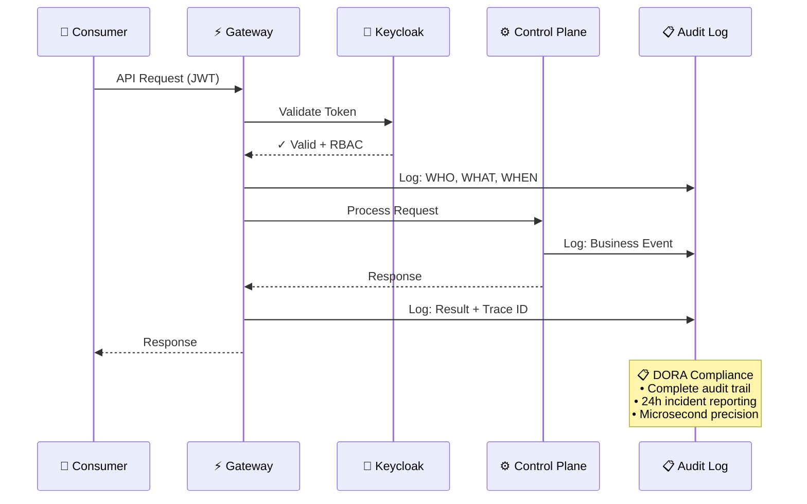
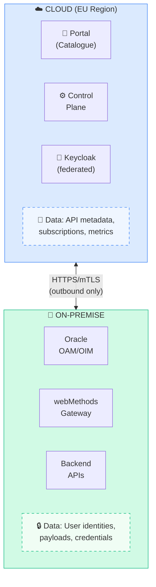
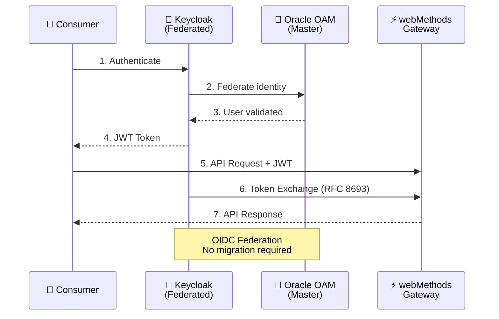
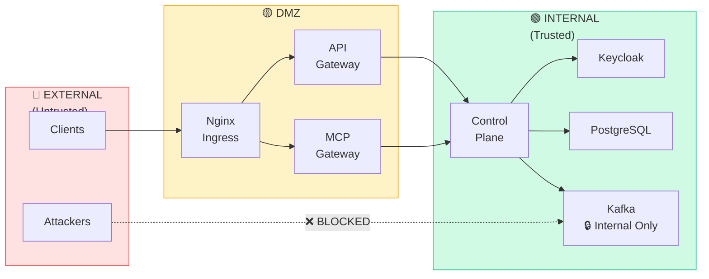

# Security & Compliance

STOA Platform is designed with **European enterprise security requirements** at its core. This page explains how STOA helps organizations meet regulatory obligations while maintaining operational efficiency.

## Regulatory Compliance

### DORA (Digital Operational Resilience Act)

The Digital Operational Resilience Act requires financial entities to strengthen their ICT risk management. STOA addresses key DORA requirements:

| DORA Requirement | How STOA Helps |
|------------------|----------------|
| **ICT Risk Management** | Centralized Control Plane with full audit trail of all API operations |
| **Incident Reporting** | Real-time alerting via Grafana + structured logs in OpenSearch for incident reconstruction |
| **Operational Resilience Testing** | Built-in health checks, circuit breakers, and chaos engineering support |
| **Third-Party Risk** | API subscription governance with approval workflows and usage monitoring |

**DORA Compliance Flow:**

:::info Compliance Disclaimer
STOA provides tools and features to support your compliance efforts. Certification, audit, and ultimate compliance responsibility remains with the implementing organization. Consult qualified advisors for your specific regulatory requirements.
:::

### NIS2 (Network and Information Security Directive)

NIS2 expands cybersecurity requirements across essential sectors. STOA supports compliance through:

- **Supply Chain Security** — Full provenance tracking of API dependencies and third-party integrations
- **Sovereignty** — European-hosted Control Plane option with data residency guarantees
- **Incident Handling** — Automated alerting and audit logs meeting 24-hour reporting requirements
- **Access Control** — Role-based access with Keycloak integration and multi-tenant isolation

:::info Compliance Disclaimer
STOA provides tools and features to support your NIS2 compliance efforts. Certification and audit responsibility remains with the implementing organization.
:::

### RGPD (General Data Protection Regulation)

STOA implements privacy-by-design principles:

| Capability | Implementation |
|------------|----------------|
| **Data Minimization** | Configurable log anonymization — mask PII in request/response logs |
| **Data Residency** | Control Plane Cloud EU or Full On-Premise deployment options |
| **Right to Access** | API usage logs per consumer with export capabilities |
| **Data Portability** | Standard OpenAPI contracts, no vendor lock-in |

:::info Compliance Disclaimer
STOA provides privacy-by-design features to support GDPR compliance. Data protection responsibility remains with the data controller.
:::

## Data Residency Architecture

Understanding what data flows where is critical for compliance. STOA's hybrid architecture provides clear boundaries:

### What Stays On-Premise

- **Business Data** — All API request/response payloads containing business information
- **User Identities** — Oracle OAM/OIM remains the master identity provider
- **Credentials** — Secrets, certificates, and sensitive configuration
- **Raw Logs** — Detailed transaction logs (only aggregated metrics sent to cloud)

### What Goes to Cloud

- **API Metadata** — Catalogue information, OpenAPI specifications
- **Aggregated Metrics** — Request counts, latency percentiles, error rates
- **Subscription Data** — Who has access to which APIs
- **Federated Tokens** — Short-lived tokens via Keycloak federation (not credentials)

## Security Architecture

### Authentication & Authorization

- **OIDC Federation** — Keycloak federates with existing Oracle OAM, no migration required
- **Token Exchange** — RFC 8693 compliant token exchange for service-to-service calls
- **mTLS** — Mutual TLS between Control Plane and Gateway components
- **RBAC** — Role-based access control with tenant isolation

### Secrets Management

STOA integrates with **HashiCorp Vault** for secrets management:

- Dynamic secrets generation for database credentials
- Automatic credential rotation
- Audit logging of all secret access
- Kubernetes-native integration via CSI driver

### Network Security

| Layer | Protection |
|-------|------------|
| **Edge** | WAF integration, DDoS protection via Cloudflare |
| **Transport** | TLS 1.3, mTLS for internal communication |
| **Application** | Input validation, rate limiting, circuit breakers |
| **Data** | Encryption at rest (AES-256), field-level encryption for PII |

### Trust Boundary Architecture

STOA implements a Zero Trust architecture with clearly defined security zones:

**Zone Definitions:**
- **External (Red)** — Untrusted internet traffic, potential attackers
- **DMZ (Amber)** — Semi-trusted zone with ingress controllers and gateways
- **Internal (Green)** — Trusted zone with core services, databases, and message queues

## Audit & Observability

### Audit Trail

Every action in STOA is logged with:

- **Who** — User identity, tenant, role
- **What** — Action type, affected resources
- **When** — Timestamp with microsecond precision
- **Where** — Source IP, geographic location
- **Result** — Success/failure, error details

### Log Retention

| Log Type | Default Retention | Configurable |
|----------|-------------------|--------------|
| Access Logs | 90 days | Yes |
| Audit Logs | 1 year | Yes |
| Metrics | 13 months | Yes |
| Security Events | 2 years | Yes |

### Compliance Reporting

Built-in dashboards for:

- API usage by consumer/team
- Authentication failures and anomalies
- Data access patterns
- SLA compliance metrics

## Security Certifications (Roadmap)

| Certification | Status | Target |
|---------------|--------|--------|
| SOC 2 Type II | Planned | Q4 2026 |
| ISO 27001 | Planned | 2027 |
| ISAE 3402 | Planned | 2027 |

---

## Next Steps

- [Hybrid Deployment Options](/docs/deployment/hybrid) — Choose your deployment model
- [Enterprise Use Cases](/docs/enterprise/use-cases) — Industry-specific implementations
- [Migration Guides](/docs/guides/migration) — Move from legacy platforms
