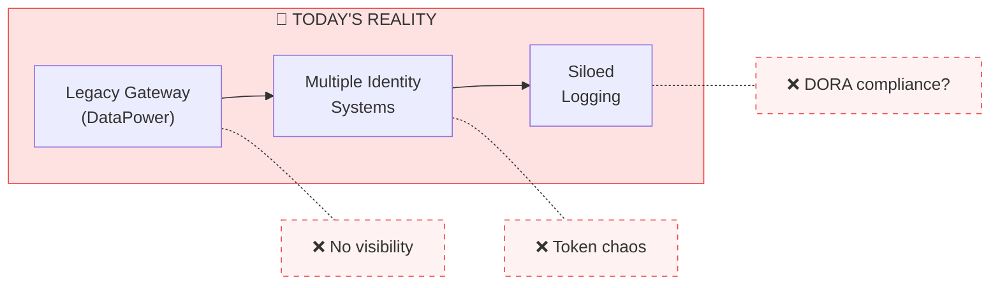
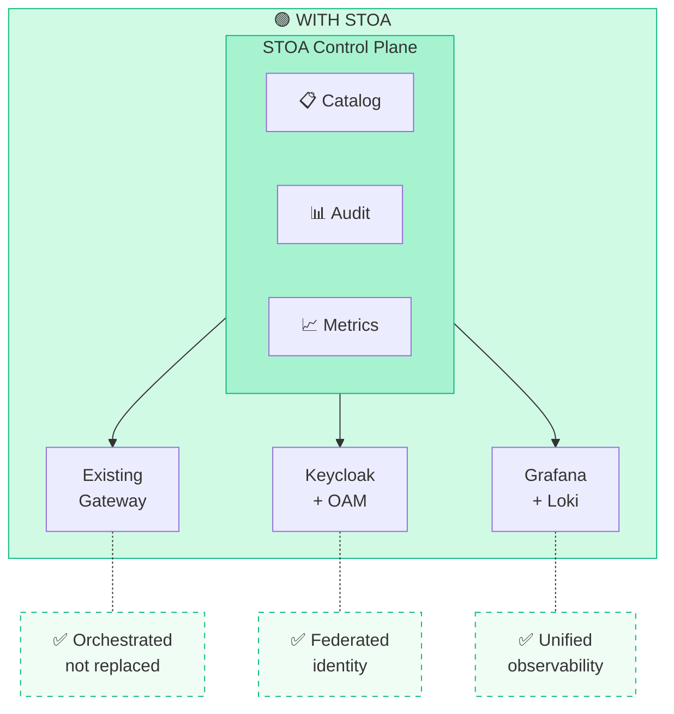
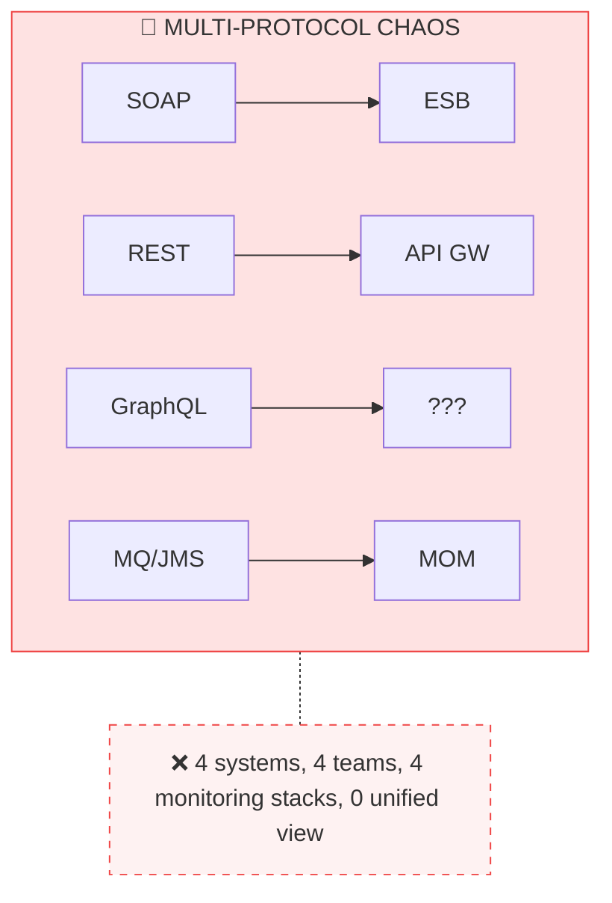
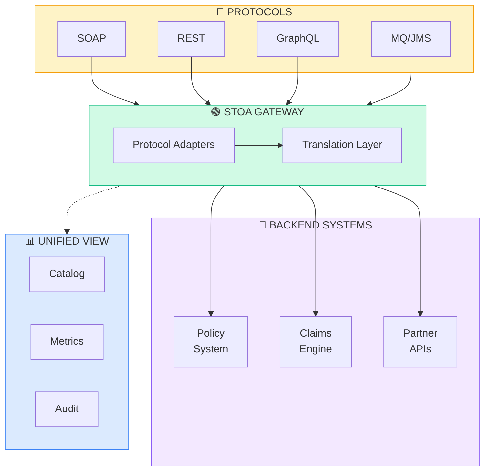
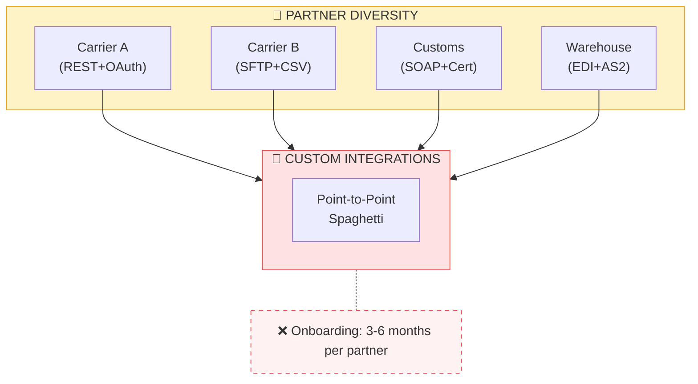
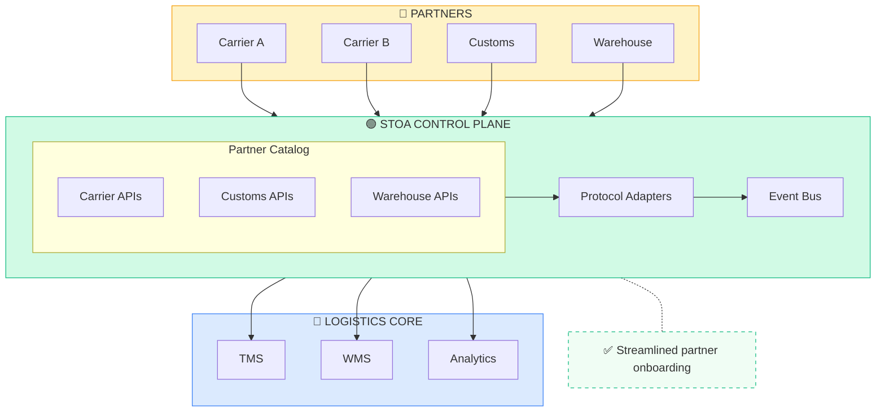
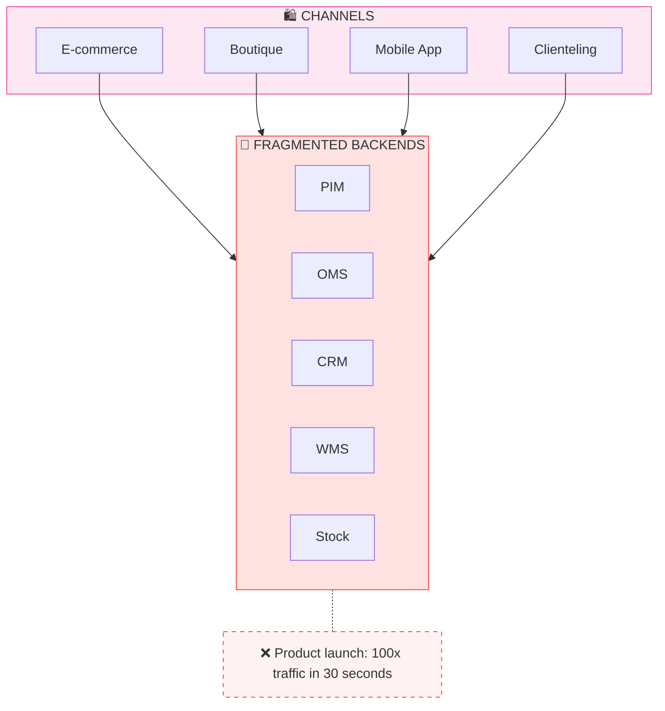
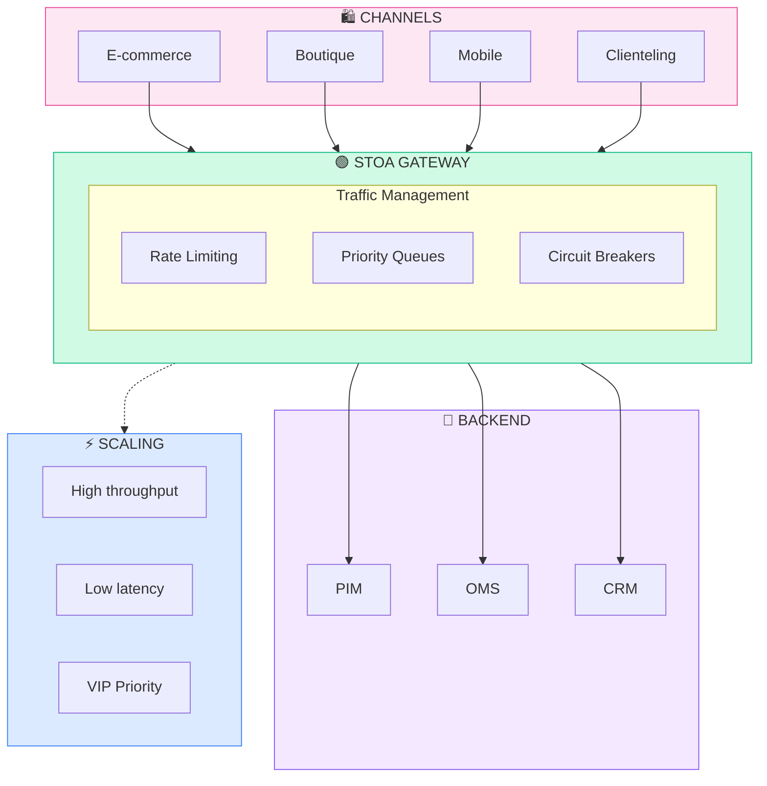

# Enterprise Use Cases

STOA Platform addresses critical API management challenges across regulated industries. Each vertical faces specific constraints that require tailored solutions.

## Banking & Central Banks

**Target clients:** Commercial banks, European central banks, payment processors

### The Challenge

**Pain points:**
- **DORA compliance pressure** — 24-hour incident reporting with incomplete audit trails
- **Legacy gateway opacity** — Limited observability into existing gateway infrastructure
- **Identity fragmentation** — Multiple token formats, no unified authorization
- **Cost** — Expensive licenses for declining expertise availability

### STOA Solution

**Key benefits:**
- ✅ **DORA-supportive audit trail** — Complete request lifecycle logging
- ✅ **Legacy protection** — Keep existing gateway investment, add control layer
- ✅ **Unified identity** — Keycloak federates with existing OAM/OIM
- ✅ **Cost control** — Open-source core, pay only for enterprise support

### Banking Reference Architecture

| Component | Current | With STOA |
|-----------|---------|-----------|
| Gateway | DataPower/webMethods | Keep existing + STOA orchestration |
| Identity | Oracle OAM/OIM | OAM + Keycloak federation |
| Observability | Scattered logs | Unified Grafana/Loki dashboards |
| API Catalog | Excel/Confluence | Self-service Developer Portal |
| Compliance | Manual reports | DORA-supportive audit trails |

---

## Insurance

**Target clients:** Large insurance groups, reinsurers, insurtechs

### The Challenge

Insurance APIs must handle diverse protocols (SOAP legacy, REST modern, emerging GraphQL) while maintaining strict audit trails for regulatory compliance.

**Pain points:**
- **Protocol proliferation** — SOAP, REST, GraphQL, async messaging
- **Partner integration** — Each partner API requires custom integration
- **Audit requirements** — Full transaction history for claims, policies
- **Solvency II** — Operational risk management requirements

### STOA Solution

**Key benefits:**
- ✅ **Protocol translation** — Expose legacy SOAP as modern REST
- ✅ **Partner onboarding** — Self-service subscription to streamline onboarding
- ✅ **Unified audit trail** — Cross-protocol transaction correlation
- ✅ **Real-time monitoring** — SLA tracking across all API types

---

## Logistics & Supply Chain

**Target clients:** Global logistics providers, freight forwarders, 3PLs, shipping lines

### The Challenge

Logistics APIs require real-time data exchange with hundreds of partners, each with different technical capabilities and security requirements.

**Pain points:**
- **Partner diversity** — REST, SOAP, EDI, SFTP, AS2 — each partner is unique
- **Real-time tracking** — Shipment visibility requires sub-second updates
- **Scale variability** — Black Friday 10x traffic spikes
- **Security fragmentation** — Different auth per partner

### STOA Solution

**Key benefits:**
- ✅ **Rapid partner onboarding** — Pre-built adapters, self-service portal
- ✅ **Real-time events** — Webhook and event streaming support
- ✅ **Elastic scaling** — Auto-scale for peak periods
- ✅ **Unified monitoring** — Track all partner SLAs in one dashboard

---

## Luxury & Retail

**Target clients:** Luxury conglomerates, premium brands, omnichannel retailers

### The Challenge

Luxury retail requires seamless omnichannel experiences with extreme scalability during product launches and fashion events.

**Pain points:**
- **Event-driven traffic** — Product launches, fashion weeks, VIP events
- **Omnichannel consistency** — Same data across all touchpoints
- **VIP treatment** — Priority access for high-value customers
- **Global reach** — Low latency from Paris to Shanghai

### STOA Solution

**Key benefits:**
- ✅ **Event scalability** — Designed to scale to high request volumes during peak events
- ✅ **VIP priority** — Tiered rate limiting, priority queues
- ✅ **Global edge** — CDN integration, multi-region deployment
- ✅ **Real-time inventory** — Consistent stock across channels

---

## Cross-Industry Capabilities

Regardless of vertical, STOA provides:

| Capability | Description |
|------------|-------------|
| **Self-Service Portal** | Developers find and subscribe to APIs without IT tickets |
| **Unified Observability** | Single dashboard for all APIs, all protocols |
| **Compliance-Supporting Features** | Built-in audit trails to support DORA, NIS2, RGPD compliance efforts |
| **Hybrid Deployment** | Control Plane cloud + Gateway on-premises |
| **No Rip & Replace** | Augment existing gateways, don't replace them |

---

## Next Steps

- [Security & Compliance](/docs/enterprise/security-compliance) — DORA, NIS2, RGPD details
- [Hybrid Deployment](/docs/deployment/hybrid) — Architecture options
- [Request a Demo](mailto:contact@gostoa.dev) — See STOA in action for your industry

---

*Have a specific use case not covered here? [Contact us](mailto:contact@gostoa.dev) to discuss your requirements.*
