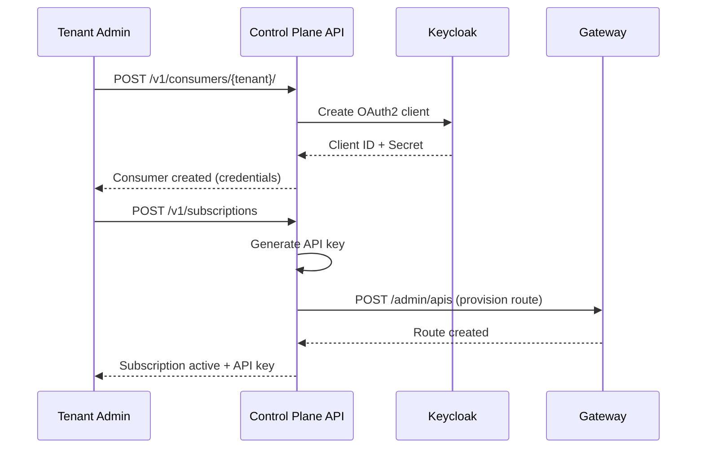

import EnvSetup from '@site/docs/_partials/_env-setup.mdx';

# Consumer Onboarding

Register external partners and applications as API consumers — with automatic OAuth2 credentials, optional mTLS certificates, and bulk onboarding.

## What Is a Consumer?

A **consumer** represents an external partner, application, or team that consumes your APIs. Consumers are different from users:

| Concept | Represents | Auth Method | Example |
|---------|-----------|-------------|---------|
| **User** | A person with a login | OIDC (Keycloak) | Developer accessing the Console |
| **Consumer** | An app or partner | API Key or OAuth2 | Mobile app calling your API |

Each consumer belongs to a **tenant** and can have multiple subscriptions to different APIs.

## Consumer Data Model

| Field | Type | Description |
|-------|------|-------------|
| `id` | UUID | Auto-generated identifier |
| `external_id` | string | Your identifier (unique per tenant, e.g., `partner-acme`) |
| `name` | string | Display name |
| `email` | string | Contact email |
| `company` | string | Organization name (optional) |
| `description` | text | Notes about this consumer (optional) |
| `tenant_id` | string | The tenant this consumer belongs to |
| `status` | enum | `active`, `suspended`, `blocked` |
| `consumer_metadata` | JSON | Custom attributes (optional) |

### Consumer Status

| Status | API Access | Use Case |
|--------|-----------|----------|
| **active** | Full access via subscriptions | Normal operation |
| **suspended** | Temporarily blocked | Billing issues, investigation |
| **blocked** | Permanently blocked | Terms violation, security incident |

<EnvSetup />

## Register a Consumer

### Via REST API

```bash
curl -X POST "${STOA_API_URL}/v1/consumers/${TENANT_ID}" \
  -H "Authorization: Bearer ${TOKEN}" \
  -H "Content-Type: application/json" \
  -d '{
    "external_id": "partner-acme",
    "name": "ACME Corp Integration",
    "email": "api-team@acme.example.com",
    "company": "ACME Corporation",
    "description": "Production integration for order management",
    "consumer_metadata": {
      "contract_id": "CNT-2026-042",
      "tier": "enterprise"
    }
  }'
```

**Response (201 Created):**

```json
{
  "id": "consumer-uuid-123",
  "external_id": "partner-acme",
  "name": "ACME Corp Integration",
  "email": "api-team@acme.example.com",
  "company": "ACME Corporation",
  "tenant_id": "oasis",
  "status": "active",
  "keycloak_client_id": "oasis-partner-acme",
  "consumer_metadata": {
    "contract_id": "CNT-2026-042",
    "tier": "enterprise"
  },
  "created_at": "2026-02-13T10:00:00Z"
}
```

### What Happens on Creation

When you create a consumer, STOA automatically:

1. **Creates a Keycloak OAuth2 client** — `{tenant_id}-{external_id}` (e.g., `oasis-partner-acme`)
2. **Enables service accounts** — The client can obtain tokens via `client_credentials` grant
3. **Returns credentials once** — Client ID and secret are shown only at creation time

The consumer can now authenticate to STOA and subscribe to APIs.

### Via Console UI

1. Navigate to **Consumers** in the Console sidebar
2. Click **Add Consumer**
3. Fill in the registration form
4. Copy the OAuth2 credentials from the confirmation dialog

## Consumer Authentication

Consumers authenticate using their auto-created Keycloak client:

```bash
# Get an access token using client credentials
TOKEN=$(curl -s -X POST "${STOA_AUTH_URL}/realms/${TENANT_REALM}/protocol/openid-connect/token" \
  -d "client_id=oasis-partner-acme" \
  -d "client_secret=${CLIENT_SECRET}" \
  -d "grant_type=client_credentials" | jq -r '.access_token')

# Use the token for API calls
curl "${STOA_API_URL}/v1/portal/apis" \
  -H "Authorization: Bearer ${TOKEN}"
```

## Manage Consumers

### List Consumers

```bash
curl "${STOA_API_URL}/v1/consumers/${TENANT_ID}" \
  -H "Authorization: Bearer ${TOKEN}"
```

### Update a Consumer

```bash
curl -X PUT "${STOA_API_URL}/v1/consumers/${TENANT_ID}/${CONSUMER_ID}" \
  -H "Authorization: Bearer ${TOKEN}" \
  -H "Content-Type: application/json" \
  -d '{
    "name": "ACME Corp Integration v2",
    "consumer_metadata": {
      "contract_id": "CNT-2026-042",
      "tier": "enterprise",
      "upgraded_at": "2026-06-01"
    }
  }'
```

### Delete a Consumer

```bash
curl -X DELETE "${STOA_API_URL}/v1/consumers/${TENANT_ID}/${CONSUMER_ID}" \
  -H "Authorization: Bearer ${TOKEN}"
```

:::warning
Deleting a consumer also revokes all their subscriptions and removes their Keycloak client. This action cannot be undone.
:::

## mTLS Certificates

For high-security integrations, consumers can authenticate via mutual TLS (mTLS) certificates instead of or in addition to API keys.

### Certificate Fields

| Field | Description |
|-------|-------------|
| `certificate_fingerprint` | SHA-256 fingerprint of the X.509 certificate |
| `certificate_subject_dn` | Subject distinguished name |
| `certificate_issuer_dn` | Issuer distinguished name |
| `certificate_not_before` | Validity start date |
| `certificate_not_after` | Validity end date |
| `certificate_status` | `active`, `rotating`, `revoked`, `expired` |

### Rotate Certificate

```bash
curl -X POST "${STOA_API_URL}/v1/consumers/${TENANT_ID}/${CONSUMER_ID}/certs/rotate" \
  -H "Authorization: Bearer ${TOKEN}" \
  -H "Content-Type: application/json" \
  -d '{
    "new_certificate_pem": "-----BEGIN CERTIFICATE-----\n...\n-----END CERTIFICATE-----",
    "grace_period_hours": 48
  }'
```

During the grace period, both the old and new certificates are accepted.

## Bulk Onboarding

For onboarding many consumers at once (e.g., partner migration), use CSV upload:

```bash
curl -X POST "${STOA_API_URL}/v1/consumers/${TENANT_ID}/bulk-onboard" \
  -H "Authorization: Bearer ${TOKEN}" \
  -F "file=@consumers.csv"
```

### CSV Format

```csv
external_id,name,email,company,description
partner-acme,ACME Corp,api@acme.example.com,ACME Corporation,Order management
partner-globex,Globex Inc,api@globex.example.com,Globex Inc,Supply chain
partner-initech,Initech,api@initech.example.com,Initech,HR integration
```

**Response:**

```json
{
  "total": 3,
  "created": 3,
  "failed": 0,
  "errors": []
}
```

## Consumer + Subscription Flow

The typical onboarding flow combines consumer registration with subscription creation:



## RBAC for Consumer Management

| Action | Required Role |
|--------|--------------|
| Create consumer | `tenant-admin`, `cpi-admin` |
| List consumers | `tenant-admin`, `devops`, `viewer`, `cpi-admin` |
| Update consumer | `tenant-admin`, `cpi-admin` |
| Delete consumer | `tenant-admin`, `cpi-admin` |
| Bulk onboard | `tenant-admin`, `cpi-admin` |
| Rotate certificate | `tenant-admin`, `cpi-admin` |

## Related

- [Subscription Lifecycle](/docs/guides/subscriptions-lifecycle) — Subscription states and approval
- [API Key Rotation](/docs/guides/api-key-rotation) — Rotate keys with zero downtime
- [RBAC Permissions](/docs/reference/rbac-permissions) — Full permission matrix
- [Authentication Guide](/docs/guides/authentication) — OIDC and Keycloak setup
