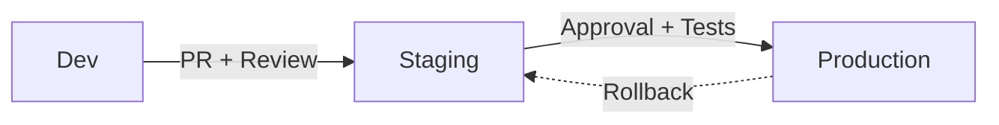

import EnvSetup from '@site/docs/_partials/_env-setup.mdx';

# Environment Management

STOA implements a "Born GitOps" model (ADR-040) where environments are first-class citizens with distinct access modes, visual indicators, and scoped queries.

## Three Environments

| Environment | Mode | Color | Purpose |
|-------------|------|-------|---------|
| **Development** | `full` | Green | Unrestricted — create, modify, delete freely |
| **Staging** | `full` | Amber | Pre-production validation |
| **Production** | `read-only` | Red | Locked — changes only via promotion |

### Environment Modes

| Mode | Create | Edit | Delete | Deploy | Who Can Override |
|------|--------|------|--------|--------|-----------------|
| `full` | Yes | Yes | Yes | Yes | Everyone with role permissions |
| `read-only` | No | No | No | No | `cpi-admin` only (emergency hotfixes) |
| `promote-only` | No | No | No | Yes | `devops` and above |

## Retrieve Environments

<EnvSetup />

```bash
curl "${STOA_API_URL}/v1/environments" \
  -H "Authorization: Bearer ${TOKEN}"
```

**Response:**

```json
{
  "environments": [
    {"name": "dev", "label": "Development", "mode": "full", "color": "green"},
    {"name": "staging", "label": "Staging", "mode": "full", "color": "amber"},
    {"name": "prod", "label": "Production", "mode": "read-only", "color": "red"}
  ]
}
```

## Environment-Scoped Queries

All API queries can be scoped to a specific environment using the `environment` query parameter:

```bash
# List APIs in staging only
curl "${STOA_API_URL}/v1/apis?environment=staging" \
  -H "Authorization: Bearer ${TOKEN}"

# List deployments in production
curl "${STOA_API_URL}/v1/deployments?environment=prod" \
  -H "Authorization: Bearer ${TOKEN}"
```

Without the `environment` parameter, the API returns resources from the currently active environment (default: `dev`).

## Console UI Indicators

The Console UI reflects the active environment with visual cues:

| Indicator | Meaning |
|-----------|---------|
| Green dot | Development — all actions available |
| Amber dot | Staging — all actions available |
| Red dot + lock icon | Production — read-only mode active |

### Switching Environments

In the Console, use the **environment selector** dropdown in the header. The selected environment:

- Persists across page navigations (stored in localStorage)
- Scopes all data queries (APIs, deployments, subscriptions)
- Enables/disables action buttons based on the environment mode

## Read-Only Production

When the environment is `prod`, write operations are blocked at two levels:

### Backend Enforcement

The API uses a `require_writable_environment` guard on all write endpoints:

```
POST /v1/apis                → 403 Forbidden (prod is read-only)
PUT /v1/apis/{id}            → 403 Forbidden
DELETE /v1/apis/{id}         → 403 Forbidden
GET /v1/apis                 → 200 OK (reads always allowed)
```

**Error response:**

```json
{
  "detail": "Environment 'prod' is read-only. Write operations are not permitted."
}
```

### Frontend Enforcement

The `useEnvironmentMode` hook disables buttons and forms:

- **Create** buttons are hidden or disabled
- **Edit** forms are read-only
- **Delete** actions are hidden
- A banner displays: "Production environment — read-only mode"

### CPI Admin Override

Platform administrators (`cpi-admin` role) can bypass read-only restrictions for emergency hotfixes. The override is logged in the audit trail.

## Promotion Workflow

Changes flow from development to production through a promotion pipeline:



### Step 1: Develop in Dev

Create and iterate freely in the development environment:
- Full CRUD access for all roles
- No approval required
- Rapid iteration

### Step 2: Promote to Staging

Move validated changes to staging for integration testing:
- Automated tests run against staging
- Integration validation with other services
- Pre-production review

### Step 3: Approve for Production

Production changes require explicit approval:
- Manual gate — `cpi-admin` or `tenant-admin` approval
- Read-only enforcement prevents direct edits
- All changes tracked in Git (GitOps audit trail)

## ArgoCD Integration

When using ArgoCD for GitOps deployment, each environment maps to an ArgoCD Application with its own sync policy:

| Environment | ArgoCD Behavior |
|-------------|----------------|
| Dev | Auto-sync, self-heal, fast iteration |
| Staging | Auto-sync, self-heal, integration validation |
| Production | Auto-sync, self-heal, promotion-only |

Drift in production is automatically reverted by ArgoCD's self-heal. Manual `kubectl` changes are overwritten to match the Git-defined state.

## Related

- [GitOps with ArgoCD](/docs/concepts/gitops) — GitOps architecture and ArgoCD integration
- [RBAC Permissions](/docs/reference/rbac-permissions) — Role-based access control
- [Quick Start](/docs/guides/quickstart) — Get started with STOA
- [Architecture Overview](/docs/concepts/architecture) — System architecture
