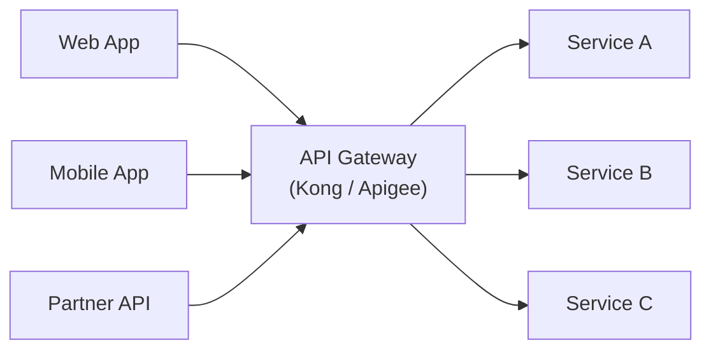
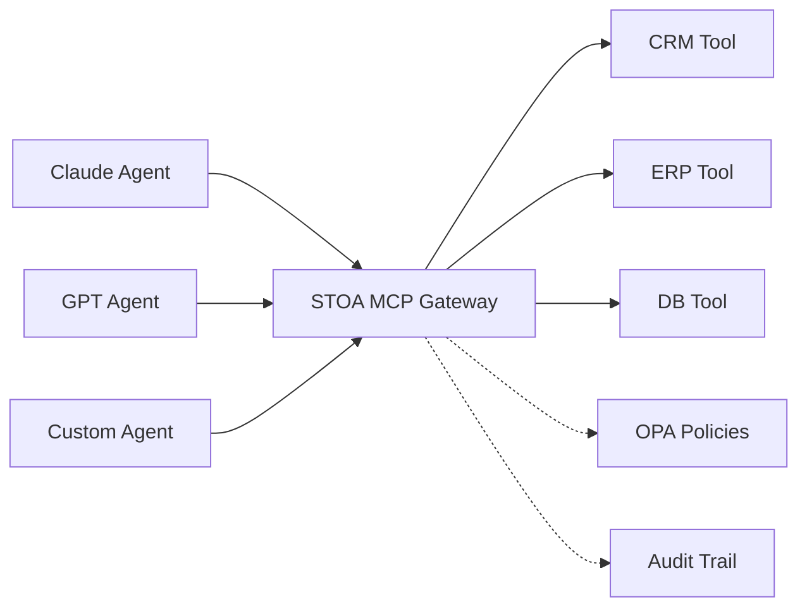
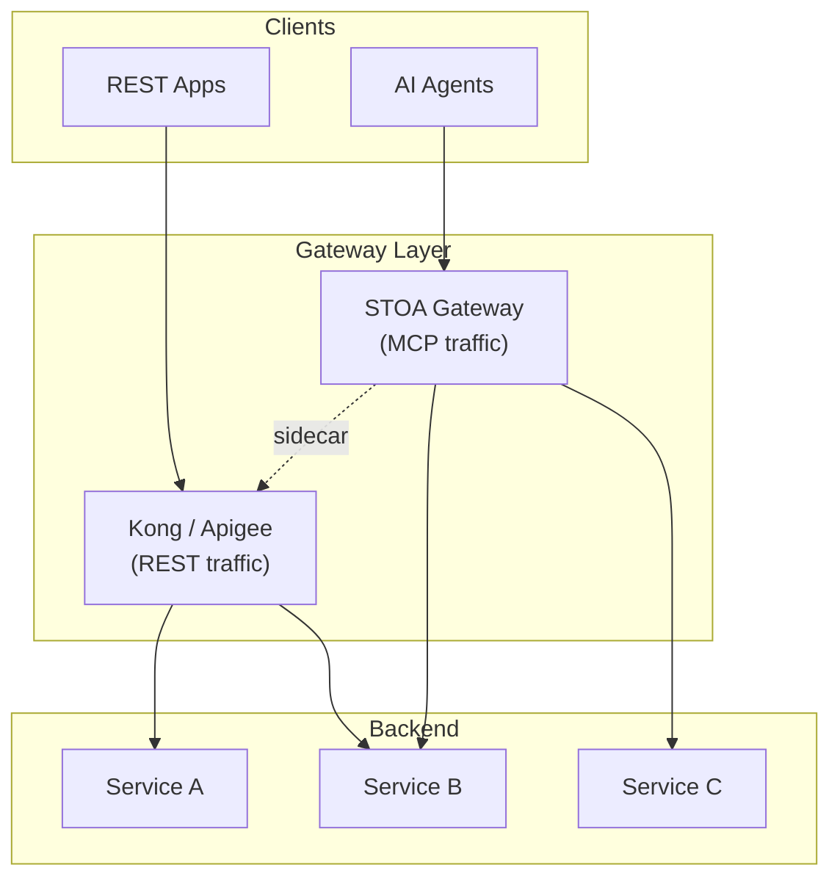
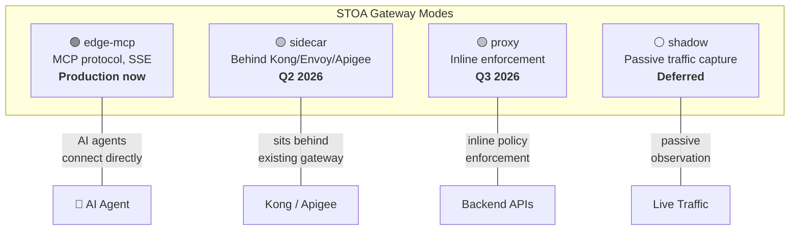
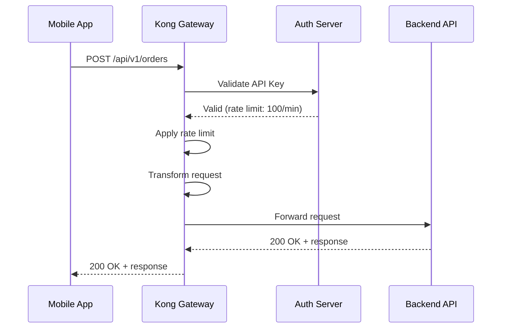
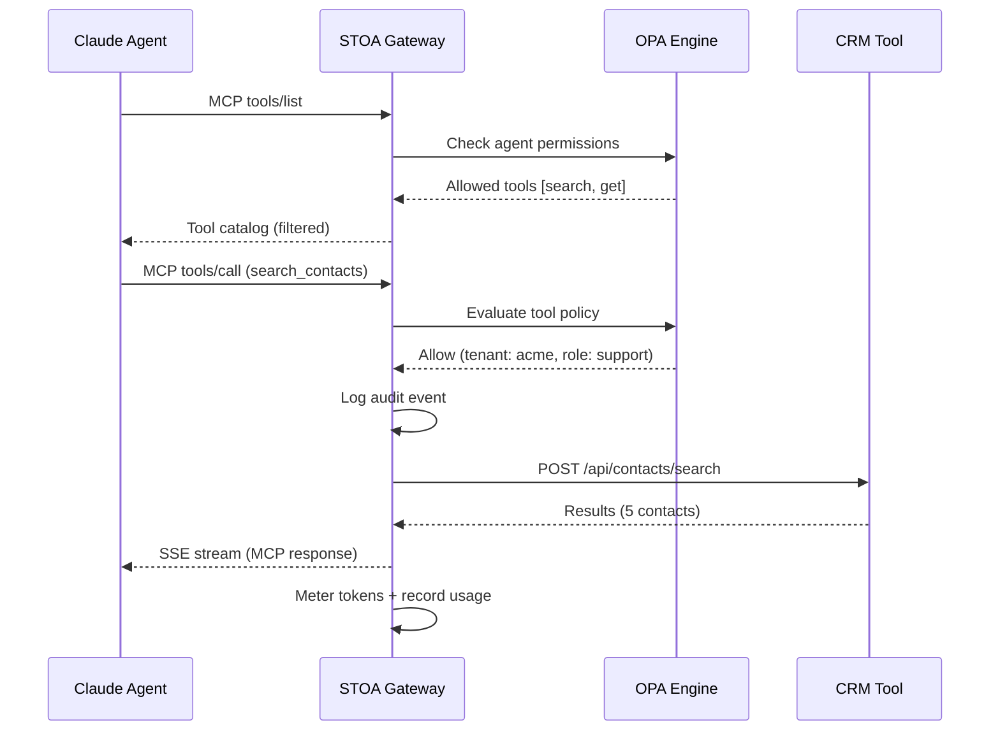

# API Gateway Patterns — STOA vs Kong vs Apigee (2026 Comparison)

> STOA is not a general-purpose API gateway — it is a purpose-built AI-native gateway that governs tool access for LLM agents, complementing (not replacing) traditional gateways.

The API gateway landscape in 2026 spans two distinct categories: **traditional gateways** built for REST/GraphQL traffic management, and **AI-native gateways** built for Model Context Protocol (MCP) and agent-to-tool governance. Understanding these architectural patterns helps organizations choose the right gateway — or combination of gateways — for their specific needs.

## Gateway Architecture Patterns

### Pattern 1: Traditional API Gateway (Kong, Apigee)

Traditional gateways sit at the edge of your infrastructure and handle all inbound API traffic. They provide routing, rate limiting, authentication, and protocol transformation for human-built applications.



**Strengths:** Mature plugin ecosystems, proven at scale, broad protocol support (REST, gRPC, GraphQL, WebSocket).

**Limitation:** Designed for request-response patterns between applications. AI agents require tool discovery, session management, and streaming responses that traditional gateways were not built for.

### Pattern 2: AI-Native MCP Gateway (STOA)

An MCP gateway is purpose-built for AI agent communication. Instead of routing HTTP requests, it manages tool discovery, invocation, and governance for LLM agents using the Model Context Protocol.



**Strengths:** Native MCP protocol, per-tool OPA policies, multi-tenant tool discovery, token metering, streaming SSE responses.

**Limitation:** Not designed to replace traditional REST/GraphQL routing. Best deployed alongside existing gateways.

### Pattern 3: Hybrid Gateway (STOA Sidecar + Traditional)

The most common enterprise pattern: keep your existing gateway for REST/GraphQL traffic and add STOA in sidecar mode for AI agent governance.



This pattern allows organizations to add AI governance incrementally without disrupting existing API traffic or gateway configurations.

## 5 Key Points

### 1. Different Problems, Different Gateways

Traditional gateways (Kong, Apigee, AWS API Gateway) solve REST/GraphQL traffic management: routing, rate limiting, API key validation. STOA solves AI-agent governance: tool discovery, multi-tenant isolation, subscription-based access for LLMs.

| Concern | Traditional Gateway | STOA MCP Gateway |
|---------|--------------------|--------------------|
| Protocol | REST, GraphQL, gRPC | MCP (tools/call, tools/list) |
| Consumer | Apps, microservices | AI agents (Claude, GPT) |
| Discovery | OpenAPI / Swagger | MCP tools/list (dynamic) |
| Governance | API keys, OAuth scopes | OPA policies per tool per tenant |
| Billing model | Per API call | Per tool invocation |
| Session model | Stateless request-response | Stateful agent sessions |
| Streaming | WebSocket, SSE (add-on) | SSE native (MCP standard) |

### 2. The Four Gateway Modes (ADR-024)

STOA's unified architecture supports four deployment modes under a single codebase:



Each mode uses the same Rust binary — the mode is selected at startup via configuration. This means upgrades, security patches, and new policies apply across all deployment modes simultaneously.

### 3. Coexistence, Not Replacement

STOA is designed to sit alongside your existing gateway. In sidecar mode, STOA deploys behind Kong or Apigee, adding AI governance without disrupting current API traffic:

```
┌─────────────┐     ┌────────────────┐     ┌──────────────┐
│  REST Apps  │────►│  Kong / Apigee │────►│ Backend APIs │
└─────────────┘     └────────────────┘     └──────────────┘
                           │
┌─────────────┐     ┌──────▼───────┐
│  AI Agents  │────►│ STOA Gateway │ (sidecar mode)
└─────────────┘     │  MCP + OPA   │
                    └──────────────┘
```

### 4. Head-to-Head Comparison

<!-- last verified: 2026-02 -->

| Feature | Kong | Apigee | STOA |
|---------|------|--------|------|
| **MCP Protocol** | Plugin (since 3.12) | No | Native |
| **AI Tool Discovery** | N/A | N/A | tools/list per tenant |
| **Multi-Tenant Isolation** | Enterprise (Workspaces) | Yes | Native (K8s namespaces) |
| **Policy Engine** | Plugins (Lua) | Apigee policies | OPA (Rego) |
| **Developer Portal** | Kong Dev Portal (Enterprise) | Apigee Portal | STOA Portal (OSS) |
| **Open Source** | Core: Yes (Apache 2.0) | No | Yes (Apache 2.0) |
| **REST/gRPC Routing** | Yes | Yes | Via sidecar/proxy mode |
| **Deployment** | Any | Google Cloud | Any (K8s-native) |
| **Token Metering** | N/A | N/A | Per-agent, per-tool |
| **Circuit Breaking** | Plugin | Built-in | Built-in (per-upstream) |
| **mTLS** | Enterprise | Yes | Built-in (all tiers) |
| **EU Data Sovereignty** | US company | US company (Google) | European (Apache 2.0) |
| **Pricing** | Enterprise license | Per API call | Open-source + Enterprise |

*Comparison based on publicly available information as of 2026-02. All product names are trademarks of their respective owners.*

### 5. When to Use What

| Scenario | Recommendation | Rationale |
|----------|---------------|-----------|
| REST API management only | Kong or Apigee | Mature ecosystems, battle-tested |
| AI agents need API access | STOA (edge-mcp mode) | Purpose-built for MCP protocol |
| Both REST apps + AI agents | Kong/Apigee + STOA (sidecar) | Best of both worlds |
| Greenfield AI-first platform | STOA (all modes) | Single platform, no legacy |
| Regulatory compliance (DORA/NIS2) | STOA (audit trail + OPA) | EU sovereignty, immutable logs |
| Migration from legacy ESB | STOA + existing gateway | Incremental migration |

## Request Lifecycle Comparison

Understanding how a request flows through each gateway architecture reveals the fundamental differences:

### Traditional Gateway Request Flow



### MCP Gateway Request Flow



Key differences: the MCP gateway adds **tool discovery**, **per-tool policy evaluation**, **audit logging**, and **token metering** — none of which exist in the traditional flow.

## Security Architecture

Each gateway pattern has different security characteristics:

| Security Layer | Kong | Apigee | STOA |
|---------------|------|--------|------|
| **Authentication** | API keys, OAuth2, JWT, mTLS | API keys, OAuth2, SAML | JWT, API keys, mTLS |
| **Authorization** | Plugin-based (ACLs, RBAC) | API Products, custom policies | OPA (fine-grained Rego policies) |
| **Policy Granularity** | Per-route | Per-API product | Per-tool, per-tenant, per-agent |
| **Audit Trail** | Access logs | Analytics | Structured audit events (OpenSearch) |
| **Multi-Tenant Isolation** | Enterprise workspaces | Organizations | K8s namespace + Keycloak realm |
| **Data Sovereignty** | Depends on hosting | Google Cloud regions | Self-hosted, EU-native |

STOA's security model is specifically designed for the AI agent threat model, where:
- **Prompt injection** can cause agents to call tools in unintended ways
- **Agent impersonation** requires strong identity verification
- **Overprivileged access** must be prevented by fine-grained per-tool policies
- **Audit requirements** demand full traceability of every tool invocation

## Deployment Architecture

### Kong Deployment

Kong typically deploys as a standalone gateway or Kubernetes Ingress Controller, backed by PostgreSQL or in DB-less mode:

```
Kong Gateway (Nginx + Lua)
├── PostgreSQL (config store)
├── Kong Manager (Enterprise UI)
└── Kong Dev Portal (Enterprise)
```

### Apigee Deployment

Apigee runs on Google Cloud infrastructure. Apigee hybrid allows a partial on-premise deployment:

```
Apigee Management Plane (Google Cloud)
└── Apigee Runtime (hybrid: on-premise)
    ├── Message Processor
    ├── Router
    └── Cassandra (config store)
```

### STOA Deployment

STOA follows a Kubernetes-native Control Plane / Data Plane architecture:

```
Control Plane (cloud or on-premise)
├── Control Plane API (Python/FastAPI)
├── Console (React admin dashboard)
├── Portal (React developer portal)
├── Keycloak (identity provider)
└── PostgreSQL (config store)

Data Plane (on-premise or edge)
├── STOA Gateway (Rust/axum)
├── OPA (embedded policy engine)
└── OpenSearch (audit logs)
```

The Data Plane can run independently of the Control Plane, ensuring that API traffic stays within your infrastructure even if the management layer is hosted elsewhere.

## Objections & Answers

| Objection | Answer |
|-----------|--------|
| "We already have Kong/Apigee, we don't need another gateway" | STOA doesn't replace them. Sidecar mode adds AI governance behind your existing gateway with minimal disruption to current traffic. |
| "MCP is niche — our APIs are REST" | Your APIs stay REST. STOA translates MCP to REST. AI agents speak MCP, backends speak REST — the gateway bridges both. |
| "Why not add MCP support as a Kong plugin?" | Kong added MCP plugins in 3.12. For basic MCP proxying, that may be sufficient. For multi-tenant tool discovery, OPA per-tool policies, and token metering, STOA provides these as core capabilities. |
| "Open-source means no support" | STOA offers an Enterprise tier with SLAs, support, and managed deployment — same model as Kong Enterprise vs Kong OSS. |
| "How does STOA handle high traffic?" | The gateway is built in Rust (Tokio + axum) for high throughput and low latency. Horizontal scaling via Kubernetes replica sets handles traffic growth. |
| "What about service mesh?" | STOA is not a service mesh. If you need east-west traffic management, use Istio or Linkerd. STOA handles north-south AI agent traffic at the application layer. |

## Migration Paths

### From Kong to STOA

Kong users can adopt STOA incrementally using sidecar mode:

1. **Phase 1:** Deploy STOA alongside Kong, routing only MCP traffic through STOA
2. **Phase 2:** Migrate tool definitions from Kong plugins to STOA CRDs
3. **Phase 3:** Gradually move API management to STOA's Control Plane

See the [Kong Migration Guide](/docs/guides/migration/kong) for step-by-step instructions.

### From Apigee to STOA

Apigee users migrating to open-source can map Apigee concepts to STOA equivalents:

| Apigee Concept | STOA Equivalent |
|---------------|-----------------|
| API Product | Tool Set (CRD) |
| Developer App | Consumer + API Key |
| Policy | OPA Rego Policy |
| Environment | Kubernetes Namespace |
| Analytics | OpenSearch + Grafana |

See the [Apigee Migration Guide](/docs/guides/migration/apigee) for the full mapping.

## Further Reading

- **[API Gateway Migration Guide 2026](/blog/api-gateway-migration-guide-2026)** — Comprehensive migration guide covering all platforms
- **[STOA vs Kong](/blog/stoa-vs-kong)** — Detailed comparison with honest strengths and weaknesses
- **[Open Source API Gateways 2026](/blog/open-source-api-gateway-2026)** — Kong, Envoy, APISIX, Tyk, and STOA compared
- [ADR-024: Gateway Unified Modes](/docs/architecture/adr/adr-024-gateway-unified-modes) — Architecture decision record
- [MCP Gateway Positioning](/docs/concepts/mcp-gateway-positioning) — What STOA does vs doesn't do
- [Migration from Kong](/docs/guides/migration/kong) — Kong migration with plugin mapping
- [Migration from Apigee](/docs/guides/migration/apigee) — Apigee migration with policy translation
- [Migration from webMethods](/docs/guides/migration/ibm-webmethods) — webMethods/DataPower migration
- [Migration from Oracle OAM](/docs/guides/migration/oracle-oam) — Oracle identity migration
- [DORA and NIS2 Compliance](/blog/dora-nis2-api-gateway-compliance) — Regulatory requirements for API gateways

---

> Feature comparisons are based on publicly available documentation as of 2026-02. Product capabilities change frequently. We encourage readers to verify current features directly with each vendor. All trademarks belong to their respective owners. See [trademarks](/docs/trademarks).
