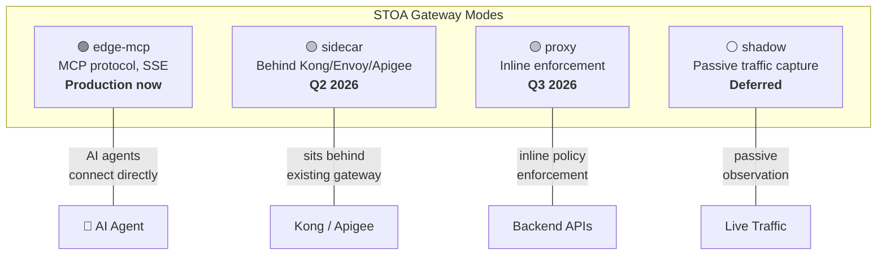

# Fiche #4: API Gateway Patterns — STOA vs Kong vs Apigee

> STOA is not a general-purpose API gateway — it is a purpose-built AI-native gateway that governs tool access for LLM agents, complementing (not replacing) traditional gateways.

## 5 Key Points

### 1. Different Problems, Different Gateways

Traditional gateways (Kong, Apigee, AWS API Gateway) solve REST/GraphQL traffic management: routing, rate limiting, API key validation. STOA solves AI-agent governance: tool discovery, multi-tenant isolation, subscription-based access for LLMs.

| Concern | Traditional Gateway | STOA MCP Gateway |
|---------|--------------------|--------------------|
| Protocol | REST, GraphQL, gRPC | MCP (tools/call, tools/list) |
| Consumer | Apps, microservices | AI agents (Claude, GPT) |
| Discovery | OpenAPI / Swagger | MCP tools/list (dynamic) |
| Governance | API keys, OAuth scopes | OPA policies per tool per tenant |
| Billing model | Per API call | Per tool invocation |

### 2. The Four Gateway Modes (ADR-024)

STOA's unified architecture supports four deployment modes under a single codebase:



### 3. Coexistence, Not Replacement

STOA is designed to sit alongside your existing gateway. In sidecar mode, STOA deploys behind Kong or Apigee, adding AI governance without disrupting current API traffic:

```
┌─────────────┐     ┌────────────────┐     ┌──────────────┐
│  REST Apps  │────►│  Kong / Apigee │────►│ Backend APIs │
└─────────────┘     └────────────────┘     └──────────────┘
                           │
┌─────────────┐     ┌──────▼───────┐
│  AI Agents  │────►│ STOA Gateway │ (sidecar mode)
└─────────────┘     │  MCP + OPA   │
                    └──────────────┘
```

### 4. Head-to-Head Comparison

| Feature | Kong | Apigee | STOA |
|---------|------|--------|------|
| **MCP Protocol** | No | No | Native |
| **AI Tool Discovery** | No | No | tools/list |
| **Multi-Tenant Isolation** | Plugin | Yes | Native (K8s namespaces) |
| **Policy Engine** | Plugins (Lua) | Apigee policies | OPA (Rego) |
| **Developer Portal** | Kong Dev Portal | Apigee Portal | STOA Portal |
| **Open Source** | Core: Yes | No | Yes (Apache 2.0) |
| **REST/gRPC Routing** | Yes | Yes | Via sidecar/proxy mode |
| **Deployment** | Any | Google Cloud | Any (K8s-native) |
| **Pricing** | Enterprise license | Per API call | Open-source + Enterprise |

*Comparison based on publicly available information. All product names are trademarks of their respective owners.*

### 5. When to Use What

| Scenario | Recommendation |
|----------|---------------|
| REST API management only | Kong or Apigee |
| AI agents need API access | STOA (edge-mcp mode) |
| Both REST apps + AI agents | Kong/Apigee + STOA (sidecar) |
| Greenfield AI-first platform | STOA (all modes) |
| Regulatory compliance (DORA/NIS2) | STOA (audit trail + OPA) |

## Objections & Answers

| Objection | Answer |
|-----------|--------|
| "We already have Kong/Apigee, we don't need another gateway" | STOA doesn't replace them. Sidecar mode adds AI governance behind your existing gateway with minimal disruption to current traffic. |
| "MCP is niche — our APIs are REST" | Your APIs stay REST. STOA translates MCP to REST. AI agents speak MCP, backends speak REST — the gateway bridges both. |
| "Why not add MCP support as a Kong plugin?" | A plugin can handle protocol translation, but not multi-tenant tool discovery, OPA-based per-tool policies, or the developer portal. STOA is purpose-built for AI governance. |
| "Open-source means no support" | STOA offers an Enterprise tier with SLAs, support, and managed deployment — same model as Kong Enterprise vs Kong OSS. |

## Further Reading

- [ADR-024: Gateway Unified Modes](/docs/architecture/adr/adr-024-gateway-unified-modes) — Architecture decision record
- [MCP Gateway Positioning](/docs/concepts/mcp-gateway-positioning) — What STOA does vs doesn't do
- [Migration from Kong](/docs/guides/migration/kong) — Kong coexistence guide
- [Migration from Apigee](/docs/guides/migration/apigee) — Apigee coexistence guide
