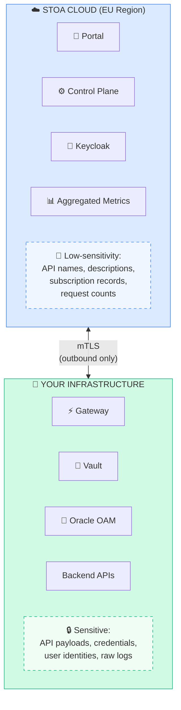

# Fiche #5: Data Sovereignty & GDPR

> STOA's hybrid architecture is designed so that sensitive business data and user identities remain within your perimeter, while metadata and metrics are hosted in EU-sovereign infrastructure.

## 5 Key Points

### 1. Clear Data Boundary: What Stays vs What Leaves

A key question for any enterprise: "Where does my data go?" STOA makes this explicit:



**No inbound connections required.** All communication is initiated from your infrastructure.

### 2. Three Deployment Models for Every Sovereignty Level

| Model | Data Residency | Best For |
|-------|---------------|----------|
| **Hybrid** (default) | Business data on-prem, metadata in EU cloud | Most enterprises |
| **Full On-Premises** | 100% on your infrastructure | Air-gapped, defense, banking |
| **Multi-Cloud** | Distributed across regions | Global organizations |

### 3. Regulatory Coverage: GDPR, DORA, NIS2

| Regulation | Key Requirement | How STOA Helps |
|------------|----------------|----------------|
| **GDPR** | Data minimization, right of access | Configurable log anonymization, per-consumer usage export |
| **DORA** | ICT risk management, 24h incident reporting | Full audit trail, real-time alerting, structured logs |
| **NIS2** | Supply chain security, sovereignty | API provenance tracking, EU-hosted control plane |

### 4. CLOUD Act Protection

The US CLOUD Act can compel US-headquartered providers to hand over data stored abroad. STOA mitigates this:

- **Control Plane hosted in EU** (OVHcloud / Scaleway — not AWS/Azure/GCP)
- **Business data is designed to remain within your premises** in hybrid mode
- **Full on-prem option** eliminates any cloud dependency entirely
- **Open-source codebase** — no hidden data exfiltration, fully auditable

```
US CLOUD Act Exposure Matrix
─────────────────────────────────────────
              │ US Provider │ EU Provider │ On-Prem
──────────────┼─────────────┼─────────────┼────────
Metadata      │    ⚠️ Risk  │  ✅ Safe    │ ✅ Safe
Payloads      │    ❌ Risk  │  ✅ Safe    │ ✅ Safe
Credentials   │    ❌ Risk  │  ✅ Safe    │ ✅ Safe
─────────────────────────────────────────
STOA default: EU cloud (metadata) + On-prem (payloads)
```

### 5. Encryption at Every Layer

| Layer | Mechanism |
|-------|-----------|
| **In Transit** | TLS 1.3 (external), mTLS (internal) |
| **At Rest** | AES-256 (databases), AES-256-GCM (Vault) |
| **Field-Level** | PII field encryption in logs |
| **Secrets** | HashiCorp Vault with automatic rotation |

## Objections & Answers

| Objection | Answer |
|-----------|--------|
| "Any cloud component is a sovereignty risk" | Full on-premises deployment is supported with no required cloud dependency. Your cluster, your rules. |
| "EU hosting doesn't protect against CLOUD Act" | Correct if the provider is US-headquartered. STOA's EU option uses EU-sovereign providers (OVHcloud, Scaleway). |
| "We need SOC 2 / ISO 27001 certification" | On the roadmap: SOC 2 Type II (Q4 2026), ISO 27001 (2027). Current architecture is designed to meet these standards. |
| "GDPR requires right to deletion — can STOA do that?" | Yes. Per-consumer data isolation allows targeted deletion. Audit logs can be configured with retention policies. |
| "Our DPO won't approve SaaS" | Share the data boundary diagram above. Only API metadata (names, descriptions) goes to cloud. Or deploy fully on-prem. |

## Further Reading

- [Security & Compliance](/docs/enterprise/security-compliance) — Full DORA, NIS2, GDPR details
- [Hybrid Deployment](/docs/deployment/hybrid) — Deployment models and data flow
- [GDPR (EU)](https://gdpr.eu/) — Official GDPR resource
- [DORA Regulation](https://www.digital-operational-resilience-act.com/) — DORA overview
- [NIS2 Directive](https://digital-strategy.ec.europa.eu/en/policies/nis2-directive) — EU NIS2 information
