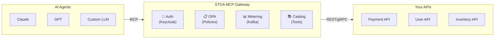

# Fiche #3: MCP Protocol — The USB-C of LLMs

> MCP (Model Context Protocol) is an open standard that lets any AI agent discover and invoke any tool through a single interface — like USB-C replaced proprietary chargers, MCP replaces custom AI integrations.

## 5 Key Points

### 1. One Protocol, Any AI Agent, Any Tool

Before MCP, connecting Claude to your CRM required custom code. Connecting GPT to the same CRM required different custom code. MCP defines a universal interface: `tools/list` to discover, `tools/call` to invoke. Write the integration once, every AI agent can use it.

```
BEFORE MCP                           WITH MCP
┌────────┐ ─custom─► ┌─────┐        ┌────────┐
│ Claude │ ─custom─► │ CRM │        │ Claude │──┐
└────────┘           └─────┘        └────────┘  │
┌────────┐ ─custom─► ┌─────┐        ┌────────┐  │  MCP    ┌─────┐
│  GPT   │ ─custom─► │ CRM │        │  GPT   │──┼────────►│ CRM │
└────────┘           └─────┘        └────────┘  │         └─────┘
┌────────┐ ─custom─► ┌─────┐        ┌────────┐  │
│ Gemini │ ─custom─► │ CRM │        │ Gemini │──┘
└────────┘           └─────┘        └────────┘
 6 integrations                      1 integration
```

### 2. The Three Primitives

MCP defines three resource types that cover the full AI-tool interaction surface:

| Primitive | Purpose | Example |
|-----------|---------|---------|
| **Tools** | Actions the AI can invoke | `create_invoice`, `search_orders` |
| **Resources** | Data the AI can read | Database schemas, config files |
| **Prompts** | Reusable prompt templates | "Summarize this API response" |

### 3. STOA = MCP Gateway for the Enterprise

Raw MCP has no authentication, no multi-tenancy, no rate limiting. STOA adds the enterprise layer:



### 4. Transport: HTTP/SSE (Today), Streamable HTTP (Tomorrow)

MCP uses Server-Sent Events over HTTP for streaming responses. This works through firewalls, load balancers, and CDNs — no WebSocket upgrades required. The protocol version `2024-11-05` is production-stable.

| Transport | Status | Use Case |
|-----------|--------|----------|
| HTTP/SSE | Production | Streaming responses, real-time |
| Streamable HTTP | Emerging | Simplified bidirectional |

### 5. Tool Registration via Kubernetes CRDs

In STOA, tools are declared as Kubernetes Custom Resources. GitOps-compatible, version-controlled, auditable:

```yaml
apiVersion: gostoa.dev/v1alpha1
kind: Tool
metadata:
  name: create-invoice
  namespace: tenant-acme
spec:
  displayName: Create Invoice
  description: Creates a new invoice in the billing system
  endpoint: https://billing.acme.com/v1/invoices
  method: POST
```

Apply with `kubectl apply`, and the tool is immediately discoverable by authorized AI agents via `tools/list`.

## Objections & Answers

| Objection | Answer |
|-----------|--------|
| "MCP is too new, it's risky" | MCP was created by Anthropic and has been adopted by Claude, Cursor, Windsurf, and dozens of open-source projects. The spec is stable (2024-11-05). |
| "We already have REST APIs, why add MCP?" | You keep your REST APIs. MCP is the protocol AI agents use to discover and call them. STOA bridges MCP to REST — your backends don't change. |
| "What about OpenAI function calling?" | Function calling is vendor-specific. MCP is an open standard. STOA supports both — agents using function calling can still go through the gateway. |
| "Our APIs are internal, AI agents shouldn't access them" | That's exactly what the gateway controls. OPA policies define which agents can access which tools. No policy = no access. |

## Further Reading

- [MCP Specification](https://modelcontextprotocol.io/) — Official Model Context Protocol docs
- [MCP Gateway Concept](/docs/concepts/mcp-gateway) — STOA's MCP Gateway architecture
- [MCP Gateway Positioning](/docs/concepts/mcp-gateway-positioning) — What STOA does (and doesn't do)
- [API Reference](/docs/api/mcp-gateway) — MCP Gateway endpoints
