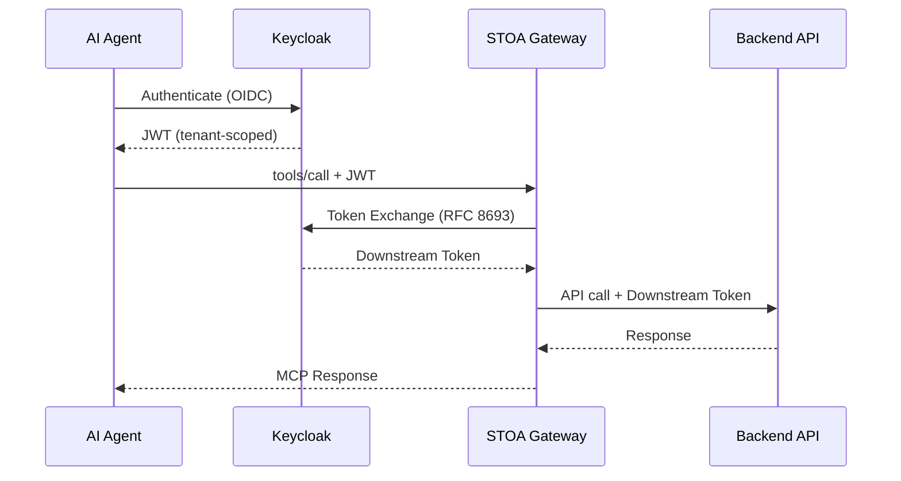

# Fiche #2: OAuth 2.0 + Token Exchange (RFC 8693)

> STOA leverages OAuth 2.0 with RFC 8693 Token Exchange to let AI agents and users securely access multi-tenant APIs without sharing credentials across trust boundaries.

## 5 Key Points

### 1. Keycloak as Federated Identity Broker

STOA uses Keycloak with one realm per tenant. Each realm isolates users, roles, and clients. Keycloak federates with existing enterprise IdPs (Oracle OAM, Okta, Azure AD) via OIDC — no user migration required.

```
┌─────────────────────────────────────┐
│        Keycloak (STOA)              │
│  ┌───────────┐  ┌───────────┐      │
│  │ realm-acme│  │realm-globex│     │
│  └─────┬─────┘  └─────┬─────┘     │
│        │               │           │
│   Federation      Federation       │
│        │               │           │
│  ┌─────▼─────┐  ┌─────▼─────┐     │
│  │ Oracle OAM│  │  Azure AD │     │
│  └───────────┘  └───────────┘     │
└─────────────────────────────────────┘
```

### 2. Token Exchange (RFC 8693) Bridges Trust Domains

When an AI agent authenticated via Keycloak needs to call a backend behind a different gateway (e.g., webMethods), STOA performs a standards-compliant token exchange. The agent's JWT is swapped for a downstream-compatible token — no credential sharing.



### 3. Scoped Access with RBAC Claims

Every JWT issued by STOA contains tenant-specific claims and scopes (`stoa:read`, `stoa:write`, `stoa:admin`). The MCP Gateway and OPA policies enforce fine-grained access per tool, per user, per tenant — no over-privileged tokens.

| Scope | Allowed Actions |
|-------|----------------|
| `stoa:read` | List tools, read resources |
| `stoa:write` | Invoke tools, create subscriptions |
| `stoa:admin` | Manage tenants, configure policies |

### 4. Short-Lived Tokens, No Stored Credentials

Access tokens are short-lived (default: 1 hour). Refresh tokens handle re-authentication. No long-lived credentials flow between cloud and on-premises — only federated, short-lived JWTs cross the boundary.

### 5. Standard Flows for Every Use Case

| Flow | Use Case |
|------|----------|
| **Client Credentials** | Machine-to-machine (AI agents, CI/CD) |
| **Authorization Code + PKCE** | Web apps, Developer Portal |
| **Token Exchange (RFC 8693)** | Cross-gateway, cross-realm delegation |

## Objections & Answers

| Objection | Answer |
|-----------|--------|
| "We already have OAuth — why another IdP?" | Keycloak federates with your existing IdP. No migration, no duplication. It adds multi-tenant isolation on top. |
| "Token Exchange adds latency" | Exchange happens once per session, not per request. Downstream tokens are cached. Typical overhead: minimal (depends on network and infrastructure). |
| "Our security team won't accept cloud-based auth" | Full on-premises deployment is supported. Keycloak runs in your cluster. |
| "RFC 8693 is niche — will it be supported long-term?" | RFC 8693 is an IETF standard supported by Keycloak, Auth0, and Azure AD. It's the standard way to delegate tokens across trust boundaries. |

## Further Reading

- [RFC 8693 — OAuth 2.0 Token Exchange](https://datatracker.ietf.org/doc/html/rfc8693)
- [Authentication Setup](/docs/guides/authentication) — STOA authentication guide
- [Security & Compliance](/docs/enterprise/security-compliance) — DORA, NIS2, GDPR coverage
- [MCP Gateway](/docs/concepts/mcp-gateway) — How the gateway validates tokens
