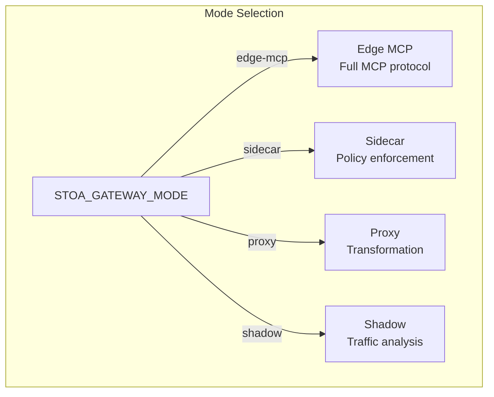
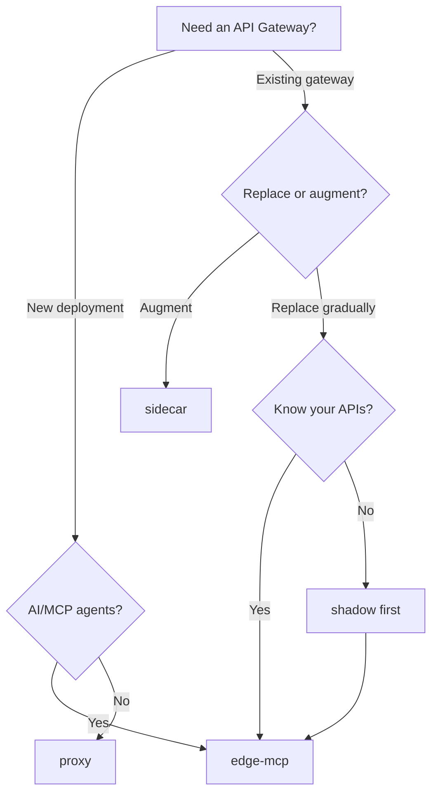

import EnvSetup from '@site/docs/_partials/_env-setup.mdx';

# Gateway Modes

STOA Gateway supports 4 deployment modes (defined in [ADR-024](/docs/architecture/adr/adr-024-gateway-unified-modes)), each optimized for a different integration pattern. Select the mode via the `STOA_GATEWAY_MODE` environment variable.

## Mode Overview

| Mode | Port | MCP Support | Use Case | Status |
|------|------|-------------|----------|--------|
| **edge-mcp** | 8080 | Yes | Standalone MCP gateway with full protocol support | Production |
| **sidecar** | 8081 | No | Policy enforcement alongside existing gateways | Q2 2026 |
| **proxy** | 8082 | No | Inline request/response transformation | Q3 2026 |
| **shadow** | 8083 | No | Passive traffic capture and UAC generation | Q4 2026 |



## Mode Capabilities

| Capability | edge-mcp | sidecar | proxy | shadow |
|-----------|----------|---------|-------|--------|
| MCP protocol (SSE) | Yes | No | No | No |
| Tool discovery/invocation | Yes | No | No | No |
| JWT authentication | Yes | Yes | Yes | No |
| Rate limiting | Yes | Yes | Yes | No |
| Circuit breaker | Yes | No | Yes | No |
| Request transformation | No | No | Yes | No |
| Traffic capture | No | No | No | Yes |
| UAC generation | No | No | No | Yes |
| Requires upstream | No | No | Yes | Yes |
| Passive (read-only) | No | No | No | Yes |

## Edge-MCP Mode (Production)

The default and primary production mode. Implements the full MCP protocol with SSE transport, OAuth 2.1 discovery, tool management, and session handling.

### Configuration

```bash
# Environment variables
STOA_GATEWAY_MODE=edge-mcp

# Edge-MCP specific settings
STOA_SSE_KEEPALIVE=true
STOA_SSE_KEEPALIVE_INTERVAL_SECS=30
STOA_MAX_SESSIONS=10000
STOA_SESSION_TIMEOUT_SECS=3600
```

### Helm Values

```yaml
stoaGateway:
  mode: edge-mcp
  edgeMcp:
    sseKeepalive: true
    sseKeepaliveIntervalSecs: 30
    maxSessions: 10000
    sessionTimeoutSecs: 3600
```

### Exposed Routes

| Path | Method | Purpose |
|------|--------|---------|
| `/.well-known/oauth-authorization-server` | GET | OAuth 2.1 discovery |
| `/.well-known/oauth-protected-resource` | GET | Protected resource metadata |
| `/mcp/sse` | GET | SSE transport endpoint |
| `/mcp/messages` | POST | JSON-RPC message endpoint |
| `/oauth/authorize` | GET | OIDC proxy (to Keycloak) |
| `/oauth/token` | POST | Token proxy (to Keycloak) |
| `/oauth/register` | POST | Dynamic client registration |
| `/admin/*` | Various | Admin API (22 endpoints) |
| `/health` | GET | Health check |
| `/metrics` | GET | Prometheus metrics |

### When to Use

- Standalone MCP gateway deployment
- AI agent integration (Claude, GPT, custom agents)
- Full API management with rate limiting, quotas, and circuit breaking
- Production workloads requiring SSE transport

## Sidecar Mode

Deploys alongside an existing API gateway (Kong, webMethods, Envoy) to add STOA policy enforcement without replacing the primary gateway.

### Configuration

```bash
STOA_GATEWAY_MODE=sidecar

# Sidecar specific settings
STOA_UPSTREAM_TYPE=generic       # Options: generic, webmethods, kong, envoy, apigee
STOA_USER_INFO_HEADER=X-User-Info
STOA_TENANT_ID_HEADER=X-Tenant-ID
STOA_DECISION_FORMAT=StatusCode  # Options: StatusCode, JsonBody, EnvoyExtAuthz, KongPlugin
```

### Decision Format

The sidecar responds to auth/policy checks in a format compatible with the host gateway:

| Format | Compatible With | Response |
|--------|----------------|----------|
| `StatusCode` | Any gateway | 200 (allow) or 403 (deny) |
| `JsonBody` | Custom integrations | JSON with `allowed: true/false` and `reason` |
| `EnvoyExtAuthz` | Envoy, Istio | ext_authz gRPC/HTTP response |
| `KongPlugin` | Kong | Kong plugin-compatible response |

### Exposed Routes

| Path | Method | Purpose |
|------|--------|---------|
| `/authz` | POST | Authorization decision endpoint |
| `/health` | GET | Health check |
| `/metrics` | GET | Prometheus metrics |

### When to Use

- Adding STOA RBAC/rate-limiting to an existing Kong or Envoy deployment
- Gradual migration from a legacy gateway
- Environments where replacing the gateway is not feasible

## Proxy Mode

Sits inline in the request path, transforming requests and responses between clients and backends. Supports header injection, body transformation, and WebSocket passthrough.

### Configuration

```bash
STOA_GATEWAY_MODE=proxy

# Proxy specific settings
STOA_TRANSFORM_REQUEST=false
STOA_TRANSFORM_RESPONSE=false
STOA_INJECT_HEADERS=true
STOA_WEBSOCKET_PASSTHROUGH=false
STOA_CONNECTION_POOL_SIZE=100
```

### Capabilities

| Feature | Default | Description |
|---------|---------|-------------|
| Request transformation | Off | Modify request headers/body before forwarding |
| Response transformation | Off | Modify response headers/body before returning |
| Header injection | On | Add tenant, trace, and correlation headers |
| WebSocket passthrough | Off | Forward WebSocket connections |
| Connection pooling | 100 | Upstream connection pool size |

### When to Use

- Request/response transformation between clients and backends
- Adding observability headers to existing API traffic
- WebSocket proxying with policy enforcement
- Environments requiring inline traffic manipulation

## Shadow Mode

Passively captures traffic for analysis and automatic UAC (Universal API Contract) generation. Does not modify or block any requests.

### Configuration

```bash
STOA_GATEWAY_MODE=shadow

# Shadow specific settings
STOA_CAPTURE_METHOD=Inline       # Options: EnvoyTap, PortMirror, Inline, KafkaReplay
STOA_UAC_OUTPUT_DIR=/var/stoa/uac
STOA_AUTO_CREATE_MR=false
STOA_MIN_REQUESTS_FOR_UAC=100
STOA_ANALYSIS_WINDOW_HOURS=168   # 7 days
```

### Capture Methods

| Method | Description | Infrastructure |
|--------|-------------|----------------|
| `Inline` | STOA captures traffic directly | No extra infra |
| `EnvoyTap` | Envoy tap filter forwards copies | Envoy sidecar |
| `PortMirror` | Network-level traffic mirroring | Switch/router config |
| `KafkaReplay` | Replay from Kafka topic | Redpanda/Kafka |

### UAC Generation

After collecting `min_requests_for_uac` requests over `analysis_window_hours`, shadow mode generates a Universal API Contract:

```
1. Capture traffic (requests + responses)
2. Analyze patterns (endpoints, schemas, error codes)
3. Generate OpenAPI spec + STOA UAC annotations
4. Output to UAC_OUTPUT_DIR (or auto-create MR if configured)
```

### Exposed Routes

| Path | Method | Purpose |
|------|--------|---------|
| `/shadow/status` | GET | Capture statistics |
| `/shadow/generate` | POST | Trigger UAC generation |
| `/health` | GET | Health check |
| `/metrics` | GET | Prometheus metrics |

### When to Use

- Discovering undocumented APIs in legacy environments
- Automatically generating API contracts from live traffic
- Pre-migration analysis before moving to STOA
- Compliance auditing of API traffic patterns

## Mode Selection Guide



| Scenario | Recommended Mode |
|----------|-----------------|
| Greenfield MCP deployment | `edge-mcp` |
| Adding policies to existing Kong | `sidecar` |
| API transformation layer | `proxy` |
| Legacy API discovery | `shadow` → then `edge-mcp` |
| Gradual migration from webMethods | `shadow` → `sidecar` → `edge-mcp` |

## Runtime Configuration

Set the mode via environment variable or Helm values:

```bash
# Environment variable (highest priority)
export STOA_GATEWAY_MODE=edge-mcp

# Helm values
stoaGateway:
  mode: edge-mcp
```

The mode is logged at startup:

```
INFO Starting STOA Gateway version=2.0.0 mode=edge-mcp
```

The gateway listens on the mode's default port (8080-8083) unless overridden.

## Troubleshooting

| Problem | Cause | Fix |
|---------|-------|-----|
| "Unknown mode" on startup | Invalid `STOA_GATEWAY_MODE` value | Use: `edge-mcp`, `sidecar`, `proxy`, or `shadow` |
| MCP endpoints return 404 | Wrong mode selected | Only `edge-mcp` serves MCP routes |
| Sidecar not enforcing policies | Decision format mismatch | Match `STOA_DECISION_FORMAT` to host gateway |
| Shadow not capturing traffic | Capture method requires infra | Use `Inline` if no Envoy/Kafka available |
| Proxy dropping WebSocket | Passthrough disabled | Set `STOA_WEBSOCKET_PASSTHROUGH=true` |

## Related

- [Multi-Gateway Orchestration](/docs/guides/multi-gateway-setup) -- Multi-gateway adapter pattern
- [MCP Gateway API](/docs/api/mcp-gateway) -- Edge-MCP protocol reference
- [Gateway Admin API](/docs/api/gateway-admin-api) -- Admin endpoints
- [Installation Guide](/docs/admin/installation) -- Helm chart configuration
- [Architecture Overview](/docs/concepts/architecture) -- Platform architecture
