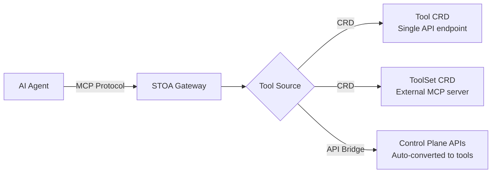

# MCP Tools Development

Build, test, and deploy MCP tools on STOA Platform.

## Architecture

STOA exposes tools to AI agents through two mechanisms:



| Source | Use Case | How It Works |
|--------|----------|-------------|
| **Tool CRD** | Wrap any REST API as an MCP tool | Define endpoint + schema in YAML, gateway calls it |
| **ToolSet CRD** | Connect an existing MCP server | Gateway discovers tools via upstream SSE/HTTP |
| **API Bridge** | Expose Control Plane APIs as tools | Automatic conversion of registered APIs to MCP tools |

## Tool CRD Reference

### Full Schema

```yaml
apiVersion: gostoa.dev/v1alpha1
kind: Tool
metadata:
  name: <tool-name>          # Lowercase, hyphens allowed
  namespace: stoa-system      # Must be in gateway namespace
spec:
  displayName: <string>       # Required — human-readable name
  description: <string>       # Required — description for LLM context
  endpoint: <url>             # Required — backend HTTP endpoint
  method: <GET|POST|PUT|DELETE|PATCH>  # Required
  inputSchema:                # Required — JSON Schema for arguments
    type: object
    properties: { ... }
    required: [ ... ]
  outputSchema:               # Optional — JSON Schema for response
    type: object
    properties: { ... }
  auth: <bearer|service_account|none>  # Default: none
  rateLimit: "<N>/<unit>"     # Optional — e.g., "100/min", "1000/hour"
  annotations:                # Optional — MCP 2025-03-26 hints
    readOnly: <boolean>       # Tool only reads data
    destructive: <boolean>    # Tool deletes/modifies irreversibly
    idempotent: <boolean>     # Same call twice = same result
    openWorld: <boolean>      # Interacts with external systems
```

### Status (read-only, set by gateway)

```yaml
status:
  registered: true            # Gateway has loaded this tool
  lastSeen: "2026-02-13T10:30:00Z"
  error: ""                   # Empty = no error
```

### Annotations Best Practices

Annotations help AI agents decide when and how to use tools safely:

| Action Type | readOnly | destructive | idempotent | openWorld |
|-------------|----------|-------------|------------|-----------|
| **Read/Search** | `true` | `false` | `true` | depends |
| **Create** | `false` | `false` | `false` | depends |
| **Update** | `false` | `false` | `true` | depends |
| **Delete** | `false` | `true` | `false` | depends |
| **External call** | depends | depends | depends | `true` |

:::tip
If unsure, set `openWorld: true` — it signals the tool has side effects beyond the local system. AI agents treat `openWorld: false` tools as safe to call speculatively.
:::

### Input Schema Patterns

#### Simple query parameter

```yaml
inputSchema:
  type: object
  properties:
    query:
      type: string
      description: "Search term"
  required: [query]
```

#### Complex object with validation

```yaml
inputSchema:
  type: object
  properties:
    customer_id:
      type: string
      pattern: "^[A-Z]{2}-[0-9]{6}$"
      description: "Customer ID (format: XX-000000)"
    amount:
      type: number
      minimum: 0
      maximum: 1000000
      description: "Transaction amount in EUR"
    currency:
      type: string
      enum: [EUR, USD, GBP]
      default: EUR
  required: [customer_id, amount]
```

#### Nested objects

```yaml
inputSchema:
  type: object
  properties:
    filters:
      type: object
      properties:
        status:
          type: string
          enum: [active, suspended, archived]
        created_after:
          type: string
          format: date
      description: "Filter criteria"
    pagination:
      type: object
      properties:
        page:
          type: integer
          minimum: 1
          default: 1
        per_page:
          type: integer
          minimum: 1
          maximum: 100
          default: 20
```

## ToolSet CRD Reference

### Full Schema

```yaml
apiVersion: gostoa.dev/v1alpha1
kind: ToolSet
metadata:
  name: <toolset-name>
  namespace: stoa-system
spec:
  upstream:
    url: <string>              # Required — MCP server URL
    transport: <sse|streamable-http>  # Default: sse
    auth:                      # Optional
      type: <bearer|header>
      secretRef: <string>      # K8s Secret name
      headerName: <string>     # For header type only
    timeoutSeconds: <integer>  # Connection timeout
  tools: []                    # Tool names to expose (empty = all)
  prefix: <string>             # Optional — prefix for tool names
```

### Status (read-only)

```yaml
status:
  connected: true
  toolCount: 12
  discoveredTools:
    - search_customers
    - create_order
    - get_invoice
  lastSync: "2026-02-13T10:30:00Z"
  error: ""
```

### Selective Tool Exposure

Expose only specific tools from an upstream server:

```yaml
spec:
  tools:
    - search_customers
    - get_customer_detail
  # Only these 2 tools will be available, even if the server has 20
```

### Prefix for Collision Avoidance

When connecting multiple MCP servers that might have tools with the same name:

```yaml
spec:
  prefix: "crm"
  # "search_customers" becomes "crm_search_customers"
```

## Authentication Patterns

### No Auth (Public APIs)

```yaml
spec:
  auth: none
  endpoint: https://api.open-meteo.com/v1/forecast
```

### Bearer Token (K8s Secret)

```yaml
spec:
  auth: bearer
---
# Create the secret first
apiVersion: v1
kind: Secret
metadata:
  name: my-api-token
  namespace: stoa-system
type: Opaque
stringData:
  token: "sk-my-secret-token"
```

### Service Account (OAuth2 M2M)

```yaml
spec:
  auth: service_account
  # Uses Keycloak service account credentials configured in gateway
```

## Testing Tools

### Verify CRD Applied

```bash
kubectl get tools.gostoa.dev -n stoa-system -o wide
```

### Test via REST

```bash
# List tools
curl -s -X POST "${STOA_GATEWAY_URL}/mcp/v1/tools" \
  -H "Authorization: Bearer ${TOKEN}" | jq '.tools[] | {name, description}'

# Invoke
curl -s -X POST "${STOA_GATEWAY_URL}/mcp/v1/tools/invoke" \
  -H "Authorization: Bearer ${TOKEN}" \
  -H "Content-Type: application/json" \
  -d '{"name": "get-weather", "arguments": {"q": "Berlin"}}' | jq
```

### Test via MCP Protocol

```bash
# Initialize session
curl -s -X POST "${STOA_GATEWAY_URL}/mcp/sse" \
  -H "Authorization: Bearer ${TOKEN}" \
  -H "Content-Type: application/json" \
  -d '{
    "jsonrpc": "2.0",
    "method": "initialize",
    "params": {
      "protocolVersion": "2025-03-26",
      "capabilities": {"tools": {}},
      "clientInfo": {"name": "test", "version": "1.0"}
    },
    "id": 1
  }' | jq

# List tools
curl -s -X POST "${STOA_GATEWAY_URL}/mcp/sse" \
  -H "Authorization: Bearer ${TOKEN}" \
  -H "Content-Type: application/json" \
  -d '{"jsonrpc": "2.0", "method": "tools/list", "id": 2}' | jq

# Call tool
curl -s -X POST "${STOA_GATEWAY_URL}/mcp/sse" \
  -H "Authorization: Bearer ${TOKEN}" \
  -H "Content-Type: application/json" \
  -d '{
    "jsonrpc": "2.0",
    "method": "tools/call",
    "params": {"name": "get-weather", "arguments": {"q": "Berlin"}},
    "id": 3
  }' | jq
```

### Check Gateway Admin

```bash
curl -s "${STOA_GATEWAY_URL}/admin/health" \
  -H "Authorization: Bearer ${ADMIN_TOKEN}" | jq
```

## Deployment Patterns

### Pattern 1: Wrap Existing REST API

The most common pattern — expose a company's internal API to AI agents:

```yaml
apiVersion: gostoa.dev/v1alpha1
kind: Tool
metadata:
  name: search-orders
  namespace: stoa-system
spec:
  displayName: Search Orders
  description: "Search customer orders by status, date range, or customer ID. Returns order summary with amounts."
  endpoint: https://erp.internal.example.com/api/v2/orders/search
  method: POST
  inputSchema:
    type: object
    properties:
      customer_id:
        type: string
        description: "Customer identifier"
      status:
        type: string
        enum: [pending, shipped, delivered, cancelled]
      date_from:
        type: string
        format: date
    required: [customer_id]
  auth: bearer
  rateLimit: "100/min"
  annotations:
    readOnly: true
    idempotent: true
    openWorld: false
```

### Pattern 2: Federation via ToolSet

Connect an entire MCP server and expose its tools through STOA's auth and rate limiting:

```yaml
apiVersion: gostoa.dev/v1alpha1
kind: ToolSet
metadata:
  name: data-science-tools
  namespace: stoa-system
spec:
  upstream:
    url: https://ds-tools.internal.example.com/mcp
    transport: sse
    auth:
      type: bearer
      secretRef: ds-tools-secret
    timeoutSeconds: 60
  prefix: "ds"
  tools:
    - run_prediction
    - feature_importance
    - model_metrics
```

### Pattern 3: Multi-Gateway Tool Distribution

Deploy the same tool across multiple gateway instances for high availability:

```bash
# Tool CRD is cluster-scoped — all gateways in the namespace see it
kubectl apply -f my-tool.yaml -n stoa-system

# Verify on each gateway
curl -s "${STOA_GATEWAY_URL}/mcp/v1/tools" \
  -H "Authorization: Bearer ${TOKEN}" | jq '.tools | length'
```

## What's Next

| Topic | Link |
|-------|------|
| MCP Getting Started | [Quick tutorial](/docs/guides/mcp-getting-started) |
| MCP API Reference | [Full endpoint reference](/docs/api/mcp-gateway) |
| Tool CRD spec | [CRD Reference](/docs/reference/crds/tool) |
| ToolSet CRD spec | [CRD Reference](/docs/reference/crds/toolset) |
| Gateway modes | [Architecture concepts](/docs/concepts/mcp-gateway) |
