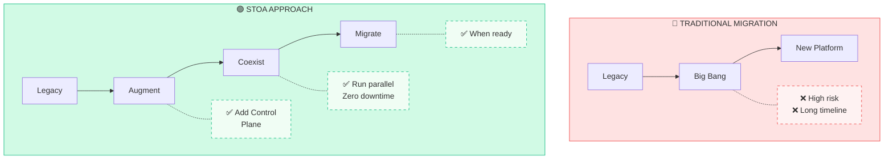

# Migration from Legacy Platforms

STOA Platform is designed to **augment, not replace** your existing API infrastructure. Our migration approach minimizes risk while delivering immediate value.

## Migration Philosophy

**Key principle:** Keep your existing gateway running. Add STOA as a control layer. Migrate traffic gradually.

---

## Supported Platforms

| Platform | Migration Guide | Complexity | Timeline |
|----------|-----------------|------------|----------|
| [IBM webMethods / DataPower](./ibm-webmethods) | Available | Medium | 4-8 weeks |
| [Oracle OAM / API Platform](./oracle-oam) | Available | Medium | 4-8 weeks |
| Kong OSS / Enterprise | Coming Soon | Low | 2-4 weeks |
| Google Apigee | Coming Soon | Medium | 4-6 weeks |
| AWS API Gateway | Planned | Low | 2-4 weeks |
| Azure API Management | Planned | Medium | 4-6 weeks |

---

## General Migration Steps

Regardless of source platform, migration follows these phases:

### Phase 1: Assessment (1-2 weeks)

1. **Inventory** — Catalog all APIs, consumers, and dependencies
2. **Analysis** — Identify integration patterns and protocols
3. **Planning** — Define migration waves and success criteria

**Deliverables:**
- API inventory spreadsheet
- Integration architecture diagram
- Migration wave plan

### Phase 2: Parallel Setup (2-4 weeks)

1. **Deploy STOA** — Install Control Plane and Gateway
2. **Federate Identity** — Connect Keycloak to existing IdP
3. **Import APIs** — Register existing APIs in STOA catalog
4. **Configure Routing** — Set up parallel traffic paths

**Deliverables:**
- STOA environment running
- Identity federation working
- Test APIs accessible via both paths

### Phase 3: Traffic Migration (2-4 weeks)

1. **Shadow Mode** — STOA receives copy of traffic, no impact
2. **Canary** — 1-5% of traffic through STOA
3. **Gradual** — Increase to 50%, 75%, 100%
4. **Cutover** — Full production traffic

**Deliverables:**
- Traffic metrics comparison
- Performance validation
- Rollback tested

### Phase 4: Optimization (Ongoing)

1. **Decommission Legacy** — Remove old routing when ready
2. **Enhance** — Add STOA-native features (rate limiting, analytics)
3. **Expand** — Onboard new APIs directly to STOA

---

## Risk Mitigation

### Rollback Strategy

Every migration phase includes a rollback plan:

| Phase | Rollback Action | Time to Rollback |
|-------|-----------------|------------------|
| Shadow | Disable shadow routing | Immediate |
| Canary | Revert traffic weight | < 1 minute |
| Gradual | Reduce STOA percentage | < 1 minute |
| Full | DNS/routing fallback | 5-15 minutes |

### Data Continuity

- **Configuration** — Version-controlled in Git
- **Metrics** — Historical data preserved in both systems
- **Logs** — Unified in OpenSearch regardless of source

---

## What You Keep

STOA migration doesn't require throwing away your investment:

| Asset | Status After Migration |
|-------|------------------------|
| Existing Gateway | Can continue running (hybrid mode) |
| API Definitions | Imported to STOA catalog |
| Identity Provider | Federated via Keycloak |
| Monitoring Stack | Integrated (Prometheus, Grafana) |
| Custom Policies | Translated to STOA format |

---

## What Changes

| Before | After |
|--------|-------|
| Manual API onboarding | Self-service portal |
| Scattered logs | Unified observability |
| Siloed metrics | Centralized dashboards |
| Point-to-point integrations | API catalog with discovery |
| Email-based access requests | Automated subscription workflow |

---

## Success Metrics

Track these KPIs during migration:

| Metric | Target |
|--------|--------|
| API Registration | 100% imported |
| Traffic Migration | 100% through STOA |
| Error Rate | ≤ pre-migration |
| Latency | ≤ pre-migration + 5ms |
| Developer Satisfaction | NPS improvement |

---

## Next Steps

Choose your source platform guide:

- [IBM webMethods / DataPower](./ibm-webmethods) — Software AG gateway migration
- [Oracle OAM / API Platform](./oracle-oam) — Oracle stack migration
- [Kong OSS / Enterprise](./kong) — Kong to STOA (coming soon)
- [Google Apigee](./apigee) — Apigee migration (coming soon)

Or [contact us](mailto:contact@gostoa.dev) for a custom migration assessment.
