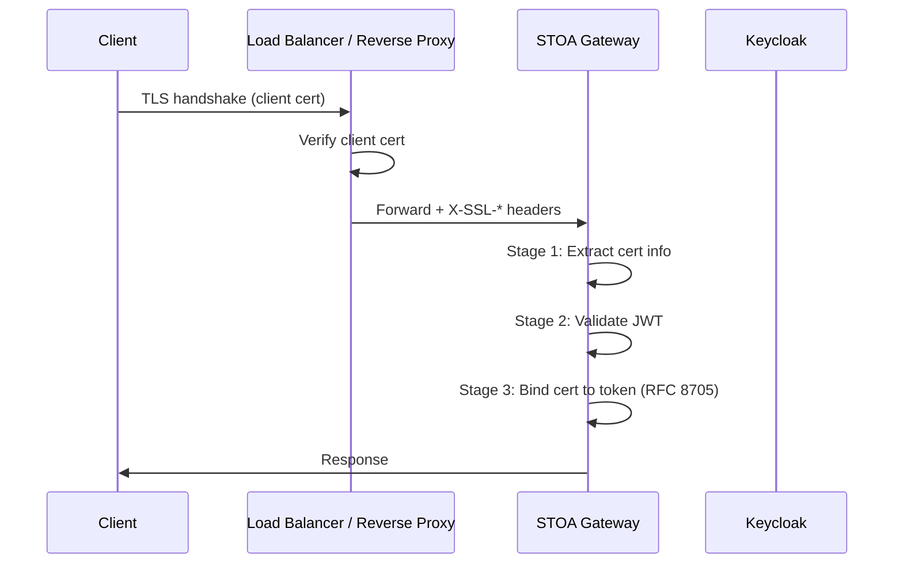

import EnvSetup from '@site/docs/_partials/_env-setup.mdx';

# mTLS Configuration

STOA Gateway supports mutual TLS (mTLS) with RFC 8705 certificate-bound token validation. Client certificates are validated at the gateway, and their fingerprints are bound to JWT tokens for end-to-end proof of possession.

## Architecture



The load balancer (nginx, HAProxy, F5) terminates TLS and forwards certificate details via `X-SSL-*` headers. The gateway validates these headers and binds them to JWT tokens.

## Configuration

### Environment Variables

| Variable | Default | Description |
|----------|---------|-------------|
| `STOA_MTLS_ENABLED` | `false` | Enable mTLS processing |
| `STOA_MTLS_REQUIRE_BINDING` | `true` | Require JWT `cnf` claim when cert present |
| `STOA_MTLS_TRUSTED_PROXIES` | (empty) | Comma-separated CIDRs of trusted proxies |
| `STOA_MTLS_ALLOWED_ISSUERS` | (empty) | Comma-separated issuer DNs |
| `STOA_MTLS_REQUIRED_ROUTES` | (empty) | Glob patterns for routes requiring certs |
| `STOA_MTLS_TENANT_FROM_DN` | `true` | Extract tenant from certificate subject DN |

### Header Mapping

The gateway reads certificate data from these headers (configurable):

| Header | Default | Content |
|--------|---------|---------|
| `X-SSL-Client-Verify` | -- | `SUCCESS` if cert verified |
| `X-SSL-Client-Fingerprint` | -- | SHA-256 fingerprint |
| `X-SSL-Client-S-DN` | -- | Subject DN (RFC 2253) |
| `X-SSL-Client-I-DN` | -- | Issuer DN |
| `X-SSL-Client-Serial` | -- | Serial number (hex) |
| `X-SSL-Client-NotBefore` | -- | Validity start |
| `X-SSL-Client-NotAfter` | -- | Validity end |

## RFC 8705 Certificate-Bound Tokens

When a client presents both a certificate and a JWT, the gateway verifies that the token was issued for that specific certificate:

1. Extract certificate fingerprint (SHA-256) from `X-SSL-Client-Fingerprint`
2. Extract `cnf.x5t#S256` claim from the JWT
3. Compare using timing-safe comparison (`subtle::ConstantTimeEq`)
4. If mismatch: reject with `403 MTLS_BINDING_MISMATCH`

### JWT Token with cnf Claim

```json
{
  "sub": "user-123",
  "iss": "https://auth.<YOUR_DOMAIN>/realms/stoa",
  "cnf": {
    "x5t#S256": "base64url-encoded-sha256-thumbprint"
  }
}
```

### Fingerprint Format Normalization

The gateway automatically normalizes fingerprints from three formats:

| Input Format | Example | Output |
|-------------|---------|--------|
| Hex with colons | `a1:b2:c3:...` | `a1b2c3...` (lowercase hex) |
| Raw hex | `A1B2C3...` | `a1b2c3...` (lowercase hex) |
| Base64url | `obsz...` | Decoded to hex |

## Phased Rollout

### Phase 1: Monitoring Only

Enable mTLS processing without enforcement:

```bash
STOA_MTLS_ENABLED=true
STOA_MTLS_REQUIRE_BINDING=false
```

Certificates are extracted and logged, but requests without certificates are still allowed.

### Phase 2: Required on Test Routes

```bash
STOA_MTLS_ENABLED=true
STOA_MTLS_REQUIRE_BINDING=true
STOA_MTLS_REQUIRED_ROUTES=/api/v1/test-mtls/*
```

### Phase 3: Production Enforcement

```bash
STOA_MTLS_ENABLED=true
STOA_MTLS_REQUIRE_BINDING=true
STOA_MTLS_REQUIRED_ROUTES=/api/v1/payments/*,/api/v1/transfers/*
STOA_MTLS_TRUSTED_PROXIES=10.0.1.0/24
STOA_MTLS_ALLOWED_ISSUERS=CN=STOA Intermediate CA,O=STOA Platform,C=FR
```

## Trusted Proxy Configuration

When `STOA_MTLS_TRUSTED_PROXIES` is set, the gateway only accepts `X-SSL-*` headers from requests originating from trusted IPs:

```bash
# Trust specific CIDR ranges
STOA_MTLS_TRUSTED_PROXIES=10.0.0.0/8,172.16.0.0/12

# Trust single IP
STOA_MTLS_TRUSTED_PROXIES=10.0.1.50

# Empty = accept from all sources (dev only)
STOA_MTLS_TRUSTED_PROXIES=
```

Untrusted sources sending `X-SSL-*` headers receive `403 MTLS_UNTRUSTED_PROXY`.

## Error Responses

| Error Code | HTTP Status | Cause |
|------------|-------------|-------|
| `MTLS_CERT_REQUIRED` | 401 | Certificate required on this route |
| `MTLS_CERT_INVALID` | 403 | Verify header is not `SUCCESS` |
| `MTLS_CERT_EXPIRED` | 403 | Certificate `NotAfter` is in the past |
| `MTLS_ISSUER_DENIED` | 403 | Issuer not in allowed list |
| `MTLS_BINDING_REQUIRED` | 403 | JWT lacks `cnf` claim (binding required) |
| `MTLS_BINDING_MISMATCH` | 403 | Certificate fingerprint does not match JWT |
| `MTLS_UNTRUSTED_PROXY` | 403 | X-SSL-* headers from untrusted IP |

## Downstream Headers

After successful validation, the gateway forwards these headers to backend services:

```
X-Authenticated-Client-Fingerprint: {first 16 chars of fingerprint}
X-Authenticated-Client-Subject: {subject DN}
```

## Related

- [Security Hardening](/docs/admin/security-hardening) -- Production security
- [Authentication Guide](/docs/guides/authentication) -- OIDC flow
- [Security Configuration](/docs/reference/security-configuration) -- JWT and CORS settings
- [Consumer Onboarding](/docs/guides/consumer-onboarding) -- mTLS certificate provisioning
