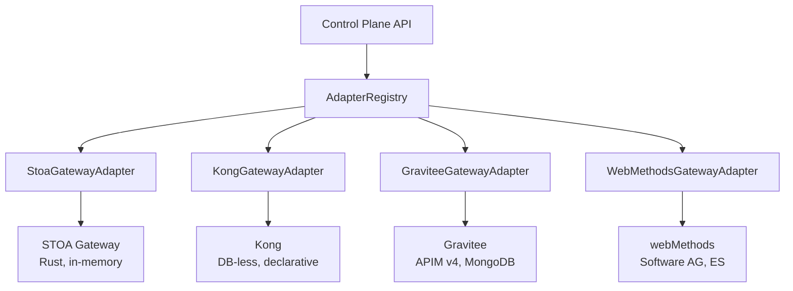
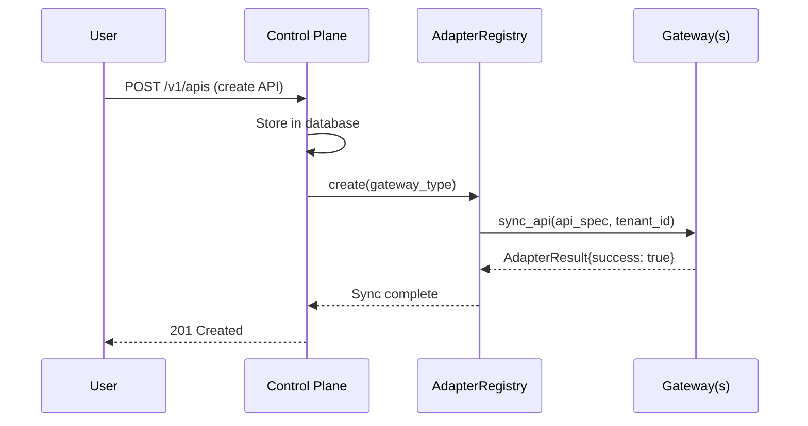
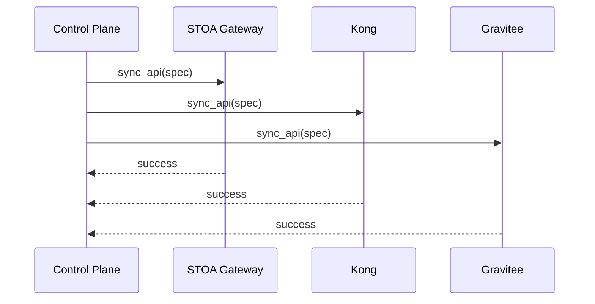

import EnvSetup from '@site/docs/_partials/_env-setup.mdx';

# Multi-Gateway Orchestration

STOA's Control Plane orchestrates multiple API gateways through a unified **Adapter pattern**. Register any supported gateway, and the Control Plane handles API synchronization, policy enforcement, and consumer provisioning across all of them.

## Architecture



## Supported Gateways

| Gateway | Type | Storage | Admin API | Adapter Status |
|---------|------|---------|-----------|----------------|
| **STOA** | Rust, axum | In-memory | REST (`/admin/*`) | Full support |
| **Kong** | Lua, OpenResty | DB-less YAML | REST (`:8001`) | Full support |
| **Gravitee** | Java | MongoDB + ES | REST (`:8083`) | Full support |
| **webMethods** | Java | Elasticsearch | REST (`:5555`) | Full support (16/16 methods) |

## Adapter Interface

Every gateway adapter implements 16 abstract methods organized in 5 categories:

### Lifecycle (3 methods)

| Method | Purpose | Returns |
|--------|---------|---------|
| `health_check()` | Verify gateway connectivity | `AdapterResult` |
| `connect()` | Initialize connection/session | `None` |
| `disconnect()` | Clean up resources | `None` |

### API Management (3 methods)

| Method | Purpose | Returns |
|--------|---------|---------|
| `sync_api(api_spec, tenant_id)` | Create or update an API route | `AdapterResult` |
| `delete_api(api_id)` | Remove an API route | `AdapterResult` |
| `list_apis()` | List all managed APIs | `list[dict]` |

### Policy Management (3 methods)

| Method | Purpose | Returns |
|--------|---------|---------|
| `upsert_policy(policy_spec)` | Create or update a policy (rate limit, CORS) | `AdapterResult` |
| `delete_policy(policy_id)` | Remove a policy | `AdapterResult` |
| `list_policies()` | List all managed policies | `list[dict]` |

### Consumer Management (3 methods)

| Method | Purpose | Returns |
|--------|---------|---------|
| `provision_application(app_spec)` | Register a consumer with credentials | `AdapterResult` |
| `deprovision_application(app_id)` | Remove a consumer | `AdapterResult` |
| `list_applications()` | List all managed consumers | `list[dict]` |

### Extended (4 methods, gateway-specific)

| Method | Purpose | Supported By |
|--------|---------|--------------|
| `upsert_auth_server(auth_spec)` | Configure OIDC provider | webMethods |
| `upsert_strategy(strategy_spec)` | Set auth strategy | webMethods |
| `upsert_scope(scope_spec)` | Define OAuth scopes | webMethods |
| `upsert_alias(alias_spec)` | Configure endpoint alias | webMethods |
| `apply_config(config_spec)` | Apply full configuration | webMethods |
| `export_archive()` | Export gateway backup | webMethods |

Unsupported methods return `AdapterResult(success=False, error="Not supported by <gateway>")`.

### AdapterResult

All adapter methods return a standardized result:

```python
@dataclass
class AdapterResult:
    success: bool
    resource_id: str | None = None
    data: dict | None = None
    error: str | None = None
```

## Gateway Registration

Register gateways via the Control Plane API or CRD:

### Via API

<EnvSetup />

```bash
curl -X POST "${STOA_API_URL}/v1/gateways" \
  -H "Authorization: Bearer ${TOKEN}" \
  -H "Content-Type: application/json" \
  -d '{
    "name": "kong-production",
    "display_name": "Kong Production (GRA)",
    "gateway_type": "kong",
    "base_url": "http://kong-admin:8001",
    "environment": "prod",
    "capabilities": ["rest", "rate_limiting"]
  }'
```

### Via CRD

```yaml
apiVersion: gostoa.dev/v1alpha1
kind: GatewayInstance
metadata:
  name: kong-production
  namespace: stoa-system
spec:
  displayName: Kong Production (GRA)
  gatewayType: kong
  environment: prod
  baseUrl: http://kong-admin:8001
  capabilities: [rest, rate_limiting]
```

### Gateway Types

Valid `gateway_type` values:

| Type | Description |
|------|-------------|
| `stoa` | STOA Gateway (generic) |
| `stoa_edge_mcp` | STOA in edge-mcp mode |
| `stoa_sidecar` | STOA in sidecar mode |
| `stoa_proxy` | STOA in proxy mode |
| `stoa_shadow` | STOA in shadow mode |
| `kong` | Kong (DB-less) |
| `gravitee` | Gravitee APIM v4 |
| `webmethods` | Software AG webMethods |
| `apigee` | Google Apigee |
| `aws_apigateway` | AWS API Gateway |

## Per-Gateway Details

### STOA Gateway (Rust)

| Aspect | Detail |
|--------|--------|
| Admin API | `POST /admin/apis`, `POST /admin/policies`, `GET /admin/health` |
| Auth | Bearer token (`admin_api_token`) |
| Storage | In-memory (Control Plane is source of truth) |
| Idempotency | `sync_api` and `upsert_policy` are both upserts |
| Key behavior | All state lost on restart; CP API re-syncs automatically |

```bash
# Health check
curl "${STOA_GATEWAY_URL}/admin/health" \
  -H "Authorization: Bearer ${ADMIN_TOKEN}"
```

### Kong (DB-less)

| Aspect | Detail |
|--------|--------|
| Admin API | `GET /services`, `GET /plugins`, `POST /config` |
| Auth | `Kong-Admin-Token` header |
| Storage | Declarative YAML via `POST /config` (atomic reload) |
| State pattern | Read current → merge changes → POST full config |
| Config version | `_format_version: "3.0"` required |

Kong DB-less mode makes the Admin API read-only for individual writes. All mutations follow the read-merge-post pattern:

```
1. GET /services + /plugins + /consumers → current state
2. Merge desired change (upsert by name/tag)
3. POST /config with full declarative payload → atomic reload
```

### Gravitee (APIM v4)

| Aspect | Detail |
|--------|--------|
| Management API | `/management/v2/environments/DEFAULT/apis` |
| Auth | Basic auth (configurable) |
| Storage | MongoDB + Elasticsearch (full CRUD) |
| API lifecycle | `CREATED → PUBLISHED → STARTED → DEPLOYED` |
| Plans | Rate limiting via Plans with flows (not standalone policies) |

Gravitee APIs require explicit lifecycle transitions:

```
1. POST /apis (create, V4 definition)
2. POST /apis/{id}/_start (start)
3. POST /apis/{id}/deployments (deploy)
```

### webMethods (Software AG)

| Aspect | Detail |
|--------|--------|
| Admin API | `/rest/apigateway/*` |
| Auth | Basic auth (`Administrator:manage`) |
| Storage | Elasticsearch (internal) |
| Feature set | Full 16/16 methods (most complete adapter) |
| OpenAPI import | Only 3.0.x supported (not 3.1.0) |

webMethods is the most feature-complete adapter, supporting OIDC integration, endpoint aliases, configuration management, and full backup/export.

## Sync Workflow

When you create or update an API in the Control Plane, it syncs to all bound gateways:



For multi-gateway setups, the Control Plane syncs to each bound gateway:



## Adding a New Gateway Adapter

1. Copy `control-plane-api/src/adapters/template/` to `adapters/<new_gateway>/`
2. Implement all 16 abstract methods in `adapter.py`
3. Create spec translation functions in `mappers.py`
4. Register in `adapters/registry.py`
5. Add the type to the `gateway_type_enum` database migration
6. Write tests (~30+ unit tests with mocked HTTP calls)

### Adapter Contract Rules

- All methods **must be idempotent** (calling twice produces the same result)
- Return `AdapterResult(success=False, error="...")` for failures; never raise exceptions
- Use `httpx.AsyncClient` for HTTP calls (async, connection pooling)
- Log warnings for non-critical failures (e.g., plan not subscribable)

## Troubleshooting

| Problem | Cause | Fix |
|---------|-------|-----|
| `sync_api` returns 404 | Gateway not registered | Register via API or CRD first |
| Kong config reload fails | Invalid service in payload | All-or-nothing: one bad service breaks the reload |
| Gravitee API not reachable | API not started/deployed | Run the full lifecycle: create → plan → publish → deploy → start |
| webMethods import fails | OpenAPI 3.1.0 spec | Convert to 3.0.3: `sed 's/3.1.0/3.0.3/'` |
| Adapter returns "Not supported" | Extended method on non-webMethods | Expected; only webMethods supports all 16 methods |

## Related

- [Gateway Modes](/docs/guides/gateway-modes) -- STOA gateway deployment modes
- [Installation Guide](/docs/admin/installation) -- Helm chart and CRDs
- [Gateway Admin API](/docs/api/gateway-admin-api) -- STOA gateway admin endpoints
- [Architecture Overview](/docs/concepts/architecture) -- Platform architecture
- [Hybrid Deployment](/docs/deployment/hybrid) -- Multi-cloud gateway deployment
