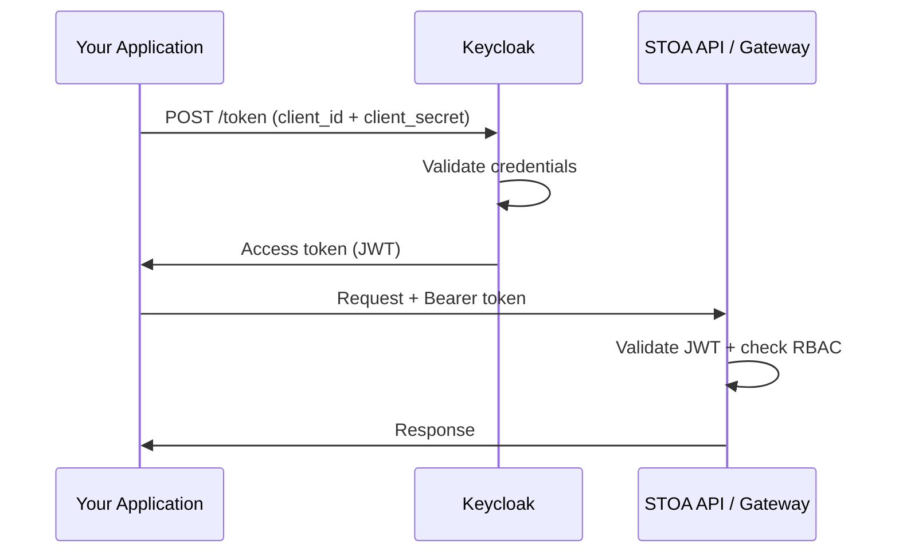

import EnvSetup from '@site/docs/_partials/_env-setup.mdx';

# Service Accounts

Service accounts provide machine-to-machine (M2M) access to STOA APIs using the OAuth2 `client_credentials` grant. They are ideal for CI/CD pipelines, backend services, and automation scripts.

## How It Works



1. Your application authenticates with Keycloak using `client_id` and `client_secret`
2. Keycloak returns a JWT access token
3. The token is used as a Bearer token for API requests
4. The service account inherits the RBAC role of the user who created it

## Creating a Service Account

### Via API

<EnvSetup />

```bash
curl -X POST "${STOA_API_URL}/v1/service-accounts" \
  -H "Authorization: Bearer $TOKEN" \
  -H "Content-Type: application/json" \
  -d '{
    "name": "ci-pipeline",
    "description": "CI/CD pipeline for API deployments"
  }'
```

Response (credentials shown once):

```json
{
  "id": "sa_abc123",
  "name": "ci-pipeline",
  "client_id": "sa-ci-pipeline-a1b2c3",
  "client_secret": "generated-secret-shown-once",
  "created_at": "2026-02-13T10:00:00Z"
}
```

**Save the `client_secret` immediately** — it cannot be retrieved after creation.

### Via Portal

1. Navigate to **Service Accounts** in the Portal sidebar
2. Click **Create Service Account**
3. Enter a name and optional description
4. Click **Create**
5. Copy the `client_id` and `client_secret` (shown once)

## Using a Service Account

### Get an Access Token

```bash
TOKEN=$(curl -s -X POST "${STOA_AUTH_URL}/realms/stoa/protocol/openid-connect/token" \
  -d "grant_type=client_credentials" \
  -d "client_id=sa-ci-pipeline-a1b2c3" \
  -d "client_secret=your-client-secret" \
  | jq -r '.access_token')
```

### Make API Requests

```bash
# List APIs
curl -s "${STOA_API_URL}/v1/apis" \
  -H "Authorization: Bearer $TOKEN"

# Call a tool via MCP Gateway
curl -s "${STOA_GATEWAY_URL}/v1/tools/payment-tool/execute" \
  -H "Authorization: Bearer $TOKEN" \
  -H "Content-Type: application/json" \
  -d '{"input": {"amount": 100}}'
```

### Python Example

```python
import httpx

async def get_token(client_id: str, client_secret: str) -> str:
    async with httpx.AsyncClient() as client:
        response = await client.post(
            f"{auth_url}/realms/stoa/protocol/openid-connect/token",
            data={
                "grant_type": "client_credentials",
                "client_id": client_id,
                "client_secret": client_secret,
            },
        )
        return response.json()["access_token"]
```

## RBAC Inheritance

Service accounts inherit the role of the user who created them:

| Creator Role | Service Account Permissions |
|-------------|---------------------------|
| `cpi-admin` | Full platform access |
| `tenant-admin` | Own tenant: read + write |
| `devops` | Own tenant: deploy + promote |
| `viewer` | Read-only access |

Service accounts are scoped to the same tenant as their creator.

## Secret Rotation

### Regenerate a Secret

```bash
curl -X POST "${STOA_API_URL}/v1/service-accounts/{sa_id}/regenerate-secret" \
  -H "Authorization: Bearer $TOKEN"
```

Response:

```json
{
  "client_id": "sa-ci-pipeline-a1b2c3",
  "client_secret": "new-generated-secret"
}
```

The old secret is invalidated immediately. Update all systems using this service account before rotating.

### Rotation Best Practices

1. **Rotate every 90 days** — align with your secret rotation policy
2. **Update consumers first** — deploy the new secret to all clients before rotating
3. **Use environment variables** — never hardcode secrets in source code
4. **Monitor token failures** — a spike in 401 errors after rotation indicates missed updates

## Managing Service Accounts

### List Service Accounts

```bash
curl "${STOA_API_URL}/v1/service-accounts" \
  -H "Authorization: Bearer $TOKEN"
```

### Delete a Service Account

```bash
curl -X DELETE "${STOA_API_URL}/v1/service-accounts/{sa_id}" \
  -H "Authorization: Bearer $TOKEN"
```

Deletion removes the Keycloak client and invalidates all tokens immediately.

## CI/CD Integration

### GitHub Actions

```yaml
jobs:
  deploy-api:
    steps:
      - name: Get STOA token
        run: |
          TOKEN=$(curl -s -X POST "$STOA_AUTH_URL/realms/stoa/protocol/openid-connect/token" \
            -d "grant_type=client_credentials" \
            -d "client_id=${{ secrets.STOA_CLIENT_ID }}" \
            -d "client_secret=${{ secrets.STOA_CLIENT_SECRET }}" \
            | jq -r '.access_token')
          echo "STOA_TOKEN=$TOKEN" >> $GITHUB_ENV

      - name: Sync API spec
        run: |
          curl -X POST "$STOA_API_URL/v1/apis/sync" \
            -H "Authorization: Bearer $STOA_TOKEN" \
            -H "Content-Type: application/json" \
            -d @openapi.json
```

### Token Caching

Access tokens have a default TTL of 5 minutes. For long-running processes, refresh the token before expiry:

```bash
# Check token expiry
echo $TOKEN | cut -d. -f2 | base64 -d 2>/dev/null | jq '.exp'
```

## Related

- [Authentication Guide](/docs/guides/authentication) -- OIDC flow for interactive users
- [RBAC Permissions](/docs/reference/rbac-permissions) -- Role matrix
- [Keycloak Administration](/docs/admin/keycloak) -- Client configuration
- [Security Configuration](/docs/reference/security-configuration) -- JWT settings
