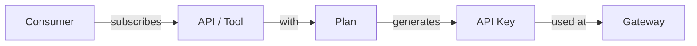
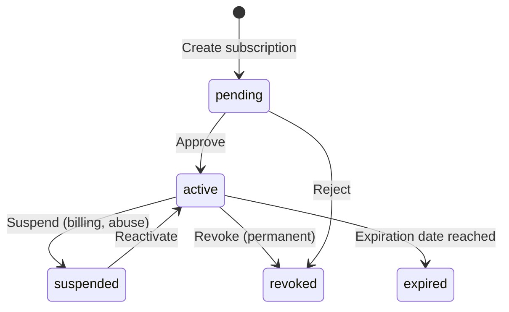

import EnvSetup from '@site/docs/_partials/_env-setup.mdx';

# Subscription Lifecycle

How subscriptions flow from request to active API key — with approval workflows, state transitions, and gateway provisioning.

## Overview

Every API or MCP tool access in STOA goes through a subscription. Subscriptions connect a **consumer** (who wants access) to an **API** (what they want to access) via a **plan** (how much access they get).



## Subscription States



| State | Access | Transition From | Transition To |
|-------|--------|----------------|---------------|
| **pending** | None — awaiting approval | `[*]` | `active`, `revoked` |
| **active** | Full API access | `pending`, `suspended` | `suspended`, `revoked`, `expired` |
| **suspended** | Blocked temporarily | `active` | `active`, `revoked` |
| **revoked** | Permanently cancelled | `pending`, `active`, `suspended` | Terminal |
| **expired** | Auto-expired | `active` | Terminal |

## API Key Format

When a subscription is approved, STOA generates a unique API key:

```
stoa_sk_a1b2c3d4e5f6a1b2c3d4e5f6a1b2c3d4
└──────┘ └──────────────────────────────────┘
 prefix   32 hex characters (128 bits entropy)
```

| Variant | Prefix | Usage |
|---------|--------|-------|
| REST API subscription | `stoa_sk_` | Standard API access via `X-API-Key` header |
| MCP server subscription | `stoa_mcp_` | MCP tool access via gateway |

**Security**:
- The full API key is returned **once** at creation — store it securely
- STOA stores only a **SHA-256 hash** — the key cannot be recovered
- The **prefix** (`stoa_sk_a1b2`) is stored for identification in dashboards

<EnvSetup />

## Create a Subscription

### Via REST API

```bash
curl -X POST "${STOA_API_URL}/v1/subscriptions" \
  -H "Authorization: Bearer ${TOKEN}" \
  -H "Content-Type: application/json" \
  -d '{
    "api_id": "billing-api",
    "plan_name": "gold",
    "application_name": "my-payment-app"
  }'
```

**Response:**

```json
{
  "id": "sub-uuid-123",
  "status": "pending",
  "api_key": "stoa_sk_a1b2c3d4e5f6a1b2c3d4e5f6a1b2c3d4",
  "api_key_prefix": "stoa_sk_a1b2",
  "api_name": "billing-api",
  "plan_name": "gold",
  "created_at": "2026-02-13T10:00:00Z"
}
```

:::warning Save Your API Key
The `api_key` field is only returned once. Copy it to a secure location (e.g., Infisical, environment variable). It cannot be retrieved later — only rotated.
:::

### Via Developer Portal

1. Browse the **API Catalog** at `portal.<YOUR_DOMAIN>`
2. Click **Subscribe** on any API
3. Select a plan (e.g., Gold, Silver, Community)
4. Name your application
5. Click **Request Access**
6. Copy your API key from the confirmation screen

## Approval Workflows

### Manual Approval (Default)

When a plan has `requires_approval: true`, subscriptions start in **pending** state:

```bash
# Admin: List pending subscriptions for your tenant
curl "${STOA_API_URL}/v1/subscriptions/tenant/${TENANT_ID}/pending" \
  -H "Authorization: Bearer ${TOKEN}"

# Admin: Approve a subscription
curl -X POST "${STOA_API_URL}/v1/subscriptions/${SUB_ID}/approve" \
  -H "Authorization: Bearer ${TOKEN}"
```

### Auto-Approval

Plans can define roles that bypass manual approval:

```json
{
  "slug": "community",
  "name": "Community Plan",
  "requires_approval": false,
  "auto_approve_roles": ["tenant-admin", "devops"]
}
```

When `requires_approval` is `false`, subscriptions go directly to **active** and the API key is usable immediately.

## State Transitions

### Suspend a Subscription

Temporarily blocks access (e.g., billing issues, abuse detection):

```bash
curl -X POST "${STOA_API_URL}/v1/subscriptions/${SUB_ID}/suspend" \
  -H "Authorization: Bearer ${TOKEN}" \
  -H "Content-Type: application/json" \
  -d '{"reason": "Payment overdue"}'
```

The consumer receives a `401 Unauthorized` error on API calls. The API key is not deleted — it can be reactivated.

### Reactivate a Subscription

```bash
curl -X POST "${STOA_API_URL}/v1/subscriptions/${SUB_ID}/reactivate" \
  -H "Authorization: Bearer ${TOKEN}"
```

### Revoke a Subscription

Permanently cancels access — cannot be undone:

```bash
curl -X POST "${STOA_API_URL}/v1/subscriptions/${SUB_ID}/revoke" \
  -H "Authorization: Bearer ${TOKEN}" \
  -H "Content-Type: application/json" \
  -d '{"reason": "Terms of service violation"}'
```

## Gateway Provisioning

When a subscription is approved, STOA provisions the API route on the gateway. This process is tracked via a separate provisioning status:

| Provisioning Status | Meaning |
|---------------------|---------|
| `none` | No gateway provisioning needed |
| `pending` | Queued for provisioning |
| `provisioning` | Route being created on gateway |
| `ready` | Route active — traffic flowing |
| `failed` | Provisioning error (check `provisioning_error`) |
| `deprovisioning` | Route being removed |
| `deprovisioned` | Route removed from gateway |

## Using Your API Key

Once your subscription is **active** and provisioning is **ready**, use the API key:

```bash
curl "${STOA_GATEWAY_URL}/apis/${TENANT_ID}/${API_NAME}/v1/endpoint" \
  -H "X-API-Key: stoa_sk_a1b2c3d4e5f6a1b2c3d4e5f6a1b2c3d4"
```

The gateway validates the key, checks the subscription status, and applies the plan's rate limits before forwarding to the backend.

## Subscription Plans

Plans define the quotas and approval rules for subscriptions:

| Field | Type | Description |
|-------|------|-------------|
| `slug` | string | Unique identifier per tenant (e.g., `gold`) |
| `rate_limit_per_second` | int | Max requests per second |
| `rate_limit_per_minute` | int | Max requests per minute |
| `daily_request_limit` | int | Max requests per day |
| `monthly_request_limit` | int | Max requests per month |
| `burst_limit` | int | Max concurrent requests |
| `requires_approval` | bool | Whether admin must approve |
| `auto_approve_roles` | list | Roles that skip approval |

### Example Plans

| Plan | Rate/min | Daily | Monthly | Approval |
|------|----------|-------|---------|----------|
| Community | 60 | 10,000 | 100,000 | Auto |
| Silver | 300 | 50,000 | 1,000,000 | Auto |
| Gold | 1,000 | 500,000 | 10,000,000 | Manual |
| Enterprise | Custom | Custom | Custom | Manual |

## Related

- [API Key Rotation](/docs/guides/api-key-rotation) — Rotate keys with zero downtime
- [Consumer Onboarding](/docs/guides/consumer-onboarding) — Register API consumers
- [Quota Enforcement](/docs/reference/quotas) — Rate limits and quotas
- [Subscriptions Overview](/docs/guides/subscriptions) — General subscription concepts
