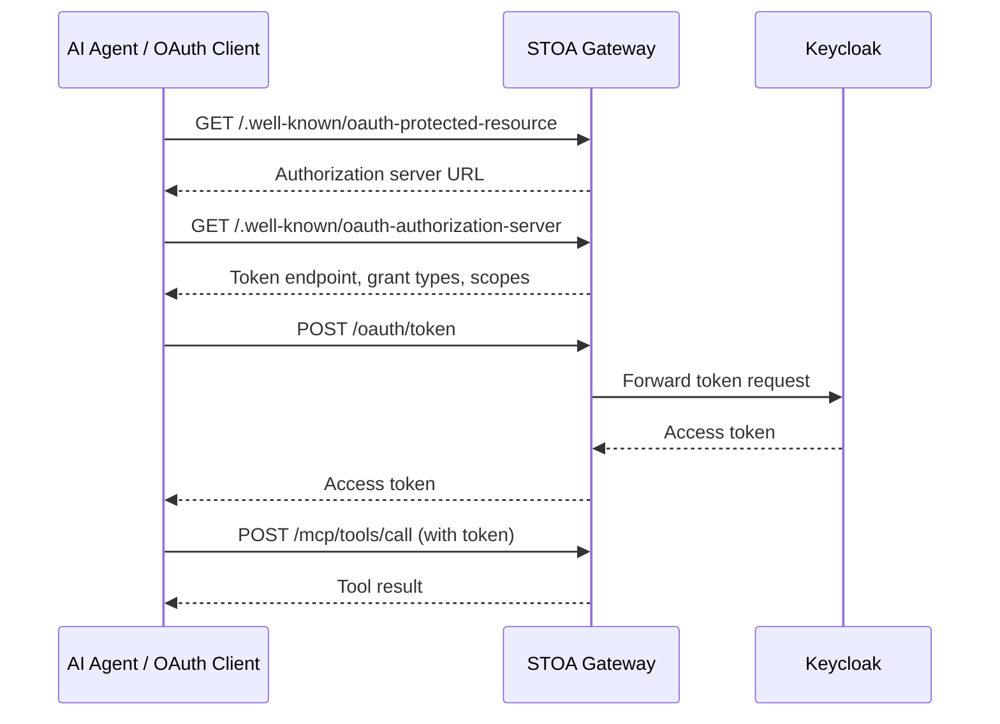

# OAuth 2.1 Discovery

STOA implements OAuth 2.1 discovery standards so AI agents and OAuth clients can automatically discover authentication endpoints and obtain tokens — without hardcoding Keycloak URLs.

## Why Discovery Matters

Without discovery, every MCP client would need to know:
- The Keycloak URL
- The realm name
- The token endpoint path
- The supported grant types

With discovery, the client only needs the gateway URL (`mcp.<YOUR_DOMAIN>`) and can discover everything else automatically.



---

## Protected Resource Metadata (RFC 9728)

### GET /.well-known/oauth-protected-resource

Tells OAuth clients that this resource is protected and where to authenticate.

```bash
curl "https://mcp.<YOUR_DOMAIN>/.well-known/oauth-protected-resource"
```

**Response:**

```json
{
  "resource": "https://mcp.<YOUR_DOMAIN>",
  "authorization_servers": [
    "https://auth.<YOUR_DOMAIN>/realms/stoa"
  ],
  "scopes_supported": [
    "openid",
    "profile",
    "email",
    "stoa:read",
    "stoa:write",
    "stoa:admin"
  ],
  "bearer_methods_supported": ["header"]
}
```

| Field | Description |
|-------|-------------|
| `resource` | The protected resource identifier (gateway URL) |
| `authorization_servers` | List of authorization servers that can issue tokens |
| `scopes_supported` | OAuth scopes the resource understands |
| `bearer_methods_supported` | How to present tokens (`header` = Authorization header) |

---

## Authorization Server Metadata (RFC 8414)

### GET /.well-known/oauth-authorization-server

Returns authorization server metadata. Token and registration endpoints point to the **gateway** (not Keycloak directly), enabling the gateway to proxy these requests.

```bash
curl "https://mcp.<YOUR_DOMAIN>/.well-known/oauth-authorization-server"
```

**Response:**

```json
{
  "issuer": "https://auth.<YOUR_DOMAIN>/realms/stoa",
  "authorization_endpoint": "https://auth.<YOUR_DOMAIN>/realms/stoa/protocol/openid-connect/auth",
  "token_endpoint": "https://mcp.<YOUR_DOMAIN>/oauth/token",
  "registration_endpoint": "https://mcp.<YOUR_DOMAIN>/oauth/register",
  "jwks_uri": "https://auth.<YOUR_DOMAIN>/realms/stoa/protocol/openid-connect/certs",
  "scopes_supported": [
    "openid", "profile", "email",
    "stoa:read", "stoa:write", "stoa:admin"
  ],
  "response_types_supported": ["code"],
  "grant_types_supported": [
    "authorization_code",
    "client_credentials",
    "refresh_token"
  ],
  "token_endpoint_auth_methods_supported": [
    "none",
    "client_secret_basic",
    "client_secret_post"
  ],
  "code_challenge_methods_supported": ["S256"],
  "subject_types_supported": ["public"]
}
```

Key points:
- `token_endpoint` points to the **gateway** (`/oauth/token`), not Keycloak directly
- `registration_endpoint` points to the **gateway** (`/oauth/register`) for DCR
- `authorization_endpoint` points to **Keycloak** (user-facing login page)
- PKCE S256 is required for authorization code flows

---

## OpenID Connect Discovery

### GET /.well-known/openid-configuration

Proxies Keycloak's OIDC discovery document, overriding token and registration endpoints to route through the gateway.

```bash
curl "https://mcp.<YOUR_DOMAIN>/.well-known/openid-configuration"
```

The response is Keycloak's standard OIDC discovery with two overrides:
- `token_endpoint` → `https://mcp.<YOUR_DOMAIN>/oauth/token`
- `registration_endpoint` → `https://mcp.<YOUR_DOMAIN>/oauth/register`

| Status | Meaning |
|--------|---------|
| `200 OK` | Discovery document returned |
| `502 Bad Gateway` | Keycloak unreachable |
| `503 Service Unavailable` | Keycloak not configured |

---

## Token Proxy

### POST /oauth/token

Transparent proxy to Keycloak's token endpoint. The gateway forwards the request body as-is and returns the Keycloak response.

**Client Credentials Grant:**

```bash
curl -X POST "https://mcp.<YOUR_DOMAIN>/oauth/token" \
  -H "Content-Type: application/x-www-form-urlencoded" \
  -d "grant_type=client_credentials" \
  -d "client_id=my-app" \
  -d "client_secret=my-secret"
```

**Authorization Code Grant (with PKCE):**

```bash
curl -X POST "https://mcp.<YOUR_DOMAIN>/oauth/token" \
  -H "Content-Type: application/x-www-form-urlencoded" \
  -d "grant_type=authorization_code" \
  -d "code=AUTH_CODE" \
  -d "client_id=my-app" \
  -d "code_verifier=PKCE_VERIFIER" \
  -d "redirect_uri=https://myapp.example.com/callback"
```

**Response:**

```json
{
  "access_token": "eyJhbGciOiJSUzI1NiIs...",
  "token_type": "Bearer",
  "expires_in": 3600,
  "refresh_token": "refresh-token-xyz",
  "scope": "openid profile email stoa:read"
}
```

| Status | Meaning |
|--------|---------|
| `200 OK` | Token issued |
| `400 Bad Request` | Invalid grant or parameters |
| `401 Unauthorized` | Invalid client credentials |
| `502 Bad Gateway` | Keycloak unreachable |

---

## Dynamic Client Registration (DCR)

### POST /oauth/register

Proxy to Keycloak's DCR endpoint. After registration, the gateway automatically patches the client to be **public** (no client_secret) with **PKCE S256** support — required for AI agents like Claude.ai.

```bash
curl -X POST "https://mcp.<YOUR_DOMAIN>/oauth/register" \
  -H "Content-Type: application/json" \
  -d '{
    "client_name": "claude-mcp-connector",
    "application_type": "web",
    "grant_types": ["authorization_code"],
    "response_types": ["code"],
    "token_endpoint_auth_method": "none",
    "redirect_uris": ["https://claude.ai/oauth/callback"]
  }'
```

**Response (201 Created):**

```json
{
  "client_id": "new-client-abc123",
  "client_name": "claude-mcp-connector",
  "application_type": "web",
  "grant_types": ["authorization_code"],
  "response_types": ["code"],
  "registration_access_token": "rat-xyz",
  "registration_client_uri": "https://auth.<YOUR_DOMAIN>/..."
}
```

### Post-Registration PKCE Patch

After successful registration, the gateway automatically:
1. Obtains an admin token from Keycloak
2. Finds the newly created client
3. Patches it to set `publicClient: true` and `pkce.code.challenge.method: S256`

This ensures AI agents can authenticate using the authorization code flow with PKCE, without needing a client secret.

| Status | Meaning |
|--------|---------|
| `201 Created` | Client registered |
| `400 Bad Request` | Invalid registration parameters |
| `403 Forbidden` | DCR disabled in Keycloak |
| `502 Bad Gateway` | Keycloak unreachable |

---

## AI Agent Integration Example

Here's how an AI agent (e.g., Claude.ai) discovers and authenticates with STOA:

1. **Discover**: `GET /.well-known/oauth-protected-resource` → finds authorization server
2. **Metadata**: `GET /.well-known/oauth-authorization-server` → finds token endpoint, supported flows
3. **Register** (first time): `POST /oauth/register` → gets `client_id`
4. **Authorize**: Redirect user to Keycloak login → get authorization code
5. **Token**: `POST /oauth/token` with code + PKCE verifier → get access token
6. **Call tools**: `POST /mcp/tools/call` with `Authorization: Bearer <token>`

## Related

- [MCP Gateway API](/docs/api/mcp-gateway) — MCP protocol endpoints
- [Authentication Guide](/docs/guides/authentication) — Keycloak and OIDC setup
- [RBAC Permissions](/docs/reference/rbac-permissions) — Roles and scopes
- [Security Configuration](/docs/reference/security-configuration) — Security best practices
