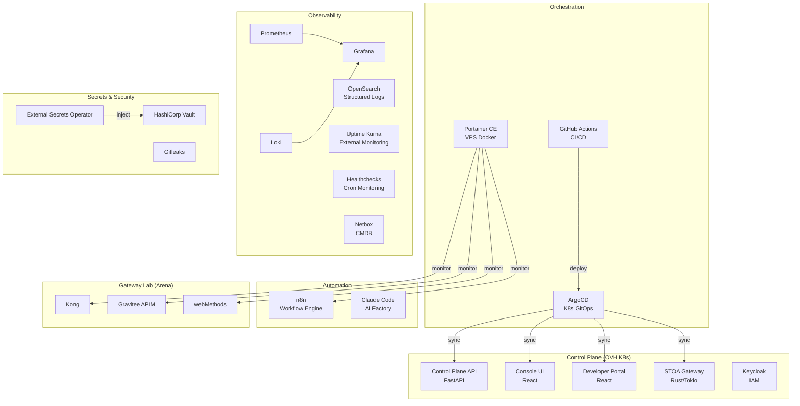

<!-- last verified: 2026-03 | review cadence: quarterly -->

# Platform Tooling Map

Complete inventory of the tools powering STOA Platform. Every tool is open-source or self-hosted — no vendor lock-in, full EU data sovereignty.

## Architecture Overview

## Compute & Hosting

| Tool | Version | Purpose | Why This One | Alternatives Considered |
|------|---------|---------|-------------|------------------------|
| **OVH Managed Kubernetes (MKS)** | K8s 1.31 | Production cluster (3x B2-15, GRA9) | EU sovereignty, DORA-ready, competitive pricing (~$135/mo) | AWS EKS (too expensive, US jurisdiction), Hetzner K3s (less managed) |
| **Contabo VPS** | 5x L (8vCPU/24GB) | HEGEMON AI workers | Best price/performance for compute-heavy AI workloads ($9/mo each) | Hetzner (5-server limit), OVH VPS (2x price) |
| **OVH VPS** | Various | Gateway lab (Kong, Gravitee, webMethods), services (n8n, Vault) | EU, low cost, dedicated per service for isolation | Shared K8s namespace (too coupled), AWS EC2 (overkill) |
| **Cloudflare** | Free plan | DNS, zero-trust access (CF Access) | Free, global anycast, Access policies for admin UIs | Route53 (paid), self-hosted DNS (maintenance burden) |

## Orchestration & Deployment

| Tool | Version | Purpose | Why This One | Alternatives Considered | ADR |
|------|---------|---------|-------------|------------------------|-----|
| **ArgoCD** | 2.13 | K8s GitOps continuous delivery | Auto-sync, self-heal, declarative, UI dashboard | Flux (no UI), Jenkins (not GitOps-native) | — |
| **Portainer CE** | 2.25 | VPS Docker fleet visibility + GitOps Stacks | Single pane of glass for all VPS containers, zero restructuring | Kamal (requires restructuring), Ansible-only (no UI) | — |
| **GitHub Actions** | — | CI pipelines (lint, test, build, security scan, deploy) | Native to GitHub, path-based triggers, reusable workflows | GitLab CI (repo migration), CircleCI (paid) | — |
| **Docker + GHCR** | — | Container builds + registry | Integrated with GHA, free for public repos | ECR (AWS lock-in), Docker Hub (rate limits) | — |

## Authentication & Security

| Tool | Version | Purpose | Why This One | Alternatives Considered | ADR |
|------|---------|---------|-------------|------------------------|-----|
| **Keycloak** | 26.5 | IAM, OIDC, multi-tenant RBAC, federation | OSS, full OIDC/SAML, multi-realm federation, FAPI 2.0 support | Auth0 (SaaS, US), Zitadel (less mature), Ory (complex) | [ADR-056](/docs/architecture/adr/adr-056-fapi-2-architecture) |
| **HashiCorp Vault** | 1.21 | Secrets management (KV v2) | Industry standard, ESO integration, AppRole + K8s auth | Infisical (less mature for K8s), AWS Secrets Manager (vendor lock-in) | — |
| **External Secrets Operator** | 0.12 | K8s Secret sync from Vault | Declarative, CRD-based, multi-backend | Sealed Secrets (no external store), SOPS (file-based) | — |
| **Gitleaks** | 8.x | Secret scanning (pre-commit + CI) | Fast, configurable allowlist, CI-native | TruffleHog (slower), git-secrets (less maintained) | — |
| **Trivy** | 0.58 | Container vulnerability scanning + SBOM | Multi-target (container, filesystem, SBOM), OSS | Grype (less features), Snyk (paid) | — |

## Observability & Monitoring

| Tool | Version | Purpose | Why This One | Alternatives Considered |
|------|---------|---------|-------------|------------------------|
| **Prometheus** | 2.48 | Metrics collection + alerting | Industry standard, PromQL, Pushgateway for batch jobs | Datadog (SaaS, expensive), VictoriaMetrics (less ecosystem) |
| **Grafana** | 10.x | Dashboards + visualization | Multi-datasource (Prom, Loki, OS), rich ecosystem | Kibana (OS-only), Datadog (SaaS) |
| **Loki** | 2.9 | Log aggregation (lightweight) | Grafana-native, label-based (no full-text index), low resource | ELK (heavy), Fluentd (more complex) |
| **OpenSearch** | 2.11 | Structured logs with multi-tenant RBAC (DLS/FLS) | Document-level security per tenant, OIDC auth, ISM policies | Elasticsearch (license change), Loki (no DLS) |
| **Fluent Bit** | 3.x | Log shipping (K8s DaemonSet) | Lightweight C-based, OpenSearch output plugin | Fluentd (Ruby, heavier), Promtail (Loki-only) |
| **Uptime Kuma** | 1.23 | External uptime monitoring | Self-hosted, simple, 21 monitors, status page | Pingdom (paid), UptimeRobot (SaaS, limited free) |
| **Healthchecks** | — | Cron job monitoring (dead man's switch) | Self-hosted, simple, integrates with alerting | Cronitor (SaaS), custom scripts (no UI) |
| **Netbox** | 4.5 | CMDB / IP address management / service catalog | Industry standard for network inventory, REST API | phpIPAM (less features), spreadsheets (not scalable) |
| **Portainer CE** | 2.25 | VPS container inventory + health | Real-time Docker state across all VPS (see Orchestration) | SSH scripts (no UI), ctop (single-host) |

## Automation & AI

| Tool | Version | Purpose | Why This One | Alternatives Considered |
|------|---------|---------|-------------|------------------------|
| **n8n** | 1.78 | Workflow automation (Slack, Linear, GHA integration) | Self-hosted, visual editor, 400+ integrations, webhook support | Zapier (SaaS, expensive), Make (SaaS), Temporal (overkill) |
| **Claude Code** | Opus 4.6 | AI Factory (code generation, CI, reviews, deployment) | Best reasoning for complex multi-file tasks, 1M context | Cursor (IDE-only), Copilot (less autonomous), Aider (less capable) |
| **Linear** | — | Issue tracking, sprint management | Fast, keyboard-first, great API, MCP integration | Jira (bloated), GitHub Issues (limited) |

## Gateway Lab (Arena)

These gateways run on dedicated VPS servers for the [Gateway Arena benchmark](/docs/reference/performance-benchmarks):

| Tool | Version | Purpose | Why Included | VPS |
|------|---------|---------|-------------|-----|
| **Kong** | 3.9 (DB-less) | Proxy baseline benchmark | Most popular OSS gateway, declarative config | Dedicated OVH VPS |
| **Gravitee APIM** | 4.6 | European APIM comparison | EU-based, full lifecycle APIM, V4 engine | Dedicated OVH VPS |
| **webMethods** | 10.15 | Legacy enterprise bridge | Represents traditional ESB migration path | Dedicated OVH VPS |

## Development & Build

| Tool | Version | Purpose | Why This One |
|------|---------|---------|-------------|
| **Rust** | stable (1.93) | STOA Gateway (data plane) | Zero-cost abstractions, memory safety, Tokio async runtime |
| **Python** | 3.11 | Control Plane API, CLI | FastAPI + SQLAlchemy async, rapid development |
| **React + TypeScript** | 18 + 5.x | Console UI, Developer Portal | Ecosystem, Keycloak-js integration, Vite build |
| **Node** | 20 LTS | Frontend builds | Required by React/Vite toolchain |
| **Helm** | 3 | K8s package management | Standard for K8s, values-based config |
| **Docusaurus** | 3.9 | Documentation site (docs.gostoa.dev) | MDX, versioning, search, React components |

## Decision Principles

Every tool choice follows these principles:

1. **Open-source first** — Apache 2.0, MIT, or equivalent. No proprietary dependencies.
2. **EU data sovereignty** — Hosting and data processing within EU borders (OVH France, Contabo Germany).
3. **Self-hosted** — Full control over data, no SaaS vendor lock-in.
4. **Right-sized** — Use the simplest tool that solves the problem. No Kubernetes for what Docker Compose handles.
5. **Observable** — Every tool must expose health endpoints, metrics, or logs.

## See Also

- [Architecture Overview](../concepts/architecture) — How components interact
- [Hardware Requirements](./hardware-requirements) — Minimum specs per component
- [Security Configuration](./security-configuration) — Auth, TLS, RBAC setup
- [Exit Strategy](./exit-strategy) — Migration paths away from each tool
