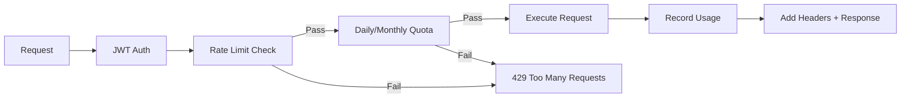

import EnvSetup from '@site/docs/_partials/_env-setup.mdx';

# Quota Enforcement

STOA enforces per-consumer API quotas at the gateway level — rate limits (per-second/minute), daily caps, and monthly limits. Quotas are defined in subscription plans and enforced in real-time.

## Enforcement Pipeline

Every API request passes through the quota check after authentication:



## Quota Types

| Type | Window | Example | Use Case |
|------|--------|---------|----------|
| **Per-second** | Rolling 1s | 100 req/s | Burst protection |
| **Per-minute** | Rolling 1min | 1,000 req/min | Steady-state rate limiting |
| **Daily** | Midnight UTC reset | 100,000 req/day | Daily usage caps |
| **Monthly** | 1st of month reset | 1,000,000 req/month | Billing-period limits |
| **Burst** | Instant | 50 concurrent | Concurrent request cap |

## Plan Configuration

Quotas are defined per plan in the Control Plane:

<EnvSetup />

```bash
curl -X POST "${STOA_API_URL}/v1/plans" \
  -H "Authorization: Bearer ${TOKEN}" \
  -H "Content-Type: application/json" \
  -d '{
    "slug": "gold",
    "name": "Gold Plan",
    "rate_limit_per_second": 100,
    "rate_limit_per_minute": 5000,
    "daily_request_limit": 500000,
    "monthly_request_limit": 10000000,
    "burst_limit": 50
  }'
```

### Example Plans

| Plan | Rate/sec | Rate/min | Daily | Monthly |
|------|----------|----------|-------|---------|
| Community | 5 | 60 | 10,000 | 100,000 |
| Silver | 20 | 300 | 50,000 | 1,000,000 |
| Gold | 100 | 5,000 | 500,000 | 10,000,000 |
| Enterprise | Custom | Custom | Custom | Custom |

## Response Headers

Every successful response includes rate limit headers:

```
X-RateLimit-Limit: 5000
X-RateLimit-Remaining: 4523
X-RateLimit-Reset: 1708000123
```

| Header | Description |
|--------|-------------|
| `X-RateLimit-Limit` | Maximum requests allowed in the current window |
| `X-RateLimit-Remaining` | Requests remaining in the current window |
| `X-RateLimit-Reset` | Unix timestamp when the window resets |

## Error Response (429)

When a quota is exceeded, the gateway returns `429 Too Many Requests`:

**Rate limit exceeded:**

```json
{
  "error": "quota_exceeded",
  "message": "Rate limit exceeded: per_minute limit of 100 requests reached",
  "retry_after_secs": 45
}
```

**Daily quota exceeded:**

```json
{
  "error": "quota_exceeded",
  "message": "Daily quota exceeded: 10000/10000 requests used. Resets at midnight UTC.",
  "retry_after_secs": null
}
```

The `Retry-After` header is also set:

```
HTTP/1.1 429 Too Many Requests
Retry-After: 45
Content-Type: application/json
```

## Reset Behavior

| Quota Type | Resets When |
|-----------|-------------|
| Per-second | After 1 second |
| Per-minute | After 60 seconds |
| Daily | Midnight UTC (00:00 UTC) |
| Monthly | 1st of the month (00:00 UTC) |

Resets are automatic — no manual intervention needed. The gateway checks the current date/time on every request and resets counters when the window changes.

## Monitoring Quotas

### Via Admin API

```bash
# List all consumer quota statistics
curl "${STOA_GATEWAY_URL}/admin/quotas" \
  -H "Authorization: Bearer ${ADMIN_TOKEN}"
```

```json
[
  {
    "consumer_id": "user-123",
    "daily_count": 450,
    "daily_limit": 1000,
    "monthly_count": 12500,
    "monthly_limit": 50000,
    "daily_remaining": 550,
    "monthly_remaining": 37500
  }
]
```

### Per-Consumer Stats

```bash
curl "${STOA_GATEWAY_URL}/admin/quotas/${CONSUMER_ID}" \
  -H "Authorization: Bearer ${ADMIN_TOKEN}"
```

### Reset Quotas (Admin)

For troubleshooting or customer support, admins can reset a consumer's quota counters:

```bash
curl -X POST "${STOA_GATEWAY_URL}/admin/quotas/${CONSUMER_ID}/reset" \
  -H "Authorization: Bearer ${ADMIN_TOKEN}"
```

This resets both daily and monthly counters to zero immediately.

## Prometheus Metrics

The gateway exposes quota-related Prometheus metrics:

| Metric | Type | Description |
|--------|------|-------------|
| `stoa_requests_total` | Counter | Total requests (by consumer, status) |
| `stoa_rate_limited_total` | Counter | Requests rejected by rate limiter |
| `stoa_quota_exceeded_total` | Counter | Requests rejected by daily/monthly quota |
| `stoa_quota_usage_ratio` | Gauge | Current usage as ratio (0.0-1.0) |

### Grafana Alert Example

```yaml
# Alert when a consumer reaches 80% of daily quota
- alert: QuotaNearLimit
  expr: stoa_quota_usage_ratio{type="daily"} > 0.8
  for: 5m
  labels:
    severity: warning
  annotations:
    summary: "Consumer {{ $labels.consumer_id }} at {{ $value | humanizePercentage }} of daily quota"
```

## Default Quotas

When no plan is specified, the gateway applies default limits:

| Setting | Default Value |
|---------|---------------|
| Rate per minute | 5 requests |
| Daily limit | 10,000 requests |

These defaults protect against abuse for consumers without an explicit plan. Configure higher limits by assigning a plan to the subscription.

## Troubleshooting

| Problem | Cause | Fix |
|---------|-------|-----|
| 429 immediately on first request | Default quota too low (5/min) | Assign a plan to the subscription |
| Quota not resetting at midnight | Time zone mismatch | Quotas reset at midnight **UTC** |
| Consumer shows 0 remaining but requests work | Cache delay | Wait up to 5 minutes or clear cache |
| Admin quota reset doesn't take effect | Gateway cache | Clear cache after reset: `POST /admin/cache/clear` |

## Related

- [Subscription Lifecycle](/docs/guides/subscriptions-lifecycle) — Plans and subscriptions
- [Gateway Admin API](/docs/api/gateway-admin-api) — Quota admin endpoints
- [Observability Guide](/docs/guides/observability) — Prometheus and Grafana
- [MCP Gateway API](/docs/api/mcp-gateway) — MCP protocol endpoints
