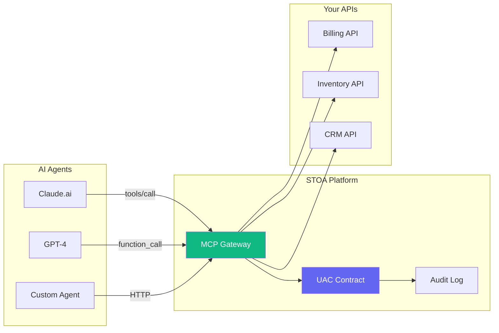
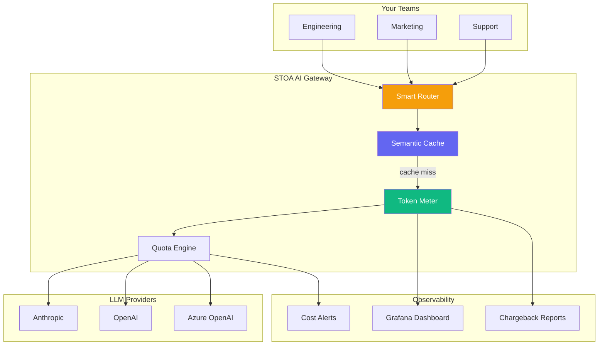
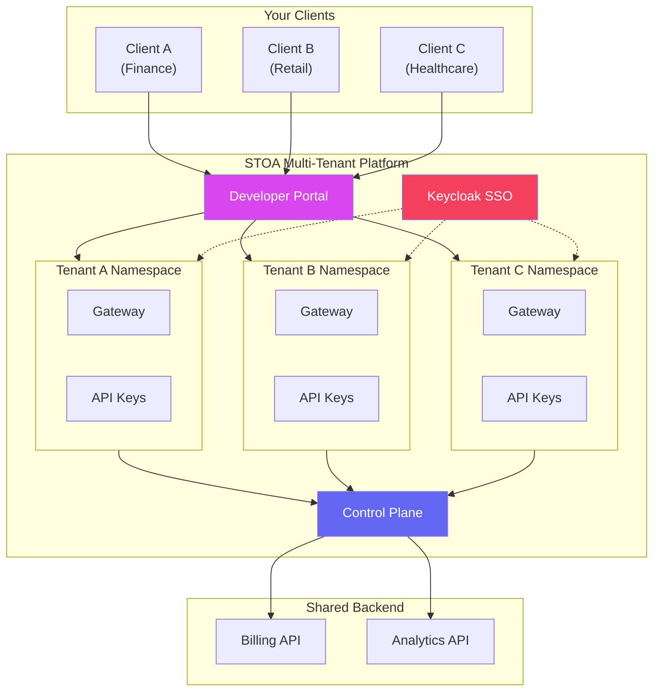

import Tabs from '@theme/Tabs';
import TabItem from '@theme/TabItem';

# Use Cases

Discover how STOA Platform solves real challenges for enterprises adopting AI and managing APIs at scale.

---

## 🤖 Use Case 1: AI Agent API Gateway

**Challenge:** Your AI agents (Claude, GPT, custom LLMs) need to call internal APIs, but you lack governance, audit trails, and access control.

**Solution:** STOA's MCP Gateway provides a unified entry point for all AI-to-API interactions.



### Benefits

| Without STOA | With STOA |
|--------------|-----------|
| Direct API access, no governance | Centralized policy enforcement |
| No visibility on AI calls | Full audit trail per agent |
| Manual API key management | Auto-discovery via MCP |
| Scattered rate limiting | Unified quotas per tenant |

### Quick Implementation

```bash
# 1. Register your API in STOA
stoa api register --name billing-api --upstream https://billing.internal

# 2. Claude.ai automatically discovers it
# In Claude: "What billing APIs are available?"
# Claude calls: stoa_catalog(action="search", query="billing")

# 3. Agent subscribes and calls
# stoa_subscription(action="create", api_id="billing-api")
# Direct API call through MCP Gateway with full audit
```

---

## 📊 Use Case 2: AI Cost Management & Token Metering

**Challenge:** Multiple teams use LLMs, but you have no visibility on token consumption, costs spiral, and there's no chargeback mechanism.

**Solution:** STOA's AI Gateway tracks every token, provides real-time dashboards, and enables per-team quotas.



### Benefits

| Metric | Before STOA | After STOA |
|--------|-------------|------------|
| Cost visibility | None | Real-time per team |
| Token waste | Redundant LLM calls | Reduced with semantic cache* |
| Budget control | Monthly surprise bills | Automatic quota enforcement |
| Provider lock-in | Single provider | Multi-provider failover |

*Semantic caching can significantly reduce redundant LLM calls. Actual savings vary based on query patterns and use case.*

### Dashboard Preview

```
┌─────────────────────────────────────────────────────────┐
│  Token Usage by Team (January 2026)                     │
├─────────────────────────────────────────────────────────┤
│  Engineering  ████████████████████░░░░  2.4M tokens     │
│  Marketing    ████████░░░░░░░░░░░░░░░░  800K tokens     │
│  Support      ████████████░░░░░░░░░░░░  1.2M tokens     │
├─────────────────────────────────────────────────────────┤
│  Total Cost: €1,240  |  Cache Savings: €520 (30%)       │
└─────────────────────────────────────────────────────────┘
```

---

## 🏢 Use Case 3: Multi-Tenant API Platform

**Challenge:** You're an ESN/ISV exposing APIs to multiple clients. You need isolation, per-client quotas, billing, and compliance (NIS2/DORA).

**Solution:** STOA provides native multi-tenancy with complete isolation and European sovereignty.



### Tenant Isolation Architecture

| Aspect | Implementation |
|--------|----------------|
| **Network** | Kubernetes NetworkPolicy per namespace |
| **Data** | Schema-per-tenant in PostgreSQL |
| **Auth** | Separate Keycloak realm per tenant |
| **Secrets** | Isolated Vault paths |
| **Quotas** | Independent rate limits |

### Compliance Features

- **NIS2** — Security incident reporting, access controls
- **DORA** — ICT risk management, resilience testing
- **GDPR** — Data residency in EU, audit trails
- **European Hosting** — EU data residency option available*

*Legal jurisdiction depends on multiple factors. Consult your legal counsel for compliance advice.*

---

## Getting Started

Ready to implement these use cases?

:::info Early Access — Private Beta
STOA Platform is currently in private beta. [Request access](mailto:christophe@hlfh.io) to deploy these use cases on your infrastructure, or explore the [Architecture Overview](/docs/concepts/architecture) to understand how STOA works.
:::

<Tabs>
  <TabItem value="saas" label="☁️ SaaS" default>
    ```
    1. Request beta access → christophe@hlfh.io
    2. Receive your tenant credentials
    3. Sign in at https://console.gostoa.dev
    4. Create your first API in the Console
    ```
  </TabItem>
  <TabItem value="self-hosted" label="🏠 Self-Hosted">
    ```
    1. Request beta access → christophe@hlfh.io
    2. Receive Helm chart access
    3. helm repo add stoa https://charts.gostoa.dev
    4. helm install stoa stoa/stoa-platform -n stoa-system
    ```
  </TabItem>
</Tabs>

---

## Need Help?

- 📚 [Quick Start Guide](/docs/guides/quickstart)
- 💬 [Discord Community](https://discord.gg/j8tHSSes)
- 📧 [Contact Sales](mailto:sales@gostoa.dev) for enterprise use cases

---

*Claude is a trademark of Anthropic, PBC. GPT-4 and Azure OpenAI are trademarks of OpenAI/Microsoft. All other product names are trademarks of their respective owners.*
