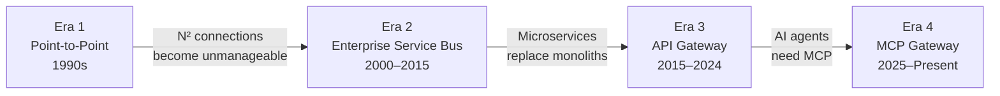
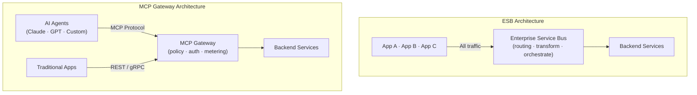

<!-- last verified: 2026-02 -->

# L'ESB est mort, vive MCP : Des bus d'intégration aux passerelles IA

Disons ce que de nombreux architectes d'entreprise pensent tout bas mais que peu de fournisseurs admettront jamais : **l'ESB est mort**. Le bus de services d'entreprise — ce middleware d'intégration monolithique qui a défini l'ère SOA — est en déclin depuis une décennie. Ce qui l'a tué n'est pas une technologie unique, mais une série de mutations architecturales : les microservices, les API gateways, les architectures événementielles, et maintenant le Model Context Protocol (MCP). Chaque mutation a rendu l'ESB un peu moins pertinent. MCP pourrait être le coup de grâce.

<!-- truncate -->

## Une brève histoire de l'intégration d'entreprise

Pour comprendre où nous allons, il faut comprendre d'où nous venons. L'intégration d'entreprise a traversé quatre ères distinctes :



### Ère 1 : le point à point (années 1990)

Le premier modèle d'intégration était le plus simple : des connexions directes entre systèmes. L'application A appelle l'application B via un protocole propriétaire (CORBA, RMI, DCOM). Cela fonctionne pour cinq systèmes. Cela devient ingérable à cinquante. Le nombre de connexions croît de manière quadratique — N systèmes produisent N(N-1)/2 connexions.

### Ère 2 : le bus de services d'entreprise (2000-2015)

L'ESB a résolu le chaos du point à point en introduisant un courtier de messages centralisé. Tous les systèmes se connectent au bus, et non les uns aux autres. Le bus prend en charge le routage, la transformation, la médiation de protocoles et l'orchestration. Les grands produits — IBM WebSphere, TIBCO, Software AG webMethods, Oracle Service Bus, MuleSoft — sont devenus l'épine dorsale de l'intégration d'entreprise.

L'ESB fonctionnait. Pendant un temps. Mais il a introduit ses propres problèmes :

- **Goulot d'étranglement central.** Tout transite par le bus. Si le bus est lent, tout est lent.
- **Dépendance aux fournisseurs.** Formats de messages propriétaires, langages de transformation et modèles de déploiement verrouillants.
- **Gouvernance monolithique.** La gestion des changements de configuration ESB est lente et risquée.
- **Coût.** Les frais de licence pour les ESB d'entreprise atteignent plusieurs millions par an.

### Ère 3 : API gateways et microservices (2015-2024)

La révolution des microservices a tué la prémisse centrale de l'ESB. Plutôt que de faire transiter tout le trafic par un bus, les services communiquent directement via des APIs HTTP légères. L'API gateway a remplacé l'ESB comme couche de gestion du trafic — avec une différence fondamentale : il route, il ne transforme pas. La logique métier réside dans les services, non dans le middleware.

Kong, Envoy, Traefik et AWS API Gateway sont devenus la nouvelle infrastructure. REST a remplacé SOAP. JSON a remplacé XML. OpenAPI a remplacé WSDL. Les fournisseurs d'ESB ont cherché à se repositionner en tant que « plateformes d'intégration » et fournisseurs « iPaaS ».

### Ère 4 : les passerelles MCP et les agents IA (2025 à aujourd'hui)

Un nouveau consommateur vient d'entrer en scène : l'agent IA. Les LLM tels que Claude et GPT n'appellent pas les APIs REST comme le ferait une application web. Ils utilisent le [Model Context Protocol (MCP)](/docs/concepts/mcp-gateway) pour découvrir des outils, invoquer des fonctions et lire des ressources de manière dynamique.

Il ne s'agit pas d'un simple changement de protocole. C'est un changement fondamental dans la manière dont l'intégration s'opère :

| Aspect | Ère ESB | Ère API Gateway | Ère passerelle MCP |
|---|---|---|---|
| **Consommateur** | Applications (Java, .NET) | Développeurs web/mobile | Agents IA (LLM) |
| **Découverte** | Registre UDDI (statique) | Docs OpenAPI/Swagger | Enumération dynamique des outils |
| **Protocole** | SOAP/XML via JMS/MQ | REST/GraphQL via HTTP | MCP via JSON-RPC/SSE |
| **Transformation** | Dans le middleware (XSLT, DataMapper) | Dans le service (code) | Dans l'agent (raisonnement LLM) |
| **Gouvernance** | Console d'administration ESB | Portail API + politiques gateway | Moteur de politiques (OPA) + isolation par tenant |
| **Modèle d'invocation** | Workflows orchestrés | Requête/réponse | Invocation d'outils contextuelle |



## Pourquoi l'ESB ne peut pas s'adapter

Certains fournisseurs argueront que leur ESB peut gérer le trafic MCP. Après tout, ce n'est qu'un autre protocole, n'est-ce pas ?

Non. L'architecture de l'ESB est fondamentalement incompatible avec le paradigme des agents IA pour trois raisons :

### 1. Routage statique face à la découverte dynamique

Les ESB routent les messages selon des règles préconfigurées : si le message de type X arrive, le router vers le service Y via la transformation Z. Chaque route doit être définie à l'avance par un développeur d'intégration.

Les agents IA découvrent les outils dynamiquement à l'exécution. Un agent peut lister les outils disponibles, sélectionner celui qui est approprié selon son contexte courant, et l'invoquer — le tout au sein d'un seul tour de conversation. L'ESB n'a aucun concept de ce modèle d'interaction.

### 2. Transformation centralisée face au raisonnement de l'agent

La proposition de valeur centrale de l'ESB est la transformation de messages : conversion entre formats, enrichissement des payloads, mapping de schémas. Cette logique réside dans le bus lui-même, maintenue par des développeurs d'intégration spécialisés.

Avec MCP, l'agent IA prend en charge l'interprétation et la transformation des données via son propre raisonnement. Le rôle de la passerelle est de router, sécuriser et observer — non de transformer. Un ESB qui insiste pour médiatiser chaque payload ajoute de la latence et de la complexité sans apporter de valeur.

### 3. Gouvernance monolithique face aux politiques multi-tenant

La gouvernance ESB est généralement tout ou rien : une équipe centrale contrôle la configuration du bus. Ajouter une nouvelle route ou transformation nécessite une demande de changement, des tests en environnement de préproduction, et une fenêtre de déploiement.

Les passerelles MCP nécessitent une [gouvernance multi-tenant en libre-service](/docs/concepts/architecture). Chaque équipe gère ses propres outils et politiques. La plateforme assure l'isolation. C'est le modèle introduit par les API gateways, que les passerelles MCP étendent désormais au trafic des agents IA.

## Le chemin de migration : de l'ESB à la passerelle MCP

Si votre organisation exploite encore un ESB — et beaucoup le font, notamment dans les services financiers, l'assurance, la santé et le secteur public — la voie à suivre n'est pas une migration en rupture totale. C'est une transition progressive et non disruptive.

### Phase 1 : déploiement en sidecar

Déployez une passerelle MCP aux côtés de votre ESB existant. Le trafic des agents IA transite par la passerelle MCP. Le trafic d'intégration traditionnel continue de passer par l'ESB. Aucune perturbation des flux existants.

```
Traditional Apps ──→ ESB ──→ Backend Services
AI Agents ──→ MCP Gateway ──→ Same Backend Services
```

### Phase 2 : façade API

Encapsulez les services exposés par l'ESB avec des APIs REST légères. Ces APIs deviennent des outils que la passerelle MCP peut exposer aux agents IA. L'ESB continue de fonctionner en coulisses, mais sa surface se réduit.

### Phase 3 : extraction de services

Extrayez progressivement les services de l'ESB vers des microservices autonomes ou des fonctions serverless. Chaque service extrait devient un outil MCP natif. L'ESB prend en charge de moins en moins d'intégrations.

### Phase 4 : décommissionnement

Lorsque l'ESB ne gère plus aucun trafic critique, décommissionnez-le. La passerelle MCP et l'API gateway standard prennent en charge toute l'intégration — IA et traditionnelle.

Cette approche par phases est exactement ce pour quoi STOA est conçu. Nos [guides de migration](/docs/guides/migration/) couvrent les produits ESB spécifiques, dont [webMethods](/docs/guides/migration/ibm-webmethods), avec des instructions pas à pas détaillées.

## Ce qui remplace les fonctionnalités utiles de l'ESB

L'ESB apportait une vraie valeur. Voici où vivent ces capacités dans la stack moderne :

| Capacité ESB | Equivalent moderne |
|---|---|
| Routage de messages | Règles de routage API gateway / passerelle MCP |
| Transformation de messages | Code au niveau du service (ou raisonnement de l'agent pour l'IA) |
| Médiation de protocoles | Support de protocoles de l'API gateway (REST, gRPC, MCP) |
| Orchestration | Moteurs de workflows (Temporal, Step Functions) ou chaînes d'agents |
| Registre de services | Service discovery Kubernetes + catalogues d'outils MCP |
| Supervision | Prometheus/Grafana + traçage distribué (Jaeger, Tempo) |
| Sécurité | Politiques OPA + OAuth2/JWT + mTLS |
| Livraison garantie | Event streaming (Kafka, NATS) |

Rien n'est perdu. Les capacités sont désagrégées en composants dédiés, chacun pouvant être mis à l'échelle, mis à jour et remplacé indépendamment.

## Les entreprises encore sous ESB

Si vous lisez ceci en vous disant « nous avons encore un ESB en production », vous n'êtes pas seul. Une enquête Gartner 2025 révèle que 43 % des grandes entreprises exploitent encore au moins un ESB en production, avec une durée de vie résiduelle moyenne de 3 à 5 ans.

Les raisons les plus fréquentes de maintenir un ESB en production :

1. **Intégrations legacy** avec des systèmes mainframe ou ERP qui ne parlent que SOAP/JMS.
2. **Exigences réglementaires** imposant des pistes d'audit spécifiques liées à l'ESB.
3. **Inertie organisationnelle** — l'équipe d'intégration connaît l'ESB, et la reconversion est coûteuse.
4. **Absence de chemin de migration clair** — jusqu'à présent.

STOA répond à ces quatre points. Le mode de déploiement en sidecar gère la coexistence avec les plateformes existantes. Les politiques OPA fournissent des pistes d'audit structurées. La console d'administration et le portail développeur réduisent la courbe d'apprentissage. Et le chemin de migration par phases élimine le besoin d'une bascule risquée en rupture totale.

## L'avenir : une passerelle API et IA unifiée

L'objectif final n'est pas de remplacer l'ESB par un autre middleware monolithique. C'est une couche de passerelle unifiée qui gère tout le trafic — REST, GraphQL, gRPC, MCP — avec une sécurité, une observabilité et une gouvernance cohérentes.

C'est ce que STOA construit : une plateforme où les consommateurs d'API traditionnels et les agents IA partagent la même infrastructure, les mêmes politiques et la même expérience développeur. L'ESB centralisait tout dans un bus. La passerelle MCP unifie tout via un standard.

L'ESB est mort. Vive MCP.

## Pour démarrer

- **[Présentation de l'architecture](/docs/concepts/architecture)** — Comment le plan de contrôle et le plan de données de STOA fonctionnent ensemble.
- **[Guides de migration](/docs/guides/migration/)** — Chemins pas à pas depuis webMethods, Kong, Apigee et d'autres.
- **[Démarrage rapide](/docs/guides/quickstart)** — Une instance opérationnelle en 15 minutes avec Docker Compose.

---

## Pour aller plus loin

- [Guide complet de migration d'API gateway 2026](/blog/api-gateway-migration-guide-2026) — Cadre de décision pour la modernisation des gateways legacy
- [Guide de migration webMethods](/blog/webmethods-migration-guide) — Migration ESB-vers-gateway avec l'approche sidecar
- [Concepts passerelle MCP](/docs/concepts/mcp-gateway) — Comment MCP remplace les modèles d'intégration ESB

---

*Vous exploitez encore un ESB ? [Consultez les guides de migration](/docs/guides/migration/) pour planifier votre transition vers une passerelle API et IA moderne — sans perturber la production.*

> **Avertissement :** Les noms de produits mentionnés sont des marques déposées de leurs propriétaires respectifs. Les comparaisons de fonctionnalités sont basées sur la documentation publiquement disponible en date de février 2026. Cet article décrit des tendances générales du secteur et n'implique aucune insuffisance de produits spécifiques.
