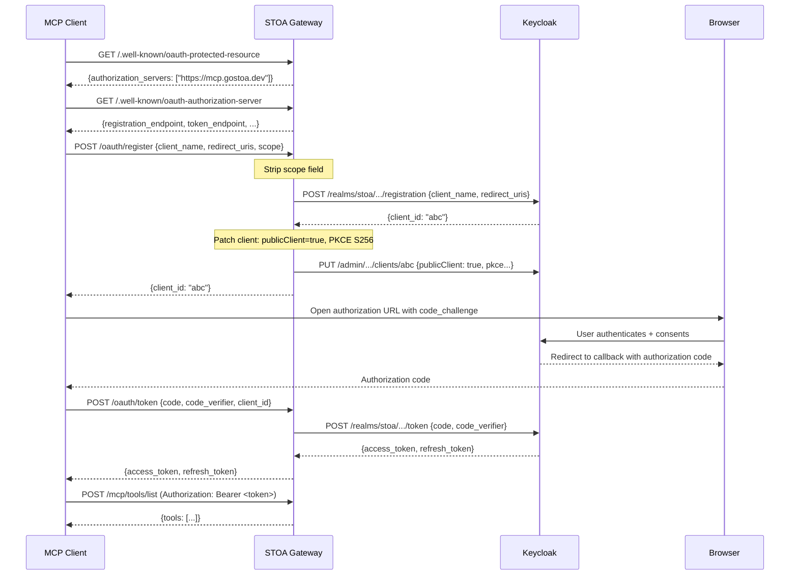

<!-- last verified: 2026-02 -->

# OAuth 2.1 + PKCE pour les Gateways MCP : Le Flux Complet

Les clients MCP comme Claude Desktop et GPT sont des clients publics. Ils ne peuvent pas stocker de secrets client. OAuth 2.1 avec PKCE (Proof Key for Code Exchange) résout cela en remplaçant le secret client par une preuve cryptographique que seul le requérant original pourrait produire. Cet article parcourt le flux OAuth complet pour les gateways MCP, incluant la chaîne de découverte, le Dynamic Client Registration, et les pièges de production que nous avons rencontrés et résolus.

<!-- truncate -->

:::info Partie de la Série de Plongée Sécurité
Cet article couvre le flux d'authentification OAuth pour les gateways MCP. Pour une plongée au niveau protocole, consultez [Architecture Protocolaire MCP en Profondeur](/blog/mcp-protocol-architecture-deep-dive). Pour des patterns d'authentification plus larges, consultez [Sécurité des Agents IA : 5 Patterns d'Authentification](/blog/ai-agent-security-authentication-patterns). Pour l'architecture de sécurité complète, consultez [Architecture de Sécurité STOA : Défense en Profondeur](/blog/stoa-api-security-architecture).
:::

## Pourquoi les Clients Publics ont Besoin de PKCE

Le flux de code d'autorisation OAuth 2.0 traditionnel repose sur un secret client partagé entre l'application cliente et le serveur d'autorisation. Cela fonctionne pour les applications côté serveur où le secret peut être stocké en sécurité. Cela ne fonctionne pas pour :

- **Les agents IA** (Claude Desktop, GPT) qui s'exécutent sur les machines des utilisateurs
- **Les applications mobiles** sans stockage sécurisé côté serveur
- **Les outils CLI** qui ne peuvent pas protéger les secrets embarqués
- **Les clients MCP basés sur navigateur** où le code source est inspectable

Ce sont tous des **clients publics** dans la terminologie OAuth : ils ne peuvent pas maintenir la confidentialité d'un secret client.

Sans PKCE, un attaquant qui intercepte le code d'autorisation (via un URI de redirection compromis, une extension de navigateur malveillante, ou un man-in-the-middle sur localhost) peut l'échanger contre des tokens. PKCE empêche cela en exigeant une preuve cryptographique que seul le client original pourrait produire.

### Comment PKCE Fonctionne

Le flux PKCE ajoute deux paramètres à l'échange de code d'autorisation :

1. **code_verifier** : une chaîne aléatoire (43 à 128 caractères) générée par le client
2. **code_challenge** : un hash SHA-256 du code_verifier, envoyé lors de la requête d'autorisation

```
Client                        Serveur d'Autorisation
  │                                    │
  │── Requête d'Autorisation ──────────→│
  │   code_challenge = SHA256(verifier)│
  │   code_challenge_method = S256     │
  │                                    │
  │←── Code d'Autorisation ────────────│
  │                                    │
  │── Requête de Token ───────────────→│
  │   code = <auth_code>               │
  │   code_verifier = <original>       │
  │                                    │
  │   Le serveur vérifie :             │
  │   SHA256(code_verifier) ==         │
  │     code_challenge stocké ?        │
  │                                    │
  │←── Access Token ──────────────────│
  │                                    │
```

Un attaquant qui intercepte le code d'autorisation n'a pas le code_verifier (il n'a jamais été transmis pendant la requête d'autorisation). Sans le verifier, la requête de token échoue.

OAuth 2.1 (draft) mandate PKCE pour tous les flux de code d'autorisation, pas seulement pour les clients publics. Cela élimine entièrement la classe d'attaques d'interception de code d'autorisation.

## La Chaîne de Découverte OAuth MCP

MCP utilise une chaîne de découverte basée sur des standards pour trouver la configuration OAuth. Ce n'est pas spécifique à STOA — elle suit les RFC 9728 et RFC 8414.

### Étape 1 : Métadonnées de Ressource Protégée (RFC 9728)

Le client MCP découvre d'abord que la ressource nécessite OAuth en récupérant les métadonnées de ressource protégée :

```
GET /.well-known/oauth-protected-resource HTTP/1.1
Host: mcp.gostoa.dev
```

Réponse :

```json
{
  "resource": "https://mcp.gostoa.dev",
  "authorization_servers": ["https://mcp.gostoa.dev"],
  "scopes_supported": ["openid", "stoa:read", "stoa:write", "stoa:admin"],
  "bearer_methods_supported": ["header"]
}
```

**Détail critique** : `authorization_servers` pointe vers le **gateway**, pas directement vers Keycloak. C'est intentionnel. Le gateway sert des métadonnées OAuth curées qui diffèrent de ce que Keycloak retournerait nativement. Spécifiquement, le gateway annonce `token_endpoint_auth_methods_supported: ["none"]`, ce qui est requis pour les clients publics. Les métadonnées natives de Keycloak n'annoncent pas la méthode d'auth `none`, même quand les clients publics sont activés.

### Étape 2 : Métadonnées du Serveur d'Autorisation (RFC 8414)

Le client suit `authorization_servers[0]` pour récupérer les métadonnées OAuth complètes :

```
GET /.well-known/oauth-authorization-server HTTP/1.1
Host: mcp.gostoa.dev
```

Réponse :

```json
{
  "issuer": "https://auth.gostoa.dev/realms/stoa",
  "authorization_endpoint": "https://auth.gostoa.dev/realms/stoa/protocol/openid-connect/auth",
  "token_endpoint": "https://mcp.gostoa.dev/oauth/token",
  "registration_endpoint": "https://mcp.gostoa.dev/oauth/register",
  "scopes_supported": ["openid", "profile", "email", "stoa:read", "stoa:write", "stoa:admin"],
  "response_types_supported": ["code"],
  "grant_types_supported": ["authorization_code", "refresh_token"],
  "token_endpoint_auth_methods_supported": ["none"],
  "code_challenge_methods_supported": ["S256"]
}
```

Notez que `token_endpoint` et `registration_endpoint` pointent vers le gateway (`mcp.gostoa.dev/oauth/*`), pas directement vers Keycloak. Le gateway proxifie ces requêtes en appliquant des transformations qui font fonctionner le flux pour les clients MCP publics.

### Étape 3 : Dynamic Client Registration (DCR)

Le client MCP s'enregistre dynamiquement :

```
POST /oauth/register HTTP/1.1
Host: mcp.gostoa.dev
Content-Type: application/json

{
  "client_name": "Claude Desktop",
  "redirect_uris": ["http://127.0.0.1:54321/callback"],
  "grant_types": ["authorization_code", "refresh_token"],
  "response_types": ["code"],
  "token_endpoint_auth_method": "none",
  "scope": "openid profile email stoa:read stoa:write"
}
```

Le gateway proxifie cela vers l'endpoint DCR de Keycloak, mais avec une modification critique : **il supprime le champ `scope` du payload avant de le transmettre**.

### Étape 4 : Échange de Token

Après que l'utilisateur autorise dans son navigateur, le client MCP échange le code d'autorisation :

```
POST /oauth/token HTTP/1.1
Host: mcp.gostoa.dev
Content-Type: application/x-www-form-urlencoded

grant_type=authorization_code
&code=abc123
&redirect_uri=http://127.0.0.1:54321/callback
&client_id=claude-desktop-xyz
&code_verifier=dBjftJeZ4CVP-mB92K27uhbUJU1p1r_wW1gFWFOEjXk
```

Le gateway proxifie vers l'endpoint token de Keycloak. Keycloak valide le code_verifier contre le code_challenge stocké, émet un access token (JWT) et un refresh token.

### Diagramme de Flux Complet



## Pièges de Production (Éprouvés)

Ce ne sont pas des préoccupations théoriques. Chacun de ces pièges a cassé le flux OAuth en production et a nécessité des corrections spécifiques.

### Piège 1 : Suppression du Scope DCR

**Problème** : Quand Claude Desktop envoie `scope: "openid profile email stoa:read stoa:write"` dans le payload d'enregistrement DCR, Keycloak **remplace** tous les scopes par défaut du realm par uniquement ceux demandés. Le client enregistré perd l'accès aux scopes comme `roles`, `web-origins`, et tous les mappers personnalisés attachés aux scopes par défaut. La prochaine requête de token échoue avec `invalid_scope`.

**Cause Racine** : Keycloak interprète le champ `scope` dans le DCR littéralement — il définit les scopes optionnels du client à exactement ce qui a été demandé, supprimant tous les défauts.

**Correction** : Le gateway supprime le champ `scope` du payload DCR avant de le transmettre à Keycloak. Sans scope explicite, Keycloak attribue tous les scopes par défaut du realm plus tous les scopes optionnels au nouveau client. Le client peut ensuite demander n'importe quel scope pendant le flux d'autorisation.

**Vérification** : Enregistrez un client avec scope inclus vs sans. Comparez les scopes attribués au client dans la console d'administration Keycloak.

### Piège 2 : Bypass mTLS pour les Endpoints OAuth

**Problème** : Le middleware mTLS de STOA (sécurité Layer 1) applique le TLS mutuel sur tous les endpoints. Mais les endpoints de découverte et d'enregistrement OAuth doivent être accessibles *avant* que le client ne se soit authentifié. Si l'application mTLS bloque les chemins `/.well-known/*` et `/oauth/*`, le client n'atteint jamais le challenge OAuth et le flux échoue silencieusement.

**Cause Racine** : Le middleware mTLS retourne `401 MTLS_CERT_REQUIRED` avant que la couche OAuth puisse retourner `401` avec les en-têtes `WWW-Authenticate: Bearer`. Le client ne voit jamais le challenge OAuth.

**Correction** : Liste de bypass codée en dur dans le middleware mTLS. Ces chemins passent outre la vérification de certificat :

- `/.well-known/*` (découverte)
- `/oauth/*` (token, register)
- `/mcp/sse`, `/mcp/tools/*`, `/mcp/v1/*` (transport MCP)
- `/health`, `/ready`, `/metrics` (infrastructure)

La liste de bypass est intentionnellement codée en dur (non configurable) car une erreur de configuration ne doit pas casser le flux OAuth.

**Vérification** : Connectez-vous au gateway sans certificat client. L'endpoint `/.well-known/oauth-protected-resource` devrait retourner 200, pas 401.

### Piège 3 : Patch du Client Public PKCE

**Problème** : Keycloak crée les clients DCR en tant que clients confidentiels par défaut. Un client confidentiel nécessite un `client_secret` dans la requête de token. Les clients publics MCP (Claude, GPT) n'ont pas de secret client.

**Cause Racine** : La spécification OAuth 2.1 DCR ne mandate pas que `token_endpoint_auth_method: "none"` crée automatiquement un client public. Keycloak ignore ce champ pendant le DCR.

**Correction** : Après un enregistrement DCR réussi, le gateway patche le client Keycloak via l'API d'administration :

1. Définir `publicClient: true` (supprime l'exigence de client_secret)
2. Définir `pkce.code.challenge.method: S256` (active PKCE)

Cela nécessite `KEYCLOAK_ADMIN_PASSWORD` comme variable d'environnement. Sans elle, l'étape de patch est ignorée et les clients nécessiteront un client_secret (cassant les flux client public).

**Vérification** : Après l'enregistrement DCR, vérifiez le client dans l'admin Keycloak. `Client authentication` devrait être DÉSACTIVÉ. `PKCE Code Challenge Method` devrait être S256.

### Piège 4 : Les Serveurs d'Autorisation Doivent Pointer vers le Gateway

**Problème** : Si `authorization_servers` dans les métadonnées de ressource protégée pointe directement vers Keycloak (`auth.gostoa.dev`), le client récupère les métadonnées OAuth natives de Keycloak. Ces métadonnées n'annoncent pas `token_endpoint_auth_methods_supported: ["none"]`, causant l'échec de l'enregistrement des clients publics.

**Cause Racine** : Les métadonnées OAuth de Keycloak reflètent sa configuration par défaut. Même quand les clients publics sont activés au niveau client, les métadonnées au niveau serveur ne changent pas.

**Correction** : `authorization_servers` pointe toujours vers le gateway. Le gateway sert des métadonnées curées qui incluent `"none"` comme méthode d'auth supportée. Les endpoints d'enregistrement et de token sont proxifiés via le gateway, qui applique les transformations nécessaires.

**Vérification** : Comparez `GET https://auth.gostoa.dev/realms/stoa/.well-known/openid-configuration` avec `GET https://mcp.gostoa.dev/.well-known/oauth-authorization-server`. Les métadonnées du gateway devraient inclure `"none"` dans `token_endpoint_auth_methods_supported`.

### Piège 5 : Politique de Scope DCR Keycloak

**Problème** : Les scopes personnalisés comme `stoa:read`, `stoa:write`, `stoa:admin` sont rejetés par Keycloak lors du DCR si la politique DCR "Allowed Client Scopes" ne les inclut pas.

**Cause Racine** : Keycloak a une politique DCR intégrée qui restreint les scopes pouvant être demandés lors de l'enregistrement client. Par défaut, seuls les scopes OpenID Connect standard sont autorisés.

**Correction** : Dans l'admin Keycloak : Paramètres du Realm > Politiques Client > trouver la politique DCR > ajouter `stoa:read`, `stoa:write`, `stoa:admin` à la liste des scopes autorisés. Alternativement, puisque le gateway supprime le champ scope (Piège 1), cela n'a d'importance que si le client demande explicitement des scopes personnalisés lors de l'échange de token.

## Propriétés de Sécurité du Flux

Le flux OAuth 2.1 + PKCE complet pour MCP fournit :

| Propriété | Mécanisme | Menace Adressée |
|-----------|-----------|----------------|
| **Pas de secrets client** | PKCE (code_verifier/code_challenge) | Authentification client public |
| **Résistance à l'interception de code** | Challenge S256 empêche la réutilisation du code | Vol de code d'autorisation |
| **Tokens à courte durée de vie** | TTL de 15 minutes pour l'access token | Fenêtre de token volé |
| **Renouvellement de token** | Refresh token avec rotation | Continuité de session sans ré-auth |
| **Application des scopes** | Scopes par token validés par requête | Privilèges excessifs |
| **Liaison certificat** | RFC 8705 (optionnel, ajoute mTLS) | Rejeu de token depuis un autre client |
| **Basé sur la découverte** | RFC 9728 + RFC 8414 | Pas d'endpoints codés en dur |

Combiné avec la liaison de certificat mTLS (RFC 8705), un access token volé est inutile sans la clé privée du certificat client correspondant. Cette combinaison — PKCE pour l'authentification initiale, mTLS pour la liaison continue — représente le pattern d'authentification le plus robuste pour l'accès API des agents IA.

## Référence d'Implémentation

### Configuration du Gateway

Le proxy OAuth dans STOA Gateway est configuré via des variables d'environnement :

```bash
# Connexion Keycloak
KEYCLOAK_BASE_URL=https://auth.gostoa.dev
KEYCLOAK_REALM=stoa
KEYCLOAK_ADMIN_PASSWORD=<requis pour le patch PKCE>

# Métadonnées OAuth
OAUTH_ISSUER=https://auth.gostoa.dev/realms/stoa
GATEWAY_EXTERNAL_URL=https://mcp.gostoa.dev
```

### Tester le Flux Manuellement

Vérifiez chaque étape de la chaîne de découverte :

```bash
# Étape 1 : Métadonnées de ressource protégée
curl -s https://mcp.gostoa.dev/.well-known/oauth-protected-resource | jq .

# Étape 2 : Métadonnées du serveur d'autorisation
curl -s https://mcp.gostoa.dev/.well-known/oauth-authorization-server | jq .

# Étape 3 : Dynamic client registration
curl -s -X POST https://mcp.gostoa.dev/oauth/register \
  -H "Content-Type: application/json" \
  -d '{
    "client_name": "test-client",
    "redirect_uris": ["http://127.0.0.1:9999/callback"],
    "grant_types": ["authorization_code"],
    "response_types": ["code"],
    "token_endpoint_auth_method": "none"
  }' | jq .

# Étape 4 : Générer des valeurs PKCE
CODE_VERIFIER=$(openssl rand -base64 32 | tr -d '=/+' | head -c 43)
CODE_CHALLENGE=$(echo -n "$CODE_VERIFIER" | openssl dgst -sha256 -binary | base64 | tr -d '=' | tr '+/' '-_')

echo "Verifier: $CODE_VERIFIER"
echo "Challenge: $CODE_CHALLENGE"

# Étape 5 : Ouvrir l'URL d'autorisation (navigateur)
echo "https://auth.gostoa.dev/realms/stoa/protocol/openid-connect/auth?\
client_id=<client_id>&\
response_type=code&\
redirect_uri=http://127.0.0.1:9999/callback&\
scope=openid+stoa:read&\
code_challenge=$CODE_CHALLENGE&\
code_challenge_method=S256"
```

### Couverture des Tests

Le flux OAuth est couvert à plusieurs couches de tests :

| Couche | Tests | Ce qui est Couvert |
|--------|-------|-------------------|
| Unitaire (`src/oauth/proxy.rs`) | 15 | Proxy token, proxy DCR, suppression scope, chemins d'erreur |
| Unitaire (`src/auth/mtls.rs`) | 4 | Correspondance de chemin de bypass mTLS |
| Unitaire (`src/oauth/discovery.rs`) | 7 | Champs de métadonnées de découverte, construction d'URL |
| Contrat (`tests/contract/oauth.rs`) | 3 | Snapshot : authorization_servers, forme des métadonnées |
| Intégration (`tests/integration/mcp.rs`) | 12 | Endpoints de découverte OAuth, validation des métadonnées |
| E2E bash (`tests/e2e/test-mcp-oauth-flow.sh`) | 9 étapes | Flux complet : découverte, DCR, token (manuel, nécessite Keycloak live) |

## Foire aux Questions

### Pourquoi ne pas utiliser le flux client credentials plutôt que PKCE ?

Le flux client credentials nécessite un secret client, que les agents IA fonctionnant sur des machines utilisateurs ne peuvent pas stocker en sécurité. Le secret serait embarqué dans le binaire de l'application, extractible par tout utilisateur ayant accès au système de fichiers. PKCE élimine le besoin d'un secret persistant.

### Puis-je utiliser ce flux avec un fournisseur d'identité autre que Keycloak ?

Le flux suit des RFC standard (9728, 8414, OAuth 2.1). Tout fournisseur d'identité supportant le Dynamic Client Registration et PKCE devrait fonctionner. La suppression de scope et le patch de client public du gateway sont des contournements spécifiques à Keycloak. D'autres fournisseurs peuvent ne pas en avoir besoin (ou nécessiter des contournements différents).

### Que se passe-t-il si le patch PKCE échoue ?

Si `KEYCLOAK_ADMIN_PASSWORD` n'est pas défini ou si l'API admin est inaccessible, l'enregistrement DCR réussit mais le client est créé comme confidentiel. La requête de token suivante du client MCP échoue car il ne peut pas fournir un secret client. Le gateway enregistre un avertissement : `PKCE patch failed: admin API unavailable`. C'est une panne bloquante pour les clients publics.

### Comment révoquer ou renouveler un client enregistré dynamiquement ?

Keycloak stocke les clients DCR comme n'importe quel autre client. Révoquez via la console d'administration Keycloak (Clients > trouver par client_id > désactiver ou supprimer) ou via l'API admin. STOA ne supporte pas actuellement la gestion des clients DCR (RFC 7592) via le proxy gateway.

### Le flux OAuth est-il compatible avec le transport MCP Streamable HTTP ?

Oui. Le flux OAuth est indépendant du transport. L'access token obtenu via PKCE est inclus comme token Bearer dans les en-têtes HTTP, quel que soit le transport MCP (SSE, Streamable HTTP ou WebSocket).

## Lecture Complémentaire

- [Architecture Protocolaire MCP en Profondeur](/blog/mcp-protocol-architecture-deep-dive) — Couches de protocole et options de transport
- [Sécurité des Agents IA : 5 Patterns d'Authentification](/blog/ai-agent-security-authentication-patterns) — Stratégies d'authentification plus larges
- [Architecture de Sécurité STOA : Défense en Profondeur](/blog/stoa-api-security-architecture) — Modèle de sécurité complet à cinq couches
- [Zero Trust pour les Gateways API (Partie 1)](/blog/zero-trust-api-gateways-part-1) — Pourquoi vérifier chaque requête est important
- [OWASP API Security Top 10 & STOA](/blog/owasp-api-security-top-10-stoa) — Couverture OWASP API2 (Authentification Brisée)
- [Spécification OAuth MCP](https://modelcontextprotocol.io/specification/2025-03-26/basic/authorization) — Spec officielle d'autorisation MCP

---

> Ce guide décrit l'implémentation OAuth de production de STOA. Il ne constitue pas un audit de sécurité. Les organisations devraient valider les configurations OAuth par rapport à leurs exigences de sécurité spécifiques et faire appel à des évaluateurs de sécurité qualifiés pour les évaluations de conformité.

*STOA Platform est open source (Apache 2.0). [Déployez le gateway](https://docs.gostoa.dev/docs/guides/quickstart) ou explorez la [documentation de sécurité](https://docs.gostoa.dev/docs/reference/security-configuration).*
