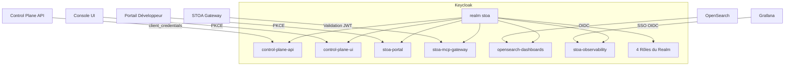

import EnvSetup from '@site/docs/_partials/_env-setup.mdx';

# Administration Keycloak

STOA utilise Keycloak comme fournisseur d'identité. Ce guide couvre la configuration du realm, la mise en place des clients OIDC, le mapping des rôles RBAC et le durcissement en production.

## Vue d'Ensemble de l'Architecture



## Configuration du Realm

### Créer le Realm

1. Connectez-vous à la Console d'Administration Keycloak (`https://auth.<VOTRE_DOMAINE>/admin`)
2. Cliquez sur **Créer un Realm**
3. Définissez le nom du realm : `stoa`

### Paramètres du Realm

| Paramètre | Valeur | Objectif |
|-----------|--------|---------|
| Nom affiché | `STOA Identity` | Affiché sur la page de connexion |
| SSL requis | `external` (prod) / `none` (dev) | Application de TLS |
| Inscription autorisée | `false` | Accès sur invitation uniquement |
| Connexion avec email | `true` | Email comme nom d'utilisateur |
| Protection contre la force brute | `true` | Durcissement sécurité |
| Réinitialisation du mot de passe | `true` | Récupération en libre-service |

### Durées de Vie des Tokens

| Paramètre | Dev | Production | Objectif |
|-----------|-----|------------|---------|
| Durée de vie du token d'accès | 3600s (1h) | 300s (5min) | Courte durée pour la sécurité |
| Inactivité de session SSO | 1800s (30min) | 900s (15min) | Délai d'inactivité |
| Durée maximale de session SSO | 36000s (10h) | 28800s (8h) | Session maximale |

## Rôles RBAC

Créez ces 4 rôles de realm dans **Paramètres du Realm > Rôles** :

| Rôle | Description | Portée |
|------|-------------|--------|
| `cpi-admin` | Administrateur complet de la plateforme, peut gérer tous les tenants et les paramètres système | Plateforme entière |
| `tenant-admin` | Administrateur de tenant, peut gérer les APIs et utilisateurs de son propre tenant | Tenant spécifique |
| `devops` | Ingénieur DevOps, peut déployer et promouvoir des APIs | Tenant spécifique |
| `viewer` | Accès en lecture seule aux ressources du tenant | Tenant spécifique |

### Hiérarchie des Rôles

```
cpi-admin (plateforme entière)
  └── tenant-admin (tenant spécifique)
       └── devops (portée déploiement)
            └── viewer (lecture seule)
```

Les rôles supérieurs héritent de toutes les permissions des rôles inférieurs. Voir [Permissions RBAC](/docs/reference/rbac-permissions) pour la matrice complète des permissions.

### Mapping Utilisateur-Tenant

Chaque utilisateur a besoin d'un attribut `tenant` pour délimiter son accès :

1. Allez dans **Utilisateurs** > sélectionnez l'utilisateur > **Attributs**
2. Ajoutez l'attribut : `tenant` = `acme` (le slug du tenant)

Le claim `tenant` est inclus dans les tokens via un protocol mapper (configuré par client).

## Clients OIDC

### 1. Control Plane API (Backend)

**Objectif** : Authentification service-à-service pour le backend.

| Paramètre | Valeur |
|-----------|--------|
| Client ID | `control-plane-api` |
| Type de client | Confidentiel |
| Flux standard | Activé |
| Accès direct | Activé |
| Comptes de service | Activé |
| Authentification client | Activée (client secret) |

**URIs de Redirection** :
- Dev : `http://localhost:8000/*`
- Prod : `https://api.<VOTRE_DOMAINE>/*`

### 2. Console UI (Console d'Administration)

**Objectif** : Console d'administration pour les fournisseurs d'APIs. Client public utilisant PKCE.

| Paramètre | Valeur |
|-----------|--------|
| Client ID | `control-plane-ui` |
| Type de client | Public |
| Flux standard | Activé |
| Accès direct | Activé |

**URIs de Redirection** :
- Dev : `http://localhost:3000/*`, `http://localhost:5173/*`
- Prod : `https://console.<VOTRE_DOMAINE>/*`

**Protocol mapper** (requis) : Ajoutez un mapper **Audience** :
- Nom : `control-plane-api-audience`
- Type de mapper : Audience
- Audience client incluse : `control-plane-api`
- Ajouter au token ID : Oui
- Ajouter au token d'accès : Oui

Cela garantit que le claim `aud` inclut `control-plane-api`, permettant au backend de valider les tokens.

### 3. Portail Développeur

**Objectif** : Portail développeur public pour les consommateurs d'APIs.

| Paramètre | Valeur |
|-----------|--------|
| Client ID | `stoa-portal` |
| Type de client | Public |
| Flux standard | Activé |
| Accès direct | Activé |

**URIs de Redirection** :
- Dev : `http://localhost:3001/*`
- Prod : `https://portal.<VOTRE_DOMAINE>/*`

**Protocol mapper** : Même mapper d'audience que la Console (`control-plane-api-audience`).

### 4. MCP Gateway

**Objectif** : Validation JWT du gateway et compte de service pour la découverte d'outils.

| Paramètre | Valeur |
|-----------|--------|
| Client ID | `stoa-mcp-gateway` |
| Type de client | Confidentiel |
| Flux standard | Activé |
| Accès direct | Activé |
| Comptes de service | Activé |

**URIs de Redirection** :
- Dev : `http://localhost:8081/*`
- Prod : `https://mcp.<VOTRE_DOMAINE>/*`

### 5. OpenSearch Dashboards (Optionnel)

**Objectif** : SSO OIDC pour l'interface d'exploitation des logs.

| Paramètre | Valeur |
|-----------|--------|
| Client ID | `opensearch-dashboards` |
| Type de client | Confidentiel |
| Flux standard | Activé |

**Protocol mappers** :
- `tenant-mapper` : Mapper attribut utilisateur, claim `tenant_id` depuis l'attribut utilisateur `tenant`
- `realm-roles-mapper` : Mapper rôles realm, claim `roles` avec les rôles realm de l'utilisateur

**URIs de Redirection** :
- Prod : `https://opensearch.<VOTRE_DOMAINE>/*`

### 6. Observabilité (Optionnel)

**Objectif** : SSO Grafana et proxy OAuth2 Prometheus.

| Paramètre | Valeur |
|-----------|--------|
| Client ID | `stoa-observability` |
| Type de client | Confidentiel |
| Flux standard | Activé |

**Protocol mapper** : Mapper `realm-roles` ajoutant le claim `roles`.

**URIs de Redirection** :
- Grafana : `https://grafana.<VOTRE_DOMAINE>/login/generic_oauth`
- Prometheus : `https://prometheus.<VOTRE_DOMAINE>/oauth2/callback`

## Récapitulatif des Clients

| Client ID | Type | Compte de Service | Mapper Audience | Utilisateurs |
|-----------|------|-------------------|-----------------|-------------|
| `control-plane-api` | Confidentiel | Oui | -- | Services backend |
| `control-plane-ui` | Public | Non | `control-plane-api` | Admins (Console) |
| `stoa-portal` | Public | Non | `control-plane-api` | Développeurs (Portail) |
| `stoa-mcp-gateway` | Confidentiel | Oui | -- | Service Gateway |
| `opensearch-dashboards` | Confidentiel | Non | -- | Utilisateurs observabilité |
| `stoa-observability` | Confidentiel | Non | -- | Grafana/Prometheus |

## Durcissement Sécurité (Production)

### En-têtes de Sécurité du Navigateur

Configurez dans **Paramètres du Realm > Défenses de Sécurité > En-têtes** :

| En-tête | Valeur |
|---------|--------|
| Content-Security-Policy | `frame-src 'self'; frame-ancestors 'self' https://console.<VOTRE_DOMAINE>; object-src 'none';` |
| X-Content-Type-Options | `nosniff` |
| X-XSS-Protection | `1; mode=block` |
| Strict-Transport-Security | `max-age=31536000; includeSubDomains` |
| Referrer-Policy | `no-referrer` |

### Protection contre la Force Brute

Activez dans **Paramètres du Realm > Défenses de Sécurité > Détection Force Brute** :

| Paramètre | Valeur Recommandée |
|-----------|--------------------|
| Activée | Oui |
| Échecs de connexion max | 5 |
| Incrément d'attente (secondes) | 60 |
| Attente maximale (secondes) | 900 |
| Temps de réinitialisation des échecs (secondes) | 43200 (12h) |

### TOTP/2FA (Optionnel)

STOA prend en charge l'authentification renforcée avec TOTP pour les opérations sensibles :

| Paramètre | Valeur |
|-----------|--------|
| Type de politique OTP | TOTP |
| Algorithme | HmacSHA256 |
| Chiffres | 6 |
| Période | 30 secondes |
| Applications compatibles | Google Authenticator, Microsoft Authenticator, Authy, 1Password, FreeOTP |

Activez via un flux d'authentification personnalisé (`step-up-totp`) qui exige l'OTP pour les opérations d'administration.

## Export/Import du Realm

### Export (Sauvegarde)

<EnvSetup />

```bash
# Exporter la configuration du realm (sans les secrets)
curl -s "${STOA_AUTH_URL}/admin/realms/stoa" \
  -H "Authorization: Bearer ${ADMIN_TOKEN}" | jq > stoa-realm-backup.json
```

### Import (Amorçage)

Pour le déploiement initial, importez le realm de référence :

```bash
# Via le CLI Keycloak
/opt/keycloak/bin/kcadm.sh config credentials \
  --server "${STOA_AUTH_URL}" \
  --realm master \
  --user admin \
  --password "${KEYCLOAK_ADMIN_PASSWORD}"

/opt/keycloak/bin/kcadm.sh create realms \
  -f stoa-realm.json
```

Ou via Docker Compose avec montage de volume :

```yaml
keycloak:
  image: quay.io/keycloak/keycloak:24.0
  command: start-dev --import-realm
  volumes:
    - ./init/keycloak-realm.json:/opt/keycloak/data/import/stoa-realm.json
```

## Intégration OIDC Grafana

Configurez Grafana pour utiliser le SSO Keycloak :

```yaml
# Valeurs Helm (kube-prometheus-stack)
grafana:
  grafana.ini:
    auth.generic_oauth:
      enabled: true
      name: Keycloak
      client_id: stoa-observability
      client_secret: ${GF_AUTH_GENERIC_OAUTH_CLIENT_SECRET}
      auth_url: https://auth.<VOTRE_DOMAINE>/realms/stoa/protocol/openid-connect/auth
      token_url: https://auth.<VOTRE_DOMAINE>/realms/stoa/protocol/openid-connect/token
      api_url: https://auth.<VOTRE_DOMAINE>/realms/stoa/protocol/openid-connect/userinfo
      scopes: openid profile email roles
      role_attribute_path: "contains(roles[*], 'stoa:admin') && 'Admin' || 'Viewer'"
```

Ce mapping associe les rôles Keycloak aux rôles Grafana :
- Les utilisateurs avec la portée `stoa:admin` obtiennent le rôle Grafana **Admin**
- Tous les autres obtiennent le rôle Grafana **Viewer**

## Dépannage

| Problème | Cause | Solution |
|---------|-------|---------|
| Erreur `invalid_grant` | Token expiré ou client secret incorrect | Régénérer le client secret dans Keycloak |
| `audience_mismatch` | Mapper d'audience manquant sur le client | Ajouter le protocol mapper `control-plane-api-audience` |
| `unauthorized_client` | Mauvais type de grant activé | Activer le Flux Standard et/ou l'Accès Direct |
| La page de connexion affiche le realm `stoa` | Comportement correct | Les utilisateurs s'authentifient sur le realm `stoa` |
| Erreurs CORS depuis la Console | Web Origins incorrect | Ajouter l'URL de la Console aux Web Origins du client |
| Token sans claim `tenant` | L'utilisateur n'a pas d'attribut `tenant` | Ajouter l'attribut utilisateur `tenant` dans Keycloak |
| Grafana SSO affiche 403 | Claim `roles` manquant | Ajouter le protocol mapper `realm-roles` au client `stoa-observability` |

## Voir Aussi

- [Guide d'Authentification](/docs/guides/authentication) -- Flux OIDC et gestion des tokens
- [Permissions RBAC](/docs/reference/rbac-permissions) -- Matrice complète des permissions
- [Découverte OAuth](/docs/reference/oauth-discovery) -- Points de terminaison OAuth 2.1
- [Guide d'Installation](/docs/admin/installation) -- Déploiement du chart Helm
- [Isolation Multi-Tenant](/docs/concepts/multi-tenant) -- Architecture tenant
