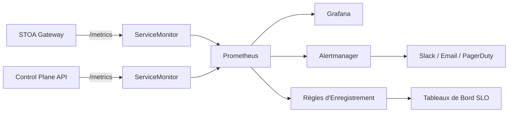

import EnvSetup from '@site/docs/_partials/_env-setup.mdx';

# Monitoring & Alerting

STOA s'intègre avec Prometheus et Grafana pour la collecte de métriques, les tableaux de bord et les alertes. Ce guide couvre la mise en place, les métriques personnalisées, les règles SLO et la configuration des alertes.

## Architecture



## Prérequis

Installez le chart Helm kube-prometheus-stack (inclut Prometheus, Grafana et Alertmanager) :

```bash
helm repo add prometheus-community https://prometheus-community.github.io/helm-charts
helm repo update

helm install kube-prometheus-stack prometheus-community/kube-prometheus-stack \
  -n monitoring --create-namespace \
  -f prometheus-values.yaml
```

## ServiceMonitors

STOA fournit des CRDs ServiceMonitor dans le chart Helm. Activez-les dans `values.yaml` :

```yaml
stoaGateway:
  serviceMonitor:
    enabled: true
    interval: 15s
    scrapeTimeout: 10s
```

### ServiceMonitors Déployés

| Cible | Port | Chemin | Intervalle | Labels |
|-------|------|--------|------------|--------|
| STOA Gateway | `http` | `/metrics` | 15s | `app.kubernetes.io/name: stoa-gateway` |
| MCP Gateway | `http` | `/metrics` | 15s | `app.kubernetes.io/name: mcp-gateway` |
| Pushgateway | `http` | `/metrics` | 30s | `app: pushgateway` |

Tous les ServiceMonitors utilisent le label `prometheus: kube-prometheus-stack` pour correspondre au sélecteur de l'opérateur Prometheus.

### Vérifier les Cibles de Scraping

Vérifiez que Prometheus découvre les cibles STOA :

```bash
# Redirection de port vers Prometheus
kubectl port-forward -n monitoring svc/kube-prometheus-stack-prometheus 9090:9090

# Ouvrez http://localhost:9090/targets et cherchez la cible stoa-gateway
```

## Métriques Personnalisées

### STOA Gateway (Rust)

Le gateway expose 12 familles de métriques personnalisées sur `/metrics` :

#### Métriques HTTP

| Métrique | Type | Labels | Description |
|---------|------|--------|-------------|
| `stoa_http_requests_total` | Compteur | `method`, `path`, `status` | Total des requêtes HTTP |
| `stoa_http_request_duration_seconds` | Histogramme | `method`, `path` | Latence des requêtes |

#### Métriques d'Invocation des Outils MCP

| Métrique | Type | Labels | Description |
|---------|------|--------|-------------|
| `stoa_mcp_tools_calls_total` | Compteur | `tool`, `tenant`, `status` | Invocations d'outils |
| `stoa_mcp_tool_duration_seconds` | Histogramme | `tool`, `tenant`, `status` | Latence d'exécution des outils |

#### Métriques de Connexion SSE

| Métrique | Type | Labels | Description |
|---------|------|--------|-------------|
| `stoa_mcp_sse_connections_active` | Jauge | -- | Connexions SSE actives |
| `stoa_mcp_sse_connection_duration_seconds` | Histogramme | `tenant` | Durée de session SSE |
| `stoa_mcp_sessions_active` | Jauge | -- | Sessions MCP actives |

#### Métriques de Rate Limiting

| Métrique | Type | Labels | Description |
|---------|------|--------|-------------|
| `stoa_rate_limit_hits_total` | Compteur | `tenant` | Rejets pour limite de débit |
| `stoa_rate_limit_buckets` | Jauge | -- | Buckets de rate limiting actifs |

#### Métriques de Circuit Breaker

| Métrique | Type | Labels | Description |
|---------|------|--------|-------------|
| `stoa_circuit_breaker_state` | Jauge | `upstream` | État du CB : 0=fermé, 1=ouvert, 2=semi-ouvert |

#### Métriques de Quota et Upstream

| Métrique | Type | Labels | Description |
|---------|------|--------|-------------|
| `stoa_quota_remaining` | Jauge | `consumer`, `period` | Quota restant |
| `stoa_upstream_latency_seconds` | Histogramme | `upstream`, `status` | Latence du backend |

### Buckets d'Histogramme

Tous les histogrammes de latence utilisent les mêmes limites de buckets :

```
[0.001, 0.005, 0.01, 0.025, 0.05, 0.1, 0.25, 0.5, 1.0, 2.5, 5.0, 10.0] secondes
```

La durée de connexion SSE utilise des buckets plus larges :

```
[1.0, 5.0, 10.0, 30.0, 60.0, 120.0, 300.0, 600.0, 1800.0] secondes
```

## Règles d'Enregistrement SLO

STOA fournit des règles d'enregistrement pour le suivi des SLO. Appliquez-les comme une PrometheusRule :

```bash
kubectl apply -f deploy/prometheus/stoa-slo-rules.yaml -n monitoring
```

### SLO de Disponibilité

**Objectif** : 99,9% (budget d'erreur de 0,1%)

```promql
# Règle d'enregistrement : slo:api_availability:ratio
sum(rate(stoa_http_requests_total{status!~"5.."}[5m]))
/
sum(rate(stoa_http_requests_total[5m]))
```

### SLO de Latence

**Objectif** : P95 < 500ms

```promql
# Règle d'enregistrement : slo:api_latency_p95:seconds
histogram_quantile(0.95,
  sum(rate(stoa_http_request_duration_seconds_bucket[5m])) by (le)
)
```

### Score APDEX

**Objectif** : >= 0,85 (satisfait < 250ms, tolérance < 1s)

```promql
# Règle d'enregistrement : slo:apdex:score
(
  sum(rate(stoa_http_request_duration_seconds_bucket{le="0.25"}[5m]))
  + sum(rate(stoa_http_request_duration_seconds_bucket{le="1.0"}[5m]))
)
/ (2 * sum(rate(stoa_http_request_duration_seconds_count[5m])))
```

### Budget d'Erreur

```promql
# Règle d'enregistrement : slo:error_budget:remaining_ratio
1 - (
  sum(increase(stoa_http_requests_total{status=~"5.."}[30d]))
  / (sum(increase(stoa_http_requests_total[30d])) * 0.001)
)
```

### Métriques Métier

| Règle | Intervalle | Description |
|------|------------|-------------|
| `business:active_tenants:count` | 5m | Nombre de tenants actifs distincts |
| `business:api_calls:hourly_rate` | 5m | Taux horaire d'appels API |
| `business:tool_usage:1h_rate` | 5m | Taux horaire d'invocations d'outils |
| `business:billable_requests_by_tenant:daily` | 5m | Requêtes facturables quotidiennes par tenant |

## Règles d'Alertes

### Alertes Gateway

```yaml
groups:
  - name: stoa.stoa-gateway.rules
    rules:
      - alert: StoaGatewayHighErrorRate
        expr: |
          sum(rate(stoa_http_requests_total{status=~"5.."}[5m]))
          / sum(rate(stoa_http_requests_total[5m])) > 0.05
        for: 5m
        labels:
          severity: critical
        annotations:
          summary: "Taux d'erreur STOA Gateway supérieur à 5%"

      - alert: StoaGatewayHighLatency
        expr: |
          histogram_quantile(0.99,
            sum(rate(stoa_http_request_duration_seconds_bucket[5m])) by (le)
          ) > 2
        for: 5m
        labels:
          severity: warning
        annotations:
          summary: "Latence P99 STOA Gateway supérieure à 2s"

      - alert: StoaGatewayDown
        expr: up{job=~".*stoa-gateway.*"} == 0
        for: 1m
        labels:
          severity: critical
        annotations:
          summary: "STOA Gateway est hors service"
```

### Alertes SLO

```yaml
      - alert: ErrorBudgetLow
        expr: slo:error_budget:remaining_ratio < 0.2
        for: 5m
        labels:
          severity: warning
        annotations:
          summary: "Budget d'erreur sous 20% — ralentir les déploiements"

      - alert: ErrorBudgetExhausted
        expr: slo:error_budget:remaining_ratio < 0.05
        for: 5m
        labels:
          severity: critical
        annotations:
          summary: "Budget d'erreur épuisé — geler les changements"

      - alert: SLOAvailabilityBreach
        expr: slo:api_availability_30d:ratio < 0.999
        for: 10m
        labels:
          severity: critical
        annotations:
          summary: "Disponibilité sur 30 jours inférieure au SLO de 99,9%"
```

### Alertes Kubernetes

```yaml
      - alert: PodCrashLooping
        expr: |
          increase(kube_pod_container_status_restarts_total{
            namespace="stoa-system"
          }[15m]) > 3
        labels:
          severity: critical

      - alert: PodHighMemory
        expr: |
          container_memory_usage_bytes{namespace="stoa-system"}
          / container_spec_memory_limit_bytes > 0.9
        for: 5m
        labels:
          severity: warning
```

### Inventaire Complet des Alertes

| Groupe | Alertes | Sévérités |
|--------|---------|-----------|
| STOA Gateway | Taux d'erreur, latence, hors service, échec OIDC | critique, avertissement |
| Control Plane API | Taux d'erreur, latence, hors service | critique, avertissement |
| Base de données | Hors service, connexions élevées, requêtes lentes | critique, avertissement |
| Kubernetes | Pod non prêt, boucles de redémarrage, mémoire/CPU élevés | critique, avertissement |
| Disque | Espace élevé (sous 20%), critique (sous 10%), PVC | avertissement, critique |
| Keycloak | Hors service, échecs de connexion élevés | critique, avertissement |
| Redpanda | Hors service, lag consommateur >10k | critique, avertissement |
| SLO | Budget d'erreur faible/épuisé, violation de disponibilité | avertissement, critique |

## Tableaux de Bord Grafana

STOA fournit 12 tableaux de bord préconstruits. Importez-les depuis `docker/observability/grafana/dashboards/` :

| Tableau de Bord | Objectif | Panneaux Clés |
|-----------------|---------|---------------|
| **Vue d'Ensemble Plateforme** | Santé générale | Requêtes/sec, taux d'erreur, latence P95, statut des services |
| **Control Plane API** | Performance backend | Latence par endpoint, erreurs, débit |
| **MCP Gateway** | Métriques gateway | Invocations d'outils, consommation de tokens, connexions SSE |
| **Tableau de Bord SLO** | Conformité SLO | Score APDEX, budget d'erreur, disponibilité dans le temps |
| **Gateway Méthode RED** | Débit/Erreurs/Durée | Visualisation RED par endpoint |
| **Gateway Arena** | Classement benchmark | Scores STOA vs Kong vs Gravitee |
| **Santé des Services** | Santé des pods | Redémarrages, disponibilité, utilisation des ressources |
| **Infrastructure** | Ressources nœuds | CPU, mémoire, réseau, disque par nœud |
| **Suivi des Erreurs** | Analyse des erreurs | Catégories d'erreurs, traces de pile, tendances |
| **Explorateur de Logs** | Recherche de logs | Requêtes Loki avec filtres |
| **Optimisation des Tokens** | Utilisation des tokens | Taux de consommation par tenant, projection des coûts |
| **Migration MCP** | Python vers Rust | Comparaison mode shadow, métriques canary |

### Importer les Tableaux de Bord

```bash
# Via l'API Grafana
for f in docker/observability/grafana/dashboards/*.json; do
  curl -X POST "${GRAFANA_URL}/api/dashboards/db" \
    -H "Authorization: Bearer ${GRAFANA_TOKEN}" \
    -H "Content-Type: application/json" \
    -d "{\"dashboard\": $(cat "$f"), \"overwrite\": true, \"folderId\": 0}"
done
```

Ou utilisez le provisionnement Grafana (recommandé pour GitOps) :

```yaml
# grafana-values.yaml
grafana:
  dashboardProviders:
    dashboardproviders.yaml:
      apiVersion: 1
      providers:
        - name: STOA
          folder: STOA
          type: file
          options:
            path: /var/lib/grafana/dashboards
  dashboardsConfigMaps:
    stoa: stoa-grafana-dashboards
```

## Requêtes PromQL Utiles

### Taux de Requêtes par Statut

```promql
sum by (status) (rate(stoa_http_requests_total[5m]))
```

### Latence P95 par Endpoint

```promql
histogram_quantile(0.95,
  sum by (path, le) (rate(stoa_http_request_duration_seconds_bucket[5m]))
)
```

### Connexions SSE Actives dans le Temps

```promql
stoa_mcp_sse_connections_active
```

### Top 10 des Outils par Taux d'Invocation

```promql
topk(10, sum by (tool) (rate(stoa_mcp_tools_calls_total[1h])))
```

### Statut du Circuit Breaker

```promql
stoa_circuit_breaker_state
# 0 = fermé (sain), 1 = ouvert (déclenché), 2 = semi-ouvert (en test)
```

### Taux de Consommation du Budget d'Erreur

```promql
slo:error_budget:burn_rate_1h
# Valeurs > 1,0 signifient une consommation plus rapide que soutenable
```

## Dépannage

| Problème | Cause | Solution |
|---------|-------|---------|
| Pas de métriques depuis le gateway | ServiceMonitor non correspondant | Vérifier le label `prometheus: kube-prometheus-stack` |
| Métriques obsolètes | Pod redémarré, compteurs réinitialisés | Comportement attendu ; rate() gère les réinitialisations |
| Tableau de bord affiche "Pas de données" | Mauvaise source de données ou namespace | Vérifier que la source Grafana pointe vers le bon Prometheus |
| Alertes non déclenchées | PrometheusRule non appliquée | `kubectl get prometheusrule -n monitoring` |
| Avertissement de cardinalité élevée | Trop de valeurs de labels uniques | Réduire la cardinalité du label `path` avec le groupement de routes |
| SSO Grafana ne fonctionne pas | Client Keycloak manquant | Créer le client `stoa-observability` (voir [Administration Keycloak](/docs/admin/keycloak)) |

## Voir Aussi

- [Guide d'Installation](/docs/admin/installation) -- Valeurs Helm pour ServiceMonitor
- [Administration Keycloak](/docs/admin/keycloak) -- Configuration OIDC Grafana
- [Benchmarks de Performance](/docs/reference/performance-benchmarks) -- Métriques de référence
- [Guide d'Observabilité](/docs/guides/observability) -- Fonctionnalités d'observabilité
- [Application des Quotas](/docs/reference/quotas) -- Métriques et alertes de quota
