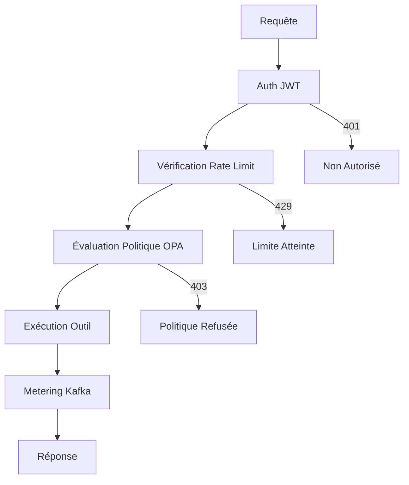

import EnvSetup from '@site/docs/_partials/_env-setup.mdx';

# API MCP Gateway

Référence complète des endpoints MCP du STOA Gateway.

<EnvSetup />

## Vue d'Ensemble

Le STOA Gateway implémente la spécification [Model Context Protocol](https://modelcontextprotocol.io) (MCP) version `2025-03-26`, avec compatibilité ascendante pour `2024-11-05`.

Deux modes d'accès :

| Mode | Transport | Cas d'usage |
|------|-----------|-------------|
| **REST** | HTTP POST | Scripts, intégrations simples, appels ponctuels |
| **Protocole MCP** | SSE (JSON-RPC) | Agents IA, streaming, sessions |

## Authentification

Tous les endpoints (sauf la découverte) nécessitent un Bearer token JWT depuis Keycloak :

```bash
# Obtenir un token
TOKEN=$(curl -s -X POST "${STOA_AUTH_URL}/realms/stoa/protocol/openid-connect/token" \
  -d "client_id=my-app" \
  -d "client_secret=${CLIENT_SECRET}" \
  -d "grant_type=client_credentials" | jq -r '.access_token')

# Utiliser le token
curl -H "Authorization: Bearer ${TOKEN}" "${STOA_GATEWAY_URL}/mcp/v1/tools"
```

Endpoints publics (aucune authentification requise) : `initialize`, `ping` et la découverte OAuth.

---

## Endpoints REST

Endpoints HTTP simples pour les opérations sur les outils.

### Lister les Outils

```http
POST /mcp/v1/tools
Authorization: Bearer <token>
Content-Type: application/json
```

**Réponse :**

```json
{
  "tools": [
    {
      "name": "get-weather",
      "description": "Returns current weather for a given city",
      "inputSchema": {
        "type": "object",
        "properties": {
          "q": { "type": "string", "description": "City name" }
        },
        "required": ["q"]
      },
      "annotations": {
        "readOnlyHint": true,
        "destructiveHint": false,
        "idempotentHint": true,
        "openWorldHint": true
      }
    }
  ]
}
```

### Invoquer un Outil

```http
POST /mcp/v1/tools/invoke
Authorization: Bearer <token>
Content-Type: application/json

{
  "name": "get-weather",
  "arguments": { "q": "Paris" }
}
```

**Réponse :**

```json
{
  "content": [
    {
      "type": "text",
      "text": "{\"location\":{\"name\":\"Paris\"},\"current\":{\"temp_c\":12.0}}"
    }
  ],
  "isError": false
}
```

---

## Endpoints du Protocole MCP (JSON-RPC sur SSE)

Conformité complète à la spécification MCP via le transport Server-Sent Events.

### Initialiser une Session

Handshake avec négociation de version du protocole :

```http
POST /mcp/sse
Authorization: Bearer <token>
Content-Type: application/json

{
  "jsonrpc": "2.0",
  "method": "initialize",
  "params": {
    "protocolVersion": "2025-03-26",
    "capabilities": {
      "tools": {}
    },
    "clientInfo": {
      "name": "my-agent",
      "version": "1.0.0"
    }
  },
  "id": 1
}
```

**Réponse :**

```json
{
  "jsonrpc": "2.0",
  "result": {
    "protocolVersion": "2025-03-26",
    "capabilities": {
      "tools": { "listChanged": true },
      "tokenOptimization": {
        "supported": true,
        "levels": ["none", "moderate", "aggressive"]
      },
      "elicitation": {}
    },
    "serverInfo": {
      "name": "stoa-gateway",
      "version": "0.1.0"
    }
  },
  "id": 1
}
```

### Lister les Outils (JSON-RPC)

```http
POST /mcp/sse
Content-Type: application/json

{
  "jsonrpc": "2.0",
  "method": "tools/list",
  "id": 2
}
```

### Appeler un Outil (JSON-RPC)

```http
POST /mcp/sse
Content-Type: application/json

{
  "jsonrpc": "2.0",
  "method": "tools/call",
  "params": {
    "name": "get-weather",
    "arguments": { "q": "London" }
  },
  "id": 3
}
```

### Requêtes Batch (MCP 2025-03-26)

Envoyer plusieurs requêtes JSON-RPC en un seul appel :

```http
POST /mcp/sse
Content-Type: application/json

[
  {
    "jsonrpc": "2.0",
    "method": "tools/call",
    "params": { "name": "get-weather", "arguments": { "q": "Paris" } },
    "id": 1
  },
  {
    "jsonrpc": "2.0",
    "method": "tools/call",
    "params": { "name": "get-weather", "arguments": { "q": "London" } },
    "id": 2
  }
]
```

Toutes les requêtes sont traitées de manière concurrente. La réponse est un tableau de résultats JSON-RPC.

### Ping

```http
POST /mcp/sse
Content-Type: application/json

{ "jsonrpc": "2.0", "method": "ping", "id": 99 }
```

### Fermer une Session

```http
DELETE /mcp/sse?sessionId=<session-id>
```

### Flux SSE (Héritage)

```http
GET /mcp/sse?sessionId=<session-id>
```

Ouvre une connexion SSE persistante pour les réponses en streaming.

### Méthodes JSON-RPC Supportées

| Méthode | Auth Requise | Description |
|---------|-------------|-------------|
| `initialize` | Non | Handshake + négociation de version |
| `ping` | Non | Maintien de connexion |
| `notifications/initialized` | Non | Accusé de réception client (sans réponse) |
| `tools/list` | Oui | Lister les outils disponibles |
| `tools/call` | Oui | Exécuter un outil |
| `resources/list` | Oui | Lister les ressources (retourne `[]`) |

---

## Endpoints de Découverte

### Découverte du Serveur MCP

```http
GET /mcp
```

Retourne les métadonnées du serveur : nom, version, version du protocole, endpoints disponibles.

### Capacités MCP

```http
GET /mcp/capabilities
```

Retourne des informations détaillées sur les capacités, y compris les fonctionnalités supportées.

### Santé MCP

```http
GET /mcp/health
```

Retourne la santé spécifique MCP : nombre d'outils, sessions actives, statut.

---

## Découverte OAuth 2.1

STOA implémente la découverte OAuth 2.1 selon la RFC 9728, permettant aux agents IA de s'authentifier automatiquement.

### Métadonnées de la Ressource Protégée (RFC 9728)

```http
GET /.well-known/oauth-protected-resource
```

```json
{
  "resource": "https://mcp.<YOUR_DOMAIN>",
  "authorization_servers": ["https://auth.<YOUR_DOMAIN>/realms/stoa"],
  "scopes_supported": ["stoa:read", "stoa:write", "stoa:execute"]
}
```

### Métadonnées du Serveur d'Autorisation (RFC 8414)

```http
GET /.well-known/oauth-authorization-server
```

### Découverte OpenID Connect

```http
GET /.well-known/openid-configuration
```

### Proxy de Token

```http
POST /oauth/token
```

Proxy transparent vers l'endpoint de token Keycloak. Permet aux agents IA d'obtenir des tokens sans connaître l'URL de Keycloak.

### Enregistrement Dynamique de Client

```http
POST /oauth/register
```

Proxy vers l'endpoint DCR de Keycloak pour l'enregistrement automatique de clients.

---

## Pipeline d'Exécution

Chaque invocation d'outil passe par ce pipeline :



1. **Auth JWT** — Bearer token validé contre les JWKS de Keycloak
2. **Rate Limit** — Vérification du quota par consumer (si configuré)
3. **Politique OPA** — Contrôle d'accès basé sur les rôles avec scopes
4. **Exécution d'outil** — Appel HTTP vers l'endpoint backend
5. **Metering Kafka** — Événement émis pour l'analytique (optionnel, géré par feature flag)

### Correspondance des Scopes RBAC

| Rôle | Scopes |
|------|--------|
| `cpi-admin` | `admin`, `read`, `write`, `execute`, `deploy`, `audit` |
| `tenant-admin` | `read`, `write`, `execute` |
| `devops` | `read`, `write`, `deploy` |
| `viewer` | `read` |

---

## Optimisation des Tokens

Réduire la consommation de tokens LLM avec l'en-tête `X-Token-Optimization` :

```bash
curl -X POST "${STOA_GATEWAY_URL}/mcp/tools/call" \
  -H "Authorization: Bearer ${TOKEN}" \
  -H "X-Token-Optimization: aggressive" \
  -H "Content-Type: application/json" \
  -d '{"name": "get-weather", "arguments": {"q": "Paris"}}'
```

| Niveau | Effet |
|--------|-------|
| `none` | Réponse complète (par défaut) |
| `moderate` | Suppression des champs redondants |
| `aggressive` | Réponse minimale, optimisée pour le contexte LLM |

---

## Gestion des Sessions

Les sessions SSE ont un TTL configurable (par défaut : 30 minutes). Les sessions sont automatiquement nettoyées par une tâche de fond.

### Statistiques des Sessions (Admin)

```http
GET /admin/sessions/stats
Authorization: Bearer <admin-token>
```

```json
{
  "active_sessions": 12,
  "zombie_sessions": 0,
  "total_created": 1543
}
```

---

## Réponses d'Erreur

| Statut | Erreur | Cause |
|--------|--------|-------|
| `401` | `Unauthorized` | Token JWT manquant ou expiré |
| `403` | `Forbidden` | Politique OPA a refusé l'action |
| `404` | `Tool not found` | Nom d'outil absent du registre |
| `429` | `Rate limited` | Quota consumer dépassé |
| `500` | `Tool execution failed` | L'endpoint backend a retourné une erreur |
| `502` | `Backend unreachable` | L'endpoint backend est indisponible |

Les erreurs JSON-RPC suivent la spécification MCP :

```json
{
  "jsonrpc": "2.0",
  "error": {
    "code": -32602,
    "message": "Tool not found: unknown-tool"
  },
  "id": 3
}
```

---

## Exemples

### Client Python

```python
import os
import requests

STOA_AUTH_URL = os.environ['STOA_AUTH_URL']
STOA_GATEWAY_URL = os.environ['STOA_GATEWAY_URL']

# Authentification
auth = requests.post(
    f'{STOA_AUTH_URL}/realms/stoa/protocol/openid-connect/token',
    data={
        'client_id': 'my-app',
        'client_secret': os.environ['STOA_CLIENT_SECRET'],
        'grant_type': 'client_credentials'
    }
)
token = auth.json()['access_token']

# Invoquer un outil
response = requests.post(
    f'{STOA_GATEWAY_URL}/mcp/tools/call',
    headers={'Authorization': f'Bearer {token}'},
    json={'name': 'get-weather', 'arguments': {'q': 'Paris'}}
)

result = response.json()
print(result['content'][0]['text'])
```

### Client JavaScript

```javascript
const STOA_GATEWAY_URL = process.env.STOA_GATEWAY_URL;

const response = await fetch(`${STOA_GATEWAY_URL}/mcp/tools/call`, {
  method: 'POST',
  headers: {
    'Authorization': `Bearer ${token}`,
    'Content-Type': 'application/json'
  },
  body: JSON.stringify({
    name: 'get-weather',
    arguments: { q: 'Paris' }
  })
});

const result = await response.json();
console.log(result.content[0].text);
```

---

## Voir Aussi

- [Démarrer avec MCP](/docs/guides/mcp-getting-started) — Tutoriel pratique
- [Développement d'Outils MCP](/docs/guides/mcp-tools-development) — Créer des outils personnalisés
- [Fiche Protocole MCP](/docs/guides/fiches/mcp-protocol) — Approfondissement du protocole
- [Référence CRD](/docs/reference/crds/) — Spécifications Tool et ToolSet
