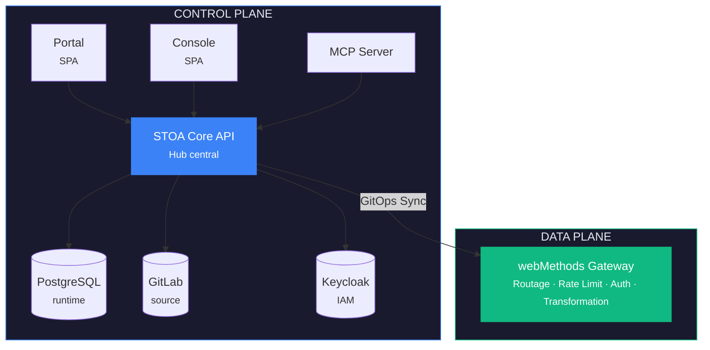
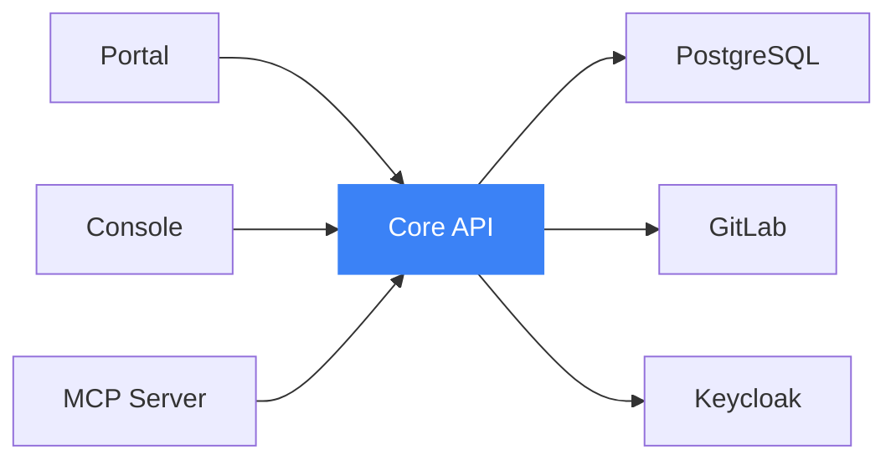
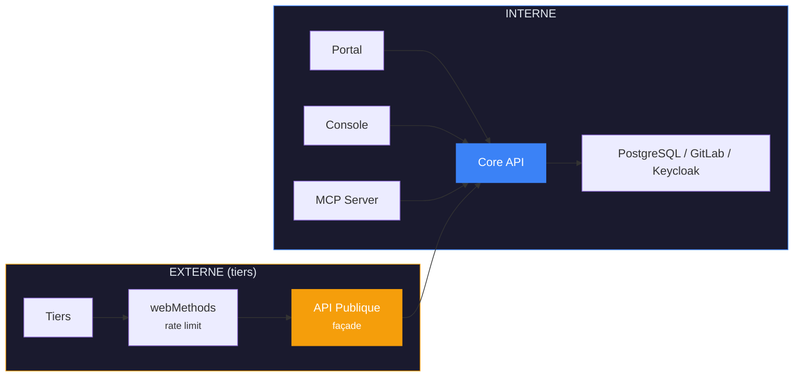

# ADR-001 : Stratégie d'exposition des API tierces — Façade API publique

## Métadonnées

| Champ | Valeur |
|-------|--------|
| **Statut** | ✅ Accepté |
| **Date** | 18 janvier 2026 |
| **Linear** | [CAB-669](https://linear.app/hlfh-workspace/issue/CAB-669) (Epic) |

## Contexte

La plateforme STOA évolue avec plusieurs composants en parallèle : Control Plane API (FastAPI), MCP Gateway, Portail Développeur (React), Console (React) et webMethods Gateway.

### Problèmes identifiés

| Problème | Impact | Sévérité |
|----------|--------|----------|
| **Dépendances croisées** | Chaque composant accède directement à PostgreSQL, GitLab, Keycloak | 🔴 Élevée |
| **Rôle flou de webMethods** | Utilisé pour l'administration ET le runtime, difficile à faire évoluer | 🔴 Élevée |
| **Duplication de logique** | Validation, authentification, isolation tenant répétées partout | 🟡 Moyenne |
| **Déploiement couplé** | Impossible de déployer le Portal sans le MCP Gateway | 🟡 Moyenne |

### Question architecturale

> **Comment structurer les composants STOA pour qu'ils soient déployables indépendamment, tout en maintenant GitLab comme source de vérité et en clarifiant le rôle de chaque élément ?**

## Décision

Adopter une architecture **Control Plane / Data Plane** avec le Core API comme hub central.

### Options envisagées

| Option | Description | Verdict |
|--------|-------------|---------|
| **A. Monolithe modulaire** | Tout dans un seul artefact | ❌ Contre l'open-core, passage à l'échelle tout-ou-rien |
| **B. Microservices purs** | Un service par domaine | ❌ Surdimensionné pour la taille de l'équipe |
| **C. Control Plane / Data Plane** | Séparation claire des responsabilités | ✅ **Retenu** |

### Architecture



### Composants

| Composant | Type | Rôle | Dépendances |
|-----------|------|------|-------------|
| **STOA Core API** | Backend (FastAPI) | Hub central, toute la logique métier | PostgreSQL, GitLab, Keycloak |
| **STOA Portal** | Frontend (React) | Self-service développeur | Core API uniquement |
| **STOA Console** | Frontend (React) | Administration de la plateforme | Core API uniquement |
| **STOA MCP Server** | Backend (Python) | Interface IA/LLM | Core API uniquement |
| **webMethods Gateway** | Data Plane | Exécution du trafic API runtime | Synchronisation config depuis Core API |

### Règles d'architecture

#### Règle 1 : Dépendances unidirectionnelles



**Interdit :** Portal → PostgreSQL (direct), MCP Server → GitLab (direct)

#### Règle 2 : GitLab = Source de vérité pour les définitions

```yaml
# Ce qui réside dans GitLab (stoa-catalog)
stoa-catalog/
  tenants/{tenant}/
    apis/{api}/
      api.yaml       # Définition de l'API
      openapi.yaml   # Spécification OpenAPI

# Ce qui réside dans PostgreSQL
- subscriptions, api_keys, audit_logs, rate_limit_usage, mcp_sessions
```

#### Règle 3 : webMethods = Data Plane uniquement

✅ **À FAIRE :** Routage, Rate limiting, Validation JWT, Transformation, Cache
❌ **À NE PAS FAIRE :** Servir des interfaces, Gérer les souscriptions, Stocker des données

## Façade API publique

### Architecture



### Endpoints exposés aux tiers

```yaml
/v1/portal/:
  catalog:           # Public ou clé API
    GET /apis, GET /apis/{id}, GET /apis/{id}/spec
  subscriptions:     # OAuth2 requis
    GET/POST/DELETE /subscriptions
  me:                # OAuth2 requis
    GET /me, GET /me/usage
```

**JAMAIS exposés :** `/v1/admin/*`, `/v1/tenants/*/members`, `/v1/gateway/*`

## Conséquences

### Positives

- ✅ Déploiement indépendant des composants
- ✅ GitLab reste la source de vérité
- ✅ Séparation claire Control Plane / Data Plane
- ✅ Exposition tierce sécurisée

### Négatives

- ⚠️ Latence supplémentaire (MCP → Core API vs accès direct DB)
- ⚠️ Effort de migration

## Références

- Séparation Control Plane / Data Plane de Kubernetes
- Istio Pilot (contrôle) vs Envoy (données)
- Architecture Kong Konnect
- [ADR-012 : Architecture MCP Tools](./adr-012-mcp-rbac-architecture.md)
