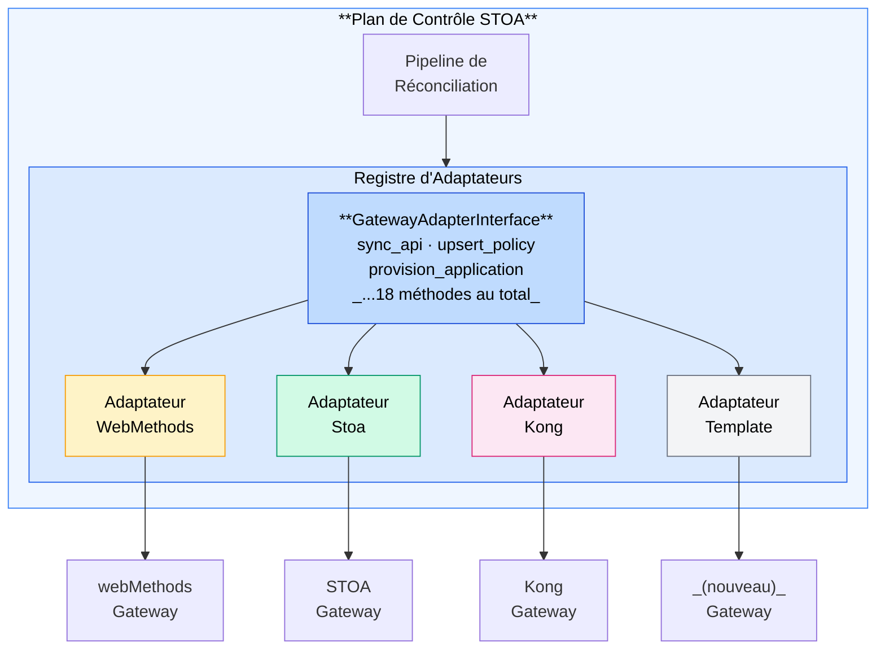

# ADR-004 : Pattern Adaptateur Gateway — Orchestration multi-gateway

## Métadonnées

| Champ | Valeur |
|-------|--------|
| **Statut** | Accepté |
| **Date** | 2026-02-06 |
| **Linear** | N/A (Fondamental) |
| **Recherche** | Éligible CIR : Réconciliation déclarative de gateways API propriétaires |

## Contexte

La plateforme STOA doit orchestrer plusieurs API gateways (webMethods, Kong, Apigee, AWS API Gateway) via un plan de contrôle unifié. Chaque gateway dispose d'une API d'administration différente, de mécanismes d'authentification différents et de modèles de ressources différents.

### Le problème

> « Comment gérer les API sur des gateways hétérogènes sans créer N codebases différentes ? »

Les approches traditionnelles conduisent soit à :
1. **Verrouillage fournisseur** — Couplage fort à un seul gateway
2. **Plus petit dénominateur commun** — Prise en charge des seules fonctionnalités communes à tous les gateways
3. **Duplication de code** — Implémentation d'intégrations séparées par gateway

STOA nécessite une abstraction permettant :
- L'utilisation complète des fonctionnalités de chaque gateway
- Une réconciliation GitOps unifiée
- Des implémentations d'adaptateurs testables
- L'ajout de nouveaux gateways sans modifier le plan de contrôle

### Contexte de recherche

Ce pattern est issu de recherches sur la réconciliation déclarative de gateways API propriétaires — notamment webMethods, qui ne dispose ni de provider Terraform ni d'opérateur Kubernetes. La solution représente une recherche originale dans l'application des principes GitOps à des logiciels d'entreprise à code fermé.

## Décision

Adopter le **Pattern Adaptateur Gateway** — une interface abstraite définissant toutes les opérations requises par la réconciliation GitOps de STOA, avec des implémentations concrètes par type de gateway.

### Architecture



### Contrat d'interface

```python
class GatewayAdapterInterface(ABC):
    """Interface abstraite pour l'orchestration de gateway.

    Toutes les opérations DOIVENT être idempotentes : appeler la même opération deux fois
    avec la même entrée doit produire le même résultat sans effets de bord.
    """

    # --- Cycle de vie (3 méthodes) ---
    async def health_check(self) -> AdapterResult: ...
    async def connect(self) -> None: ...
    async def disconnect(self) -> None: ...

    # --- APIs (3 méthodes) ---
    async def sync_api(self, api_spec: dict, tenant_id: str) -> AdapterResult: ...
    async def delete_api(self, api_id: str) -> AdapterResult: ...
    async def list_apis(self) -> list[dict]: ...

    # --- Policies (3 méthodes) ---
    async def upsert_policy(self, policy_spec: dict) -> AdapterResult: ...
    async def delete_policy(self, policy_id: str) -> AdapterResult: ...
    async def list_policies(self) -> list[dict]: ...

    # --- Applications (3 méthodes) ---
    async def provision_application(self, app_spec: dict) -> AdapterResult: ...
    async def deprovision_application(self, app_id: str) -> AdapterResult: ...
    async def list_applications(self) -> list[dict]: ...

    # --- Auth/OIDC (3 méthodes) ---
    async def upsert_auth_server(self, auth_spec: dict) -> AdapterResult: ...
    async def upsert_strategy(self, strategy_spec: dict) -> AdapterResult: ...
    async def upsert_scope(self, scope_spec: dict) -> AdapterResult: ...

    # --- Alias (1 méthode) ---
    async def upsert_alias(self, alias_spec: dict) -> AdapterResult: ...

    # --- Configuration (1 méthode) ---
    async def apply_config(self, config_spec: dict) -> AdapterResult: ...

    # --- Sauvegarde (1 méthode) ---
    async def export_archive(self) -> bytes: ...
```

### Résultat standardisé

Toutes les opérations retournent un type de résultat cohérent :

```python
@dataclass
class AdapterResult:
    success: bool
    resource_id: str | None = None  # ID côté gateway
    data: dict | None = None        # Données de réponse supplémentaires
    error: str | None = None        # Message d'erreur en cas d'échec
```

## Registre d'adaptateurs

Pattern factory pour créer des instances d'adaptateurs :

```python
class AdapterRegistry:
    _adapters: dict[str, type[GatewayAdapterInterface]] = {}

    @classmethod
    def register(cls, gateway_type: str, adapter_class: type) -> None:
        cls._adapters[gateway_type] = adapter_class

    @classmethod
    def create(cls, gateway_type: str, config: dict) -> GatewayAdapterInterface:
        adapter_class = cls._adapters.get(gateway_type)
        if not adapter_class:
            raise ValueError(f"Aucun adaptateur pour '{gateway_type}'")
        return adapter_class(config=config)
```

### Adaptateurs enregistrés

| Type | Classe | Statut | Cas d'usage |
|------|--------|--------|-------------|
| `webmethods` | `WebMethodsGatewayAdapter` | Production | Gateway entreprise |
| `stoa` | `StoaGatewayAdapter` | Production | Gateway interne/MCP |
| `template` | `TemplateGatewayAdapter` | Scaffolding | Développement de nouveaux adaptateurs |
| `kong` | (planifié) | T2 2026 | Gateway OSS |
| `apigee` | (planifié) | T3 2026 | Google Cloud |

## Structure d'implémentation

```
control-plane-api/src/adapters/
├── __init__.py
├── gateway_adapter_interface.py   # Interface abstraite
├── registry.py                    # Factory d'adaptateurs
│
├── webmethods/                    # Adaptateur de production
│   ├── __init__.py
│   ├── adapter.py                 # WebMethodsGatewayAdapter
│   ├── client.py                  # Client HTTP pour l'API webMethods
│   └── mappers.py                 # Traduction Spec <-> webMethods
│
├── stoa/                          # Adaptateur interne
│   ├── __init__.py
│   └── adapter.py                 # StoaGatewayAdapter
│
└── template/                      # Scaffolding pour les nouveaux adaptateurs
    ├── __init__.py
    ├── adapter.py                 # TemplateGatewayAdapter
    └── mappers.py                 # Commentaires TODO pour l'implémentation
```

## Exigences d'idempotence

Toutes les opérations d'adaptateur DOIVENT être idempotentes :

| Opération | Comportement idempotent |
|-----------|------------------------|
| `sync_api` | Crée si absent, met à jour si existant (upsert) |
| `delete_api` | Sans effet si déjà supprimé |
| `upsert_policy` | Crée ou met à jour selon l'ID de policy |
| `provision_application` | Retourne l'ID d'application existant si déjà provisionné |
| `health_check` | Sûr à appeler plusieurs fois |

### Boucle de réconciliation idempotente

```python
async def reconcile_api(adapter: GatewayAdapterInterface, api_spec: dict):
    """Réconciliation idempotente — sûre à rejouer en cas d'échec."""

    # 1. Vérifier l'état actuel
    existing = await adapter.list_apis()

    # 2. Synchroniser l'état désiré (crée ou met à jour)
    result = await adapter.sync_api(api_spec, tenant_id)

    if not result.success:
        # Logger et rejouer — idempotent, donc sûr
        logger.warning(f"Sync échoué : {result.error}")
        raise ReconciliationError(result.error)

    return result.resource_id
```

## Intégration GitOps

Le pattern adaptateur permet un GitOps déclaratif pour n'importe quel gateway :

```yaml
# stoa-gitops/tenants/acme/apis/payment-api/api.yaml
apiVersion: gostoa.dev/v1alpha1
kind: API
metadata:
  name: payment-api
  tenant: acme
spec:
  gateway_type: webmethods  # Sélectionne l'adaptateur
  openapi: ./openapi.yaml
  policies:
    - rate-limit-100rpm
    - jwt-validation
```

Le pipeline de réconciliation :
1. Détecte un changement dans Git
2. Charge la spécification API depuis YAML
3. Utilise `AdapterRegistry.create("webmethods")` pour obtenir l'adaptateur
4. Appelle `adapter.sync_api(spec, "acme")`
5. Enregistre le résultat dans le journal d'audit

## Conséquences

### Positives

- **Agnostique au gateway** — Le plan de contrôle ne connaît pas les détails internes des gateways
- **Testable** — Adaptateurs mock pour les tests unitaires, adaptateurs réels pour l'intégration
- **Extensible** — Ajout d'un nouveau gateway sans modifier le plan de contrôle
- **Idempotent** — Rejeux sûrs, compatible GitOps
- **Neutre vis-à-vis des fournisseurs** — Évite le verrouillage sur un seul gateway

### Négatives

- **Surcoût d'abstraction** — Certaines fonctionnalités spécifiques au gateway peuvent ne pas correspondre à l'interface
- **Complexité de mapping** — Chaque adaptateur doit traduire vers/depuis les formats spécifiques au gateway
- **Dérive de version** — Les versions d'API des gateways peuvent diverger entre implémentations

### Atténuations

| Défi | Atténuation |
|------|-------------|
| Lacunes fonctionnelles | Le champ `data` dans AdapterResult transporte les extras spécifiques au gateway |
| Complexité de mapping | Module `mappers.py` dédié par adaptateur |
| Dérive de version | Les tests d'adaptateur s'exécutent contre des versions spécifiques de gateway |

## Ajout d'un nouveau gateway

Pour ajouter la prise en charge de Kong :

1. Copier `template/` vers `kong/`
2. Implémenter `KongGatewayAdapter` en suivant les TODO de `mappers.py`
3. Enregistrer dans `registry.py` :
   ```python
   from .kong import KongGatewayAdapter
   AdapterRegistry.register("kong", KongGatewayAdapter)
   ```
4. Ajouter des tests d'intégration contre l'API Admin de Kong
5. Mettre à jour la documentation

## Références

- [control-plane-api/src/adapters/](https://github.com/stoa-platform/stoa/tree/main/control-plane-api/src/adapters/)
- [ADR-024 — Architecture Gateway Unifiée](./adr-024-gateway-unified-modes.md)
- [ADR-007 — GitOps avec ArgoCD](./adr-007-gitops-argocd.md)
- [Pattern Adaptateur — Wikipedia](https://en.wikipedia.org/wiki/Adapter_pattern)

---

*Standard Marchemalo : Un architecte vétéran de 40 ans comprend en 30 secondes*
