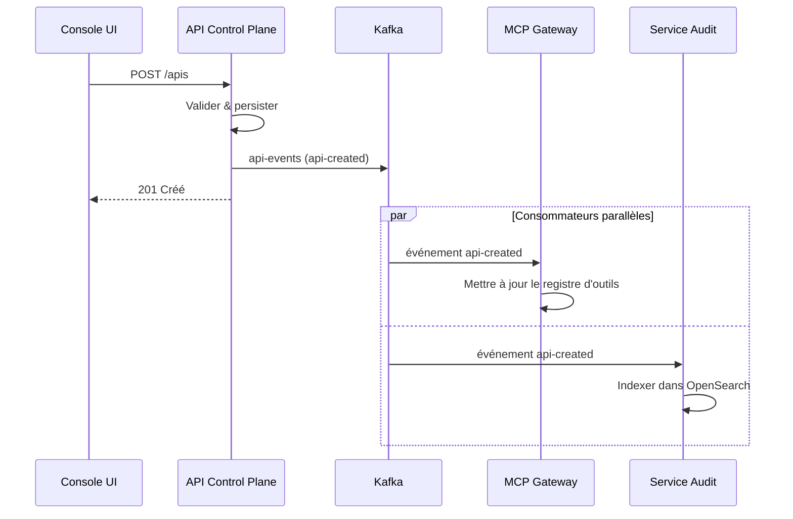
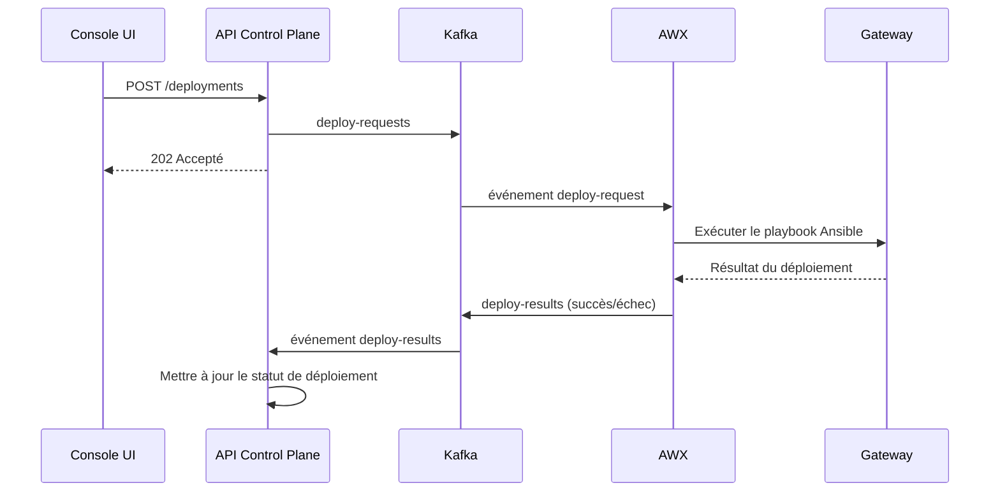

# ADR-005 : Architecture événementielle — Conception des topics Kafka

## Métadonnées

| Champ | Valeur |
|-------|--------|
| **Statut** | Accepté |
| **Date** | 2026-02-06 |
| **Linear** | N/A (Fondamental) |

## Contexte

La plateforme STOA nécessite une communication asynchrone entre ses composants :

- **L'API Control Plane** publie des événements lors des modifications de ressources
- **AWX/Ansible** consomme les demandes de déploiement et remonte les résultats
- **Le MCP Gateway** synchronise les catalogues d'outils en fonction des événements GitOps
- **Le service d'audit** ingère toutes les actions à des fins de conformité
- **L'observabilité** suit la santé des gateways et les dérives

### Le problème

> « Comment permettre un couplage lâche entre services tout en maintenant cohérence et auditabilité ? »

Les appels REST synchrones traditionnels créent un couplage fort et des pannes en cascade. STOA nécessite une architecture événementielle qui :

- Découple les producteurs des consommateurs
- Permet le rejeu et la récupération
- Supporte l'isolation multi-tenant
- Fournit une piste d'audit

## Décision

Adopter **Apache Kafka** (compatible Redpanda) comme colonne vertébrale événementielle avec une structure de topics standardisée et un format d'enveloppe d'événement.

### Schéma d'enveloppe d'événement

Tous les événements suivent une enveloppe cohérente :

```json
{
  "id": "uuid-v4",
  "type": "nom-type-evenement",
  "tenant_id": "identifiant-tenant",
  "timestamp": "2026-02-06T10:30:00.000Z",
  "user_id": "utilisateur-declencheur",
  "payload": {
    // Données spécifiques à l'événement
  }
}
```

### Inventaire des topics

| Topic | Types d'événements | Producteur | Consommateur |
|-------|-------------------|------------|--------------|
| `api-events` | api-created, api-updated, api-deleted | API Control Plane | MCP Gateway, Audit |
| `deploy-requests` | deploy-request | API Control Plane | AWX |
| `deploy-results` | deploy-success, deploy-failure | AWX | API Control Plane |
| `app-events` | app-created, app-updated, app-deleted | API Control Plane | Gateway, Audit |
| `tenant-events` | tenant-created, tenant-updated, tenant-deleted | API Control Plane | Keycloak, Audit |
| `audit-log` | audit | Tous les services | Service Audit, OpenSearch |
| `mcp-server-events` | mcp-server-registered, mcp-server-updated | API Control Plane | MCP Gateway |
| `mcp-sync-requests` | sync-request | Console UI | MCP Gateway |
| `mcp-sync-results` | sync-success, sync-failure | MCP Gateway | API Control Plane |
| `gateway-sync-requests` | sync-request | API Control Plane | Adaptateur Gateway |
| `gateway-sync-results` | sync-success, sync-failure | Adaptateur Gateway | API Control Plane |
| `gateway-events` | health-changed, drift-detected, reconciled | Adaptateur Gateway | Observabilité |

## Architecture

```
┌──────────────────────────────────────────────────────────────────────┐
│                         PRODUCTEURS                                    │
│  ┌──────────────┐  ┌──────────────┐  ┌──────────────┐               │
│  │ Control Plane│  │   Console    │  │    AWX       │               │
│  │     API      │  │     UI       │  │  (Ansible)   │               │
│  └──────┬───────┘  └──────┬───────┘  └──────┬───────┘               │
└─────────┼─────────────────┼─────────────────┼───────────────────────┘
          │                 │                 │
          ▼                 ▼                 ▼
┌─────────────────────────────────────────────────────────────────────┐
│                    CLUSTER KAFKA / REDPANDA                          │
│  ┌─────────────┐ ┌─────────────┐ ┌─────────────┐ ┌─────────────┐   │
│  │ api-events  │ │deploy-req.  │ │ audit-log   │ │gateway-sync │   │
│  │ (3 partns)  │ │ (3 partns)  │ │ (6 partns)  │ │ (3 partns)  │   │
│  └─────────────┘ └─────────────┘ └─────────────┘ └─────────────┘   │
│  ┌─────────────┐ ┌─────────────┐ ┌─────────────┐ ┌─────────────┐   │
│  │ app-events  │ │tenant-event │ │mcp-server   │ │mcp-sync-*   │   │
│  │ (3 partns)  │ │ (3 partns)  │ │  events     │ │ req/results │   │
│  └─────────────┘ └─────────────┘ └─────────────┘ └─────────────┘   │
└─────────────────────────────────────────────────────────────────────┘
          │                 │                 │
          ▼                 ▼                 ▼
┌─────────────────────────────────────────────────────────────────────┐
│                         CONSOMMATEURS                                 │
│  ┌──────────────┐  ┌──────────────┐  ┌──────────────┐               │
│  │  MCP Gateway │  │ Service Audit│  │ Observabilité│               │
│  │   (registre  │  │ (OpenSearch) │  │   (Grafana)  │               │
│  │   d'outils)  │  │              │  │              │               │
│  └──────────────┘  └──────────────┘  └──────────────┘               │
└─────────────────────────────────────────────────────────────────────┘
```

## Stratégie de partitionnement

Les événements sont partitionnés par `tenant_id` pour garantir :

1. **Ordonnancement** — Les événements du même tenant arrivent dans l'ordre
2. **Parallélisme** — Les différents tenants sont traités en parallèle
3. **Isolation** — Les groupes de consommateurs peuvent filtrer par tenant

```python
async def publish(self, topic: str, event_type: str, tenant_id: str, payload: dict):
    event = self._create_event(event_type, tenant_id, payload)
    partition_key = tenant_id  # Partition par tenant

    future = self._producer.send(topic, value=event, key=partition_key)
    future.get(timeout=10)  # Attendre l'acquittement
```

## Groupes de consommateurs

| Groupe de consommateurs | Topics | Objectif |
|------------------------|--------|----------|
| `mcp-gateway-sync` | api-events, mcp-server-events | Mises à jour du registre d'outils |
| `awx-worker` | deploy-requests | Traitement des jobs de déploiement |
| `audit-ingester` | audit-log, api-events, app-events | Indexation OpenSearch |
| `gateway-orchestrator` | gateway-sync-requests | Réconciliation gateway |
| `observability-collector` | gateway-events | Métriques/alertes |

## Exemples de flux d'événements

### Flux de création d'API



### Flux de déploiement



## Résilience des connexions

Les connexions Kafka incluent une logique de retry :

```python
async def connect(self):
    max_retries = 5
    retry_delay = 2

    for attempt in range(max_retries):
        try:
            self._producer = KafkaProducer(
                bootstrap_servers=settings.KAFKA_BOOTSTRAP_SERVERS.split(","),
                acks="all",  # Attendre tous les réplicas
                retries=3,
                request_timeout_ms=10000,
            )
            return
        except Exception as e:
            if attempt < max_retries - 1:
                logger.warning(f"Tentative {attempt + 1} échouée, nouvelle tentative...")
                time.sleep(retry_delay)
            else:
                raise
```

## Compatibilité Redpanda

STOA utilise Redpanda comme alternative compatible Kafka :

| Fonctionnalité | Kafka | Redpanda |
|----------------|-------|----------|
| Protocole | Kafka 2.x | Compatible |
| JVM | Requis | Aucun (C++) |
| ZooKeeper | Requis (< 3.x) | Aucun |
| Nœud unique | Complexe | Simple |
| Performances | Bonnes | Meilleure latence |

Configuration :

```yaml
# docker-compose.yml
services:
  redpanda:
    image: redpandadata/redpanda:latest
    command:
      - redpanda start
      - --kafka-addr 0.0.0.0:9092
      - --advertise-kafka-addr redpanda:9092
```

## Configuration des topics

Paramètres recommandés par catégorie de topic :

| Catégorie | Partitions | Rétention | Réplication |
|-----------|------------|-----------|-------------|
| Événements (api, app, tenant) | 3 | 7 jours | 3 |
| Requêtes (deploy, sync) | 3 | 1 jour | 3 |
| Résultats | 3 | 1 jour | 3 |
| Audit | 6 | 90 jours | 3 |
| Santé gateway | 3 | 1 jour | 3 |

## Conséquences

### Positives

- **Couplage lâche** — Les services communiquent via des événements, pas par appels directs
- **Fiabilité** — Kafka persiste les événements ; les consommateurs peuvent les rejouer
- **Scalabilité** — Les partitions permettent un traitement parallèle
- **Auditabilité** — Tous les événements sont enregistrés à des fins de conformité
- **Observabilité** — Les flux d'événements alimentent les tableaux de bord de surveillance

### Négatives

- **Cohérence éventuelle** — L'UI peut afficher brièvement des données périmées
- **Surcoût opérationnel** — Le cluster Kafka nécessite une administration
- **Ordonnancement des messages** — Garanti uniquement au sein d'une partition
- **Complexité de débogage** — Des traces distribuées sont nécessaires

### Atténuations

| Défi | Atténuation |
|------|-------------|
| Cohérence éventuelle | Mises à jour optimistes de l'UI + polling |
| Opérations | Redpanda géré ou Confluent Cloud |
| Ordonnancement | Partition par tenant_id |
| Débogage | Propagation de trace OpenTelemetry |

## Références

- [control-plane-api/src/services/kafka_service.py](https://github.com/stoa-platform/stoa/blob/main/control-plane-api/src/services/kafka_service.py)
- [ADR-007 — GitOps avec ArgoCD](./adr-007-gitops-argocd.md)
- [Documentation Apache Kafka](https://kafka.apache.org/documentation/)
- [Documentation Redpanda](https://docs.redpanda.com/)

---

*Standard Marchemalo : Un architecte vétéran de 40 ans comprend en 30 secondes*
