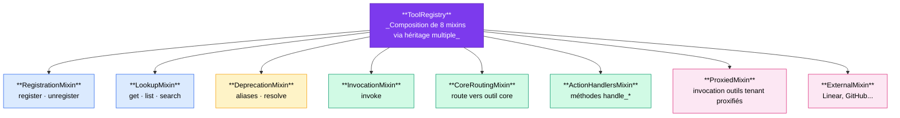

# ADR-006 : Architecture du registre d'outils — Conception modulaire en 7 modules

## Métadonnées

| Champ | Valeur |
|-------|--------|
| **Statut** | Accepté |
| **Date** | 2026-02-06 |
| **Linear** | CAB-841 (Refactorisation), CAB-603 (Core vs Proxied), CAB-605 (Consolidation) |

## Contexte

Le registre d'outils du MCP Gateway est le composant central pour la gestion des outils accessibles par l'IA. Initialement implémenté sous la forme d'un seul fichier de 1 984 lignes, il est devenu incontrôlable au fur et à mesure que les fonctionnalités se sont multipliées :

- Outils de plateforme centrale (stoa_*)
- Outils d'API tenant proxifiés (`{tenant}:{api}:{operation}`)
- Outils MCP externes (Linear, GitHub, etc.)
- Gestion des dépréciations lors du renommage d'outils
- Découverte d'outils via CRD Kubernetes

### Le problème

> « Le registre d'outils est devenu un objet-dieu. Ajouter une fonctionnalité nécessite de comprendre 2 000 lignes de code. »

La conception monolithique entraînait :
- Des conflits de fusion sur chaque PR
- Une surcharge cognitive pour les contributeurs
- Des difficultés à tester des aspects individuels
- Une itération lente sur les nouvelles fonctionnalités

## Décision

Refactoriser le registre d'outils en une **architecture modulaire basée sur des mixins** avec des modules à responsabilité unique.

### Architecture



### Structure des fichiers

```
mcp-gateway/src/services/tool_registry/
├── __init__.py           # Classe ToolRegistry (composition de mixins)
├── models.py             # Dataclass DeprecatedToolAlias
├── exceptions.py         # ToolNotFoundError
├── singleton.py          # get_tool_registry() au niveau module
│
├── registration.py       # RegistrationMixin — enregistrer/désenregistrer les outils
├── lookup.py             # LookupMixin — obtenir/lister/rechercher des outils
├── deprecation.py        # DeprecationMixin — gestion des alias
├── invocation.py         # InvocationMixin — point d'entrée principal invoke()
├── core_routing.py       # CoreRoutingMixin — routage vers les outils core
├── action_handlers.py    # ActionHandlersMixin — méthodes handle_*_action
├── proxied.py            # ProxiedMixin — invocation des outils tenant proxifiés
├── external.py           # ExternalMixin — serveurs MCP externes
└── legacy.py             # LegacyMixin — compatibilité ascendante
```

## Responsabilités des modules

### RegistrationMixin (registration.py)

Gère le cycle de vie des outils :

```python
class RegistrationMixin:
    async def register_tool(self, tool: Tool) -> None: ...
    async def unregister_tool(self, tool_name: str) -> None: ...
    async def _register_core_tools(self) -> None: ...
    async def _register_builtin_tools(self) -> None: ...
```

### LookupMixin (lookup.py)

Découverte et recherche d'outils :

```python
class LookupMixin:
    async def get_tool(self, name: str) -> Tool | None: ...
    async def list_tools(self, tenant_id: str = None) -> list[Tool]: ...
    async def search_tools(self, query: str) -> list[Tool]: ...
    def _resolve_deprecated_alias(self, name: str) -> str | None: ...
```

### DeprecationMixin (deprecation.py)

Gère le renommage des outils avec compatibilité ascendante :

```python
class DeprecationMixin:
    _deprecated_aliases: dict[str, DeprecatedToolAlias]

    async def _register_deprecation_aliases(self) -> None: ...
    def add_deprecated_alias(self, old_name: str, new_name: str) -> None: ...
```

Les alias assurent 60 jours de compatibilité ascendante :

```python
@dataclass
class DeprecatedToolAlias:
    old_name: str
    new_name: str
    deprecated_at: datetime
    expires_at: datetime  # deprecated_at + 60 jours
```

### InvocationMixin (invocation.py)

Point d'entrée principal pour l'exécution des outils :

```python
class InvocationMixin:
    async def invoke(
        self,
        tool_name: str,
        arguments: dict,
        context: InvocationContext
    ) -> ToolResult: ...
```

Route vers le gestionnaire approprié en fonction du type d'outil.

### CoreRoutingMixin (core_routing.py)

Route vers les outils de plateforme :

```python
class CoreRoutingMixin:
    async def _invoke_core_tool(
        self,
        tool: CoreTool,
        action: str,
        arguments: dict,
        context: InvocationContext
    ) -> ToolResult: ...
```

### ActionHandlersMixin (action_handlers.py)

Gestionnaires d'actions spécifiques au domaine :

```python
class ActionHandlersMixin:
    async def _handle_catalog_action(self, action: str, args: dict) -> ToolResult: ...
    async def _handle_subscription_action(self, action: str, args: dict) -> ToolResult: ...
    async def _handle_observability_action(self, action: str, args: dict) -> ToolResult: ...
    async def _handle_platform_action(self, action: str, args: dict) -> ToolResult: ...
    async def _handle_uac_action(self, action: str, args: dict) -> ToolResult: ...
    async def _handle_security_action(self, action: str, args: dict) -> ToolResult: ...
```

### ProxiedMixin (proxied.py)

Invoque les outils d'API tenant :

```python
class ProxiedMixin:
    async def _invoke_proxied_tool(
        self,
        tool: ProxiedTool,
        arguments: dict,
        context: InvocationContext
    ) -> ToolResult: ...
```

### ExternalMixin (external.py)

Gère les serveurs MCP externes (Linear, GitHub, etc.) :

```python
class ExternalMixin:
    async def register_external_server(self, server: ExternalMCPServer) -> None: ...
    async def invoke_external_tool(self, tool_name: str, args: dict) -> ToolResult: ...
```

## Types d'outils

### Outils Core (stoa_*)

Outils fournis par la plateforme avec une conception basée sur les actions :

| Outil | Domaine | Actions |
|-------|---------|---------|
| `stoa_catalog` | CATALOG | list_apis, get_api, search |
| `stoa_subscription` | SUBSCRIPTION | list, create, revoke |
| `stoa_observability` | OBSERVABILITY | get_metrics, get_logs |
| `stoa_platform` | PLATFORM | get_status, list_tenants |
| `stoa_uac` | UAC | validate, generate |
| `stoa_security` | SECURITY | check_policy, audit |

### Outils proxifiés (`{tenant}:{api}:{operation}`)

Enregistrés dynamiquement depuis les APIs tenant :

```python
# Exemple : acme:payment-api:create_payment
ProxiedTool(
    name="acme:payment-api:create_payment",
    tenant_id="acme",
    api_id="payment-api",
    operation="create_payment",
    endpoint="https://api.<YOUR_DOMAIN>/acme/payment-api/v1/payments",
    method="POST"
)
```

### Outils externes

Outils provenant de serveurs MCP externes :

```python
ExternalTool(
    name="linear:create_issue",
    server_id="linear-mcp",
    original_name="create_issue"
)
```

## Composition de la classe

La classe principale `ToolRegistry` compose tous les mixins :

```python
class ToolRegistry(
    DeprecationMixin,
    RegistrationMixin,
    LookupMixin,
    InvocationMixin,
    CoreRoutingMixin,
    ActionHandlersMixin,
    ProxiedMixin,
    ExternalMixin,
    LegacyMixin,
):
    def __init__(self) -> None:
        self._core_tools: dict[str, CoreTool] = {}
        self._proxied_tools: dict[str, ProxiedTool] = {}
        self._external_tools: dict[str, ExternalTool] = {}
        self._deprecated_aliases: dict[str, DeprecatedToolAlias] = {}
        self._http_client: httpx.AsyncClient | None = None
```

## Stratégie de stockage

Les différents types d'outils utilisent des dictionnaires séparés :

| Stockage | Format de clé | Type d'outil |
|----------|--------------|--------------|
| `_core_tools` | `stoa_DOMAINE` | CoreTool |
| `_proxied_tools` | `TENANT:API:OPERATION` | ProxiedTool |
| `_external_tools` | `SERVEUR:NOM_OUTIL` | ExternalTool |
| `_deprecated_aliases` | `ANCIEN_NOM` | DeprecatedToolAlias |

## Conséquences

### Positives

- **Responsabilité unique** — Chaque mixin gère une seule préoccupation
- **Testabilité** — Les mixins peuvent être testés de manière isolée
- **Lisibilité** — Les fichiers font 200-400 lignes au lieu de 2 000
- **Parallélisme** — Plusieurs développeurs peuvent travailler sur différents mixins
- **Extensibilité** — Les nouveaux types d'outils ajoutent de nouveaux mixins

### Négatives

- **Complexité des mixins** — L'héritage multiple requiert un ordonnancement soigneux
- **Découvrabilité** — Code réparti sur plusieurs fichiers
- **Dépendances circulaires** — Les mixins doivent éviter de s'importer mutuellement

### Atténuations

| Défi | Atténuation |
|------|-------------|
| Ordonnancement des mixins | Documenté dans `__init__.py`, vérifié par le CI |
| Découvrabilité | Nommage clair des fichiers, docstrings |
| Dépendances circulaires | Passage des dépendances via `__init__`, pas par imports |

## Performances

La recherche d'outils est O(1) via dictionnaire :

```python
async def get_tool(self, name: str) -> Tool | None:
    # Vérifier les outils core en premier (le plus courant)
    if name in self._core_tools:
        return self._core_tools[name]

    # Vérifier les alias dépréciés
    resolved = self._resolve_deprecated_alias(name)
    if resolved:
        return await self.get_tool(resolved)

    # Vérifier les outils proxifiés
    if name in self._proxied_tools:
        return self._proxied_tools[name]

    # Vérifier les outils externes
    return self._external_tools.get(name)
```

## Références

- [mcp-gateway/src/services/tool_registry/](https://github.com/stoa-platform/stoa/tree/main/mcp-gateway/src/services/tool_registry/)
- [ADR-012 — Architecture RBAC MCP](./adr-012-mcp-rbac-architecture.md)
- [CAB-841 — Refactorisation du registre d'outils](https://linear.app/stoa/issue/CAB-841)
- [CAB-603 — Séparation Core vs Proxied](https://linear.app/stoa/issue/CAB-603)
- [CAB-605 — Consolidation des outils](https://linear.app/stoa/issue/CAB-605)

---

*Standard Marchemalo : Un architecte vétéran de 40 ans comprend en 30 secondes*
