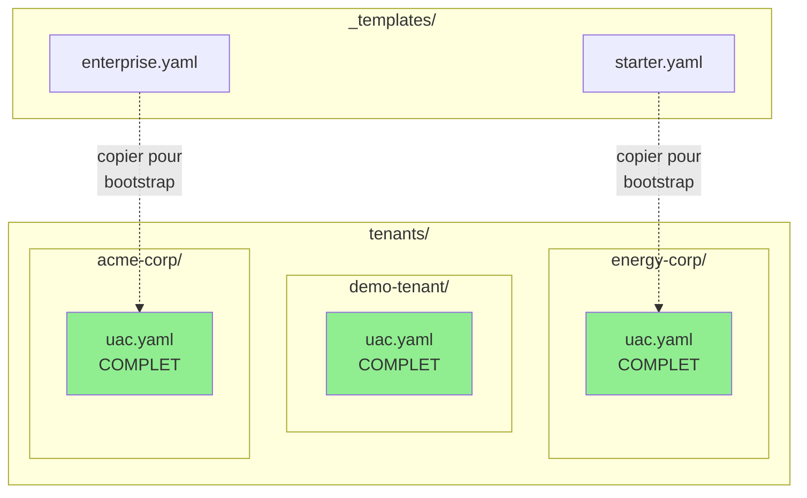

# ADR-022 : Architecture UAC Tenant — Fichiers Plats plutôt qu'Héritage

> **Décision :** Un fichier UAC complet et autonome par tenant, sans héritage ni fusion.
>
> **Statut :** Accepté
>
> **Date :** 2026-01-25
>
> **Linear :** [CAB-931](https://linear.app/hlfh-workspace/issue/CAB-931)

---

## Contexte

STOA Platform utilise des fichiers **UAC (Universal API Contract)** pour définir la configuration de chaque tenant : policies de sécurité, rate limiting, quotas, accès aux APIs, observabilité, etc.

### Question architecturale

> **Comment structurer les fichiers UAC pour supporter plusieurs tenants tout en restant maintenable, auditable et simple à déboguer ?**

### Contraintes identifiées

| Contrainte | Impact |
|------------|--------|
| **MVP 26/02/2026** | 2-3 tenants seulement pour la démo |
| **Auditabilité RSSI** | Le client veut voir "SON" fichier, pas un merge de 6 couches |
| **Debug rapide** | "D'où vient cette valeur ?" doit avoir une réponse immédiate |
| **CIR (Crédit Impôt Recherche)** | Architecture traçable et documentée |

---

## Décision

Adopter l'**Option A : Un UAC par Tenant (Plat)** — chaque tenant possède un fichier `uac.yaml` complet et autonome.

### Structure retenue

```
stoa-catalog/
├── _templates/
│   ├── starter.yaml      # Template tier Starter
│   └── enterprise.yaml   # Template tier Enterprise
└── tenants/
    ├── energy-corp/
    │   └── uac.yaml      # Config COMPLÈTE EnergyCorpEU
    ├── demo-tenant/
    │   └── uac.yaml      # Config COMPLÈTE demo
    └── acme-corp/
        └── uac.yaml      # Config COMPLÈTE Acme
```

### Diagramme



---

## Options Envisagées

### Option A — Un UAC par Tenant (Plat) ✅ RETENUE

Un fichier `uac.yaml` complet par tenant, avec templates pour le bootstrap initial.

| Aspect | Évaluation |
|--------|------------|
| **Complexité** | Minimale |
| **Debug** | Trivial — une seule source |
| **Auditabilité** | Excellente — fichier isolé par client |
| **Duplication** | Oui, mais acceptable pour 2-15 tenants |
| **Mass-updates** | Via scripts (`yq`, CI/CD) |

**Avantages :**
- Explicite et prévisible
- Chaque tenant a "son" fichier visible
- Debug immédiat : pas de "d'où vient cette valeur ?"
- Enterprise-friendly : le RSSI audite UN fichier
- Zéro magie, zéro surprise

**Inconvénients :**
- Duplication de config entre tenants similaires
- Mass-updates nécessitent des scripts

---

### Option B — UAC Global Unique ❌ REJETÉE

Un seul fichier UAC partagé par tous les tenants.

| Aspect | Évaluation |
|--------|------------|
| **Complexité** | Minimale |
| **Isolation** | Nulle |
| **Blast radius** | Maximal |

**Avantages :**
- Zéro duplication
- Une seule source de vérité

**Inconvénients :**
- Blast radius maximal : une erreur impacte TOUS les tenants
- Versioning impossible par tenant
- Paralysie du changement : peur de casser tout le monde
- Incompatible avec isolation multi-tenant

---

### Option C — Hybride Style Ansible ❌ REJETÉE

Système d'héritage multi-couches inspiré d'Ansible.

```yaml
# Ordre de fusion (du moins au plus spécifique)
defaults/base.yaml        # Valeurs par défaut globales
├── tiers/starter.yaml    # Override par tier
│   └── verticals/energy.yaml    # Override par vertical
│       └── tenants/energy-corp/uac.yaml   # Override final tenant
```

| Aspect | Évaluation |
|--------|------------|
| **Complexité** | Élevée |
| **Scalabilité** | Excellente (50+ tenants) |
| **Debug** | Complexe |

**Avantages :**
- Élégant et DRY
- Scalable pour 50+ tenants
- Modifications globales faciles

**Inconvénients :**
- Over-engineering prématuré pour 2-3 tenants
- Debug complexe : "d'où vient cette valeur ?" nécessite de parcourir 4-6 fichiers
- Ordre de fusion à documenter et comprendre
- YAGNI — on n'en a pas besoin maintenant

---

## Justification

### 1. MVP d'abord

Nous visons 2-3 tenants pour la démo du 26/02/2026. L'Option C (style Ansible) est conçue pour 50+ tenants — c'est de l'over-engineering prématuré.

### 2. Explicite > Magique

Le RSSI d'un client Enterprise veut voir **son** fichier de configuration, pas comprendre un système de fusion à 6 couches. Un fichier plat par tenant = audit trivial.

### 3. YAGNI (You Aren't Gonna Need It)

Si nous atteignons 15+ tenants et que la duplication devient douloureuse, nous migrerons vers le style Ansible. Pas avant. Voir [CAB-934](https://linear.app/hlfh-workspace/issue/CAB-934).

### 4. Philosophie

> **"Ship the simplest thing that works. Refactor when it hurts."**

---

## Conséquences

### Positives

- ✅ **Debug instantané** : une valeur = un fichier = une réponse
- ✅ **Auditabilité parfaite** : chaque tenant a son fichier isolé
- ✅ **Onboarding simplifié** : copier un template, modifier, terminé
- ✅ **Blast radius minimal** : une erreur n'impacte qu'un tenant
- ✅ **CI/CD simple** : validation par fichier, pas de résolution de fusion

### Négatives

- ⚠️ **Duplication** : les configs similaires sont répétées
- ⚠️ **Mass-updates manuels** : changement global = script sur N fichiers
- ⚠️ **Refactoring futur** : migration vers le style Ansible si 15+ tenants

---

## Déclencheur de réévaluation

Cette décision sera réévaluée si :

| Condition | Action |
|-----------|--------|
| **15+ tenants actifs** | Évaluer migration vers le style Ansible |
| **Douleur maintenance** | Mass-updates trop fréquents ou erreurs de synchronisation |
| **Demande client** | Besoin explicite d'héritage |

Ticket de suivi : [CAB-934 — Evaluate Ansible-style at 15+ tenants](https://linear.app/hlfh-workspace/issue/CAB-934)

---

## Conformité — Impact CIR

Cette décision d'architecture simplifie l'audit CIR (Crédit Impôt Recherche) :

| Aspect CIR | Bénéfice |
|------------|----------|
| **Traçabilité** | Chaque tenant = un fichier versionné dans Git |
| **Reproductibilité** | Configuration explicite, pas de magie |
| **Documentation** | Cet ADR documente le raisonnement technique |
| **État de l'art** | Comparaison avec 3 alternatives justifie le choix |

---

## Liens

- **Linear :** [CAB-931 — UAC Architecture Decision](https://linear.app/hlfh-workspace/issue/CAB-931)
- **Lié :** [CAB-912 — MCP Gateway Rust + UAC Enforcer](https://linear.app/hlfh-workspace/issue/CAB-912)
- **Futur :** [CAB-934 — Evaluate Ansible-style at 15+ tenants](https://linear.app/hlfh-workspace/issue/CAB-934)
- **ADR lié :** [ADR-021 : Observabilité pilotée par UAC](./adr-021-uac-driven-observability.md)
