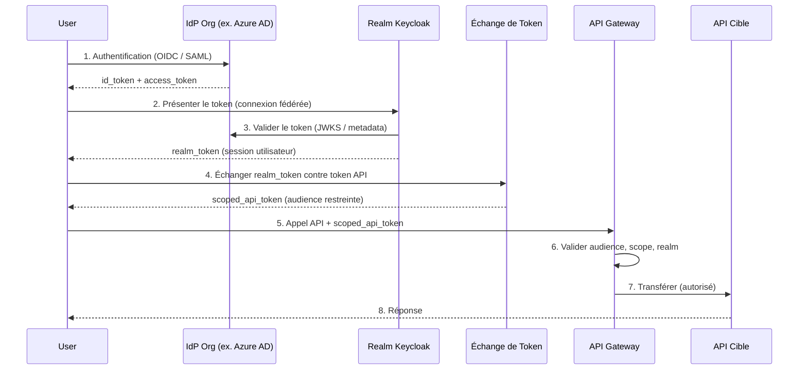
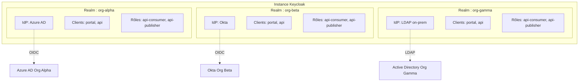

# ADR-026 : Modèle de Fédération Multi-IAM — Architecture Zéro Stockage Utilisateur

## Statut

Accepté

## Date

2026-01-28

## Contexte

Les écosystèmes d'entreprise impliquent fréquemment plusieurs organisations indépendantes qui doivent partager des APIs via une plateforme commune, tout en conservant chacune le contrôle total de leur infrastructure d'identité. Exemples :

- **Consortiums bancaires** — Établissements régionaux partageant des APIs de paiement ou de conformité, chacun exploitant son propre Active Directory ou fournisseur OIDC.
- **Groupes d'assurance** — Filiales avec des départements informatiques indépendants et des référentiels d'identité séparés, ayant besoin d'APIs de traitement des sinistres unifiées.
- **Franchises de distribution** — Magasins exploitant leurs propres systèmes d'identité, consommant des APIs partagées de stocks ou de fidélité.
- **Réseaux de santé** — Hôpitaux régionaux fédérés autour d'APIs partagées de référencement de patients ou de résultats de laboratoires.
- **Partenariats logistiques** — Transporteurs fédérés pour exposer des capacités de suivi à travers les frontières organisationnelles.

Le problème central : **N organisations, N IAMs différents, une plateforme API — sans imposer un annuaire d'utilisateurs central.**

Les approches traditionnelles copient ou synchronisent les données utilisateurs dans un référentiel central. Cela crée une responsabilité RGPD, des dérives de synchronisation et réduit le contrôle organisationnel sur leurs propres identités. STOA a besoin d'un modèle qui permette un accès API unifié tout en stockant **zéro donnée utilisateur** de manière centralisée.

## Facteurs de Décision

- **Souveraineté des données** — Chaque organisation doit rester le seul contrôleur de ses données utilisateurs.
- **Simplification RGPD** — L'élimination des données personnelles stockées centralement supprime toute une catégorie d'obligations de conformité.
- **Diversité des protocoles** — Les organisations utilisent OIDC, SAML 2.0 ou LDAP ; la plateforme doit les accommoder tous.
- **Indépendance opérationnelle** — La panne IAM d'une organisation ne doit pas se propager aux autres.
- **Scalabilité horizontale** — L'ajout d'une nouvelle organisation ne doit pas nécessiter une refonte de la plateforme.
- **Intégration API-native** — Le modèle de fédération doit se composer naturellement avec les politiques de gateway API, la limitation de débit et le comptage d'utilisation.

## Options Considérées

### 1. Hub de Fédération (Zéro Stockage Utilisateur)

Chaque organisation connecte son IAM en tant que fournisseur d'identité à un realm Keycloak dédié. STOA ne stocke aucun enregistrement utilisateur — l'authentification est entièrement déléguée à l'IdP en amont. Une étape d'échange de token (RFC 8693) convertit le token d'identité de l'utilisateur en un token API scopé que la couche gateway peut appliquer.

### 2. Synchronisation des Utilisateurs (Directory Sync)

Un annuaire central reçoit des copies périodiques ou en temps réel des enregistrements utilisateurs de chaque organisation via SCIM ou la synchronisation LDAP. L'authentification s'effectue contre la copie centrale.

### 3. Méta-Annuaire (Annuaire Virtuel)

Une couche d'annuaire virtuel interroge l'annuaire de chaque organisation au moment de l'authentification, présentant une vue unifiée sans copier les données. Les enregistrements utilisateurs ne sont jamais stockés mais sont récupérés à la demande.

## Résultat de la Décision

**Option choisie : Hub de Fédération (Zéro Stockage Utilisateur).**

Cette option est la seule qui atteigne un stockage central zéro-PII tout en préservant la pleine souveraineté organisationnelle. Elle s'aligne avec le positionnement de STOA en tant que plateforme de gestion d'APIs — pas de fournisseur d'identité — et se compose proprement avec l'architecture multi-tenant existante (un realm Keycloak par tenant).

| Critère | Hub de Fédération | Sync Utilisateurs | Méta-Annuaire |
|---|---|---|---|
| Stockage Utilisateurs | Aucun (zéro) | Copie complète | Virtuel |
| Latence Auth | Au moment de l'auth seulement | Quasi-nulle | Au moment de la requête |
| Conformité RGPD | Excellente | Complexe | Bonne |
| Souveraineté Org | Totale | Compromise | Partielle |
| Complexité d'Implémentation | Moyenne | Haute | Très Haute |
| Verrouillage Fournisseur | Faible | Élevé | Moyen |
| Conflits de Sync | Aucun | Fréquents | Aucun |
| Isolation des Pannes | Par realm | Globale | Par requête |

## Architecture

```
┌─────────────────────────────────────────────────────────────┐
│                      STOA Platform                          │
│                                                             │
│  ┌──────────┐  ┌──────────┐  ┌──────────┐                  │
│  │ Realm A  │  │ Realm B  │  │ Realm C  │   Keycloak       │
│  │ (OIDC)   │  │ (SAML)   │  │ (LDAP)   │   Multi-Realm    │
│  └────┬─────┘  └────┬─────┘  └────┬─────┘                  │
│       │              │              │                       │
│       ▼              ▼              ▼                       │
│  ┌─────────────────────────────────────────┐                │
│  │       Échange de Token (RFC 8693)        │                │
│  │    Token Utilisateur  →  Token API Scopé │                │
│  └─────────────────────────────────────────┘                │
│                       │                                     │
│                       ▼                                     │
│  ┌─────────────────────────────────────────┐                │
│  │          Couche API Gateway              │                │
│  │   (Validation d'audience par realm)      │                │
│  └─────────────────────────────────────────┘                │
└─────────────────────────────────────────────────────────────┘
          │              │              │
          ▼              ▼              ▼
     ┌────────┐    ┌────────┐    ┌────────┐
     │ Org A  │    │ Org B  │    │ Org C  │
     │  IAM   │    │  IAM   │    │  IAM   │
     └────────┘    └────────┘    └────────┘
```

### Flux d'Échange de Token



### Isolation des Realms



## Notes d'Implémentation

### Configuration Keycloak (Par Realm)

Chaque organisation reçoit un realm dédié avec son IdP configuré en tant que fournisseur d'identité :

```json
{
  "realm": "org-alpha",
  "enabled": true,
  "identityProviders": [
    {
      "alias": "org-alpha-idp",
      "providerId": "oidc",
      "enabled": true,
      "trustEmail": true,
      "firstBrokerLoginFlowAlias": "first broker login",
      "config": {
        "authorizationUrl": "https://login.org-alpha.example/.well-known/openid-configuration",
        "tokenUrl": "https://login.org-alpha.example/oauth2/token",
        "clientId": "stoa-federation",
        "clientSecret": "${vault:org-alpha-client-secret}",
        "defaultScope": "openid profile email",
        "syncMode": "FORCE",
        "validateSignature": "true",
        "useJwksUrl": "true"
      }
    }
  ],
  "users": []
}
```

Note : `"users": []` — le realm ne stocke **aucun enregistrement utilisateur**. Les données utilisateurs n'existent qu'en tant qu'attributs de session transitoires lors d'une authentification active.

### Configuration de l'Échange de Token (RFC 8693)

Activer l'échange de token sur le realm :

```json
{
  "clientId": "token-exchange-service",
  "enabled": true,
  "protocol": "openid-connect",
  "attributes": {
    "oidc.token.exchange.enabled": "true"
  },
  "protocolMappers": [
    {
      "name": "audience-mapper",
      "protocol": "openid-connect",
      "protocolMapper": "oidc-audience-mapper",
      "config": {
        "included.custom.audience": "stoa-api-gateway",
        "access.token.claim": "true"
      }
    },
    {
      "name": "realm-mapper",
      "protocol": "openid-connect",
      "protocolMapper": "oidc-hardcoded-claim-mapper",
      "config": {
        "claim.name": "stoa_realm",
        "claim.value": "org-alpha",
        "access.token.claim": "true"
      }
    }
  ]
}
```

### Politique Gateway (OPA)

L'API Gateway valide que chaque token est scopé au bon realm et à la bonne audience :

```rego
package stoa.gateway.authz

default allow = false

allow {
    input.token.aud == "stoa-api-gateway"
    input.token.stoa_realm == input.request.tenant
    token_not_expired
    realm_has_api_access(input.token.stoa_realm, input.request.api_id)
}

token_not_expired {
    now := time.now_ns() / 1000000000
    now < input.token.exp
}

realm_has_api_access(realm, api_id) {
    subscription := data.subscriptions[realm]
    subscription.apis[_] == api_id
    subscription.status == "active"
}
```

### Stratégie de Rotation des Clés

Chaque realm gère son propre JWKS de manière indépendante. Le gateway met en cache le JWKS par realm avec un TTL configurable :

```yaml
# Configuration JWKS du gateway
jwks:
  cache_ttl: 300          # 5 minutes
  refresh_interval: 60    # Rafraîchissement en arrière-plan toutes les 60s
  max_retries: 3
  timeout: 5s
  endpoints:
    org-alpha: https://auth.<YOUR_DOMAIN>/realms/org-alpha/protocol/openid-connect/certs
    org-beta: https://auth.<YOUR_DOMAIN>/realms/org-beta/protocol/openid-connect/certs
```

La rotation des clés dans une organisation se propage automatiquement : l'organisation fait tourner les clés dans son IdP, Keycloak récupère le nouveau JWKS lors de la prochaine validation, et le gateway rafraîchit son cache dans la fenêtre TTL.

### Synchronisation de l'Horloge

La fédération est sensible à la dérive d'horloge. Tous les composants doivent exécuter NTP avec un décalage maximum tolérable :

- **Validation `exp` / `iat` / `nbf` du token** : tolérance de décalage de 30 secondes configurée dans Keycloak et le gateway.
- **Exigence d'infrastructure** : Tous les nœuds (Keycloak, gateway, backends API) doivent se synchroniser sur le même pool NTP avec une dérive < 5 secondes.
- **Surveillance** : Alerte lorsque le décalage d'horloge dépasse 10 secondes sur n'importe quel nœud.

### Piste d'Audit

L'accès inter-organisations est journalisé avec une traçabilité complète :

```json
{
  "event": "cross_org_api_access",
  "timestamp": "2026-01-28T14:32:00Z",
  "source_realm": "org-alpha",
  "target_api": "payments-v2",
  "user_sub": "hashed:sha256:a1b2c3...",
  "token_jti": "uuid-of-scoped-token",
  "client_ip": "redacted-to-subnet",
  "decision": "allow",
  "policy_version": "v1.3.0"
}
```

Les identifiants utilisateurs sont hachés dans les journaux d'audit — la plateforme ne stocke jamais de données personnelles en clair, même dans les journaux.

### Reprise après Sinistre : Indisponibilité de l'IdP

Lorsque l'IdP d'une organisation tombe en panne :

1. **Les sessions existantes continuent** — Les sessions du realm Keycloak restent valides jusqu'à l'expiration de leur TTL.
2. **Les nouvelles connexions pour cette organisation échouent** — Les utilisateurs voient une erreur claire identifiant l'IdP de leur organisation comme inaccessible.
3. **Les autres organisations ne sont pas affectées** — L'isolation des realms garantit l'absence de contamination croisée.
4. **Disjoncteur** — Le gateway marque le realm comme dégradé après 3 échecs consécutifs d'IdP et cesse de tenter la fédération jusqu'à ce qu'un bilan de santé réussisse.

### Révocation de Tokens entre Realms

La révocation de tokens opère à deux niveaux :

1. **Niveau realm** : La révocation de session intégrée de Keycloak invalide tous les tokens d'un realm. Utilisée pour le verrouillage d'urgence.
2. **Niveau token** : Le gateway vérifie une liste de révocation (supportée par Redis) à chaque requête. Lorsqu'un token est révoqué, son `jti` est ajouté à la liste avec un TTL correspondant à la durée de vie restante du token.

Latence de propagation de révocation : < 1 seconde (Redis pub/sub entre les instances de gateway).

## Conséquences

### Positives

- **Zéro PII stocké centralement** — Les obligations RGPD de contrôleur de données sont significativement réduites pour les données d'identité utilisateur. La plateforme agit uniquement comme processeur d'événements d'authentification transitoires.
- **Pleine souveraineté organisationnelle** — Chaque organisation conserve le contrôle total sur le cycle de vie des utilisateurs, les politiques de mots de passe, les exigences MFA et la gestion des sessions.
- **Aucun conflit de synchronisation** — Il n'y a pas d'annuaire pouvant dériver. L'IdP reste la source de vérité pour les données utilisateurs.
- **Scalabilité horizontale par realm** — Les realms sont indépendants. Ajouter la 50ème organisation est la même opération que d'en ajouter une 2ème.
- **Flexibilité protocolaire** — Les organisations se connectent via le protocole supporté par leur IAM (OIDC, SAML 2.0, LDAP). Aucune migration requise.
- **Isolation propre des pannes** — La panne de l'IdP d'une organisation n'affecte pas les utilisateurs des autres organisations.

### Négatives

- **Latence au moment de l'auth** — La fédération ajoute un aller-retour vers l'IdP en amont lors de l'authentification initiale (typiquement 200-500ms). Atténuée par la mise en cache des sessions.
- **Complexité de l'échange de token** — La RFC 8693 n'est pas universellement bien comprise. Les équipes opérationnelles ont besoin de formation sur le flux d'échange et ses modes d'échec.
- **Nécessite un IAM mature dans chaque org** — Les organisations doivent exploiter un IdP conforme aux standards (OIDC/SAML). Les organisations n'ayant que du LDAP de base ont besoin d'un pont léger (Keycloak peut fédérer LDAP directement).
- **Pas de recherche d'utilisateurs inter-org** — La plateforme ne peut pas lister « tous les utilisateurs de toutes les organisations ». C'est voulu mais peut surprendre les administrateurs attendant un annuaire global.

### Risques

| Risque | Impact | Probabilité | Atténuation |
|---|---|---|---|
| L'indisponibilité de l'IdP bloque les utilisateurs de l'org | Élevé | Moyen | Disjoncteur, période de grâce TTL de session, surveillance de la santé |
| La taille du token dépasse les limites avec de nombreuses claims | Moyen | Faible | Filtrage des claims dans les mappers de protocole, utilisation de tokens de référence pour les grandes charges utiles |
| Le décalage d'horloge provoque le rejet du token | Élevé | Faible | Application NTP, tolérance de décalage de 30s, alertes de surveillance |
| Évasion de realm (réutilisation de token cross-tenant) | Critique | Très Faible | Validation de l'audience, application de la claim realm, politique OPA, tests de pénétration |
| Empoisonnement du cache JWKS | Critique | Très Faible | Épingler les URLs JWKS aux endpoints internes Keycloak, mTLS entre gateway et Keycloak |
| Corrélation des journaux d'audit entre orgs | Moyen | Moyen | Identifiants utilisateurs hachés avec sel par realm, corrélation via `token_jti` |

## Considérations de Sécurité

### Conception de l'Isolation des Realms

- Chaque realm s'exécute avec ses propres clés de signature, enregistrements de clients et référentiel de sessions.
- Le gateway applique la correspondance de la claim `stoa_realm` par rapport au contexte tenant de la requête. Un token émis pour `org-alpha` ne peut pas accéder aux APIs `org-beta` même si les scopes correspondent.
- Les politiques réseau restreignent la communication inter-realm au niveau Kubernetes.

### Application des Algorithmes JWT

```yaml
# Configuration du realm Keycloak
tokenSettings:
  defaultSignatureAlgorithm: RS256
  allowedSignatureAlgorithms:
    - RS256
    - ES256
  # L'algorithme "none" est rejeté au niveau du framework
```

Le gateway rejette tout token avec `alg: none` ou des algorithmes symétriques (HS256) pour les tokens de realm. Seuls les algorithmes asymétriques avec des clés provenant d'endpoints JWKS de confiance sont acceptés.

### Gestion des Secrets

- Les secrets client IdP sont stockés dans HashiCorp Vault, injectés via des secrets Kubernetes.
- Aucun secret dans les variables d'environnement, les ConfigMaps ou le contrôle de source.
- Les secrets client sont renouvelés selon un cycle de 90 jours avec rotation à zéro downtime (fenêtre à double secret).

### mTLS Entre Composants

Toutes les communications internes (Keycloak ↔ Gateway, Gateway ↔ backends API) utilisent mTLS avec des certificats émis par une CA privée. Les connexions aux IdP externes utilisent TLS standard avec épinglage de certificat lorsque supporté.

## Considérations RGPD

- **Article 28 (Sous-traitant)** : STOA agit comme sous-traitant de données pour les métadonnées d'authentification transitoires uniquement. Les accords de traitement des données couvrent les métadonnées de fédération (URLs d'émetteur, IDs client) mais pas les données personnelles des utilisateurs.
- **Droit à l'Effacement (Article 17)** : Lorsqu'un utilisateur est supprimé dans l'IdP de son organisation, sa session Keycloak (le cas échéant) expire naturellement. Les journaux d'audit contiennent uniquement des identifiants hachés — aucune donnée personnelle en clair à effacer.
- **Transferts transfrontaliers** : Si les organisations s'étendent aux juridictions UE et non-UE, les métadonnées de fédération (pas les données utilisateurs) traversent les frontières. Les Clauses Contractuelles Types s'appliquent à l'opérateur de la plateforme, pas aux données d'identité des utilisateurs (qui ne quittent jamais l'IdP de l'org).

## Proposition de Valeur STOA

Ce modèle n'est pas de la fédération Keycloak brute — c'est de la fédération **composée avec la gestion d'APIs** :

1. **Realm-par-tenant intégré aux abonnements API** — Le gateway applique le fait que le token de l'Org A peut uniquement accéder aux APIs auxquelles l'Org A est abonnée. C'est une fédération consciente du cycle de vie API, pas un SSO générique.
2. **Comptage par realm** — Le suivi d'utilisation, la limitation de débit et la facturation sont automatiquement scopés par organisation grâce à l'isolation des realms.
3. **Onboarding en libre-service** — Les nouvelles organisations sont provisionnées via le Control Plane STOA (création de realm + configuration IdP + abonnement API), pas via l'administration manuelle de Keycloak.
4. **Fédération MCP-native** — Les agents AI s'authentifiant via les outils MCP héritent du même modèle de fédération. Un agent agissant pour le compte d'un utilisateur de l'Org A obtient un token scopé qui restreint l'accès aux outils aux APIs souscrites par l'Org A.
5. **Configuration de realm pilotée par GitOps** — Les définitions de realm sont stockées sous forme de code, revues via des merge requests et appliquées via CI/CD. Aucun changement manuel dans la console Keycloak en production.

## Références

- [RFC 8693 — OAuth 2.0 Token Exchange](https://datatracker.ietf.org/doc/html/rfc8693)
- [Keycloak Identity Brokering](https://www.keycloak.org/docs/latest/server_admin/#_identity_broker)
- [RGPD Article 28 — Sous-traitant](https://gdpr-info.eu/art-28-gdpr/)
- [RGPD Article 17 — Droit à l'Effacement](https://gdpr-info.eu/art-17-gdpr/)
- [ADR-024 — Modes Unifiés du Gateway](/docs/architecture/adr/adr-024-gateway-unified-modes)
