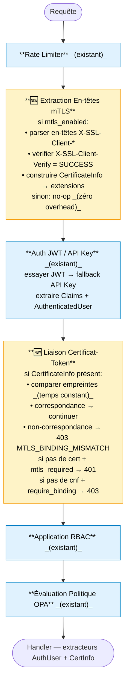

# ADR-039 : Rust Gateway mTLS + Validation de Tokens Liés aux Certificats

## Metadata

| Champ | Valeur |
|-------|--------|
| **Statut** | ✅ Accepté |
| **Date** | 2026-02-09 |
| **Décideurs** | Platform Team, Security Team |
| **Linear** | CAB-864 |

### Décisions Associées

- **ADR-027** : Authentification X509 par En-têtes HTTP — contrat d'en-têtes F5→Keycloak
- **ADR-028** : Validation de Liaison de Certificat RFC 8705 — normalisation d'empreinte, comparaison sécurisée en temps constant (MCP Gateway, Python)
- **ADR-029** : Gestion du Cycle de Vie des Certificats mTLS — provisionnement, rotation, période de grâce
- **ADR-024** : Modes Unifiés du Gateway
- **CAB-1121** : Intégration OAuth2 Consommateur (Phase 2, terminé)

## Contexte

Les ADR-027/028/029 ont établi l'architecture mTLS de STOA : F5 termine le TLS et transmet les en-têtes X-SSL-*, Keycloak valide les certificats via son SPI x509cert-lookup, et le MCP Gateway (Python) vérifie la liaison `cnf.x5t#S256` RFC 8705 en utilisant `fingerprint_utils.py`.

**Le stoa-gateway (Rust/axum) n'a aucun support mTLS aujourd'hui.** Il doit implémenter la même validation de tokens liés aux certificats que le MCP Gateway, mais en Rust — avec des patterns différents en raison du langage et du framework.

### Architecture Auth Rust Actuelle

```
stoa-gateway/src/auth/
├── mod.rs          — exports
├── claims.rs       — struct Claims (sub, exp, tenant, roles, scopes)
│                     enum StoaRole: CpiAdmin, TenantAdmin, DevOps, Viewer
│                     PAS de champ cnf, PAS de métadonnées de certificat
├── middleware.rs    — combined_auth_middleware: JWT → fallback API Key
│                     AuthenticatedUser, extracteurs AuthUser/OptionalAuthUser
├── jwt.rs          — JwtValidator: RS256 via JWKS (cache moka 5min)
├── api_key.rs      — ApiKeyValidator: cache moka → CP API /keys/validate
├── oidc.rs         — Découverte OIDC + cache JWKS
└── rbac.rs         — RbacEnforcer, enum Action, isolation tenant
```

**Grep pour `mtls|x509|certificate|X-SSL|X-Client-Cert|cnf` dans `auth/` = zéro résultats.**

### Pourquoi un ADR Séparé

L'ADR-028 couvre la validation de liaison RFC 8705 pour le **MCP Gateway (Python)** :
- Utilise `secrets.compare_digest()` pour la comparaison sécurisée en temps constant
- Utilise `fingerprint_utils.py` pour la normalisation de format
- Configuration pilotée par UAC via `security.authentication.mtls.cert_binding.*`

Le Rust Gateway nécessite des décisions d'implémentation différentes :
- Primitives crypto différentes (pas de `secrets.compare_digest`, utilise `subtle::ConstantTimeEq`)
- Système de configuration différent (Figment + variables d'env STOA_, pas UAC)
- Modèle middleware différent (couches axum + extracteurs, pas des dépendances FastAPI)
- Doit s'intégrer avec la struct `Claims` existante et `combined_auth_middleware()`

## Décision

### 1. Nouveau Module : `auth/mtls.rs`

Un module dédié pour l'extraction des en-têtes mTLS et la vérification de la liaison certificat-token.

**Structs :**

```
CertificateInfo
├── fingerprint: String          — SHA-256 hex depuis X-SSL-Client-Fingerprint
├── fingerprint_b64url: String   — calculé : hex → bytes → base64url
├── subject_dn: String           — depuis X-SSL-Client-S-DN
├── issuer_dn: String            — depuis X-SSL-Client-I-DN
├── serial: String               — depuis X-SSL-Client-Serial
├── not_before: Option<DateTime> — depuis X-SSL-Client-NotBefore
├── not_after: Option<DateTime>  — depuis X-SSL-Client-NotAfter
└── verify_status: String        — depuis X-SSL-Client-Verify

MtlsConfig
├── enabled: bool                — défaut : false (rétrocompatible)
├── require_binding: bool        — défaut : true (rejeter tokens sans cnf quand cert présent)
├── header_verify: String        — défaut : X-SSL-Client-Verify
├── header_fingerprint: String   — défaut : X-SSL-Client-Fingerprint
├── header_subject_dn: String    — défaut : X-SSL-Client-S-DN
├── header_issuer_dn: String     — défaut : X-SSL-Client-I-DN
├── header_serial: String        — défaut : X-SSL-Client-Serial
├── header_cert: String          — défaut : X-SSL-Client-Cert
├── allowed_issuers: Vec<String> — défaut : vide (accepter tous)
└── tenant_from_dn: bool         — défaut : true
```

**Fonctions :**

| Fonction | Entrée | Sortie | Objectif |
|----------|--------|--------|----------|
| `extract_certificate_from_headers` | `&HeaderMap, &MtlsConfig` | `Result<Option<CertificateInfo>>` | Parser les en-têtes X-SSL-* en `CertificateInfo` |
| `verify_certificate_binding` | `&CertificateInfo, &CnfClaim` | `Result<()>` | Comparer l'empreinte du cert avec le `cnf.x5t#S256` JWT |
| `hex_to_base64url` | `&str` | `Result<String>` | Convertir l'empreinte hex en base64url pour comparaison |
| `normalize_fingerprint` | `&str` | `String` | Supprimer les deux-points, mettre en minuscules (cohérent avec l'algorithme ADR-028) |

### 2. Extension de la Struct Claims

Ajouter le champ `cnf` à `Claims` dans `auth/claims.rs` :

```
Claims (étendu)
├── ... (champs existants : sub, exp, iat, iss, aud, tenant, etc.)
└── cnf: Option<CnfClaim>          [NOUVEAU]

CnfClaim
└── x5t_s256: Option<String>       — correspond à la clé JSON "x5t#S256"
                                      (renommage serde : #[serde(rename = "x5t#S256")])
```

C'est une modification **non cassante** : `cnf` est `Option`, les tokens existants sans ce champ se désérialisent identiquement.

### 3. Intégration dans le Pipeline Middleware

Insérer le traitement mTLS dans le `combined_auth_middleware()` existant en deux étapes :



**Choix de conception clé** : l'extraction mTLS a lieu **avant** la validation JWT (pour échouer rapidement sur les certificats invalides), la vérification de liaison a lieu **après** (nécessite à la fois le certificat et les claims JWT).

### 4. Comparaison Sécurisée en Temps Constant

Utiliser `subtle::ConstantTimeEq` (du crate `subtle`) pour la comparaison d'empreintes, correspondant aux garanties de sécurité du `secrets.compare_digest()` de l'ADR-028.

```
cert_fingerprint_hex (normalisé) → bytes
cnf_x5t_s256 (décodé base64url) → bytes
bytes.ct_eq(&other_bytes)        → comparaison sécurisée en temps constant
```

**Pas** `==` ou `PartialEq` — ceux-ci peuvent court-circuiter sur le premier octet différent.

### 5. Normalisation d'Empreinte (Cohérente avec ADR-028)

Réimplémenter le même algorithme de normalisation de `fingerprint_utils.py` en Rust :

```
Détection du format d'entrée :
  contient ':'  → hex_colons → supprimer les deux-points → minuscules
  correspond à [a-fA-F0-9]+ → hex → minuscules
  sinon → base64url → décoder → hex minuscules

Toutes les comparaisons effectuées sur hex minuscules (cohérent avec ADR-028).
```

### 6. Configuration (Figment)

Nouveaux champs dans `config.rs` sous le système de configuration Figment existant :

| Variable d'Env | Type | Défaut | Description |
|----------------|------|--------|-------------|
| `STOA_MTLS_ENABLED` | bool | `false` | Interrupteur principal |
| `STOA_MTLS_REQUIRE_BINDING` | bool | `true` | Rejeter les tokens sans `cnf` quand cert présent |
| `STOA_MTLS_HEADER_VERIFY` | String | `X-SSL-Client-Verify` | Nom de l'en-tête de statut de vérification |
| `STOA_MTLS_HEADER_FINGERPRINT` | String | `X-SSL-Client-Fingerprint` | Nom de l'en-tête d'empreinte |
| `STOA_MTLS_HEADER_SUBJECT_DN` | String | `X-SSL-Client-S-DN` | Nom de l'en-tête Subject DN |
| `STOA_MTLS_HEADER_ISSUER_DN` | String | `X-SSL-Client-I-DN` | Nom de l'en-tête Issuer DN |
| `STOA_MTLS_HEADER_SERIAL` | String | `X-SSL-Client-Serial` | Nom de l'en-tête de numéro de série |
| `STOA_MTLS_HEADER_CERT` | String | `X-SSL-Client-Cert` | Nom de l'en-tête de cert PEM |
| `STOA_MTLS_ALLOWED_ISSUERS` | String (séparé par virgules) | vide | DNs d'émetteurs autorisés |
| `STOA_MTLS_TENANT_FROM_DN` | bool | `true` | Extraire le tenant depuis le Subject DN OU |

Les noms d'en-têtes sont configurables pour supporter différents terminateurs TLS (F5, nginx, Envoy, HAProxy) selon la philosophie de l'ADR-028.

### 7. Nouvel Extracteur Axum : `CertInfo`

```
CertInfo(pub Option<CertificateInfo>)
```

Les handlers ayant besoin de métadonnées de certificat utilisent cet extracteur. Retourne `None` quand mTLS est désactivé ou qu'aucun certificat n'a été présenté (ne plante pas — optionnel par conception).

### 8. Réponses d'Erreur

| Condition | HTTP | Code | Corps |
|-----------|------|------|-------|
| `X-SSL-Client-Verify` manquant, `mtls_enabled=true` | 401 | `MTLS_CERT_REQUIRED` | `client certificate required` |
| `X-SSL-Client-Verify != SUCCESS` | 403 | `MTLS_CERT_INVALID` | `client certificate validation failed` |
| JWT sans `cnf`, cert présent, `require_binding=true` | 403 | `MTLS_BINDING_REQUIRED` | `certificate-bound token required` |
| Non-correspondance d'empreinte | 403 | `MTLS_BINDING_MISMATCH` | `certificate binding mismatch` |
| Certificat expiré (NotAfter dans le passé) | 403 | `MTLS_CERT_EXPIRED` | `client certificate expired` |
| Émetteur absent de la liste autorisée | 403 | `MTLS_ISSUER_DENIED` | `certificate issuer not allowed` |

Le format d'erreur suit le pattern JSON Gateway existant : `{"error": "...", "detail": "..."}`.

### 9. Endpoint d'Onboarding en Masse (Phase 3)

`POST /api/v1/admin/consumers/bulk` sur le Control Plane API (Python) :

- Entrée : CSV (multipart/form-data), max 100 lignes
- Colonnes : `external_id, display_name, tenant_id, certificate_pem`
- Par ligne (atomique) : valider cert → calculer x5t_s256 → créer client Keycloak + protocol mapper → stocker consommateur
- Réponse : `{ total, success, failed, results: [{ row, status, consumer_id?, client_id?, error? }] }`
- Les lignes qui échouent ne bloquent pas les autres lignes
- Nécessite le rôle `cpi-admin` ou `tenant-admin`

Cet endpoint réutilise le flux de création de consommateur existant de CAB-1121 Phase 2, en ajoutant le traitement des certificats et l'orchestration par lot.

## Conséquences

### Positives

- **Parité avec le MCP Gateway** : même validation de liaison RFC 8705, même algorithme de normalisation (ADR-028), implémenté en Rust
- **Zéro overhead quand désactivé** : `mtls_enabled=false` ignore tout le parsing d'en-têtes et les vérifications de liaison
- **Rétrocompatible** : `cnf: Option<CnfClaim>` sur Claims ne casse pas la désérialisation JWT existante
- **Sécurité du timing** : `subtle::ConstantTimeEq` empêche les attaques par canal auxiliaire basées sur le timing sur la comparaison d'empreintes
- **Flexible par vendeur** : noms d'en-têtes configurables (principe ADR-028 maintenu)
- **Onboarding en masse** : permet le provisionnement de 100 consommateurs mTLS en un seul appel API

### Négatives

- **Logique de normalisation dupliquée** : Rust réimplémente `fingerprint_utils.py` (runtimes différents, impossible de partager le code). Doit rester synchronisé manuellement.
- **Deux étapes middleware** : l'extraction mTLS (pré-JWT) et la vérification de liaison (post-JWT) ajoutent de la complexité au pipeline middleware
- **Dépendance crate `subtle`** : ajoute une nouvelle dépendance pour la comparaison sécurisée en temps constant (crate petit, bien audité)

### Risques

| Risque | Probabilité | Impact | Atténuation |
|--------|-------------|--------|-------------|
| Divergence de normalisation entre Python et Rust | Moyen | Élevé | Vecteurs de test partagés ; test CI qui vérifie que les deux produisent une sortie identique pour les entrées de référence |
| `serde(rename = "x5t#S256")` échoue sur le `#` dans le nom du champ | Faible | Élevé | Test d'intégration avec un vrai token émis par Keycloak contenant la claim `cnf` |
| Usurpation d'en-tête depuis l'intérieur du cluster | Faible | Élevé | NetworkPolicy K8s restreignant les sources des en-têtes X-SSL-* (ADR-027) |
| Régression de performance avec mTLS activé | Faible | Faible | Benchmark : parsing d'en-têtes + comparaison SHA-256 < 5µs par requête |

## Plan d'Implémentation

### Phase 2 : Module mTLS Gateway (CAB-864 P2)

| Étape | Fichiers | Description |
|-------|---------|-------------|
| 1 | `auth/mtls.rs` | `MtlsConfig`, `CertificateInfo`, `CnfClaim`, extraction d'en-têtes, vérification de liaison, `hex_to_base64url` |
| 2 | `auth/claims.rs` | Ajouter `cnf: Option<CnfClaim>` à la struct `Claims` |
| 3 | `auth/middleware.rs` | Insérer l'extraction mTLS (pré-JWT) et la vérification de liaison (post-JWT) dans le pipeline |
| 4 | `auth/mod.rs` | Exporter le module `mtls`, l'extracteur `CertInfo` |
| 5 | `config.rs` | Ajouter la section `MtlsConfig` avec mapping de variables d'env Figment |
| 6 | `Cargo.toml` | Ajouter les dépendances de crates `subtle` et `base64` |
| 7 | `auth/mtls.rs` (tests) | Tests unitaires : parsing d'en-têtes, normalisation d'empreinte, correspondance/non-correspondance de liaison, comparaison sécurisée en temps constant |
| 8 | `auth/middleware.rs` (tests) | Tests d'intégration : pipeline complet avec en-têtes mTLS + JWT + claim cnf ; compatibilité ascendante (désactivé) |

### Phase 3 : Onboarding en Masse (CAB-864 P3)

| Étape | Fichiers (control-plane-api) | Description |
|-------|------------------------------|-------------|
| 1 | `routers/consumers.py` | Endpoint `POST /v1/admin/consumers/bulk` |
| 2 | `services/consumer_service.py` | Logique de traitement par lot avec atomicité par ligne |
| 3 | `services/keycloak_service.py` | Auto-configuration du protocol mapper pour la claim `cnf` |
| 4 | `tests/test_consumers_bulk.py` | Tests unitaires + d'intégration pour l'endpoint bulk |

## Références

- [RFC 8705 — OAuth 2.0 Mutual-TLS Client Authentication and Certificate-Bound Access Tokens](https://datatracker.ietf.org/doc/html/rfc8705)
- [crate subtle — Opérations en temps constant pour Rust](https://crates.io/crates/subtle)
- ADR-027 : Authentification X509 par En-têtes HTTP
- ADR-028 : Validation de Liaison de Certificat RFC 8705
- ADR-029 : Gestion du Cycle de Vie des Certificats mTLS
- `control-plane-api/src/services/fingerprint_utils.py` — Référence de normalisation Python
